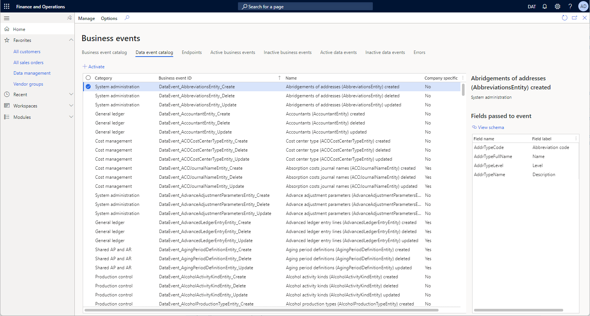
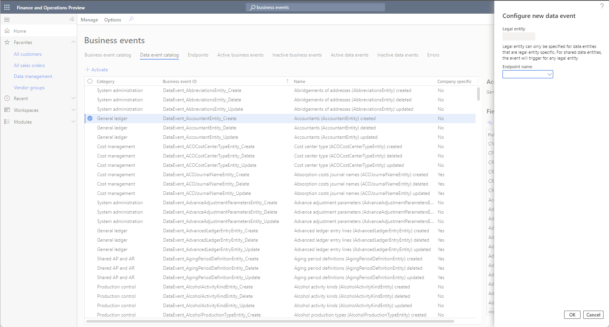

---
# required metadata

title: Data events
description: This topic provides an overview of data events.
author: jaredha
ms.date: 03/16/2022
ms.topic: article
ms.prod:
ms.technology: 

# optional metadata

# ms.search.form:
audience: Developer, IT Pro
# ms.devlang: 
ms.reviewer: sericks
# ms.tgt_pltfrm: 
# ms.custom: NotInToc
ms.search.region: Global
# ms.search.industry:
ms.author: jaredha
ms.search.validFrom: 2021-10-15
ms.dyn365.ops.version: 10.0.22
---

# Data events
[!include[banner](../includes/banner.md)]

Data events are events that are based on changes to data in Finance and Operations apps. Create, update, and delete (CUD) events can be enabled for each entity. For example, if the **Create** event is enabled for the **Purchase order headers V2** entity, an event notification is emitted every time that a new purchase order is created in the database.

All standard and custom entities in Finance and Operations apps that are enabled for Open Data Protocol (OData) can emit data events. In the data event catalog, each event for an entity is listed as a data event that subscriptions can be established for. The concept of activating the data event and associating it with an endpoint resembles the concept of business events. When a data event occurs, the payload of the event contains the corresponding entity record.

> [!IMPORTANT]
> Data events are available only in environments that the Microsoft Power Platform integration is enabled for. For more information, see [Enable the Microsoft Power Platform integration](../power-platform/enable-power-platform-integration.md).

## Data event catalog

To access the data event catalog, select the **Data event catalog** tab on the **Business events** page (**System administration** \> **Setup** \> **Business event**). The data event catalog provides a complete list of the available data events in the Finance and Operations apps environment. For each data event, the list shows the category, event ID, and name. It also indicates whether the event is company-specific. You can filter the list by category and data event ID.

## Activating data events

By default, data events are inactive. To activate a data event from the data event catalog, select it in the list, and then select **Activate**.

Data events can be activated either in all legal entities or in specific legal entities. In the **Configure new data event** dialog box, in the **Legal entity** field, select the legal entity that you want to activate the data events in. If you leave the **Legal entity** field blank, the selected data events will be activated in all legal entities. If a data event is required in multiple specific legal entities, it must be configured separately for each legal entity.

Only company-specific data events can be configured for specific legal entities. When you configure data events that aren't company-specific, the **Legal entity** field isn't editable, and the data events are enabled for all legal entities.

To activate a data event, select a configured endpoint. For information about how to configure endpoints business events and data events, see [Manage business event endpoints](managing-business-event-endpoints.md).

When you activate a data event, it's added to the list on the **Active data events** tab of the **Business events** page and becomes available for subscription through the selected endpoint.

## Deactivating data events

You can deactivate data events from the **Active data events** tab of the **Business events** page. To deactivate a data event, select it in the list, and then select **Deactivate**. The data event is removed from the list on the **Active data events** tab and added to the list on the **Inactive data events** tab.

Like business events, data events can be deactivated when business event processing is temporarily paused. A temporary pause might be required because of system maintenance, bulk data imports, or bulk data processing. Bulk data processing where data events are enabled on related data entities can send a high volume of data events that might not be required. This situation can affect system performance.

When data events are no longer required to meet business requirements, you can delete them from the list on the **Active data events** or **Inactive data events** tab. In this case, the data events are removed from the list, and all error history for them is deleted. If the history of errors for a data event must be preserved, you can deactivate the data event instead of deleting it. For more information about error logs for business events and data events, see [Errors](home-page.md#errors).

## Download the data event schema

The **Data event catalog** tab on the **Business events** page also shows the fields that are passed to a data event and that make up the event schema. The information that is shown includes the field name and label. You can download the JavaScript Object Notation (JSON) schema for an event by selecting **Download schema**. This capability is helpful when external integration systems require the schema of the payload for a business event during development.

## Performance benchmarks

The data events functionality currently supports a burst rate of 5,000 events per five-minute period, up to 50,000 events per hour, across all entities for the environment. Event loads above these thresholds may encounter performance degradation in environment processing. There are no limits in place to explicitly throttle events, and any events above the supported thresholds will still be sent, but it may slow the performance of the environment. 

Data events for update operations are inherently more expensive to process than data events for create and delete operations in Finance and Operations. If your active data events are for update operations, you may see environment performance degrade more quickly when exceeding the supported thresholds.

## Limitations

Data events are not supported for updates to virtual fields. Modify data events are triggered by update operations on the underlying tables of an entity. Because virtual fields are values calculated in X++ code, any change in the value doesn't result in any data operations against the physical tables, and won't trigger a data event.

For more information on virtual fields, see [Computed columns and virtual fields in data entities](../data-entities/data-entity-computed-columns-virtual-fields.md).

[!include[banner](../includes/banner.md)]

