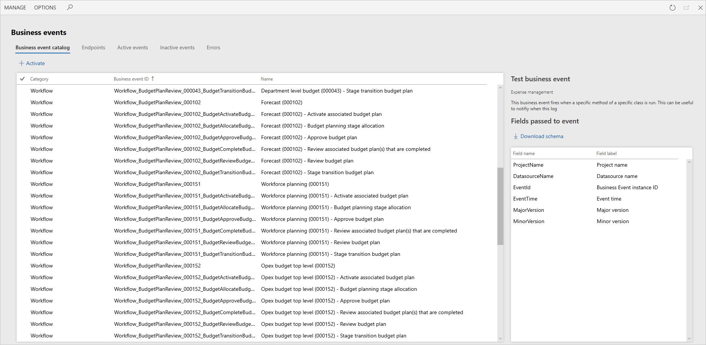
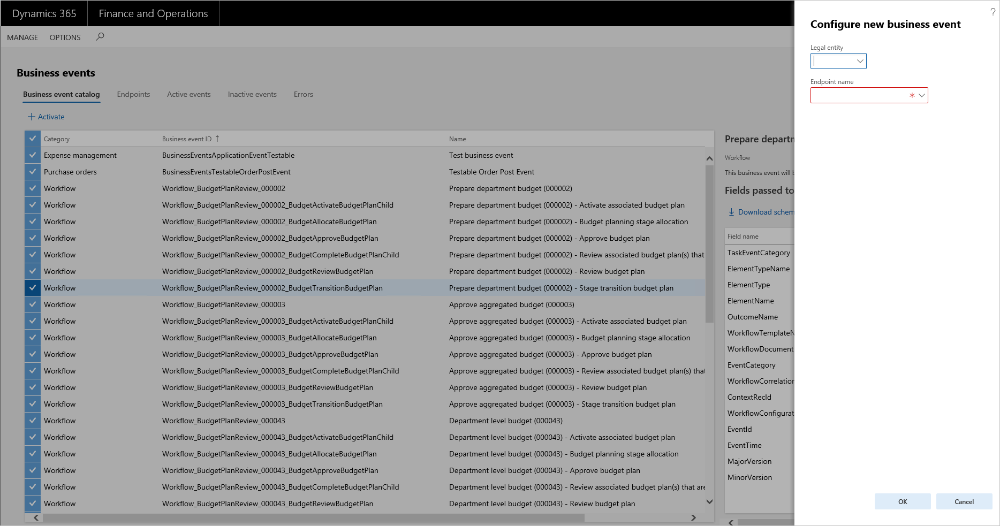
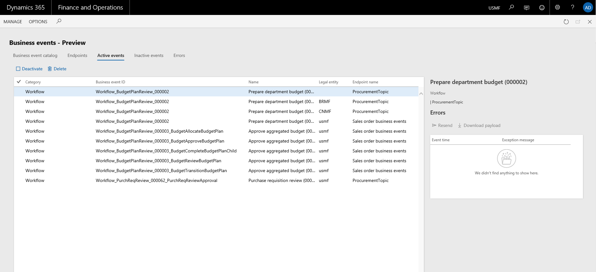
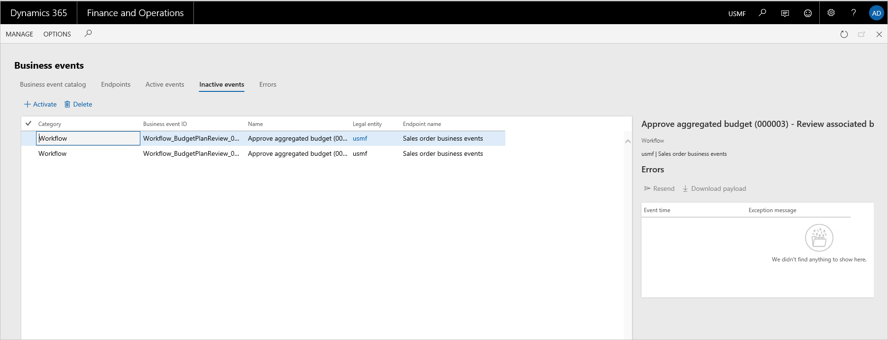

---
# required metadata

title: Business events overview
description: This article provides information about business events, which allow external systems to receive notifications from finance and operations apps.
author: jaredha
ms.date: 03/31/2023
ms.topic: overview
ms.prod: 
ms.technology: 

# optional metadata

# ms.search.form:  [Operations AOT form name to tie this article to]
audience: IT Pro
# ms.devlang: 
ms.reviewer: sericks

ms.search.region: Global for most topics. Set Country/Region name for localizations
# ms.search.industry: 
ms.author: jaredha
ms.search.validFrom: Platform update 24
ms.dyn365.ops.version: 2019-02-28
---

# Business events overview

[!include[banner](../includes/banner.md)]

Business events provide a mechanism that lets external systems receive notifications from finance and operations apps. In this way, business actions can be performed in response to the business events.

Business events occur when a business process is run. During a business process, users who participate in it perform business actions to complete the tasks that make up the business process. 

A business action that a user performs can be either a workflow action or a non-workflow action. Approval of a purchase requisition is an example of a workflow action, whereas confirmation of a purchase order is an example of a non-workflow action. Both types of actions can generate business events that external systems can use in integration and notification scenarios. 

## Prerequisites

Business events can be consumed using Microsoft Power Automate and Azure messaging services. Therefore, customers must bring their subscriptions to such assets to use business events.

> [!IMPORTANT]
> Business events must not be considered a mechanism for exporting data. By definition, business events are supposed to be lightweight and nimble. They aren't intended to carry large payloads to fulfill data export scenarios.

## Business events that are implemented

Business events are implemented in some business processes out of the box. These business events include both workflow and non-workflow business events. For more information, see [Application business events](app-business-events.md), [Workflow business events](business-events-workflow.md), and [Alerts as business events](alerts-business-events.md).

A developer must use extensions to implement new business events. For more information, see [Business events developer documentation](business-events-dev-doc.md).

## Business event catalog

The business events catalog can be accessed from **System administration > Set up > Business events**. The business event catalog lists the business events that are available in the instance that you're using. The catalog is useful because it shows which business events are available, and you can filter it by category, business event ID, and name.

The category of a business event identifies its source. Business events that originate from the workflow system are assigned to the **Workflow** category. For business events that originate from other modules, the module name is used as the category name. 

The business event catalog is built during database synchronization at the time of deployment. Therefore, users should see the complete list of business events in the catalog. However, if an explicit update of the catalog is required, you can select **Manage \> Rebuild business events catalog**.

For each business event, the business event catalog shows a description. This description can help you better understand the business event and its context in the business process. The catalog also shows the list of data fields that will be sent out in the event.

In scenarios where external integration systems require the schema of the payload for a business event during development, you can select **Download schema** to download the JavaScript Object Notation (JSON) schema.

In summary, the business event catalog helps identify the business events that are required for an implementation. It also helps identify the schema for each business event.

The next step is to manage the endpoints.

## Business events parameters

### General

The **General** tab of the **Business events parameters** page provides general settings that are applied to business events.

- **Retry count** – The number of times that the system will try again to send business events to an endpoint if an error occurs. The default value is **3**.
- **Wait time between retries** – The interval, in milliseconds, between attempts to send a business event to its endpoint. The default value is **1000** milliseconds.
- **Endpoints allowed per event** – The maximum number of endpoints that can subscribe to the same business event in a legal entity. The default value is **10**.
- **Key vault secret cache interval** – The number of minutes that the key vault secrets that are used for business events will be cached in memory before they are read and cached again from the configured key vault. The default value is **5** minutes.

### Performance

The business events framework has two primary settings that can affect performance: **Processing threads** and **Bundle size**. The application allocates dedicated batch threads to process business events in near-real time. Because threads are a shared resource for all batch processing, you must take care when you decide to change the thread allocation for business events.

- **Processing threads** – The number of threads to use to process business events.

    - With dedicated processing for business events, the thread count is the number per Batch Application Object Server (AOS) instance.
    - The maximum value is **4**.

- **Bundle size** – The number of events to group together at a time for processing by a thread.

    - By increasing the number, you produce fewer bundles and reduce the ability to distribute the events to parallel threads.
    - By decreasing the number, you produce more bundles and increase the ability to distribute the events to parallel threads. However, if you make the number too small, you will cause unnecessary parallelization on small bundles.

### Event Grid settings

The **Event Grid settings** tab provides options that apply to business event endpoints with an endpoint type of **Azure Event Grid**.

The **Send object in Event Grid data field** toggle controls whether the type of object serialized and sent to the Azure Event Grid endpoint will be a JSON string or an object. By default, the object sent to these endpoints is serialized as a JSON string. Turning on this toggle sends these as an object to the Azure Event Grid endpoints.

### HTTPS settings

The **HTTP timeout (milliseconds)** toggle controls how long the default HTTPS adapter will wait before timing out a request to an endpoint. The default timeout period is 10 seconds. Entering a value of **0** in the field is an indicator to use the default timeout period.

## Activating business events

Business events in the business event catalog aren't active by default. From the catalog, you can activate any business events that you require. Select one or more business events, and then select **Activate**.

Business events can be activated either in all legal entities or in specific legal entities. If you leave the **Legal entity** field blank, the selected business events will be activated in *all* legal entities. If a business event is required only for specific legal entities, it must be configured separately for each legal entity.

Endpoints must be assigned to the business events that are activated. See [Manage business event endpoints](managing-business-event-endpoints.md) for additional information on setting up and managing endpoints.

When business events occur as business processes are run, the system will do outbound processing only for business events that have been activated.

After business events are activated, they appear on the **Active events** tab.

From the **Active events** tab, you can inactivate business events. The system won't do outbound processing for inactivated events.

After business events are inactivated, they appear on the **Inactive events** tab.

Business events can be inactivated when processing of business events must be paused for a period because of specific system maintenance activities in the integration landscape.

When business requirements change, some business events might no longer be required. In this case, you can inactivate them instead of deleting them from the list of active events. This approach is useful if the history of errors for the business events must be preserved. Inactivated business events can be deleted later, when there is no longer a business need to keep them inactivated.

## Errors

While the system does outbound processing of business events, errors can occur. These errors might prevent the system from successfully delivering a business event to the endpoint. If an error occurs, the system retries several times to successfully process the business event. However, if all attempts are unsuccessful, the business event is saved in an error log.

Error logs can be accessed from the **Active events**, **Inactive events**, and **Errors** tabs. The **Errors** tab shows all errors across all business events, whereas the other two tabs show errors in the context of a specific business event.

You can do on-demand outbound processing on each error by using the **Resend** action. This action invokes the outbound processing logic. This logic includes retries. If the outbound processing is still unsuccessful, the error is logged in the error log. In this case, the **Last process time** field on the **Errors** tab indicates when the last attempt to process the event occurred.

If an error can't be successfully processed, you can use the **Download payload** option to download the payload from the event for offline processing, as you require.

> [!NOTE]
> If an endpoint is deleted and a new endpoint is associated with business events, all errors that are associated with the business events can still be resent. In this case, the system will do outbound processing to send to the new endpoint that is associated with the corresponding business event. This functionality allows for graceful recovery from misconfiguration or other error states.

## Business event consumption models

The integration requirements and integration solution design for implementations vary. The integration requirements play a role in identifying the consumption model for business events. In summary, you must consider the following points when you design integrations that use business events:

- Business events can be consumed using Power Automate, Service Bus, Event Grid, or other endpoint types.
- Customers must bring their own subscriptions to use Power Automate, Service Bus, Event Grid, or other endpoint types.
- A business event can be activated in all legal entities or in specific legal entities.
- A business event can be sent to a unique endpoint or multiple endpoints.
- Power Automate can directly subscribe to business events.

## Idempotency
Business events enable idempotent behavior on the consuming side by having a control number in the payload. The control number is an upwardly increasing number, which can be tracked by the consuming application to detect duplication and/or out of order delivery. The control number cannot be misread as the sequence number because the control number cannot be sequential. There can be gaps in the numbering space.

## Filtering in Azure Event Grid and Azure Service Bus
Azure Service Bus and Azure Event Grid support subscribing to topics by
specifying criteria on the incoming message. For more information, see [Topic filters and actions](/azure/service-bus-messaging/topic-filters) and [Understand event filtering for Event Grid subscriptions](/azure/event-grid/event-filtering).

A business event that is sent to an Azure Service Bus or Azure Event Grid
has the following fields made available for this purpose. Subscribers can use
this information to subscribe to more specific topics as required.

-   **Category** – This is the business event category as displayed in the
    business event catalog. This is useful as a filter criterion when a common
    article is used for receiving business events from multiple categories and
    subscribers want to only receive business events for the category that they are
    interested in.

-   **Business event ID** – This is the class name of the business event
    implementation as displayed in the business event catalog. This uniquely
    identifies the business event (not the instance of the business event) and
    thus helps in validation of received business events on the consumer side to
    ensure the expected business event is what is being received and processed.

-   **Legal entity** – This is the legal entity in which the business event
    happened. This is useful information to base the consuming logic on if
    the processing and distribution of business events on the consumption side
    must be driven by a legal entity.

> [!NOTE]
> The filterable fields that are sent in a business event can be modified to
include custom fields. This is a developer experience.

## Role-based security for business events
Role-based security can be applied to business events to meet the following requirements using the appropriate security artifact.

| **Requirement**                                                                                                                                | **Privilege**                                 | **Duty**                          |
|------------------------------------------------------------------------------------------------------------------------------------------------|-----------------------------------------------|-----------------------------------|
| Only certain users must have access to view the business events catalog.                                                                       | **BusinessEventsCatalogView**                 | None                              |
| Only certain users must have access to activate business events.                                                                               | **BusinessEventsCatalogMaintain**             | None                              |
| Only certain users must have access to create and manage endpoints.                                                                            | **Business events security privilege**        | **Business events security duty** |
| Users must only be able to subscribe to business events which they have been granted access to from external applications like Power Automate. | **Subscribe to business events from service** | None                              |
| Only certain users must be able to view the business events security setup.                                                                    | **BusinessEventsCatalogSecuritySetupView**    | None                              |
| Only certain users must be able to manage business events security.                                                                            | **Maintain business events catalog security** | None                              |

These privileges can be added to the required duties to grant corresponding roles appropriate access levels.

### Enabling role-based security for business events

Role-based security for business events must be enabled via Feature management.

1.   Go to **System administration \> Feature management**.

2.   Select the **Business events catalog security** feature.

3.   Enable the feature.

4.   Go to the business events catalog via **System administration \> Set up \> Business events \> Business events catalog.**

5.   The **Security** tab in the catalog is where a business event must be mapped to one or more roles. You must complete the configuration as required.

6.   Enable security by selecting the **Enable** menu button on the **Security** menu on the top navigation pane. An informational message will confirm if security is enabled or disabled.

7.  Modify the necessary security role to add the appropriate privilege or the duty based on security noted in the informational message.

### Subscribe to business events from service

Users having access to the privilege **Subscribe to business events from service** via their roles will be able to only see and subscribe to business events that have been assigned to their roles, as described below. The organizational assignments that are done, if any, as part of role-based security are honored in the context of business events by letting users to only subscribe
to business events in the organizations to which they have access to via their roles. This behavior is effective using any service calls like from Power Automate or Logic Apps.

### Backward compatibility

To ensure backward compatibility, the following behavior must be understood.

-   Role-based security for business events will be disabled by default.

-   Even if the feature is enabled in Feature management, role-based security will not take effect.

-   Role-based security must be explicitly enabled in the business events catalog via the **Security** menu.

-   After role-based security is enabled completely, security will be enforced henceforth. This will mean that any user with an administration role will not notice any change in behavior. However, any non-admin users either will see only business events that their roles were assigned to in the business events catalog security configuration or won't see any business events because their roles were not assigned to any business events.

> [!NOTE]
> To ensure uninterrupted functionality, it is important to understand the backward-compatibility behavior described above before you enable security on business events.

[!INCLUDE[footer-include](../../../includes/footer-banner.md)]

