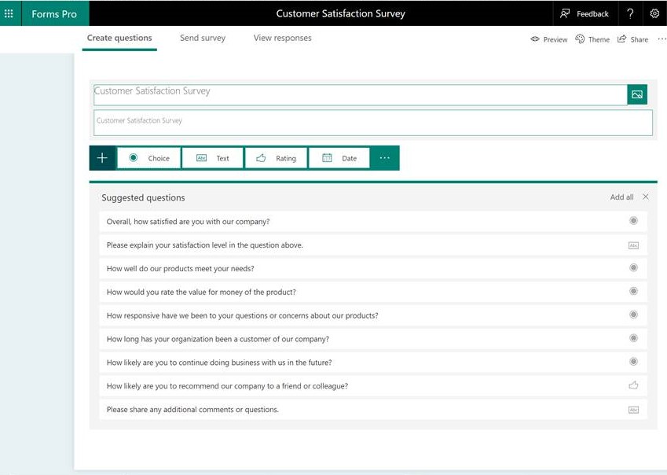
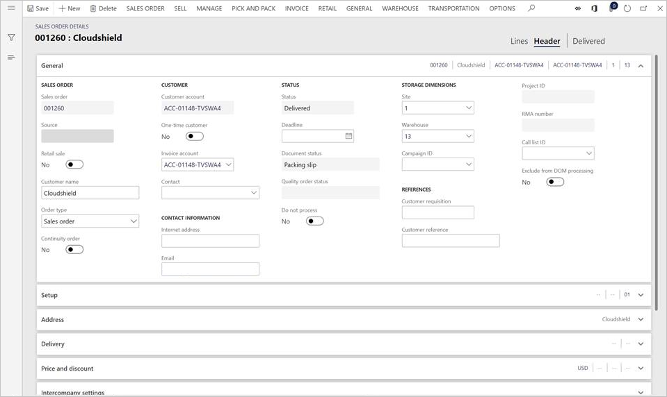
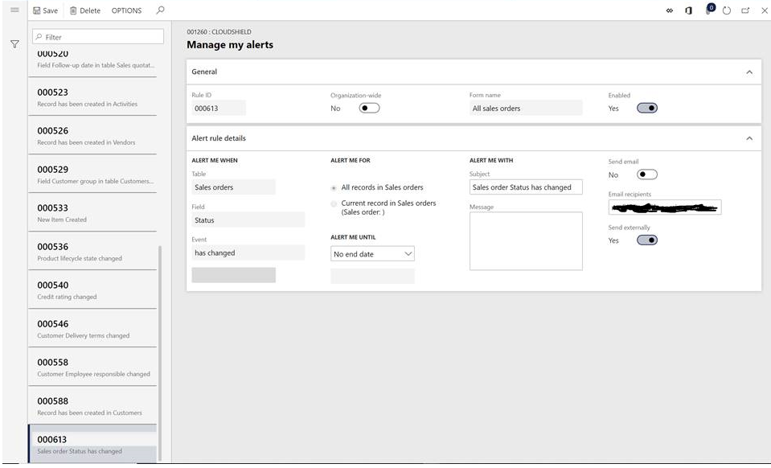
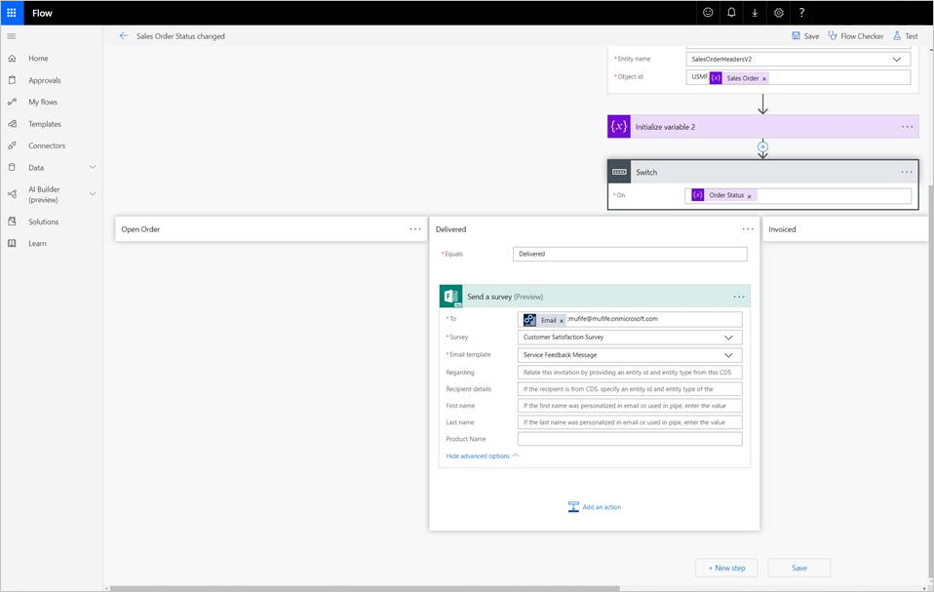
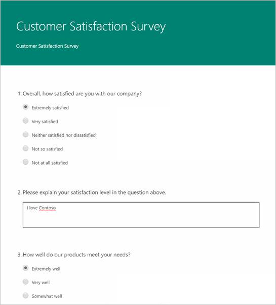
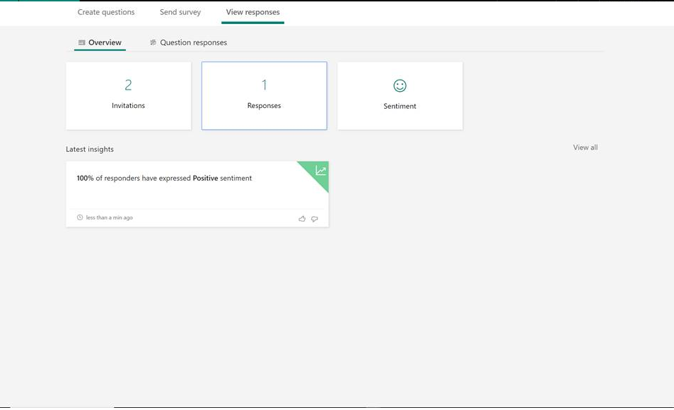

# Business events and Microsoft Forms Pro

[!include[banner](../../includes/banner.md)]

This article goes through a scenario where Microsoft Forms Pro is used to create a survey that can be used with business events. Specifically, in the scenario that is described here, a survey is sent to customers when a product has been shipped. The survey information is gathered by using Forms Pro.

## Prerequisites

If you haven't used Forms Pro before, you should first read the [Forms Pro documentation](/forms-pro/) to learn how to use it.

## Scenario

1. Create a survey. Based on the title that you enter for the survey, Forms Pro suggests survey questions.

    

2. The sales order tracks the shipment. When the product has been shipped, the status of the sales order is changed to **Delivered**.

    

    Therefore, configure an alert on the sales order, so that an alert is created whenever the value of the **Status** field is changed. Be sure to set the **Send externally** option to **Yes**, so that the alert will be sent out as a business event.

    

3. Set up the flow that will be triggered by the business event whenever the status of the sales order is updated (see the illustration in the next step). After it's triggered, the flow will use the Forms connector to send the survey to the customer email address that is registered on the sales order.

    The customer email address and other information that is required for the scenario must be in the payload of the business event. If the payload doesn't have this data, it can be extended so that it includes the appropriate fields. For more information, see the [Business events developer documentation](../business-events-dev-doc.md).

4. Because Microsoft Power Automate is used to orchestrate this scenario, don't activate the **When a change based alert occurs** business event in the application. Instead, set up Power Automate so that it subscribes directly to the business event.

    

5. After you've finished setting up the flow, it will be triggered and send out the survey whenever the sales order's status is updated.

    

    As users fill in the survey and submit it, Forms Pro shows some analytics.

    

[!INCLUDE[footer-include](../../../../includes/footer-banner.md)]
