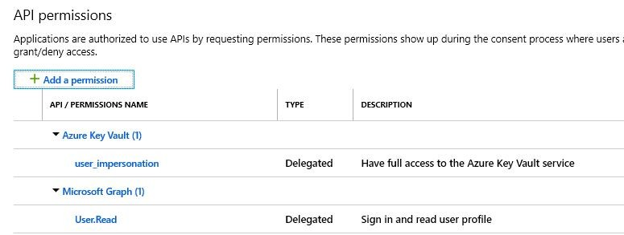
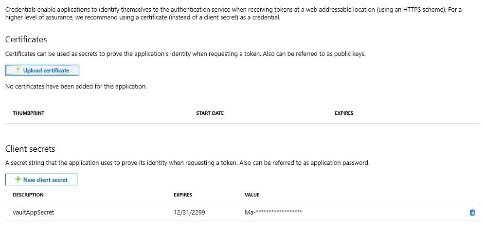
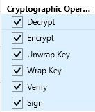
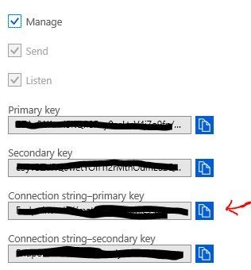

# Business events and Azure Event Hubs

[!include[banner](../../includes/banner.md)]

This tutorial describes the steps that you must follow to make business events work with Microsoft Azure Event Hubs.

1. In Azure portal, create an Active Directory application registration. Make a note of the application ID.

    

2. Give the app, permission to the Azure Key Vault application programming interface (API).

    

3. In the app registration, create an application secret. Make a note of the value.

    

4. In the key vault, give permission to the new app registration.

    

5. In the key vault, create a new secret. The value of this secret must be the connection string to your event hub. Make a note of the value.

    

6. Create an endpoint configuration for the event hub. Go to **System administration \> Setup \> Business events \> Business events catalog**, and then, on the **Endpoints** tab, select **New** to open the **Configure new endpoint** wizard.

    

7. In the **Endpoint type** field, select **Azure Event Hub**.
8. Select **Next**.
9. In the **Endpoint name** field, enter a name for the endpoint.
10. In the **Hub name** field, enter the name of your event hub.
11. In the **Microsoft Entra application ID** field, enter the application ID that was created earlier.
12. In the **Azure application secret** field, enter the value that was created earlier.
13. In the **Key Vault DNS name** field, enter the Domain Name System (DNS) name of your key vault. You can find this value on the **Overview** tab of the key vault configuration in the Azure portal.
14. In the **Key Vault secret name** field, enter the name from the secret that was created earlier.
15. Select **OK**.
16. You can now activate one or more business events that should be sent to this endpoint.

[!INCLUDE[footer-include](../../../../includes/footer-banner.md)]