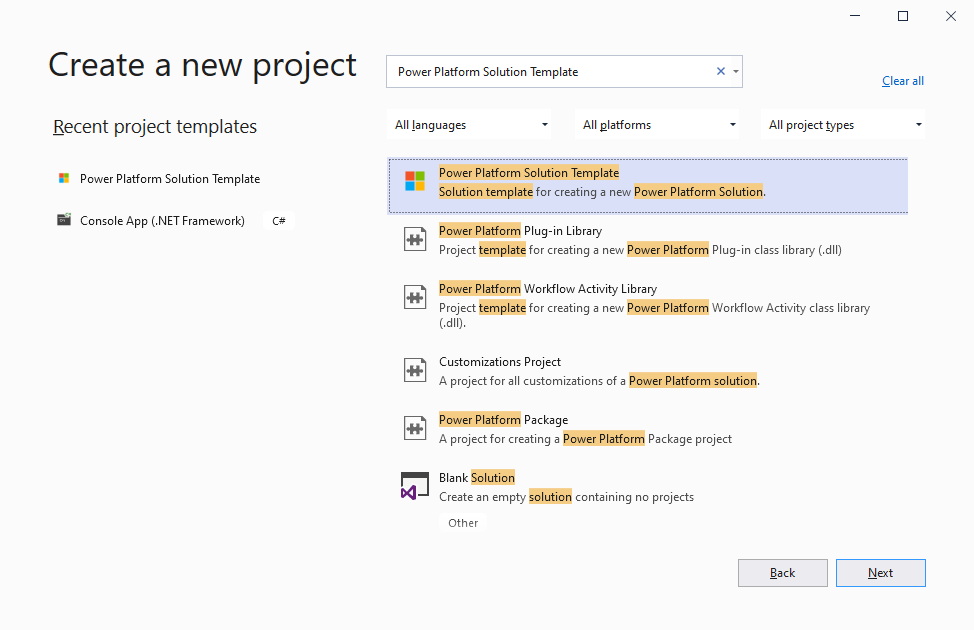
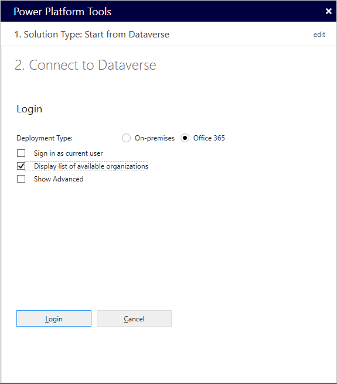
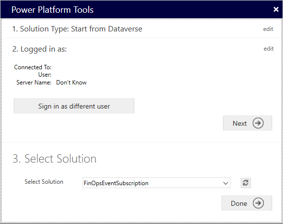
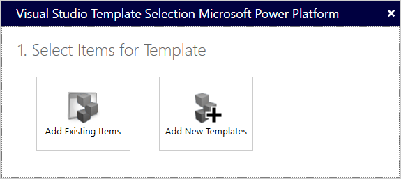
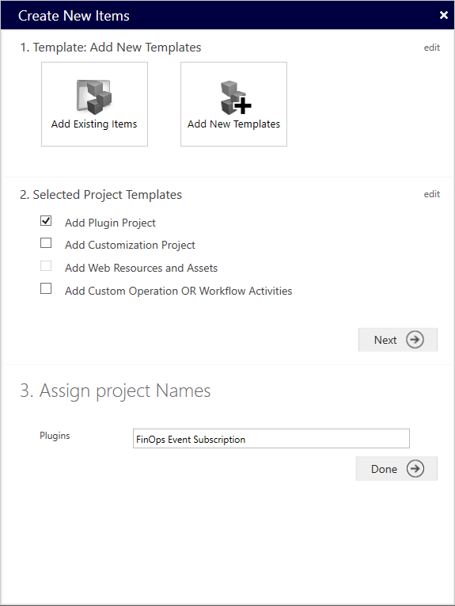
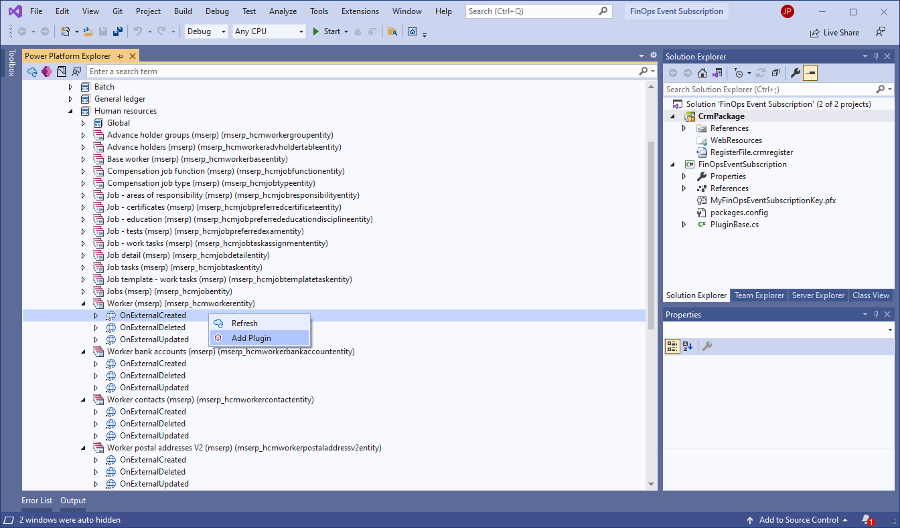
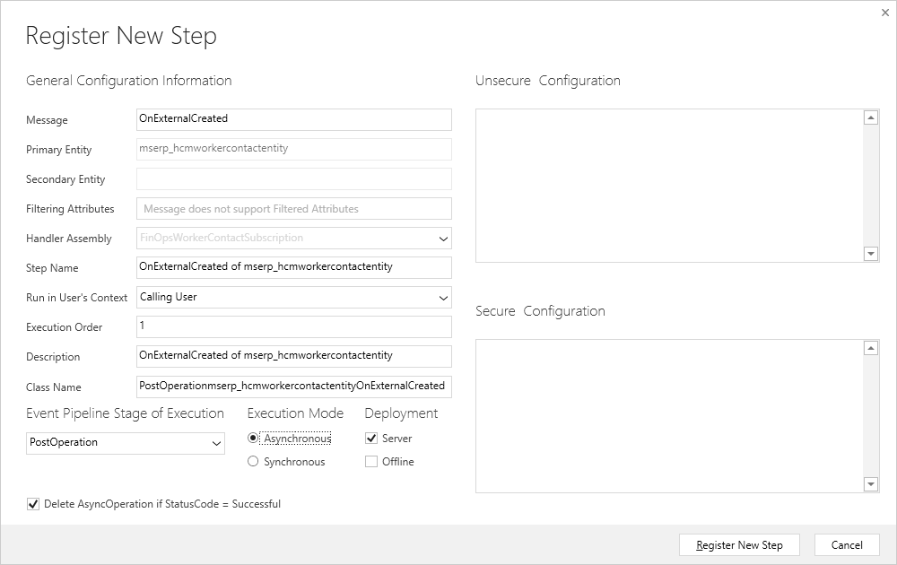
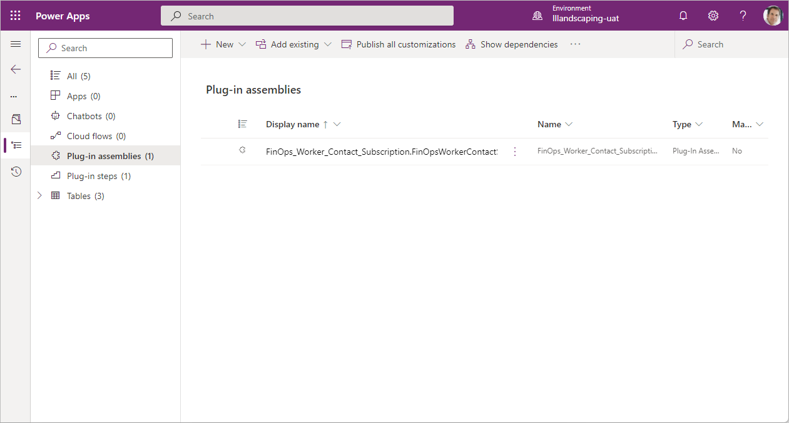
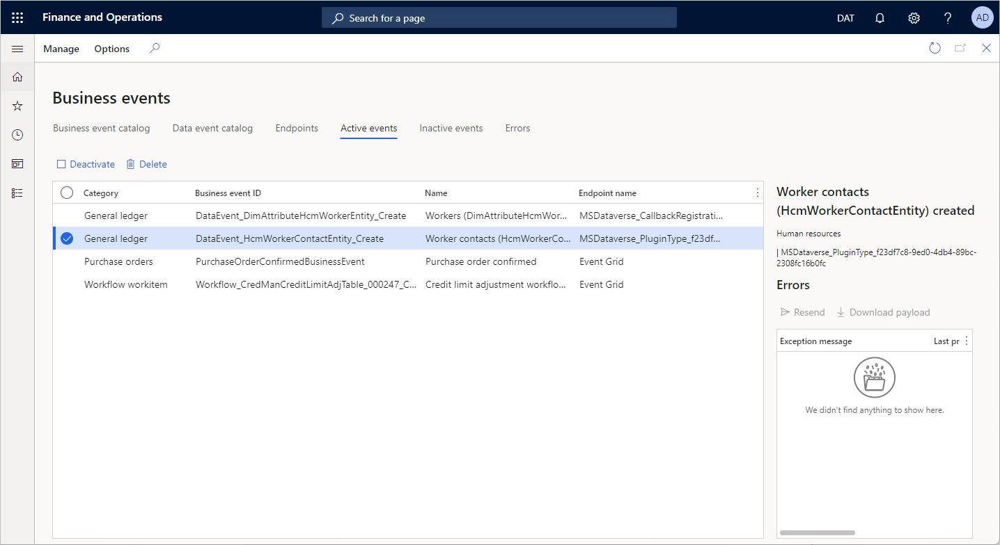

# Subscribe to events in Dataverse

[!include[banner](../../includes/banner.md)]

> [!IMPORTANT]
> Before you subscribe to Finance and Operations apps business events and data events in Microsoft Dataverse, you must enable the Microsoft Power Platform integration. For information about how to enable the Microsoft Power Platform integration for a Finance and Operations apps environment, see [Enabling the Power Platform integration](../../power-platform/enable-power-platform-integration.md).

You can subscribe to Finance and Operations apps business events and data events in Dataverse by registering plug-ins and software development kit (SDK) steps on the events in Dataverse. This topic describes how to use the Power Platform Tools extension for Visual Studio to register a plug-in for a Finance and Operations apps event. The subscriptions are shown together with other subscriptions in the business event catalog in Finance and Operations apps. The endpoint then works like other endpoints in the Finance and Operations apps business event catalog.

## Set up your development environment

### Install the Power Platform Tools extension

Power Platform Tools for Visual Studio is an extension that provides code templates for Dataverse plug-ins. In includes a Dataverse explorer that shows tables, business events, and virtual entity data events. The explorer lets you register plug-ins directly from Visual Studio. The C# code for the plug-in can then be deployed directly to Dataverse from the solution.

For information about how to install the Power Platform Tools extension, see [Install Power Platform Tools](/powerapps/developer/data-platform/tools/devtools-install).

### Create a project

After you've installed the Power Platform Tools extension, create a new project.

1. Open Visual Studio 2019 or later.
2. In the **Get started** dialog box, select **Create a new project**.
3. In the **Create a new project** dialog box, search for **Power Platform Solution Template**, select it, and then select **Next**.

    

4. In the **Configure your new project** dialog box, enter a project name, select the location where you want to save the solution file, and then select **Create**.
5. In the **Configure Microsoft Power Platform Solution** dialog box, under **1. Solution Type to Configure**, select **Start from Dataverse**.
6. In the **Power Platform Tools** dialog box, under **2. Connect to Dataverse**, follow these steps:

    1. In the **Deployment Type** field group, select the **Office 365** option.
    2. Select the **Display list of available organizations** checkbox.
    3. Select **Login**, and enter the credentials to sign in to the Dataverse environment that is linked to your Finance and Operations apps environment.
    4. In the list of organizations, select the Microsoft Power Platform environment that you want to work with. Then select **Login**.
    5. Select **Next**.

    

7. Under **3. Select Solution**, select the Microsoft Power Platform solution where you want to create the event subscription. If you haven't yet created a solution, you can create one in the Power Apps maker portal by following the steps in [Create a solution](/powerapps/maker/data-platform/create-solution).

    

8. Select **Done**.
9. In the **Visual Studio Template Selection Microsoft Power Platform** dialog box, under **1. Select Items for Template**, select **Add New Templates**.

    

10. In the **Create New Items** dialog box, under **2. Selected Template Projects**, select the **Add Plugin Project** checkbox, and then select **Next**.
11. Under **3. Assign project Names**, in the **Plugins** field, enter a name for the plug-in project. The name will be the name of the Visual Studio project. By default, it will also be the name of the assembly.

    

12. Select **Done**.

For more information about how to use the Power Platform Tools extension to create a project, see [Quickstart: Create a Power Platform Tools project](/powerapps/developer/data-platform/tools/devtools-create-project).

### Sign the assemblies

Dataverse assemblies must be signed. You can either set up a self-signed key in the solution or provide another key if you have one available. To create a self-signed key, follow these steps.

1. In Visual Studio, in Solution Explorer, select and hold (or right-click) the project name, and then select **Properties**.
2. On the **Signing** tab, select the **Sign the assembly** checkbox.
3. In the **Choose a strong name key file** field, select **New**.
4. Enter a name and password for the key, and then select **OK**.

## Subscribe to a Finance and Operations apps event

After you've finished setting up the development environment, you can begin to write code. You can create a C# class library that runs business logic in Dataverse when a Finance and Operations apps business event or data event that the plug-in is subscribed to occurs.

### Register a new step

1. In Visual Studio, on the **View** menu, select **Power Platform Explorer**.

    Power Platform Explorer shows a list of components from the Dataverse environment that you selected during the setup of the development environment. These components include tables, choices, and event catalogs.

2. Under the **Event Catalog** node, expand **Finance and Operations**.

    Under the **Finance and Operations** node, you should see a list of catalogs that are available in the **Dynamics 365 ERP Virtual Entities** solution in the selected Microsoft Power Platform environment. Under each catalog, you should see a list of the virtual entities that have been generated for that category in the environment, and the data events that are available for each of those virtual entities (**Created**, **Updated**, and **Deleted**). 

    (If you don't see any catalogs under the **Finance and Operations** node, you might have to generate and enable the virtual entities that are required for your solution. For more information about how to generate virtual entities in a Dataverse environment, see [Enable Microsoft Dataverse virtual entities](../../power-platform/enable-virtual-entities.md). After you've enabled the required virtual entities, select **Refresh** in Power Platform Explorer to update the list so that it shows the entities.)

    Under each catalog, under the **Global** node, you should see all the Finance and Operations apps business events that have been activated for the category.

3. Select and hold (or right-click) the data event under the virtual entity that should trigger your business logic, and then select **Add Plugin**.

    

4. In the **Register New Step** dialog box, follow these steps:

    1. In the **Class Name** field, change the value to the name of the class that you want to create.
    2. Under **Event Pipeline Stage of Execution**, select **PostOperation** in the drop-down list.
    3. Under **Execution Mode**, select the **Asynchronous** option.
    4. Select **Register New Step**.

    > [!NOTE]
    > The **PreValidation** and **PreOperation** execution stages and the **Synchronous** execution mode aren't currently supported for virtual entities.

    

When the new step is registered, a new class is generated that has the base code for the plug-in. In the **ExecuteCdsPlugin** method of the new class, you can write the custom business logic in the place that is indicated by the **TODO**. You can then build your solution and deploy the plug-in to your environment.

## Deploy the plug-in

You can now deploy your plug-in to the Microsoft Power Platform solution.

- In Visual Studio, in Solution Explorer, select and hold (or right-click) the project, and the select **Deploy**.

To verify that deployment was successful, you can view the plug-in assembly in the Power Apps maker portal. Go to the Microsoft Power Platform solution that you deployed the plug-in to, and then, in the navigation on the left, select **Plug-in assemblies**. To view the registered plug-in step, select **Plug-in steps** in the navigation.

You can also verify that the new endpoint appears correctly on the **Endpoints** tab of the **Business events** page in the Finance and Operations app, and that the new event appears on the **Active events** tab.

## Troubleshooting

If deployment fails, you can troubleshoot the issue by turning on verbose logging.

1. In Visual Studio, on the **Tools** menu, select **Options**.
2. In the **Options** dialog box, under the **Power Platform Tools** node, select **General**.
3. Select **Display Detailed Log Data** and **(Diagnostics) Capture Detailed Dataverse Communications Log**.
4. Select **OK**.
