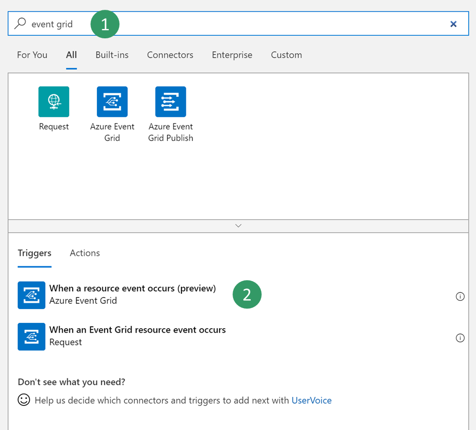
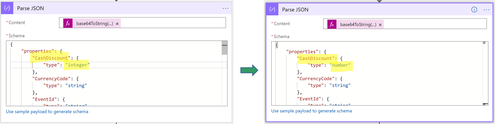

# Business events and Azure Event Grid
[!include[banner](../../includes/banner.md)]

This article explains how to configure a Microsoft Azure Event Grid endpoint, and how to consume a business event from Event Grid.

## Scenario overview

Security best practices recommend that you store connection strings outside applications, in an Azure Key Vault drive, and that you give applications the correct access to the key vault keys, secrets, or certificates.

Here are two of the many benefits of this approach:

- Someone who gets access to the application database won't be able to get the third-party connection string.
- Maintenance is easier, especially when multiple applications access the same resources, because you must update connection strings in only one place.

The following is an overview of the procedures that you must complete:

1. Create a new Event Grid topic.
2. Create a new key vault to store the key for the Event Grid topic.
3. Register an Azure app that has permission to access the key vault.
4. Configure the parameters of the endpoint.
5. Consume the business event.

## Procedure 1: Create a new Event Grid topic

1. Sign in to the Azure portal.
2. Select **All services \> Integration \> Event Grid Topics**.
3. Select **Add** to create a new Event Grid topic. Set the parameters, and then select **Create**. You can create a new resource group as a container for your lab, or you can use an existing resource group.
4. After deployment is completed, select the new Event Grid. On the property blade, select **Overview**, and make a note of the **Topic Endpoint** value. You need this value later.
5. Back on the property blade, select **Access keys**, and copy the **Key 1** value. You need this value when you configure the key vault in the next procedure.

## Procedure 2: Create a key vault

In this procedure, you create a key vault to store the key that you copied in the previous procedure. A key vault is a secure drive that is used to store keys, secrets, and certificates. Instead of storing the connection string, a more typical and more secure approach is to store it in a key vault. You can then register a new application with Microsoft Entra and grant it the right to retrieve the secret from the key vault.

1. In the Azure portal, select **All services \> Security \> Key vaults**.
2. Create a new key vault in your resource group and set the default parameters.

    

3. Select **Overview**, then copy and save the **DNS Name** value for the key vault. You use this value later.
4. Select **BE-key vault \> Secrets \> Generate/Import**. Enter a name for your secret, and paste the **Key 1** value that you saved earlier.
5. Select **Create**.

## Procedure 3: Register a new application

In this procedure, you register a new application with Microsoft Entra ID, and give it read and retrieve access to key vault secrets. The application will then use this application to retrieve Event Grid secrets.

1. In the Azure portal, select **All services \> Security \> Microsoft Entra ID**.
2. Select **App registrations (preview) \> New registration**, and then enter a name for your application.
3. Select **Register**.
4. Select your new application, and then select **Certificates & secrets \> New client secret**. Enter a name for your secret, and set the secret so that it never expires. Then select **Add**.
5. Copy and save your new secret. You use it later.

    > [!IMPORTANT]
    > Secrets are visible only one time. If you forget to copy the secret, you have to delete it and create a new secret.

6. Select **Overview**, and copy and save the application ID. You use this value later.
7. Select **All services \> Security \> Key vaults**.
8. Select the key vault that you created earlier, and then select **Access policies \> Add new**.
9. On the **Principal** blade, select your new registered application. Select the check boxes for the **Get** and **List** secret permissions to retrieve key vault secrets.

    

10. Save your new access policy.

## Procedure 4: Configure a Business Events endpoint

1. Sign in to the application and go to **System administration \> Setup \> Business events**.
2. Select **Endpoints**.
3. Select **New**.
4. Select **Azure Event Grid**.
5. Select **Next**.
6. Set the required parameter values.
7. Select **OK**.

## Procedure 5: Consume a business event

The business scenario involves sending an email message whenever a free text invoice is posted for the USMF company. The message must contain details such as the customer account number, the customer name, and the total amount of the invoice.

1. Select the business event catalog and look for **free text invoice posted** business event.
2. Then activate the business event for USMF company. Once activated, a test message is sent to validate the configuration and cache the connection.
3. To verify that the test message has been received, in the Azure portal, select your Event Grid topic, and then select **Metrics**. Verify that both the **Published Events** metric and the **Unmatched Events** metric show a value of at least **1**. If they don't, wait for the batch job to pick up your message.

    When both metrics have a value of at least **1**, you create a new logic app to subscribe to your Event Grid topic.

4. Select **All services \> Integration \> Logic Apps**.
5. Create a new logic app in your resource group.

    

6. After your logic app resource has been created, select the option to create a blank logic app.
7. Search for **Event Grid**, and select the **When a resource event occurs (preview)** trigger.

    

8. Select your subscription, select **Microsoft.EventGrid.Topics** as the resource type, and select the name of the Event Grid topic that you created in procedure 1.

    

9. Select **New Step** to add a new action.
10. Search for the **Parse Json** data operation. This step is required so that the message can be parsed by using the provided schema for the data contract.
11. Click in the **Content** field of the **Parse Json** action. The pane that appears gives you the option form the previous trigger. You must select the **Data object** field of the Event Grid message that contains the payload that is transmitted by finance and operations.

    

    Next, you must enter the provided schema for the contract. This is only a sample payload. However, you can use a capability of Azure Logic Apps to generate a schema from a payload.

12. Select your event in the business event catalog, and then select the **Download schema** link. A text file is downloaded. Open the text file, and copy the contents.
13. Go back to Logic Apps, and select the **Use sample payload to generate schema** link. Paste the contents of the text file, and then select **Done**.

    

14. Depending on the quality of your sample payload, your generator won't be able to distinguish between an integer and a real value, especially if the real value is provided as a whole number in the sample payload. Review the schema that is generated, and determine whether you must change a field of the **integer** data type to the **number** data type. (In JavaScript Object Notation \[JSON\], the **number** data type represents real values.)

    

    Next, you select a final action, such as sending a notification email that includes customer payment details.

15. Search for the **send email** action, and then sign in to your Microsoft 365 account.
16. Fill in the message with the required fields.
17. Save your logic app.
18. Trigger the business event by posting a customer payment. Then verify that the logic app runs, and that you receive an email that includes customer payment details.

[!INCLUDE[footer-include](../../../../includes/footer-banner.md)]
