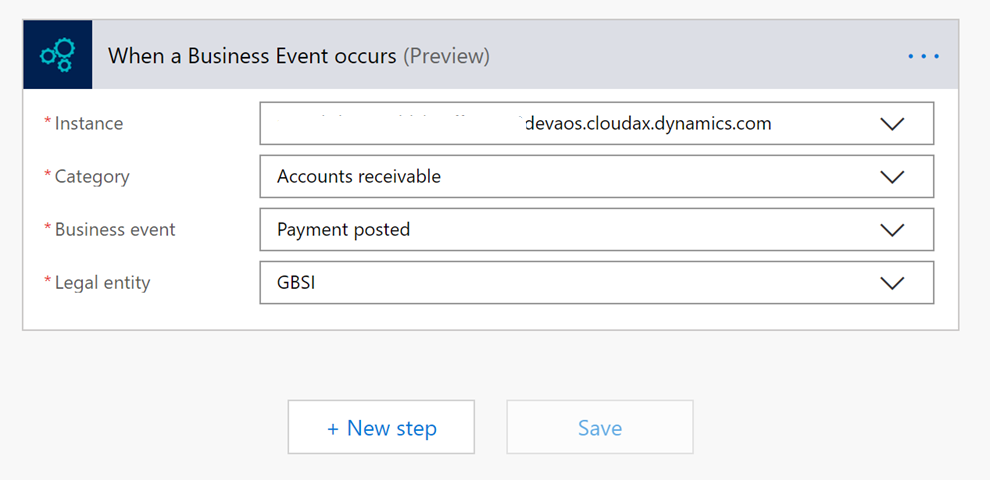
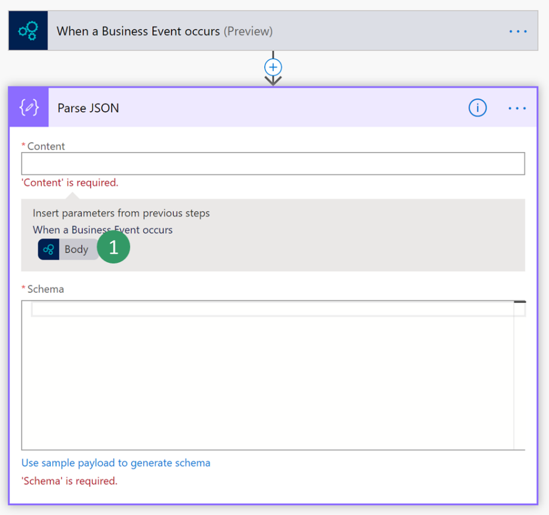
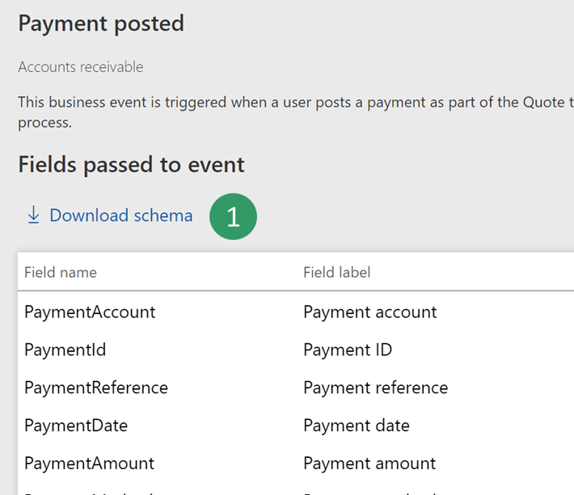
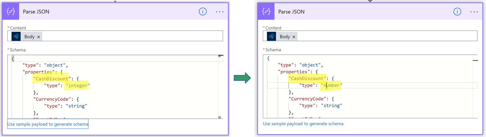
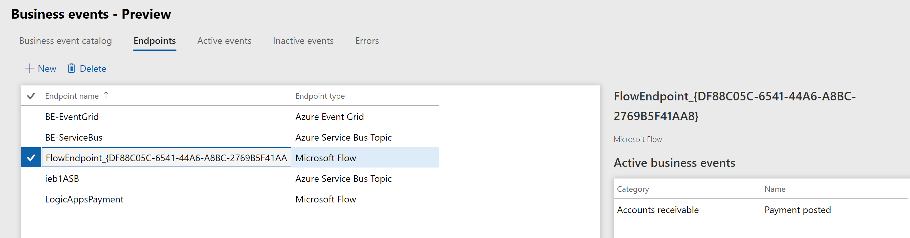
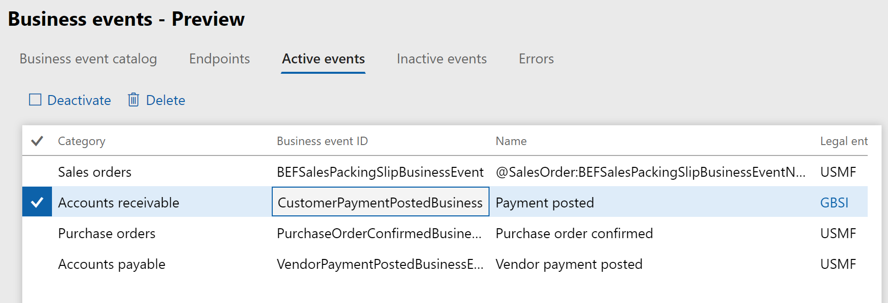

# Business events and Microsoft Power Automate

[!include[banner](../../includes/banner.md)]

This article explains how to configure and consume a business event from a Microsoft Power Automate endpoint by using the **When a Business Event occurs** trigger of the finance and operations connector. 

This article shows how to perform the following tasks:

- Create a new flow in Power Automate.
- Trigger a business event.

The steps in this article show how use the finance and operations connector. However, they can also be applied to the process of creating flows in Power Automate for finance and operations apps business events and data events in the Microsoft Dataverse connector. For more information about finance and operations apps business events and data events that have the **When an action is performed** and **When a row is added, modified or deleted** triggers in the Dataverse connector, see [Business events in Microsoft Power Automate](../business-events-flow.md).

## Create a new flow in Power Automate

1.  Sign in to Power Automate portal.

2.  Select an existing environment where you have the permissions needed to create a Power Automate resource. The default environment is open to all companies.

3.  Select **New \> Create from blank**.

4.  Search for **Dynamics 365 Finance** and select the connector.
     
5.  You will notice a trigger named **When a Business Event occurs**. Select this trigger.

6.  Select your environment instance, category, event name, and legal entity. 
    > [!TIP]
    > Take advantage of the auto-complete that Power Automate provides by entering only part of the environment instance URL or part of the event name.

    

7.  Select the **New Step** button to add a new action.

8.  Search for the **Parse JSON** data operation. This step is needed to parse the message with the schema of the data contract.

    

9.  Select the content field of **Parse Json** action, then the **Body** output from the previous step should appear as an option. Select **Body**.

    

10. Enter the schema of the contract. Because the app provides only a sample payload you can use the Power Automate capability to generate a schema from a payload. Select an event in the catalog (for example, Customer Payment) and select the **Download schema** link. This will download a text file. Open the text file and copy the content.

    

11. Go Back to Power Automate and select the **Use sample payload to generate schema** link. Paste your text file content and select **Done**.

    

12. Depending on the quality of your sample payload, your generator will not be able to distinguish between an integer and a real number. This is true if the real number is provided as a whole number in the sample payload. Review your generated schema and check if you need to change an "integer" into "number". (In JSON, a "number" data type means real number).

    

13.  Choose another final action to consume the business event content. For instance, you can send an email (or post a text message to Teams) to notify the customer about payment details. Search for the **Send email** action, then sign in to your Microsoft 365 account.

14.  Fill in the message with the required fields.

     

15. Save the flow.

## Trigger a Business Event

Power Automate can configure the application automatically for you. After you save your flow, it creates an endpoint, then it activates the business event for you. There is no remaining configuration step apart from verifying that the endpoint has been correctly configured before triggering an event.

1. Sign in to the client.

2.  Go to **System Administration \> Setup \> Business Events**.

3.  Select **Endpoints**.

4.  Verify that a new endpoint has been created with a GUID appended in the name.

    

5.  If you check the **Active events** tab, you can also verify that "**Payment Posted**" is activated for legal entity GBSI.

    

6.  The final step is to trigger the business event of a posted customer payment and check whether the flow runs and you receive an email with customer payment details.

## Troubleshooting a flow
Here are some troubleshooting suggestions:
- Power Automate provides a full history of runs to help determine what might be wrong with a failing flow.
- When reviewing a failed run, carefully review the inputs and outputs of trigger and action blocks. 
- After changes have been made to the flow, go to the latest run or a particular run, and **Resubmit** the inputs to run the flow again.

[!INCLUDE[footer-include](../../../../includes/footer-banner.md)]

