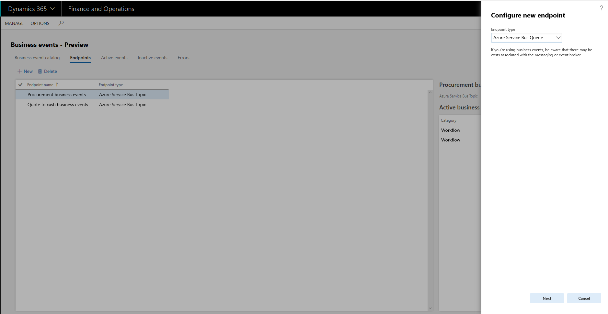
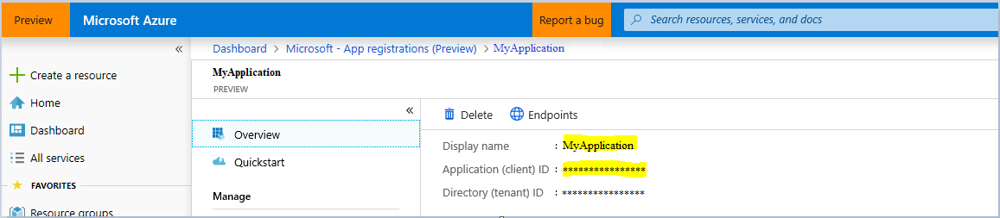
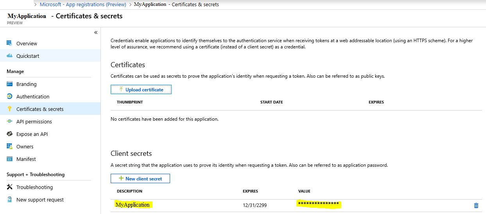
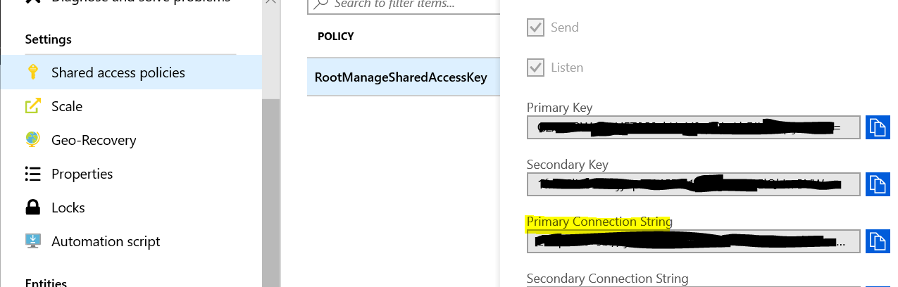
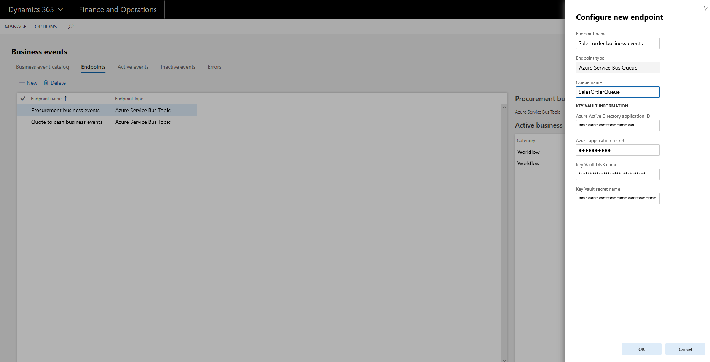

# Business events and Azure Service Bus Queue
[!include[banner](../../includes/banner.md)]

This article explains how to configure a Microsoft Azure Service Bus Queue endpoint.

## Create an Azure Service Bus Queue endpoint

1. On the **Business events** page, on the **Endpoints** tab, select **New** to create an endpoint.
2. In the **Configure new endpoint** dialog box, in the **Endpoint type** field, select the appropriate endpoint type. To create an endpoint to a Service Bus queue, select **Azure Service Bus Queue**.
3. Select **Next**.

    

4. In the **Endpoint name** field, enter the name of the endpoint.
5. Set up Azure Key Vault to provide the secret to the Azure messaging resource.
6. Set up the Microsoft Entra application ID and application secret.
7. Back in the **Configure new endpoint** dialog box, in the **Queue name** field, enter the name that you created for the Service Bus queue  in the Azure Service Bus Queue configuration in Azure.

    

8. In the **Microsoft Entra application ID** field, enter the application ID that you created in Microsoft Entra ID in the Azure portal.

    

9. In the **Azure application secret** field, enter the secret value for the application.

    

10. In the **Key Vault DNS name** field, enter the Domain Name System (DNS) name from your Key Vault setup.

    

11. In the **Key Vault secret name** field, enter the secret name for the endpoint resource that must be created in Key Vault.

    

    The **Key Vault Secret** value in Azure will be the **Primary Connection String** value for the Service Bus. You can find this value in the Service Bus that you configured, at **Shared Access Policies \> RootManagedSharedAccessKey**.

    

12. Select **OK**.

    

> [!IMPORTANT]
> The Azure application that was registered must be also added to the Key Vault setup under **Access policies** in the key vault. To complete this setup, select the **Key, Secret & Certificate Management** template, and then select the application as the **principal**.