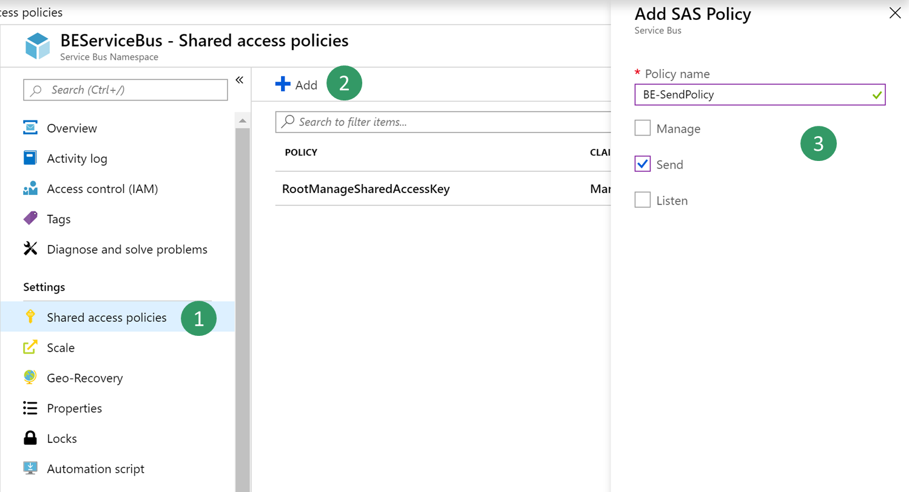
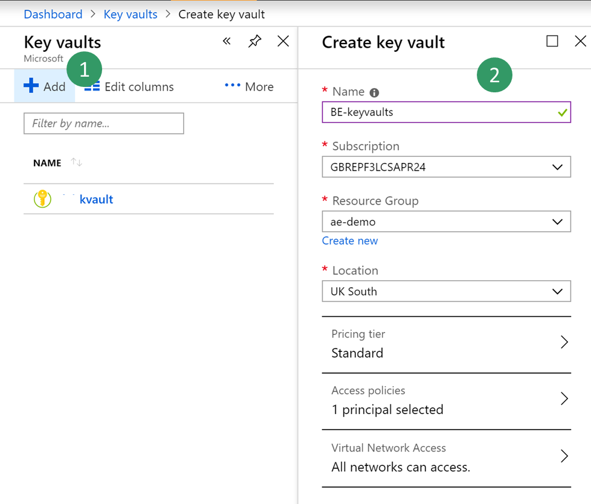
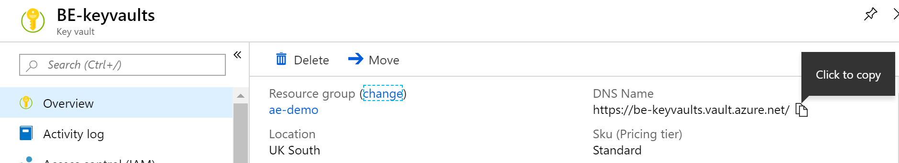
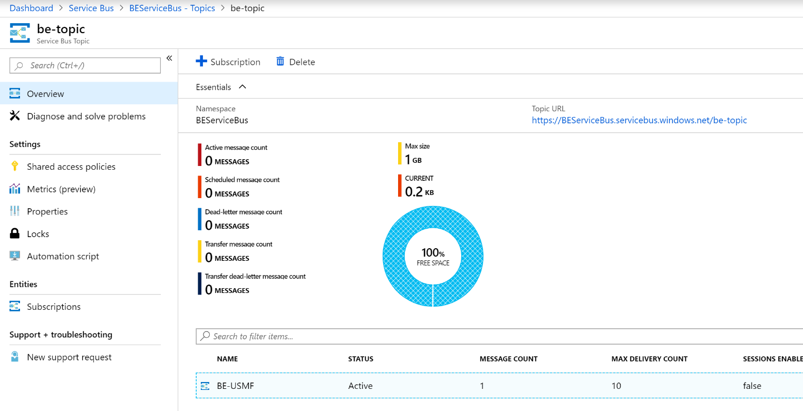
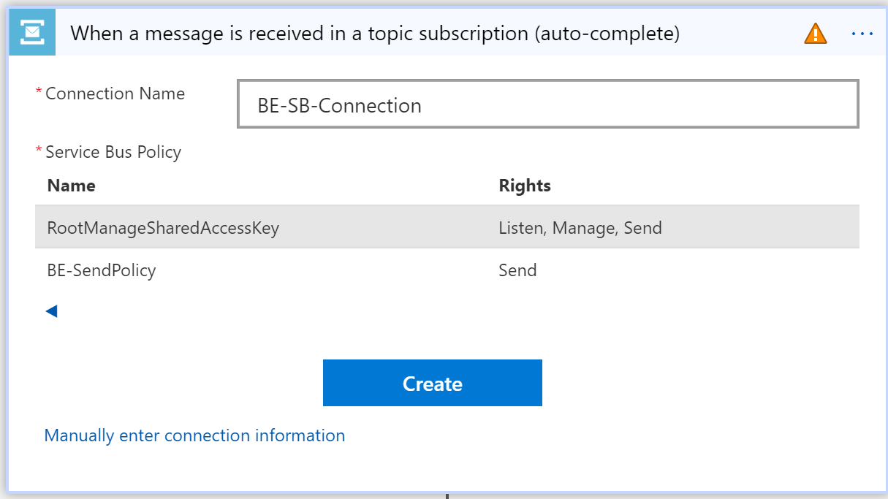
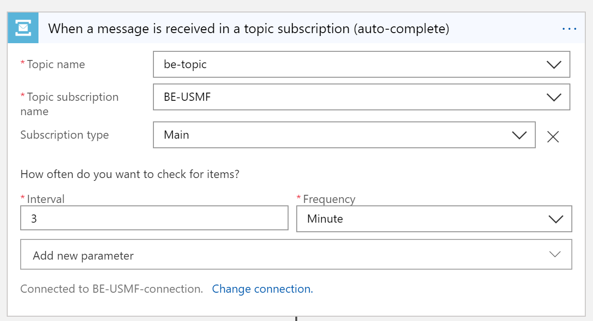
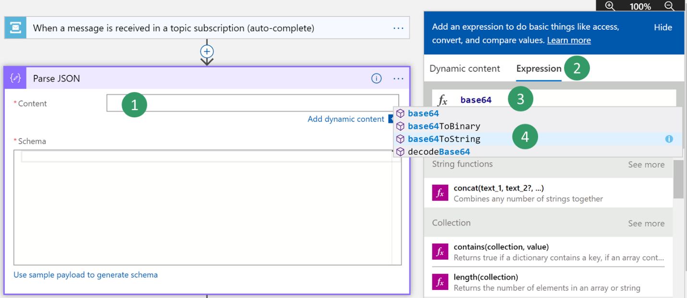
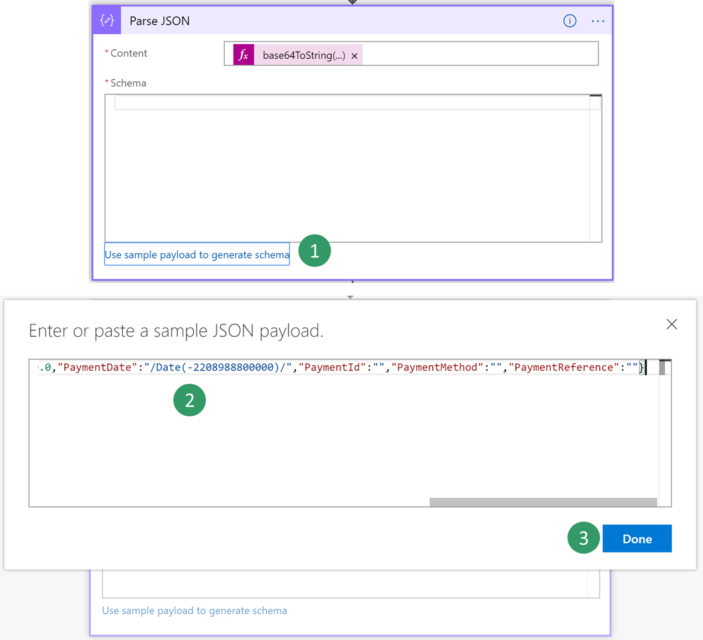

# Business events and Azure Service Bus
[!include[banner](../../includes/banner.md)]

This article explains how to configure a Microsoft Azure Service Bus endpoint and how to consume a business event from Service Bus.

## Scenario overview

Security best practices recommend that you store connection strings outside applications, in an Azure Key Vault drive, and that you give applications the correct access to the key vault keys, secrets, or certificates.

Here are two of the many benefits of this approach:

- Someone who gets access to the application database won't be able to get the third-party connection string.
- Maintenance is easier, especially when multiple applications access the same resources, because you must update connection strings in only one place.

Here is an overview of the procedures that you must complete:

1. Create a new Service Bus namespace.
2. Create a new Service Bus topic and subscription.
3. Create a new key vault to store the Service Bus key.
4. Register an Azure app that has permission to access the key vault.
5. Configure a Business Events endpoint.
6. Consume the business event.

## Create a new Service Bus namespace

1. Sign in to the Azure portal.
2. Select **All services \> Integration \> Service Bus**.
3. Select **Add** to create a new Service Bus namespace, and set the parameters. Select the **Standard** pricing tier. You can create a new resource group as a container for your lab, or you can use an existing resource group.

    > [!NOTE]
    > If you select the **Basic** pricing tier, you can create only queues. To create topics, you must select the **Standard** pricing tier.

4. When you've finished setting all the parameters, select **Create**.

## Create a new Service Bus topic and subscription

1. In the Azure portal, select the Service Bus that you just created, and then create a new topic.

   

2. Select the new topic, and then create a new subscription that is named **BE-USMF**.
3. Go back to the blade for your Service Bus, and create a new shared access policy to send events. Only the **Send** policy is required to send events to the Service Bus topic.

    

4. Select the new **Send** policy, and then copy and save the **Primary Connection String** value. You will use this value later.

  > [!NOTE]
  > The shared access policy must be at the name space level and not at the topic level. If the shared access policy from the topic level is used, the trailing string with semi colon EntityPath= must not be included when configuring the endpoint for business events.

## Create a new key vault

In this procedure, you will create a key vault to store the key that you copied in the previous procedure. A key vault is a secure drive that is used to store keys, secrets, and certificates. Instead of storing the connection string, a more typical and more secure approach is to store it in a key vault. You can then register a new application with Microsoft Entra and grant it the right to retrieve the secret from the key vault.

1. In the Azure portal, select **All services \> Security \> Key vaults**.
2. Create a new key vault in your resource group and set the default parameters.

    

3. Select **Overview**, then copy and save the **DNS Name** value for the key vault. You will use this value later.

    

4. Select **BE-key vault \> Secrets \> Generate/Import**. Enter a name for your secret, and paste the Service Bus connection string that you saved earlier.
5. Select **Create**.

## Register a new application

In this procedure, you will register a new application with Microsoft Entra ID, and give it read and retrieve access to key vault secrets. Finance and operations will then use this application to retrieve Service Bus secrets.

1. In the Azure portal, select **All services \> Security \> Microsoft Entra ID**.
2. Select **App registrations (preview) \> New registration**, and enter a name for your application.
3. Select **Register**.
4. Select the new application, and then select **Certificates & secrets \> New client secret**. Enter a name for your secret, and set the secret so that it never expires. Then select **Add**.
5. Copy and save your new secret. You will use it later.

    > [!IMPORTANT]
    > Secrets are visible only one time. If you forget to copy the secret, you will have to delete it and create a new secret.

6. Select **Overview**, and copy and save the application ID. You will use this value later.
7. Select **All services \> Security \> Key vaults**.
8. Select the key vault that you created earlier, and then select **Access policies \> Add new**.
9. On the **Principal** blade, select your new registered application. Select the check boxes for the **Get** and **List** secret permissions to retrieve key vault secrets.

    

10. Save your new access policy.

## Configure a Business Events endpoint 

1. Sign in to the application and go to **System administration** \> **Setup** \> **Business events**.
2. Select **Endpoints**.
3. Select **New**.
4. Select **Azure Service Bus Topic**.
5. Select **Next**.
6. Set the required parameter values.
7. Select **OK**.

## Consume a business event

The business scenario involves sending an email or a message to a team channel whenever a customer payment is posted for the USMF company. The message must contain details such as the customer account number, the customer name, and the amount of the payment.

1. Select the business event catalog and look for **customer payment posted** business event
2. Activate the business event for USMF company.
    After you activate a business event that uses the new Service Bus endpoint, the application sends a test message to verify that the configuration is accurate and to cache the connection.

3. To verify that the test message has been received, in the Azure portal, select your **BE-Topic** Service Bus topic, and then go into the **BE-USMF** Service Bus subscription that you created earlier. Verify that the message count for the subscription shows a value of at least **1**. If it doesn't, wait for the batch job to pick up your message.

    

3. Select **All services \> Integration \> Logic Apps**.

    

4. Create a new logic app in your resource group.
5. After your Logic Apps resource has been created, select the option to create a blank logic app.
6. Search for **Service Bus**, and select it.
7. Select the trigger that is named **When a message is received in a topic subscription (auto-complete)**.

    > [!NOTE] 
    > Auto-complete means that the message is deleted from the subscription queue after it's retrieved. Peek-lock authorizes concurrent consumers. It requires a call to the **complete** command of the Service Bus application programming interface (API) in order to delete the message.

    Because Logic Apps is accessing your Service Bus for the first time, it asks for a new connection. This connection will cache connection details as a Service Bus namespace URL and credential.

8. Select your Service Bus namespace, and enter a name for the new connection.
9. Select the **RootManageSharedAccessKey** policy for your logic app, and then select **Create**.

    > [!NOTE]
    > The **Send** policy can't be used here, because you want to *retrieve* messages, not send them. As a best practice, you could have created a new policy for this use case and given it **Listen** permission only.

    

10. Select your trigger parameters. Be sure to use the correct names for the topic and subscription that you created.

    This API polls Service Bus for new messages at a configurable recurrence (by default, every three minutes). If the volume of messages is low, the API will have a cost impact for unnecessary triggers, because Logic Apps is priced per trigger call and action run. However, you can implement a push architecture that uses Azure Event Grid in the middle. Service Bus can then push events to Event Grid when there are messages in a queue or a subscription. For more information, see [Azure Service Bus to Event Grid integration overview](/azure/service-bus-messaging/service-bus-to-event-grid-integration-concept).

    

11. Select **New step** to add a new action.
12. Search for the **Parse Json** data operation. This step is required so that the message can be parsed by using the schema of the data contract.

    The body content that is received from the Service Bus is encoded into base64 format. Therefore, you must transform it to string format before the JavaScript Object Notation (JSON) payload can be parsed. 

13. Click in the **Content** field, and then, in the pane that appears, on the **Expression** tab, enter the following expression: **Base64ToString()**

    

14. Put the cursor between the parentheses in the expression, and then, on the **Dynamic content** tab, find and select the **Content of the message** content from the previous Service Bus trigger. Then select **OK**.

    

    Next, you must enter the schema of the contract that is received from the application. The application only provides a sample payload. However, you can use a capability of Azure Logic Apps to generate a schema from a payload.

15. Select your event in the business event catalog, and then select the **Download schema** link. Open the text file that is downloaded, and copy the contents.
16. Go back to your Logic Apps, and select the **Use sample payload to generate schema** link. Paste the contents of the text file, and then select **Done**.

    

17. Depending on the quality of your sample payload, your generator won't be able to distinguish between an integer and a real value, especially if the real value is provided as a whole number in the sample payload. Review the schema that is generated, and determine whether you must change a field of the **integer** data type to the **number** data type. (In JSON, the **number** data type represents real values.)

    

    Next, you will select a final action, such as sending a notification email that includes customer payment details.

18. Search for the **send email** action, and then sign in to your Microsoft 365 account.
19. Fill in the message with the required fields.

    

20. Save your logic app.
21. Trigger the business event by posting a customer payment. Then verify that the logic app runs, and that you receive an email that includes customer payment details.

[!INCLUDE[footer-include](../../../../includes/footer-banner.md)]
