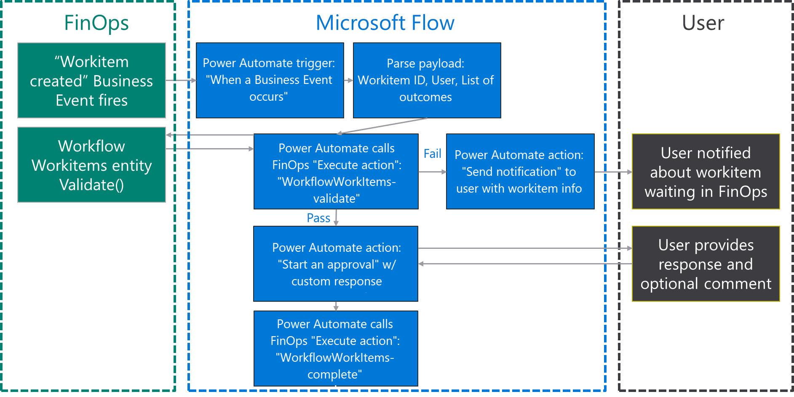
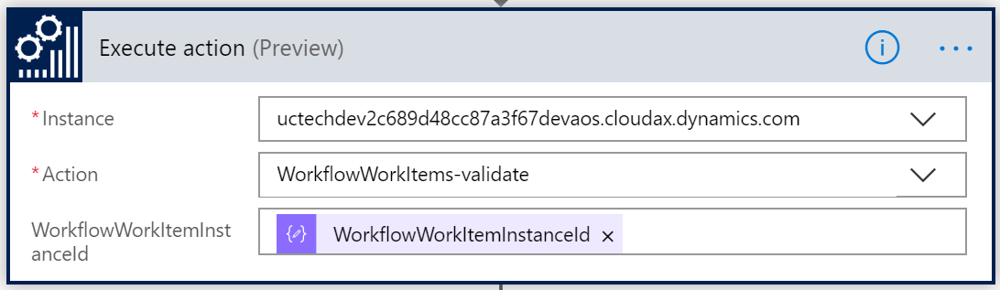
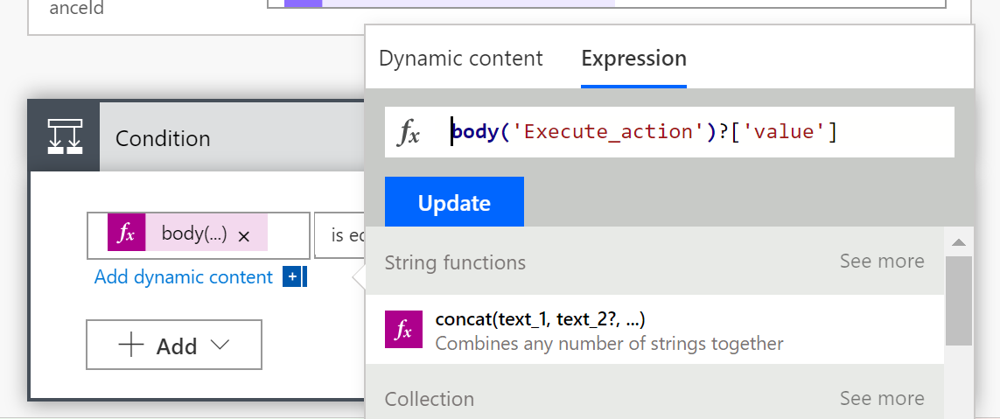
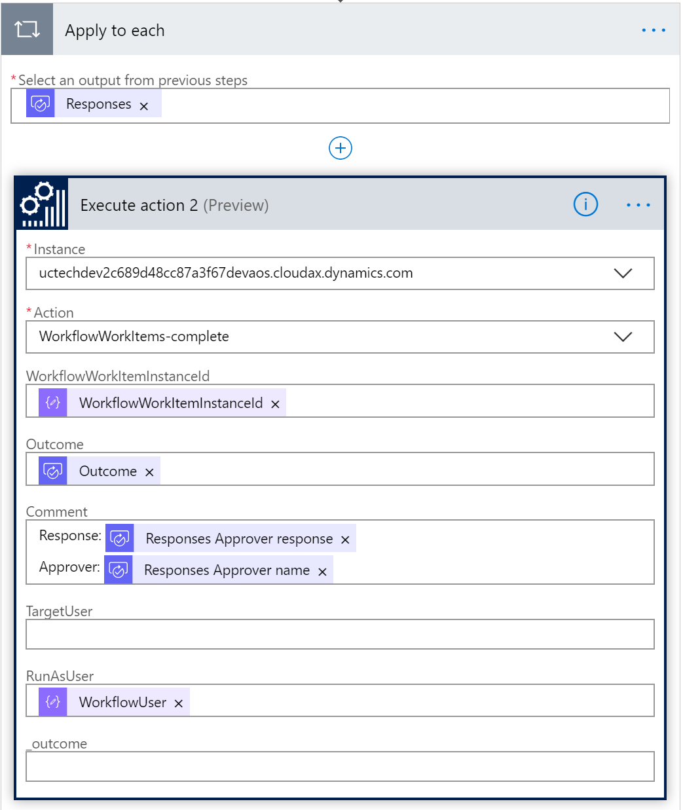

---
# required metadata

title: Business events and workflow approvals
description: This topic explains how to use Microsoft Power Automate to configure and consume a workflow business event for purchase requisition approval.
author: Sunil-Garg
ms.date: 11/13/2019
ms.topic: article
ms.prod: 
ms.technology: 

# optional metadata

# ms.search.form: [Operations AOT form name to tie this topic to]
audience: IT Pro
# ms.devlang: 
ms.reviewer: sericks
# ms.custom: [used by loc for topics migrated from the wiki]
ms.search.region: Global 
# ms.search.industry: 
ms.author: sunilg
ms.search.validFrom: Platform update 27
ms.dyn365.ops.version: 2019-6-30 

---

# Business events and workflow approvals
[!include [banner](../../includes/banner.md)]

This topic explains how to use Microsoft Power Automate to configure and consume a workflow business event for purchase requisition approval.

To complete this topic, you must be running Microsoft Dynamics 365 for Finance and Operations version 10.0.2 (May 2019) with platform update 26 or later.

## Scenario overview

The following illustration shows the high-level process that you must configure by using Power Automate. Note the following points:

1. The application fires a business event whenever a new approval starts.
2. Power Automate trigger starts. 
3. After parsing business event payload from F&O, next step is to check wheter the workflow instance ID received from F&O is still alive. This is a security step in case approval has already taken place or workflow has been recalled.
4. If the check is unsuccessful, an email is sent to notify the user about a potential work item in their workspace.
4. If the check is successful, a new Power Automate approval is started.
5. Then workflow is completed by using the outcome of the approval. The outcome can be either **Approve** or **Reject**.

## Exercise 1: Create a new flow

1. Sign in to the Power Automate portal.
2. Select an existing environment where you have the right to create a flow resource. The **(default)** environment is available to all companies.
3. Select **New \> Create from blank**.
4. Search for **Dynamics 365 for Finance and Operations**, and select the connector.
5. A new trigger is created. This trigger is named **When a Business Event occurs**. Select it.
6. Select the environment instance that has these characteristics: 

    - The category is **Workflow workitem**.
    - The event name is **Purchase requisition review (000062) – Approve purchase requisitions**.
    - Any legal entity is selected.

7. Select **New Step** to add a new action.
8. Search for the **Parse Json** data operation. This step is required so that the message can be parsed by using the schema of the data contract that the application provides.
9. Select the content field of the **Parse Json** action. The **Body** output from the previous step should appear as an option. Select **Body**.

    Next, you must enter the schema of the contract. The application provides only a sample payload. However, you can use a capability of Microsoft Flow to generate a schema from a payload.

10. Select the **000062** workflow event in the catalog, and then select the **Download schema** link. Open the text file that is downloaded, and copy the contents.
11. Go back to Power Automate, and select the **Use sample payload to generate schema** link. Paste the contents of the text file, and then select **Done**.
12. Add a new step to call a workflow action that validates whether a workflow that has the correct instance ID is running and awaiting approval.

    

13. Add a new condition control step to check the result of the validate action. The dynamic field won't provide the required output. Therefore, you must manually enter the following expression instead: **Body('Execute_action')?\['value'\]**. Then select **OK**.

    

    > [!NOTE]
    > The next time that you open the workflow, you will notice that the expression has been updated so that it shows the **value** field. As the following illustration shows, this field will have an application icon.

    

14. The condition control automatically creates two branches for **Yes**/**No** results. If the result of the validate step is **No**, an email must be sent to the user. This email notifies the user that a new task requires attention, and that the user must sign in to the client. In order to complete this step create a new send email action within the **No** container and fill in the parameter with the email of the Approver from the previous step **workflowuseremail** and a subject and body of your choice.

    > [!NOTE]
    > The email address that the workflow business event returns is the email address of the workflow approver. If the workflow approver user hasn't been configured in yourdemo environment, you can use your own email address for demo purposes.

    

15. If the result of the validate step is **Yes**, you must start a new Power Automate approval step. In the **Yes** container, select a new action that is named **Start and wait for an approval (v2)**, and choose inputs as follows: 
Approval type: Approve/reject: first to respond
title: **workflowworkitemsubject** output form Business event payload
Assigned to: **workflowuseremail** output
Then you can fill in the details section with as much information as needed from previous step such as **workflowdocument** or **workflowstepinstruction**. 
Again, you can use your own email address in the **Assigned to** field for demo purposes especially if the workflow approver user hasn't been configured in your demo environment.

    

16. Next, you must complete the workflow approval by using the outcome of the approval step. Still in the **Yes** container, add a new **Finance and Operations Execute Action** step, and choose the **WorkflowWorkitem-complete** action and the **WorkflowWorkitemInstanceID** parameter. Then fill in the rest of the parameters from the approval outputs. As a minimum the outcome section with Approval outcome and the comment section with the approver's responses. Because the approval step can support multiple approvers, the response output is an array. Therefore, as soon as you select the output **Reponses** as an input for the comment section, Power Automate automatically embeds your action in an **Apply to each** container as shown below.

    

17. Select **Save**.

## Exercise 2: Trigger a business event

Power Automate can automatically configure the application for you. After you save your flow, Power Automate creates an endpoint and activates the business event. You don't have to complete any other configurations. You just have to verify that the endpoint has been correctly configured and then trigger an event.

1. Sign in to the client.
2. Go to **System administration \> Setup \> Business events**.
3. Select **Business events**.
4. Select **Endpoints**.
5. Verify that a new endpoint has been created, and that a globally unique identifier (GUID) has been appended to the name.
6. On the **Active events** tab, verify that **Workflow workitem** is activated for the USMF company.

[!INCLUDE[footer-include](../../../../includes/footer-banner.md)]