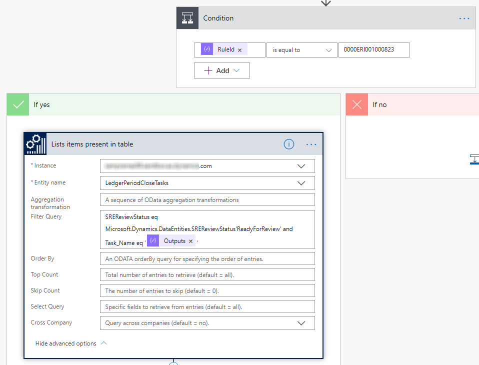
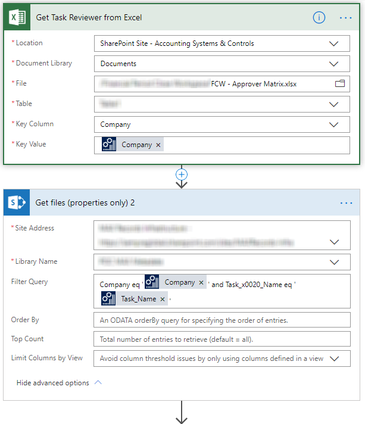
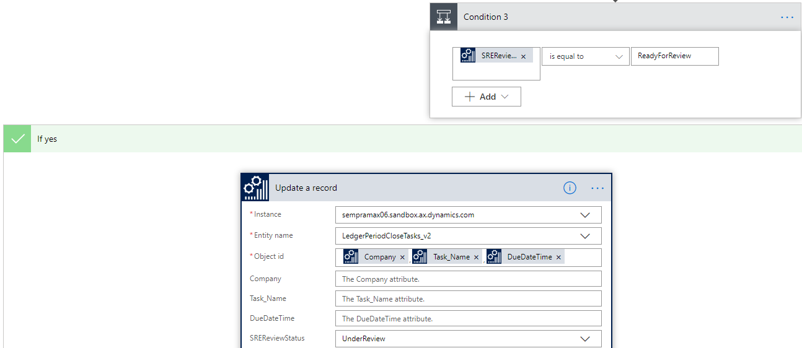
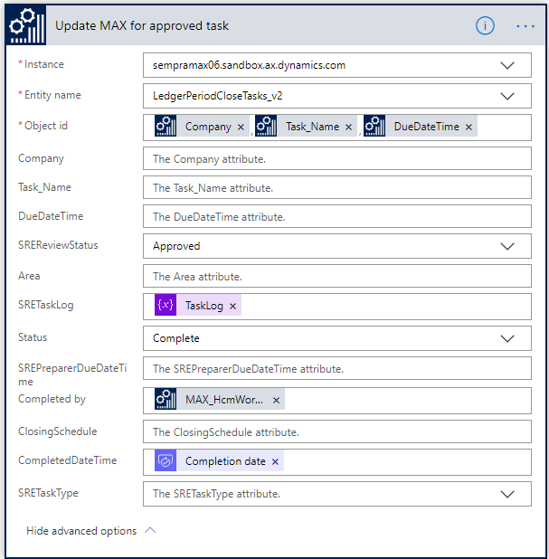
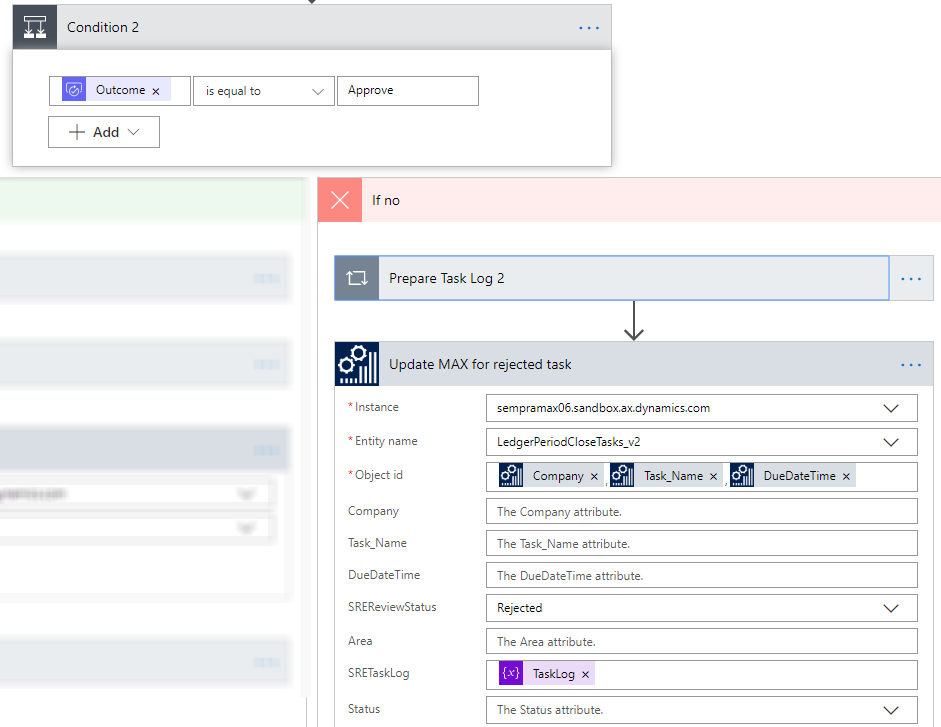

---
# required metadata

title: Business events in financial period close
description: This topic explains how to use business events in the financial period close business process to gain insights and provide internal controls.
author: suhasrao1985
manager: AnnBe
ms.date: 10/07/2019
ms.topic: article
ms.prod: 
ms.service: dynamics-ax-applications
ms.technology: 

# optional metadata

# ms.search.form: [Operations AOT form name to tie this topic to]
audience: IT Pro
# ms.devlang: 
ms.reviewer: sericks
ms.search.scope: Operations, Core
# ms.custom: [used by loc for topics migrated from the wiki]
ms.search.region: Global 
# ms.search.industry: 
ms.author: imbenbou
ms.search.validFrom: Platform update 26
ms.dyn365.ops.version: 2019-6-30 

---

# Business events in financial period close
[!include [banner](../../includes/banner.md)]

This topic explains how to use business events in the financial period close business process to gain insights and provide internal controls.

To complete this topic, you must be running Microsoft Dynamics 365 for Finance and Operations version 10.0.2 (May 2019) with platform update 26 or later.

## Scenario overview

Task management is fundamental to managing business processes across industries. Out of the box, D365FO offers users with capabilities to manage business process tasks in a structured manner. The financial period close workspace illustrates such capabilities by offering a central location to manage tasks in a company’s accounting period close process.

A few months back our organization decided to explore the utilization of the Financial period close workspace to track and report tasks associated with every period close. Performance management and traceability are some of the challenges faced by the organization in the current set up. As a result, we undertook a business process transformation exercise to identify the capabilities of the financial period close workspace.

The business process transformation exercise revealed the following business requirements:

1.  Ability to get notified when tasks needed to be started
2.  Ability to attach documents
3.  Records management and disposition capabilities for attachments
4.  Ability to approve tasks (by multiple approvers) based on a pre-defined logic
5.  Task questionnaires for audit
6.  Reporting capabilities to track current status of the period close process as well as performance analysis for efficieny insights

## High level design
To achieve the above requirements, we used out of the box capabilities of the Financial period close workspace. A gap analysis revealed
that with minor extensions to the workspace and the underlying data entities, we could fulfill requirement 2, 4 (partial), 5 and 6. However for requirements 1, 3 and 4 (partial), we chose MS flow. Following is an architectural overview of the solution.

## Managing attachments with Flow and Sharepoint Online
Accountants view their tasks in the workspace and start working on them. Attachments are added using a Sharepoint Online (SPO) Document type to the tasks. Using Sharepoint triggers in Microsoft Flow, the below Flow gets triggered. The Flow updates the Sharepoint metadata with metadata from the task in the workspace. Sharepoint columns were created for this in the document library. A separate attachment data entity was created that holds the attachment metadata for every attachment that has been added to the Financial close
workspace. Fields from the custom entity were mapped to the SPO columns in the below Flow. When documents are created in the pre-defined SPO library using the specific document type, Flow is triggered to obtain the metadata from the custom data entity and update the document’s metadata columns in Sharepoint online.

## Enabling internal controls via Business Events and Flow
As accountants complete their tasks and are ready to get them reviewed, the review status field (custom) changes to “Ready for review”. The Flow shown below is triggered using the *When the change-based alert is triggered* business event. The business event payload contains the task name and the area name. Using this combination, along with the Review status field, the Flow routes the task through email based workflow orchestrated by Flow. The Flow waits for approval, appends the task log with new comments and updates the Financial period close workspace task in F&O based on the outcome of the approval process along with related metadata. Custom data entities were built in D365FO to query and update the Financial Period Close Workspace using MS Flow. The Flow is shown in detail below.

### Subscribing to the business event
Add the F&O connector trigger to the Flow app and subscribe to the change based alert business event.

1. Parsing the business event payload
When the business event is triggered in F&O, the business event will trigger the Flow app and will contain a payload. In this step, the payload is parsed and the necessary variables are initialized.

2. Retrieve the task from F&O based on the values from the payload
When the task is updated in F&O, the business event will trigger the Flow app. At this time, after parsing the payload, we will know basic information about the task(s). To fetch more information on the tasks(s) we will use the custom data entity in this step to retrieve additional task information.

3. Retreive approvers from the excel file based on the criteria
In this step, we must determine the list of approvers so that we can send the approval request accordingly. This is a custom excel sheet on a Sharepoint online library which we will query in this step to get the list of approvers. We will also get the links to the attachments for each task to send it to the approvers.

4. Prepare to send for approval
In this step we prepare Flow to send the approval request using all the information gathered and assembled in the previous step.

5. Start the approval process
Send the approval request from Flow

6. Process the approval action taken by approvers
Once the approvers get the approval request and take an action, the Flow gets notified and further processing is performed.

7. Update the task in F&O with the approval outcome
Based on the outcome of the approval process, the task in F&O is updated with the result.

## Conclusion
For our business requirements, this solution entails minimal development needs and relies pre-dominantly on the financial period close workspace, business events, Sharepoint Online and MS Flow to drive functionality. Development is restricted to addition of fields to F&O forms, creation of custom data entities and change of form labels. Flow also provided greater flexibility in the approval process. Utilizing the multiple Microsoft applications within the Office 365 suite, the solution enables the utilization of applications that our
internal end-users are already familiar with and therefore minimizes change management.

In conclusion, business events offers unique opportunities to extend Finance and Operations functionality while avoiding extensive in-app customizations. Some things to consider prior to embarking on your journey with business events journey are the following:

1.  Determine your administration and maintenance process with business events
2.  Establish the security needs of your solution. Business events honor role based security in F&O. This can be beneficial in certain use cases.
3.  Business events and their interaction with MS Flow is still evolving. Be on the lookout for new capabilities.

Business events and Flow offer great opportunities to implement low code, no code extensions to F&O. Identifying opportunities where this framework can help while understanding some of the limitations is key.
