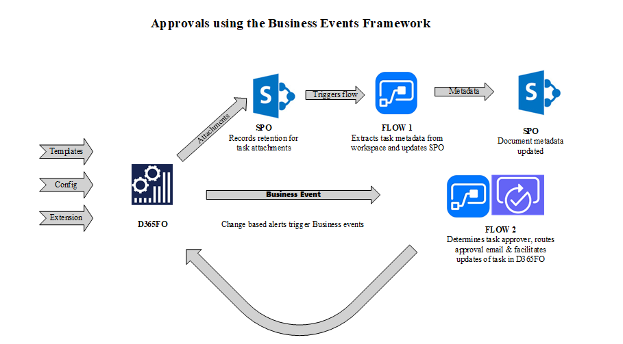
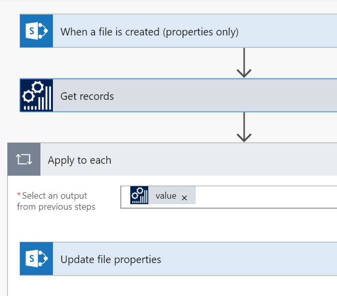
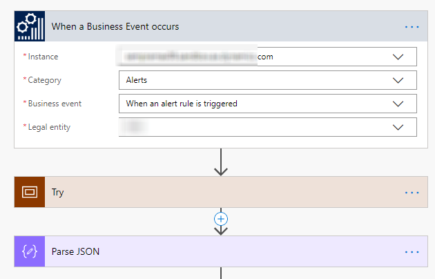
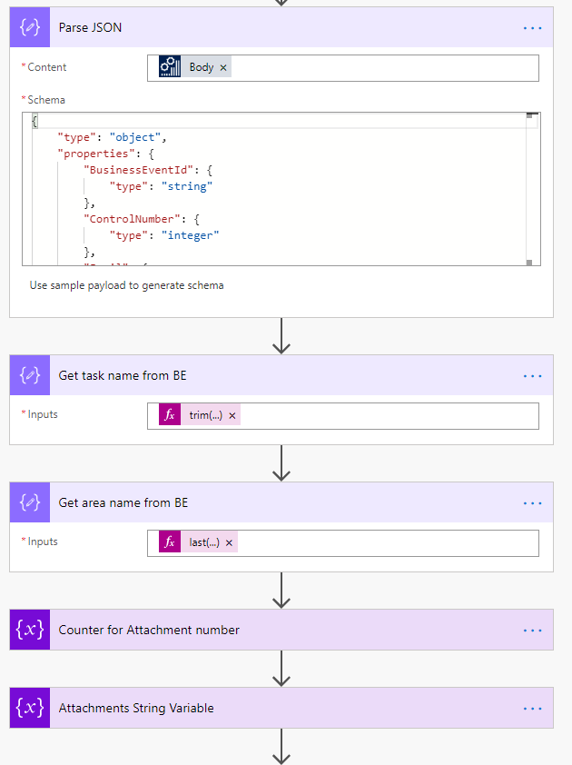
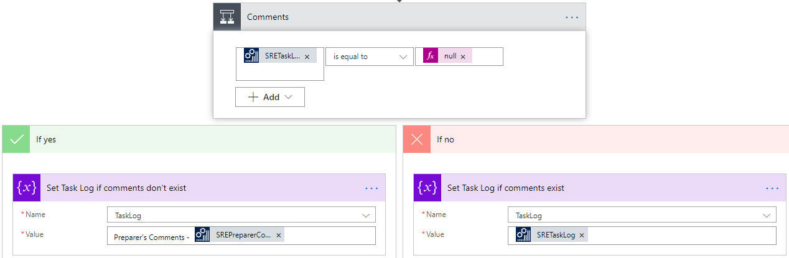
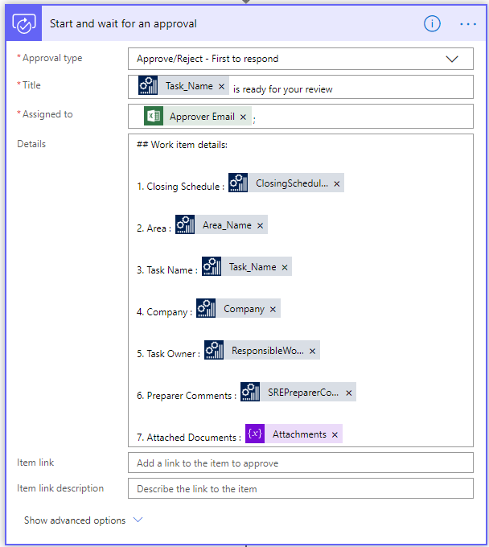
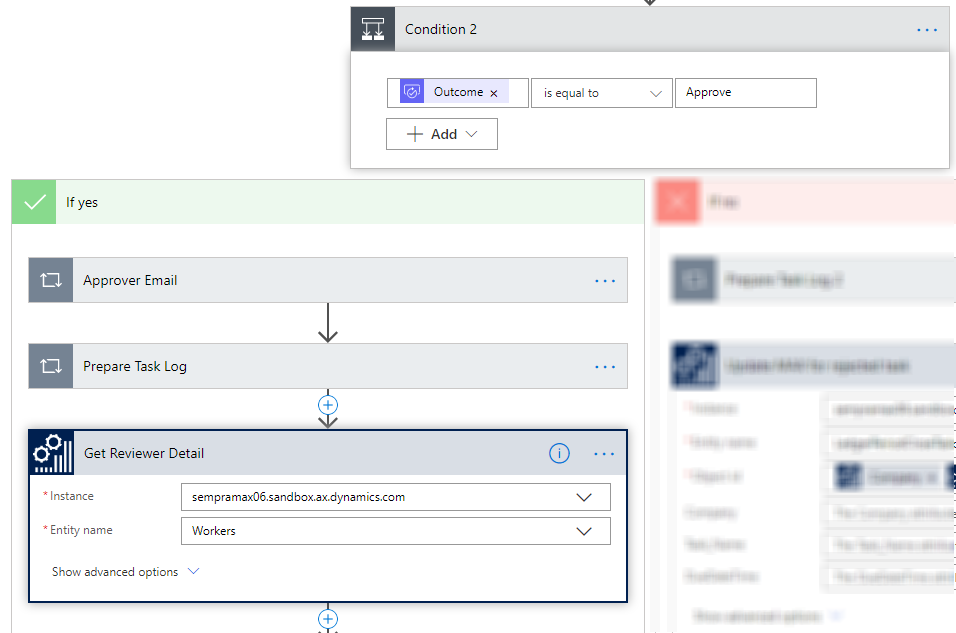

# Business events in financial period close
[!include [banner](../../includes/banner.md)]

This article explains how to use business events in the financial period close business process to gain insights and provide internal controls.

To complete this article, you must be running version 10.0.2 (May 2019) with Platform update 26 or later.

## Scenario overview

Task management is fundamental to managing business processes across industries. Out-of-box capabilities let users manage business process tasks in a structured manner. The **Financial period close** workspace illustrates these capabilities by offering a central location for managing tasks in a company's accounting period close process.

This article looks at an organization that recently decided to explore how it can use the **Financial period close** workspace to track and report tasks that are associated with every period close. Performance management and traceability are some of the challenges that this organization faces in the current setup. Therefore, the organization undertook an exercise in business process transformation to identify the capabilities of the **Financial period close** workspace. This exercise revealed the following business requirements:

1. The ability to be notified when tasks must be started
2. The ability to attach documents
3. Record management and disposition capabilities for attachments
4. The ability for multiple approvers to approve tasks, based on predefined logic
5. Task questionnaires for audits
6. Reporting capabilities to track the current status of the period close process and do performance analysis for insights into efficiency

## High-level design

To achieve the previously mentioned requirements, the organization used out-of-box capabilities of the **Financial period close** workspace. A gap analysis revealed that, by doing minor extensions to the workspace and the underlying data entities, the organization could achieve requirements 2, 5, and 6, and could partially achieve requirement 4. To achieve requirements 1 and 3, and parts of requirement 4, the organization chose to use Power Automate. The following illustration shows an architectural overview of the solution.

## Managing attachments by using Microsoft Power Automate and SharePoint Online

Accountants view their tasks in the **Financial period close** workspace and start to work on them. Attachments are added to the task by using a SharePoint Online document type. SharePoint triggers in Microsoft Power Automate are used to trigger the Power Automate that is shown in the following illustration. This Power Automate updates the SharePoint metadata with metadata from the task in the **Financial period close** workspace. SharePoint columns were created for this purpose in the document library. A separate attachment data entity was created to hold the attachment metadata for every attachment that is added to the **Financial period close** workspace. Fields from the custom entity were mapped to the SharePoint Online columns in the Power Automate. When documents that use the specified document type are created in the predefined SharePoint Online library, Power Automate is triggered, obtains the metadata from the custom data entity, and updates the document's metadata columns in SharePoint Online.

## Enabling internal controls by using business events and Power Automate

As accountants complete their tasks, and the tasks become ready for review, the value of the **Review status** custom field is updated to **Ready for review**. The Power Automate gets triggered by the **When the change-based alert is triggered** business event when this update is made. The payload of this business event contains the task name and the area name. The Power Automate uses the combination of the task name and area name, together with the value of the **Review status** field, to route the task through an email-based workflow that is orchestrated by Power Automate. The Power Automate waits for approval, add new comments to the task log, and updates the task in the **Financial period close** workspace , based on both the outcome of the approval process and related metadata. Custom data entities were built in to query and update the **Financial period close** workspace by using Power Automate.

### Subscribing to the business event

The following example describes the general steps for subscribing to a change-based alert business event.

1. Add the connector trigger to the Power Automate app, and subscribe to the change-based alert business event.

    

2. Parse the business event payload.

    When the business event is triggered, it triggers Power Automate. This business event contains a payload. In this step, the payload is parsed, and the required variables are initialized.

    

3. Retrieve the task, based on the values from the payload.

    When the task is updated, the business event triggers Power Automate. At that point, after the payload has been parsed, you will know basic information about the task. In this step, the custom data entity is used to retrieve more information about the task.

4. Retrieve approvers from the Microsoft Excel file, based on the criteria.

    Next, you must determine the list of approvers, so that you can send the approval request in the appropriate manner. This list is a custom Excel file in a SharePoint Online library. In this step, you query the Excel file to get the list of approvers. You also get the links to the attachments for each task, so that you can send the attachments to the approvers.

5. Prepare to send the request for approval.

    In this step, you prepare Power Automate to send the approval request by using all the information that was gathered and assembled in the previous step.

    

    

6. Start the approval process.

    In this step, the approval request is sent from Power Automate.

    

7. Process the approval action that is taken by approvers.

    After the approvers receive the approval request and take action, the Power Automate is notified, and additional processing is done.

    

8. Update the task with the approval outcome.

    Based on the outcome of the approval process, the task is updated with the result.

## Conclusion

For the business requirements of the organization that is described in this article, this solution involves minimal development and relies mostly on the **Financial period close** workspace, business events, SharePoint Online, and Power Automate to drive functionality. Development is restricted to the addition of fields to pages, the creation of custom data entities, and changes to page labels. Power Automate also provides greater flexibility in the approval process. Because the solution takes advantage of the various applications in the Microsoft 365 suite, internal users can use applications that they are already familiar with. Therefore, the amount of change management that is required is limited.

In conclusion, business events offer unique opportunities for extending functionality but also let you avoid extensive in-app customizations. Here are some things to consider before you start to use business events:

- Establish the security requirements of your solution. Business events honor role-based security. This behavior can be beneficial in some use cases.
- Business events functionality continues to get enhanced. Be on the lookout for new capabilities.

Business events and Power Automate offer great opportunities for implementing low-code or no-code extensions. The important thing is that you identify opportunities where this framework can help, but that you also understand some of the limitations.

[!INCLUDE[footer-include](../../../../includes/footer-banner.md)]
