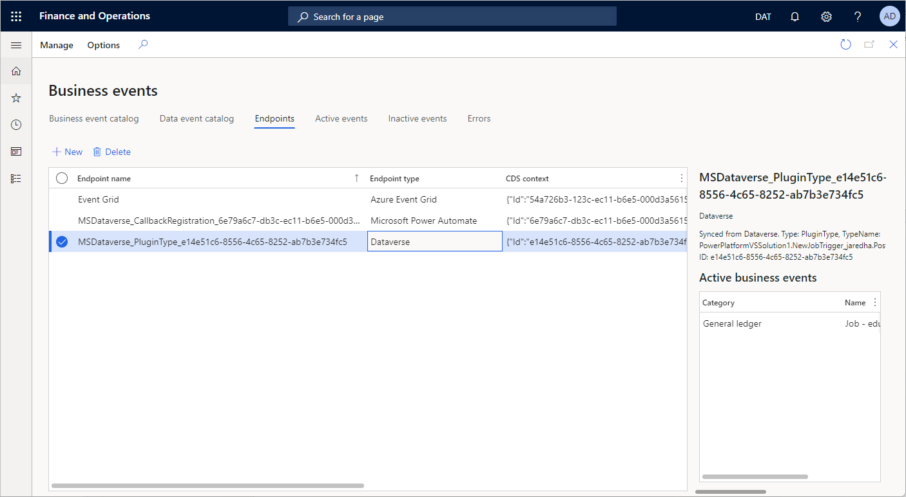

# Manage business event endpoints
[!include[banner](../includes/banner.md)]

Endpoints let you manage the destinations that business events are sent to. Business events in finance and operations apps support the following endpoint types.

| Endpoint type | Tutorial |
| ------------- | -------- |
| Azure Service Bus Queue | [Business events and Azure Service Bus](how-to/how-to-servicebus-queue.md) |
| Azure Service Bus Topic | [Business events and Azure Service Bus](how-to/how-to-servicebus.md) |
| Azure Event Grid | [Business events and Azure Event Grid](how-to/how-to-eventgrid.md) |
| Azure Event Hub | [Business events and Azure Event Hubs](how-to/event-hub.md) |
| Azure Blob Storage | Not applicable |
| HTTPS | Not applicable |
| Microsoft Power Automate | [Business events and Microsoft Power Automate](how-to/how-to-flow.md) |
| Dataverse | [Subscribe to events in Dataverse](how-to/how-to-dataverse-events.md) |

Endpoints can be created for these messaging and event brokers out of the box. Some scenarios might require multiple endpoints for organized distribution of business events to consumers. You can create multiple endpoints to support these scenarios.

The Microsoft Azure–based endpoints must be in the customer's Azure subscription. For example, if Event Grid is used as an endpoint, the endpoint must be in the customer's Azure subscription.

A finance and operations app doesn't provision the endpoints. The endpoints must be created separately and provided to the app. The app then sends events to the endpoints that are provided. Customers might incur additional costs if they use these endpoints in their Azure subscription.

## Subscribing to finance and operations apps events from Dataverse

> [!IMPORTANT]
> Before you subscribe to finance and operations apps business events and data events in Microsoft Dataverse, you must enable the Microsoft Power Platform integration. For information about how to enable the Microsoft Power Platform integration for a finance and operations apps environment, see [Enable the Microsoft Power Platform integration](../power-platform/enable-power-platform-integration.md).

After the Microsoft Power Platform integration is enabled, you can subscribe to finance and operations apps business events and data events from Dataverse. Subscription enables the following capabilities:

- Consistent behavior across events from multiple applications in Dataverse
- Application Lifecycle Management (ALM) for the Dataverse solution to consistently consume events from finance and operations apps
- Registration of plug-ins and software development kit (SDK) steps on finance and operations apps events in Dataverse

When the Microsoft Power Platform integration is enabled for a finance and operations apps environment, endpoints that are created for business events are synced with the linked Microsoft Power Platform environment for endpoint types that are supported in Dataverse. The endpoints can then be used in Microsoft Power Platform. When the endpoints are synced, business events that are sent from finance and operations apps are proxied through Dataverse to the endpoint.

The following table shows the mapping between the finance and operations apps and Dataverse implementations of the endpoints.

| Finance and operations apps endpoint type | Dataverse service endpoint type    | 
| ----------------------------------------- | ---------------------------------- |
| Azure Service Bus Queue                   | Azure Service Bus of type Queue    | 
| Azure Service Bus Topic                   | Azure Service Bus of type Topic    |
| Azure Event Grid                          | Azure Event Grid                   |
| Azure Event Hub                           | Azure Event Hub                    |
| HTTPS                                     | Webhook                            |
| Azure Blob Storage                        | Not supported in Dataverse         |
| Microsoft Power Automate                  | Asynchronous callback registration |
| Dataverse                                 | Plug-in or SDK step registration   |

> [!NOTE]
> If an endpoint type isn't supported in Dataverse, or if the Microsoft Power Platform integration isn't enabled, the endpoint will continue to send the event from finance and operations apps instead of sending it through Dataverse.

### Viewing or creating mapped endpoints in Dataverse

When a new endpoint is added in finance and operations apps, it's synced to Dataverse. It's then available for use in Dataverse in the **ServiceEndpoint** table. You can also create the endpoint directly in Dataverse in the **ServiceEndpoint** table. If the service endpoint is created by subscribing to a finance and operations apps event, it will automatically be made available to finance and operations apps and can be viewed on the **Endpoints** tab of the **Business events** page. This behavior is applicable to the following mapped endpoint types:

- Azure Service Bus Queue
- Azure Service Bus Topic
- Azure Event Grid
- Azure Event Hub

For more information about the **ServiceEndpoint** table, see [ServiceEndpoint table/entity reference](/powerapps/developer/data-platform/reference/entities/serviceendpoint).

> [!NOTE]
> When endpoints are mapped in Dataverse, Dataverse IP addresses must be added to the allow list of firewall policies for business events and data events. See [IP addresses required](/power-platform/admin/online-requirements#ip-addresses-required) for more information about the IP addresses required for the firewall policies.

### Microsoft Power Automate endpoints

The **Microsoft Power Automate** endpoint type isn't made available for setup directly in finance and operations apps. This endpoint type is used for subscriptions that are created and sent directly from a flow in Power Automate. 

The endpoint is created on the **Endpoints** tab of the **Business events** page in finance and operations apps when you subscribe to a finance and operations apps business event or data event in Power Automate. For more information about how to subscribe to business events and data events in Power Automate, see [Business events in Microsoft Power Automate](business-events-flow.md).

### Microsoft Dataverse endpoints

The **Dataverse** endpoint type also isn't available for manual setup in finance and operations apps. The endpoint is created when a plug-in or an SDK step is registered on a finance and operations apps business event or data event in Dataverse. When the step is registered, it becomes visible as an endpoint in the list on the **Endpoints** tab of the **Business events** page in finance and operations apps. 

The business event registration itself will also be listed on either the **Business event catalog** tab or the **Data event catalog** tab of the **Business events** page in finance and operations apps, depending on registration. In this way, finance and operations apps users can learn which business event or data event has a plug-in or SDK step registered in Dataverse. They can also learn the reason why the event is active in finance and operations apps.

Finance and operations apps events can be subscribed to directly in Dataverse by using the tools in the Dataverse toolset, such as the Power Platform Tools extension for Visual Studio. For more information about this extension, see [Install Power Platform Tools](/powerapps/developer/data-platform/tools/devtools-install). These subscriptions will appear on the **Business event catalog** tab of the **Business events** page in finance and operations apps.

Some attributes of service endpoints in Dataverse, such as the name and description, can be updated. These updates will also be reflected in finance and operations apps. However, updates that change the service endpoint type will be prevented if the service endpoint is used with finance and operations apps events. These updates include a change from a Service Bus article to a Service Bus queue, which Dataverse usually allows. This behavior helps ensure design simplicity and consistency, because finance and operations apps don't allow these updates to endpoints after they have been created.

After service endpoints are created, Dataverse doesn't allow them to be deleted if they are being used. This limitation also applies to service endpoints that are used by finance and operations apps events. Any attempt to delete one of these endpoints will cause an error, and deletion will be prevented. 

For more information about how to subscribe to finance and operations apps business events in Dataverse, see [Subscribe to events in Dataverse](how-to/how-to-dataverse-events.md).

