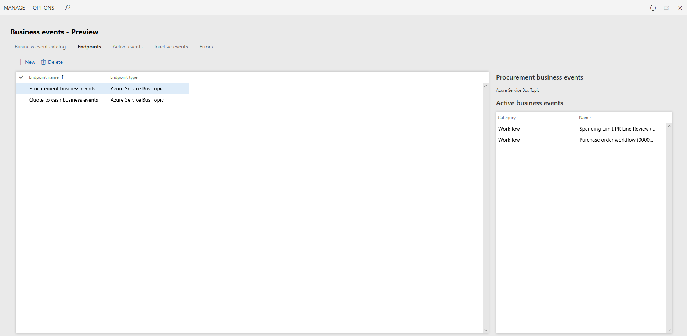

---
# required metadata

title: Data events
description: This topic provides an overview of data events.
author: jaredha
ms.date: 11/03/2021
ms.topic: article
ms.prod:
ms.technology: 

# optional metadata

# ms.search.form:
audience: Developer, IT Pro
# ms.devlang: 
ms.reviewer: sericks
# ms.tgt_pltfrm: 
# ms.custom: NotInToc
ms.search.region: Global
# ms.search.industry:
ms.author: jaredha
ms.search.validFrom: 2021-11-03
ms.dyn365.ops.version: 10.0.22
---

# Managing business event endpoints
[!include[banner](../includes/banner.md)]

## Overview
Endpoints let you manage the destinations to which business events are sent. Business events in Finance and Operations apps support the following endpoint types:

| Endpoint type | Tutorial |
| ------------- | -------- |
| Azure Service Bus Queue | [Business events and Azure Service Bus](./business-events/how-to/how-to-servicebus) |
| Azure Service Bus Topic | [Business events and Azure Service Bus](./business-events/how-to/how-to-servicebus) |
| Azure Event Grid | [Business events and Azure Event Grid](./business-events/how-to/how-to-eventgrid) |
| Azure Event Hub | [Business events and Azure Event Hubs](./business-events/how-to/event-hub)  |
| Azure Blob Storage | -- |
| HTTPS | -- |
| Microsoft Power Automate | [Business events and Microsoft Power Automate](./business-events/how-to/how-to-flow) |
| Dataverse | -- |

Endpoints can be created for these messsaging and event brokers out of the box. Some scenarios might require multiple endpoints for organized distribution of business events to consumers. You can create multiple endpoints to support these scenarios.

The Azure-based endpoints must be in the customer's Azure subscription. For example, if Event Grid is used as an endpoint, the ednpoint must be in the customer's Azure subscription.

The Finance and Operations application doesn't provision the endpoints. The endpoints must be created separately and provided to the application. The application then sends events to the endpoints that are provided. Customers may incur additional costs if they use these endpoints in their Azure subscription.

## Power Platform integration

When the Power Platform integration is enabled for a Finance and Operations apps environment, endpoints created for business events are synchronized with the linked Power Platform environment for endpoint types that are supposed in Dataverse, enabling the endpoint's use in the Power Platform. When the endpoints are synchronized, business events sent from Finance and Operations apps are proxied through Dataverse to the endpoint. See [Enabling the Power Platform integration](./power-platform/enable-power-platform-integration) for additional information on enabling the integration.

The following table provides the mapping between the Finance and Operations apps and Dataverse implementations of the endpoints.

| Finance and Operations apps endpoint type | Dataverse service endpoint type | 
| ----------------------------------------- | ------------------------------- |
| Azure Service Bus Queue                   | Azure Service Bus of type Queue | 
| Azure Service Bus Topic                   | Azure Service Bus of type Topic |
| Azure Event Grid                          | Azure Event Grid                |
| Azure Event Hub                           | Azure Event Hub                 |
| HTTPS                                     | Webhook                         |
| Azure Blob Storage                        | Not supported in Dataverse.     |
| Microsoft Power Automate                  | Asynchronous callback registration |
| Dataverse                                 | Plug-in and/or SDK step registration |

> [!NOTE]
> For endpoint types that are not supported in Dataverse, or when the Power Platform integration is not enabled, the endpoint will continue to send the event from the Finance and Operations application rather than through Dataverse.

## Subscribing to Finance and Operations events from Dataverse

With the Power Platform integration enabled is it possible to subscribe to Finance and Operations business events and data events from Dataverse. This enables the following:

  - A consistent behavior across events from multiple applications in Dataverse.
  - Dataverse solutions application lifecycle management (ALM) to consistently consume events from Finance and Operations apps.
  - Plug-ins and SDK steps to be registered on Finance and Operations apps events in Dataverse.

Finance and Operations apps events can be subscribed to directly in Dataverse usin gthe Dataverse tool set like the Plug-in Registration Tool or the Visual Studio add-in
