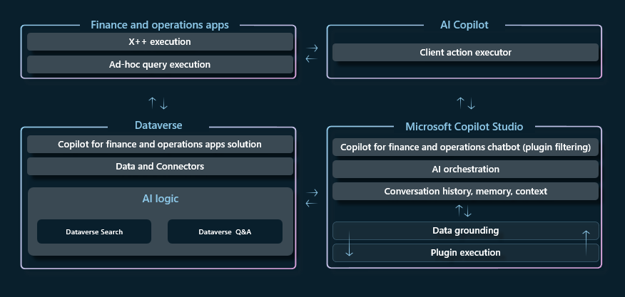

# Architecture of Copilot in finance and operations apps

[!include [banner](../includes/banner.md)]

Copilot in finance and operations apps builds on [Microsoft Copilot Studio](/microsoft-copilot-studio/fundamentals-what-is-copilot-studio), which provides the central AI orchestration of the Copilot capabilities. This framework lets you extend the capabilities to create powerful AI-powered experiences in finance and operations apps. 

## Copilot interface

The Copilot interface for the chat experience in finance and operations apps uses the same [AI Copilot](/power-apps/maker/canvas-apps/ai-overview) control that's used in [canvas apps](/power-apps/maker/canvas-apps/add-ai-copilot) and [model-driven apps](/power-apps/maker/model-driven-apps/add-ai-copilot), including other Dynamics 365 applications. The control is embedded in the finance and operations client and hosted in the **SysCopilotChatPanel** form. It manages the communication between the finance and operations client and Copilot Studio, and acts as the executor for client actions.

## Orchestration with Copilot Studio

[Copilot Studio](/microsoft-copilot-studio/fundamentals-what-is-copilot-studio) provides the central AI orchestration of the Copilot capabilities in finance and operations apps. When a prompt is entered in the Copilot chat panel, it's sent to Copilot Studio. Copilot Studio determines what the intent of the prompt is, and which topics or plugins should be invoked to provide a response. Copilot Studio then runs plugins, gets the required data, and provides output in natural language. This output is returned to the user in the Copilot interface. For more information about the architecture and execution of plugins in Copilot Studio, see [Microsoft Copilot Studio plugin architecture](/microsoft-copilot-studio/copilot-plugins-architecture).

Copilot in finance and operations apps is bound to a single chatbot in Copilot Studio. This chatbot is named **Copilot in Finance and Operation**. The chatbot is deployed as part of the Copilot in the finance and operations solution (msdyn\_FnoCopilot). For guidance about how to install the solution and chatbot in your environment, see [Enable Copilot capabilities in finance and operations apps](enable-copilot.md).

## Plugins

Capabilities are added to Copilot in finance and operations apps by adding *plugins* to the **Copilot in Finance and Operation** chatbot. A plugin is a reusable piece of code that can perform a specific task or provide specific functionality for Copilot. The plugin provides the definition of the capability. For example, it specifies the data to retrieve, the queries to run, the workflows to run, and the external systems to connect to. It also specifies any other instructions that are needed to construct the response to the prompt that invoked the plugin. 

Conceptually, a plugin is something that Copilot knows how to do. For example, you want Copilot to be able to get customer balances. In this case, create a plugin that describes the capability, and that knows which API to call to get the information that must be returned to the user.

When you design your Copilot experiences, consider the types of questions that the application user might expect to ask Copilot to answer or the types of actions that they might expect to prompt Copilot to perform. Plugins themselves shouldn't be thought of as an end-to-end scenario. Instead, each plugin should be thought of as an individual skill that the user can prompt in Copilot in various scenarios and sequences, as part of the natural language conversation. The Copilot Studio orchestration can chain the plugins together to create an end-to-end conversational experience. However, the sequence isn't necessarily the same each time. The conversation of chained-together plugins becomes the end-to-end business scenario.

### Plugin context

When you develop your plugins for Copilot in finance and operations apps, consider the user context that the plugin will be run in. Some plugins enable prompts that can be applicable in multiple user interfaces (UIs). However, other plugins are ideal for use cases only in the context of a flow in finance and operations apps.

- **AI plugins** – AI plugins are headless operations that are ideal for scenarios where there isn't a specific user interface required to perform the action or operation. If the plugin queries general information that's applicable in any user interface, it should be engineered as a AI plugin. For example, you might want to check a customer balance or on-hand inventory from data in finance and operations apps while you're in a Teams conversation. This information doesn't necessarily require application context to understand and receive values from the data. By using a headless plugin in these cases, you enable the plugin to be made available to any user interface that's connected to the [Power Platform plugin registry](/microsoft-copilot-studio/copilot-plugins-architecture#business-applications-and-power-platform-plugin-registry).

    If an AI plugin is the right approach for your business scenario, create the plugin in Copilot Studio as a Copilot plugin that connects data across multiple sources, and that can be used across any Copilot interface that's connected to the Power Platform plugin registry, such as [Copilot for Microsoft 365](https://www.microsoft.com/microsoft-365/copilot-for-work) and Copilot in finance and operations apps. For more information, see [Create AI plugins for copilots with finance and operations business logic](copilot-ai-plugins.md).

- **Client plugin** – Client plugins are ideal for use cases that are applicable only in the currently connected/running conversation and application context. If the skill makes sense only in the flow of an in-app business process, or if it requires client action, you probably want to develop a client plugin. For example, a plugin that uses AI to calculate alternate production plans for a production schedule might make sense in the application context of the production schedule, but it might not be helpful in other interfaces outside finance and operations apps. See [Create client plugins for Copilot in finance and operations apps](copilot-client-plugins.md) for more information.
