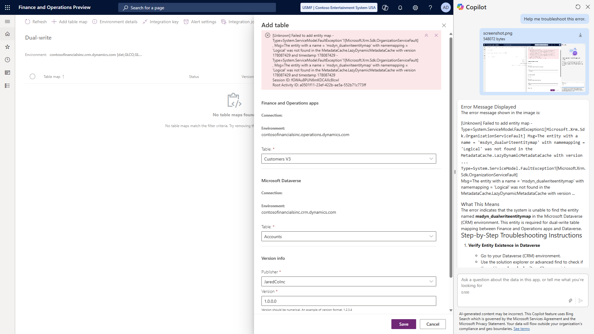

# Use file attachments in Copilot for finance and operations apps

[!include [banner](../includes/banner.md)]

The chat experience for Copilot for finance and operations apps allows you to attach files, including a screenshot of the current browser window for your finance and oeprations apps client session. The file becomes part of your chat session, which you can then work with by adding extended topics or tools to Copilot providing custom experiences for your environment.

[!NOTE] By default the chat experience for Copilot for finance and operations apps doesn't use the files or screenshots that are attached to the chat session. To use the attached files, you must extend Copilot for finance and operations apps with topics or tools needed for your user experiences that use the attached files.

## Prerequisites
The following prerequisites must be in place to use attachments with Copilot for finance and operations apps:
- Finance and operations apps must be on a minimum version of 10.0.45.
- The following solutions must be installed in the Power Platform environment. If they aren't already installed, see [Manage Dynamics 365 apps](/power-platform/admin/manage-apps) for information about how to install Dynamics 365 solution packages in Dataverse.

    - The Copilot for finance and operations package, which includes the following solutions:

        - Copilot for finance and operations apps
        - Copilot for finance and operations generation solution
        - Copilot for finance and operations anchor solution

    - Finance and Operations Virtual Entity

- The **Enable user attachments in Copilot sidecar** feature must be enabled in [Feature management](../../fin-ops/get-started/feature-management/feature-management-overview.md).

## Attaching files to a chat session
The attachments feature enables you to upload a file to your chat session, or take a screenshot of the current browser window for your finance and operations apps client session to attach to the chat session.

To add a file attachment to the chat session:
1. Select the **Attach** button in the chat window.
2. Select **Browse...**.
3. Browse to the file location and select the file you want to attach.
4. Select **Open**.

To add a screenshot attachment to your chat session with Copilot for finance and operations apps:
1. Select the **Attach** button in the chat window.
2. Select **Add screenshot**.
3. When prompted to allow the client to see the tab, select **Allow**.

## Extending Copilot for finance and operations apps to use the attachment files
By default the chat experience for Copilot for finance and operations apps doesn't use the files or screenshots that are attached to the chat session. The files are added to a system variable that can be accessed by Copilot, but you must create custom topics or tools in Copilot for finance and operations apps to provide Copilot with the skills you want it to have for users in your environment.

When a file is attached to the chat session it is added to the `System.Activity.Attachments` object in Copilot Studio, which contains the table of file attachments. You can access the file here, working with the file as you would other files in Copilot Studio. You can create a topic or tool that uses the file attachments, accessing the attached files in the table, to provide Copilot with additional capabilities.

## Example extending Copilot with attachments
The following example shows how you can extend Copilot for finance and operations apps with a custom topic that accesses attachment files from the chat session to provide additional capabilities to the user. In this scenario, we add a topic that reviews an attached screenshot of an error from Copilot for finance and operations apps, and provides guidance to the user on how to resolve the error.

[!NOTE] This example assumes [generative AI orchestration](https://learn.microsoft.com/microsoft-copilot-studio/advanced-generative-actions) is enabled for the agent.

### Create a new topic
1. In Copilot Studio, open the **Copilot for finance and operations apps** agent.
2. Select the **Topics** tab, and select **Add a topic >> From blank**.
3. On the **Trigger** node, enter a description like: "This topic troubleshoots errors based on an attached screenshot. It helps with inputs such as 'Help me troubleshoot this error.'"

### Get the attachment file
1. In the new topic select **Add node** >> **Variable management** >> **Set a variable value** to add a new **Set variable value** node.
2. Create a new local variable in the **Set variable** field called `attachment_data`.
3. In the **To value** field, enter the formula `First(System.Activity.Attachments).Value`.

### Create a prompt to analyze the error screenshot
1. After the **Set variable value** node, select **Add node** >> **Add tool** >> **New prompt**.
2. Change the prompt title to **Troubleshoot FinOps errors**.
3. In the **Model** selector, select a model that supports documents and images, like GPT-4.1 or GPT-5.0.
4. In the **Instructions**, select **Add content** >> **Image or document**. Set the **Name** to **FinOpsScreenshot**.
5. In the **Instructions**, after the document input, enter a prompt indicating what you want the LLM to do with the screenshot. For example: "Analyze this image to determine what error messages are displayed. Then provide step-by-step instructions for troubleshooting the error."
6. Save and close the prompt.
7. In the Copilot Studio topic, in the **Input** field of the prompt action, select the `Topic.attachment_data` variable created in the previous step.
8. In the **Output** field, create a new local variable called `troubleshooting_output`.

### Return the response to the user
1. After the **Prompt** node, select **Add node** >> **Send a message**.
2. On the **Message** node, select the **Insert PowerFx expression** button.
3. Enter the formula and insert into the message: `Topic.troubleshooting_output.text`.

### Test the attachments
After saving the topic, and publishing the changes to the agent, you can now try out the new attachments feature. In the finance and operations apps client, perform an operation that returns an error message. With the error message displayed on screen:

1. Open the Copilot sidecar chat panel.
2. Select the **Attach** button, then **Add screenshot**.
3. Select **Allow**.
4. In the Copilot chat, with the screenshot attached, type: "Help me troubleshoot this error."

The topic should then use the prompt action to analyze the provided screenshot, and return guidance to the user for troubleshooting the error in the screenshot.

