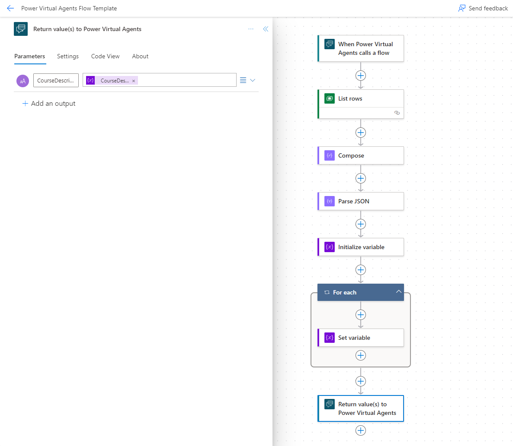
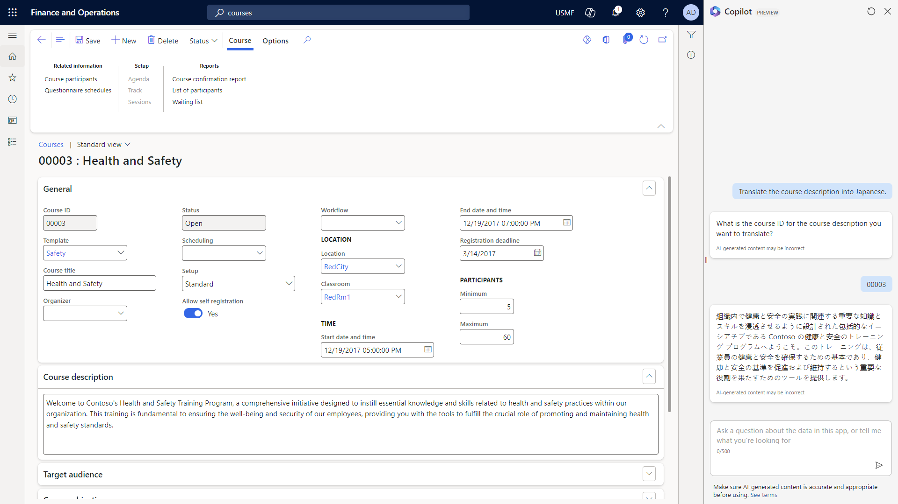

# Tutorial: Extend Copilot capabilities with low-code plugins

[!include [banner](../includes/banner.md)]

Microsoft Copilot Studio provides the orchestration of the AI capabilities for Copilot for finance and operations apps. Therefore, it enables a low-code maker experience for customizing the Copilot capabilities. This tutorial goes through an example that shows how to add new capabilities to Copilot by using Copilot Studio to add a plugin to the **Copilot for Finance and Operation** chatbot.

## Scenario

In this scenario, you'll add the Copilot capability to translate a course description into another language when a prompt such as "Translate the course description into French" is entered in the Copilot panel. The steps provide guidance about how to create low-code plugins by using Copilot Studio and the AI translation capabilities of AI Builder.

Here's an overview of the steps in this tutorial:

1. In Copilot Studio, create a new topic that's triggered by a prompt to translate the course description.
1. Add questions to the user to determine the course ID and language.
1. Create an action that uses a Power Automate flow to get the course description.
1. Create an action that uses AI Builder to translate the course description text.
1. Create a message response to send the translated text back to the user in the Copilot pane.
1. Test the new Copilot capability.

### Prerequisites

For this tutorial, you must first enable Copilot in finance and operations apps in your environment. For instructions, see [Enable Copilot capabilities in finance and operations apps](enable-copilot.md).

## Step 1: Create a new topic

In this step, you create a new topic in the **Copilot in Finance and Operation** chatbot.

1. Open [Copilot Studio](https://web.powerva.microsoft.com) in the environment that's linked to your finance and operations apps.
1. Open the **Copilot for finance and operations apps** Copilot chatbot.
1. On the **Topics & Plugins** tab, in the **Add** dropdown list, select **Topic** \> **From blank**.
1. On the **Trigger** node, on the **Phrases** card, select **Edit**.
1. In the **Phrases** pane, in the **Enter text** field, enter **Translate the course description**, and then select **Enter**.

## Step 2: Determine the course ID and language

In the new topic, you'll use variables that are set with the user's page and record context to determine the course ID of the course, and add a question that Copilot will ask the user to determine the language the description must be translated into. For more information on user context of finance and operations apps in copilot scenarios, see [Use application context with Copilot](copilot-application-context.md).

1. Below the **Trigger** node, select the plus sign (**+**), and then select **Add a condition**.
2. On the **Condition** node, set the condition to verify the user is on the Courses page.
   - Select the **Select a variable** field, and select the `Global.PA_Copilot_ServerForm_PageContext.metadataName` variable.
   - Set the condition for the variable to be **is equal to** the value **HRMCourseTable**.
   - On the node, select **New condition**.
   - Set the new condition to verify the `Global.PA_Copilot_ServerForm_PageContext.titleField1Value` variable **is not Blank**.
3. Under the **Condition** node, create a new **Set variable value** node (Variable management \> Set a variable value).
   - For the **Set variable** value, create a new variable named **CourseID**.
   - For the **To value** value, enter the `Global.PA_Copilot_ServerForm_PageContext.titleField1Value` variable.

5. On the other condition fork, under the **All other conditions** node, select the plus sign (**+**), and select **Ask a question** to create a **Question** node. Set the following values for the new node:

    - **Enter a message:** Enter **What is the course ID for the course description you want to translate?**
    - **Identify:** Specify **User's entire response**.
    - **Save response as:** Select the variable, and change the **Variable name** value to `CourseID`.

1. Below the condition section, after the condition forks merge, select the plus sign (**+**), and then select **Ask a question** to create a second **Question** node. Set the following values for the new node:

    - **Enter a message:** Enter **Into what language do you want the description translated?**
    - **Identify:** Specify **Language**.
    - **Save response as:** Select the variable, and change the **Variable name** value to **LanguageChoice**.

## Step 3: Create an action to get the course description

In the topic, create an action that uses a flow to get the course description.

1. Select the plus sign (**+**), and then select **Call an action** \> **Create a flow**. Power Automate is opened.
1. Select the **When Power Virtual Agents calls a flow** node to open the options, and define the following parameters:

    - Select **Text** as the type of user input.
    - In the **Input** field, enter **CourseID**.

1. In Power Automate, below the **When Power Virtual Agents calls a flow** node, select the plus sign (**+**), and then select **Add an action**.
2. In the **Add an action** pane, search for and select the **List rows** action in the **Microsoft Dataverse** connector.
1. On the **Parameters** tab for the **List rows** options, set the following values:

    - **Table Name:** Courses V2 (mserp)

        > [!NOTE]
        > If the Courses V2 (mserp) table isn't available in your environment, you must enable it. For instructions, see [Enable Microsoft Dataverse virtual entities](../power-platform/enable-virtual-entities.md).

    - **Select Columns:** mserp\_coursedescription
    - **Filter Rows:** mserp\_courseid eq '`CourseID`'

        > [!NOTE]
        > To select the `CourseID` variable, select the **Parameters** button (lightning bolt symbol). You can then select data from a previous step.

1. Add an action to compose the course record.

    1. Below the **List rows** action, select the plus sign (**+**), and then select **Add an action**.
    1. In the **Add an action** pane, search for and select the **Compose** data operation.
    1. Use the **Parameters** action on the **Inputs** field to select the **value** parameter from the **List rows** action as the input value.

1. Add an action to parse the JavaScript Object Notation (JSON) for the course record.

    1. Below the **Compose** action, select the plus sign (**+**), and then select **Add an action**.
    1. In the **Add an action** pane, search for and select the **Parse JSON** data operation.
    1. In the **Content** parameter of the **Parameters** pane, select the **Outputs** parameter from the **Compose** action.
    1. In the **Schema** parameter, enter the following JSON schema.

        ```json
        {
            "type": "array",
            "items": {
                "type": "object",
                "properties": {
                    "@@odata.type": {
                        "type": "string"
                    },
                    "@@odata.id": {
                        "type": "string"
                    },
                    "@@odata.editLink": {
                        "type": "string"
                    },
                    "mserp_coursedescription": {
                        "type": "string"
                    },
                    "mserp_hcmcoursev2entityid@odata.type": {
                        "type": "string"
                    },
                    "mserp_hcmcoursev2entityid": {
                        "type": "string"
                    }
                },
                "required": [
                    "@@odata.type",
                    "@@odata.id",
                    "@@odata.editLink",
                    "mserp_coursedescription",
                    "mserp_hcmcoursev2entityid@odata.type",
                    "mserp_hcmcoursev2entityid"
                ]
            }
        }
        ```

1. Initialize a variable for the course description that will be the output of the flow.

    1. Below the **Parse JSON** action, select the plus sign (**+**), and then select **Add an action**.
    1. Search for and select the **Initialize variable** action in the **Variable** group of actions.
    1. In the **Name** parameter, enter **CourseDescription**.
    1. In the **Type** parameter, specify **String**.

1. Set the variable to the course description.

    1. Below the **Initialize variable** action, select the plus sign (**+**), and then select **Add an action**.
    1. Search for and select the **Set variable** action in the **Variable** group of actions.
    1. In the **Name** parameter, enter **CourseDescription**.
    1. In the **Value** parameter, select the `Body mserp_coursedescription` parameter from the **Parse JSON** action.

1. Select the flow output to send back to Copilot Studio.

    1. Select the **Return value(s) to Power Virtual Agents** node.
    1. On the **Parameters** tab, select **Add an output**, and select **Text** as the type of output.
    1. Enter **CourseDescription** as the parameter name.
    1. In the **Enter a value to respond with** parameter, select the **CourseDescription** variable from the **Variables** parameters.

1. Select the flow name, and rename the flow **Get course description demo**.
1. Save the flow.

    

1. Back in Copilot Studio, in the **Save and refresh** dialog box, select **Done**.
1. Below the **Question** node for the language selection, select the plus sign (**+**), and then select **Call an action**.
1. In the **Select an action** dialog box, select the **Get course description demo** action that you created in the flow.
1. On the **Course description demo** action node, select the `Topic.CourseID` variable for the **CourseID (String)** input.

## Step 4: Create an action to translate the course description

In the topic, create an action that uses AI Builder to translate the course description that was retrieved in the previous step.

1. Below the **Get course description demo** action node, select the plus sign (**+**), and then select **Call an action** \> **Create a prompt**.
1. In the Prompt by AI Builder window, enter "TranslateText" for the prompt name.
1. In the **Prompt settings** pane, open the **Input** fast tab and select **Add input**
1. Set the following values for the new input:

    - **Name:** Course Description
    - **Sample data:** This course introduces you to the health and safety role at Contoso.

1. Select **Add input** again.

    - **Name:** Language
    - **Sample data:** Italian

1. In the **Prompt** field, enter "Translate `Course Description` into language `Language`", using the **Insert** action to select the variables in the prompt.
2. Select **Test prompt** to test the prompt action.
3. Select **Save custom prompt** and close the Prompt Builder window.
1. Back in Copilot Studio, in the **Save and refresh** dialog box, select **Done**.
1. Below the **Course description demo** action node, select the plus sign (**+**), and then select **Call an action** \> **TranslateText**.
   - On the **TranslateText** action node, select the `Topic.CourseDescription` variable for the **Course Description (String)** input.
   - Select the `Topic.LanguageCode` variable for the **Language (String)** input.
   - For the **predictionOutput** output, create a new `TextTranslation` variable.

## Step 5: Create a message to return the translated text to Copilot

In the chatbot, add a message node that returns the translated course description output to Copilot in finance and operations apps.

1. Below the **TranslateText** action node, select the plus sign (**+**), and then select **Send a message**.
1. In the **Enter a message** field, select the **Insert variable** action, and select the `Topic.TranslatedText` variable.

## Step 6: Test the new capability in Copilot

1. In Copilot Studio, select **Save** to save the new topic.
1. On the **Publish** tab, select **Publish** to publish your changes to the chatbot.
1. In finance and operations apps, open the **Courses** page (**Human Resources** \> **Courses**), and select a course to open the details.
1. On the navigation bar, select the **Copilot** button to open the Copilot pane.
1. In the chat panel, enter **Translate the course description into Japanese**, and follow the prompt to get a response.

    
