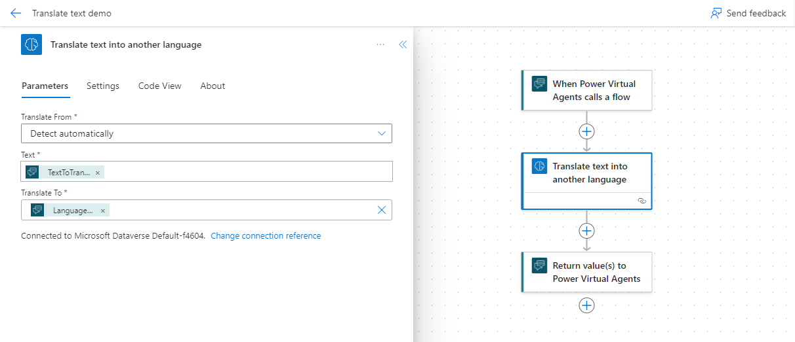
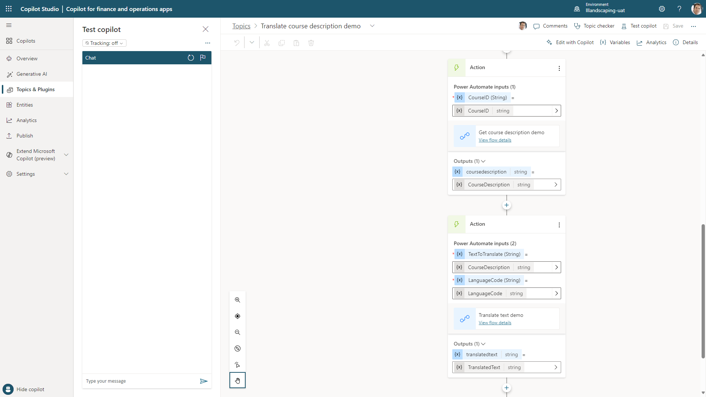

# Tutorial: Extend Copilot capabilities with low-code plugins

[!include [banner](../includes/banner.md)]

Microsoft Copilot Studio provides the orchestration of the AI capabilities for Copilot in finance and operations apps. Therefore, it enables a low-code maker experience for customizing the Copilot capabilities. This tutorial goes through an example that shows how to add new capabilities to Copilot by using Copilot Studio to add a plugin to the **Copilot in Finance and Operation** chatbot.

## Scenario

In this scenario, you'll add the Copilot capability to translate a course description into another language when a prompt such as **Translate the course description into French** is entered in the Copilot panel. The steps provide guidance about how to create low-code plugins by using Copilot Studio and the AI translation capabilities of AI Builder.

Here's an overview of the steps in this tutorial:

1. In Copilot Studio, create a new topic that's triggered by a prompt to translate the course description.
1. Add questions to the user to determine the course ID and language.
1. Create an action that uses a Power Automate flow to get the course description.
1. Create an action that uses Power Automate and AI Builder to translate the course description text.
1. Create a message response to send the translated text back to the user in the Copilot pane.
1. Test the new Copilot capability.

### Prerequisites

For this tutorial, you must first enable Copilot in finance and operations apps in your environment. For instructions, see [Enable Copilot capabilities in finance and operations apps](enable-copilot.md).

## Step 1: Create a new topic

In this step, you create a new topic in the **Copilot in Finance and Operation** chatbot.

1. Open [Copilot Studio](https://web.powerva.microsoft.com) in the environment that's linked to your finance and operations apps.
1. Open the **Copilot for finance and operations apps** Copilot chatbot.
1. On the **Topics & Plugins** tab, in the **Add** dropdown list, select **Topic** \> **From blank**.
1. On the **Trigger** node, on the **Phrases** card, select **Edit**.
1. In the **Phrases** pane, in the **Enter text** field, enter **Translate the course description**, and then select **Enter**.

## Step 2: Add questions to determine the course ID and language

In the new topic, add questions that Copilot will ask the user to determine the course ID of the course description that must be translated and the language that it must be translated into.

> [!NOTE]
> In an upcoming release, the record that the user is currently viewing in finance and operations apps will be available as a variable in Copilot Studio. This variable will be similar to other contextual variables that are highlighted in [Use application context with Copilot](copilot-application-context.md). In this way, Copilot will know the current record and won't have to ask the user to provide the course ID.

1. Below the **Trigger** node, select the plus sign (**+**), and then select **Ask a question** to create a **Question** node.
1. Set the following values for the new node:

    - **Enter a message:** Enter **What is the course ID for the course description you want to translate?**
    - **Identify:** Specify **User's entire response**.
    - **Save response as:** Select the variable, and change the **Variable name** value to **CourseID**.

1. Below the **Question** node, select the plus sign (**+**), and then select **Ask a question** to create a second **Question** node.
1. Set the following values for the new node:

    - **Enter a message:** Enter **Into what language do you want the description translated?**
    - **Identify:** Specify **Language**.
    - **Save response as:** Select the variable, and change the **Variable name** value to **LanguageChoice**.

1. Select the plus sign (**+**), and then select **Variable management** \> **Set a variable value** to create a new node.
1. Set the following values for the new node:

    - **Set variable:** Create a new variable, and name it **LanguageCode**.
    - **To value:** On the **Formula** tab, enter the following Microsoft Power Fx code.

        ```powerapps-dot
        Switch(Topic.LanguageChoice,
            "Italian", "it",
            "French", "fr",
            "Spanish", "es",
            "Russian", "ru",
            "German", "de",
            "Japanese", "ja")
        ```

## Step 3: Create an action to get the course description

In the topic, create an action that uses a flow to get the course description.

1. Select the plus sign (**+**), and then select **Call an action** \> **Create a flow**. Power Automate is opened.
1. In Power Automate, below the **When Power Virtual Agents calls a flow** node, select the plus sign (**+**), and then select **Add an action**.
1. Select the **When Power Virtual Agents calls a flow** node to open the options, and define the following parameters:

    - Select **Text** as the type of user input.
    - In the **Input** field, enter **CourseID**.

1. In the **Add an action** pane, search for and select the **List rows** action in the **Microsoft Dataverse** connector.
1. On the **Parameters** tab for the **List rows** options, set the following values:

    - **Table Name:** Courses V2 (mserp)

        > [!NOTE]
        > If the Courses V2 (mserp) table isn't available in your environment, you must enable it. For instructions, see [Enable Microsoft Dataverse virtual entities](../power-platform/enable-virtual-entities.md).

    - **Select Columns:** mserp\_coursedescription
    - **Filter Rows:** mserp\_courseid eq '`CourseID`'

        > [!NOTE]
        > To select the `CourseID` variable, select the **Parameters** button (lightning bolt symbol). You can then select data from a previous step.

1. Add an action to compose the course record.

    1. Below the **List rows** action, select the plus sign (**+**), and then select **Add an action**.
    1. In the **Add an action** pane, search for and select the **Compose** data operation.
    1. Use the **Parameters** action on the **Inputs** field to select the **body/value** parameter from the **List rows** action as the input value.

1. Add an action to parse the JavaScript Object Notation (JSON) for the course record.

    1. Below the **Compose** action, select the plus sign (**+**), and then select **Add an action**.
    1. In the **Add an action** pane, search for and select the **Parse JSON** data operation.
    1. In the **Content** parameter of the **Parameters** pane, select the **Outputs** parameter from the **Compose** action.
    1. In the **Schema** parameter, enter the following JSON schema.

        ```json
        {
            "type": "array",
            "items": {
                "type": "object",
                "properties": {
                    "@@odata.type": {
                        "type": "string"
                    },
                    "@@odata.id": {
                        "type": "string"
                    },
                    "@@odata.editLink": {
                        "type": "string"
                    },
                    "mserp_coursedescription": {
                        "type": "string"
                    },
                    "mserp_hcmcoursev2entityid@odata.type": {
                        "type": "string"
                    },
                    "mserp_hcmcoursev2entityid": {
                        "type": "string"
                    }
                },
                "required": [
                    "@@odata.type",
                    "@@odata.id",
                    "@@odata.editLink",
                    "mserp_coursedescription",
                    "mserp_hcmcoursev2entityid@odata.type",
                    "mserp_hcmcoursev2entityid"
                ]
            }
        }
        ```

1. Initialize a variable for the course description that will be the output of the flow.

    1. Below the **Parse JSON** action, select the plus sign (**+**), and then select **Add an action**.
    1. Search for and select the **Initialize variable** action in the **Variable** group of actions.
    1. In the **Name** parameter, enter **CourseDescription**.
    1. In the **Type** parameter, specify **String**.

1. Set the variable to the course description.

    1. Below the **Initialize variable** action, select the plus sign (**+**), and then select **Add an action**.
    1. Search for and select the **Set variable** action in the **Variable** group of actions.
    1. In the **Name** parameter, enter **CourseDescription**.
    1. In the **Value** parameter, select the `Body mserp_coursedescription` parameter from the **Parse JSON** action.

1. Select the flow output to send back to Copilot Studio.

    1. Select the **Return value(s) to Power Virtual Agents** node.
    1. On the **Parameters** tab, select **Add an output**, and select **Text** as the type of output.
    1. Enter **CourseDescription** as the parameter name.
    1. In the **Enter a value to respond with** parameter, select the **CourseDescription** variable from the **Variables** parameters.

1. Select the flow name, and rename the flow **Get course description demo**.
1. Save the flow.

    

1. Back in Copilot Studio, in the **Save and refresh** dialog box, select **Done**.
1. Below the **Set variable value** node, select the plus sign (**+**), and then select **Call an action**.
1. In the **Select an action** dialog box, select the **Get course description demo** action that you created in the flow.
1. On the **Course description demo** action node, select the `Topic.CourseID` variable for the **CourseID (String)** input.

## Step 4: Create an action to translate the course description

In the topic, create an action that uses a flow and AI Builder to translate the course description that was retrieved in the previous step.

1. Below the **Get course description demo** action node, select the plus sign (**+**), and then select **Call an action** \> **Create a flow**.
1. In Power Automate, select the **When Power Virtual Agents calls a flow** node.
1. On the **Parameters** tab of the options, select **Add an input**.
1. Set the following values for the new input:

    - **Input type:** Text
    - **Input:** TextToTranslate

1. Select **Add an input** again.
1. Set the following values for the new input:

    - **Input type:** Text
    - **Input:** LanguageCode

1. Below the **When Power Virtual Agents calls a flow** node of the flow, select the plus sign (**+**), and then select **Add an action**.
1. Search for and select the **Translate text into another language** action in the **AI Builder** connector.
1. Set the following values:

    - **Translate from:** Specify **Detect automatically**.
    - **Text:** Select the `TextToTranslate` variable from the **When Power Virtual Agents calls a flow** step.
    - **Translate To:** Select **Enter custom value**, and then select the `LanguageCode` variable from the **When Power Virtual Agents calls a flow** step.

1. Select the value to return to Copilot Studio.

    1. Select the **Return value(s) to Power Virtual Agents** node.
    1. Add an output of the **Text** type.
    1. Enter **TranslatedText** as the name of the output.
    1. In the **Enter a value to respond with** field, select the **Translated text** variable from the outputs of the **Translate text into another language** action node.

1. Change the flow name to **Translate text demo**, and then select **Save**.

    

1. Back in Copilot Studio, in the **Save and refresh** dialog box, select **Done**.
1. Below the **Course description demo** node, select the plus sign (**+**), and then select **Call an action** \> **Translate text demo**.
1. On the **Translate text demo** action node, select the `Topic.CourseDescription` variable for the **TextToTranslate (String)** input.
1. Select the `Topic.LanguageCode` variable for the **LanguageCode (String)** input.

    

## Step 5: Create a message to return the translated text to Copilot

In the chatbot, add a message node that returns the translated course description output to Copilot in finance and operations apps.

1. Below the **Translate text demo** action node, select the plus sign (**+**), and then select **Send a message**.
1. In the **Enter a message** field, select the **Insert variable** action, and select the `Topic.TranslatedText` variable.

## Step 6: Test the new capability in Copilot

1. In Copilot Studio, select **Save** to save the new topic.
1. On the **Publish** tab, select **Publish** to publish your changes to the chatbot.
1. In finance and operations apps, open the **Courses** page (**Human Resources** \> **Courses**), and select a course to open the details.
1. On the navigation bar, select the **Copilot** button to open the Copilot pane.
1. In the chat panel, enter **Translate the course description into Japanese**, and follow the prompt to get a response.


