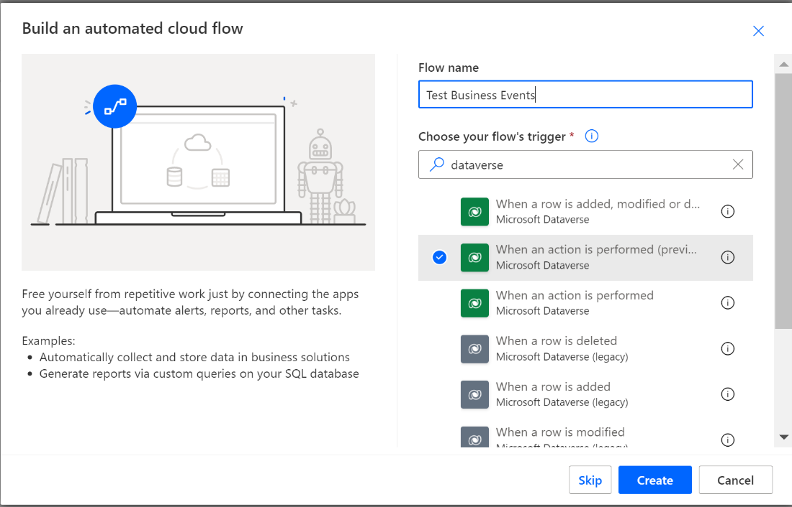
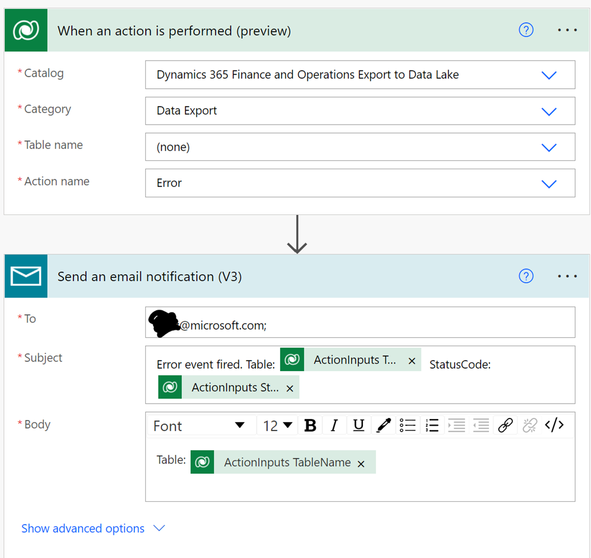

---
# required metadata

title: Business events generated by the Export to Azure Data Lake service
description: This article explains business events that are generated by the Export to Data Lake add-in in finance and operations apps.
author: MilindaV2
ms.date: 09/08/2022
ms.topic: overview
audience: Developer, IT Pro
ms.reviewer: sericks
ms.search.region: Global
ms.author: milindav
ms.search.validFrom:
ms.search.form:
ms.dyn365.ops.version:

---

# Business events generated by the Export to Azure Data Lake service

[!include [banner](../includes/banner.md)]

## What are business events?

Business events are generated by Microsoft Dynamics 365 applications when something interesting occurs during a business process (for example, an invoice is posted). They are also generated by Dataverse and Microsoft Power Platform, the platform that underlies Dynamics 365 products. External applications can consume business events and trigger actions. For more information about business events, see [Microsoft Dataverse business events](/powerapps/developer/data-platform/business-events).

The Export to Data Lake service generates business events when data transfer activities are completed or an issue is encountered. You can create automated actions to respond to these events. For example, if you have an automated data pipeline that continuously copies changed data rows from your data lake to another location, special actions might be required when a table is inactivated or reactivated. Instead of processing changed rows, you might want to trigger a full copy operation in response.

You can listen for business events and create automatic triggers to respond to business events as they occur. We refer to the automated actions that these triggers initiate as *business actions*. You don't have to listen for all business events. You can listen for and react to only the business events that are interesting to you.

## Business events that the Export to Data Lake service generates

The Export to Data Lake service generates several business events.

- **Initialize complete** – This event indicates that initialization for a selected table has been completed. When you select a table to activate, the system makes an initial copy of the data in the data lake. If you haven't enabled the **Near real-time data changes** feature, the system periodically initializes data in the data lake. The system might automatically initialize selected tables if it encounters a service operation in Finance and Operation apps, such as a database restore. In both these scenarios, the system generates **Initialize complete** events. If multiple tables are enabled in the environment, you will receive multiple business events as initialization is completed for each table.
- **Metadata changed** – This event indicates that table metadata has changed. For example, a new column has been added to the table, or (in rarer cases) a column has been deleted. You will receive multiple events for each table, one for each metadata change. If you have downstream data pipelines that can't react to metadata changes (a situation that is known as *schema drift*), you can detect changes by using these events and modify downstream pipelines.
- **Deactivated** – This event indicates that a previously active table has been inactivated. When a table is inactivated, data that is changed in finance and operations apps isn't updated in the data lake.
- **Activated** – This event indicates that a previously inactivated table has been reactivated. When a table is reactivated, the system reinitializes data in the data lake. You might subsequently receive an **Initialize complete** event.
- **Error** – This event indicates that the Export to Data Lake service has paused updates to data in the data lake.
- **Lake switch** – This event indicates that the system administrator has changed the location of the data lake.

    > [!NOTE]
    > This event isn't yet implemented.

## Enable business events

If you're using the Export to Data Lake add-in in finance and operations apps, business events are already enabled in your environment. To take action when the system generates business events, you must install the **Dynamics 365 Export to Data Lake** solution in your Microsoft Power Platform environment.

To install the **Dynamics 365 Export to Data Lake** solution, open the Power Platform admin center. You must be an administrator in the Microsoft Power Platform environment. Find the solution, and select **Install**.

## Create a business action

You can create an action by using Power Automate, Azure messaging services such as Logic Apps, and many third-party tools. For the sake of simplicity, this section explains how to create a business action by using the [When an action is performed](/connectors/commondataserviceforapps/#when-an-action-is-performed-(preview)) trigger of the Power Automate Dataverse connector.

Each business event provides an event message that helps you identify the table that is affected by that event. You can think of an event message as a parameter that can be passed to a business action. The following table shows the business events and the event message schemas.

| Business event                    | Description                                      | Event message (parameters)            |
|-----------------------------------|--------------------------------------------------|---------------------------------------|
| Initialize complete     | The system has completed a full copy of a table. | TableName: string, FolderPath: string |
| Metadata changed        | Table metadata has changed.                      | TableName: string                     |
| Deactivated             | A table has been inactivated.                    | TableName: string                     |
| Activated               | A table has been activated.                      | TableName: string                     |
| Error                   | The service has paused because of an error.      | TableName: string, StatusCode: int    |
| Lake switch (not yet implemented) | 
The data lake location has been changed.

<strong>Note:</strong> This event isn't yet implemented.
 |                                       |

To create a business action by using Microsoft Power Automate, follow these steps.

1. In the Power Apps maker portal, select **Flows** to open the Power Automate portal.
2. Select **My flows**, and then select **New Flow**.
3. Select **Automated Cloud flow**, and then select **When an action is performed**.

    

4. Select **Dynamics 365 finance and operations Export to Data Lake** as the catalog and **Data Export** as the category.
5. Leave the **Table name** field set to **(none)**. This parameter isn't applicable to the Export to Data Lake service.
6. You can choose to create an action when any of the business events are fired. In the **Action name** field, select one of the business events from the preceding table. For this example, select **Error**, because you want an action to be performed when an error occurs in the service.
7. Add a new step. You can implement any step that is available in Power Automate. For this example, add a step to send an email. You can select parameters such as the table name when you compose the email message.

    

8. Save the flow. You should now receive an email if a table goes into an error status.

## Any questions, feedback?

We are actively working on this and other features. Do you want to stay in touch and ask questions of the product team or your fellow customers or partners? Do you want to provide feedback directly to the product team? If you do, you can join the [Preview Yammer group](https://www.yammer.com/dynamicsaxfeedbackprograms/#/threads/inGroup?type=in_group&feedId=32768909312&view=all). You can then attend weekly online "office hours" meetings and use the Yammer online forums to stay in touch and ask questions.

