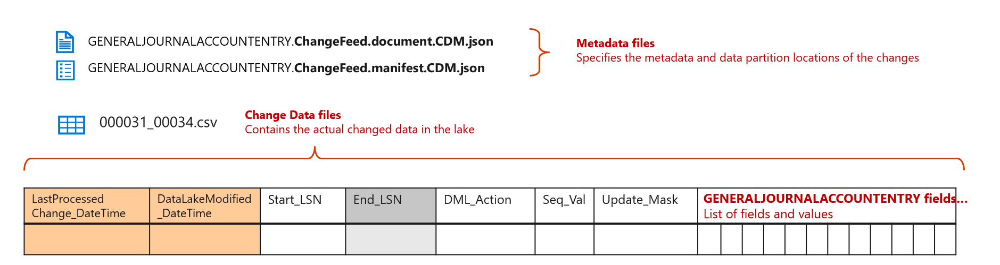

---
# required metadata

title: Change data in Azure Data Lake
description: This topic provides information about change data in a data lake and explains what you can do with it.
author: MilindaV2
ms.date: 06/10/2021
ms.topic: article
audience: Developer, IT Pro
ms.reviewer: sericks
ms.search.region: Global
ms.author: milindav
ms.search.validFrom: 2021-06-10

---

# Change data in Azure Data Lake

[!include [banner](../includes/banner.md)]

> [!NOTE]
> The **Export to Data Lake** feature is in public preview in the United States, Canada, United Kingdom, Europe, South East Asia, East Asia, Australia, and Japan regions. If your Finance and Operations environment is in any of those regions, you can enable this feature in your environment by using Microsoft Dynamics Lifecycle Services (LCS). Before you can use this feature, see [Configure export to Azure Data Lake](configure-export-data-lake.md).

Change data in a data lake lets you build near-real-time data pipelines that react to data changes in Finance and Operations apps. The **Change feed** folder in the data lake contains every data change in Finance and Operations apps. This folder is automatically created by the **Export to Data Lake** feature.

## Why do you need change data in a data lake?

Data in a data lake is often used for reporting purposes. Although you can use the table data in the data lake to create reports, you can also create additional copies of the data to improve your reporting. For example, you might have a data mart that is designed to enable your power users. In this data mart, you might have simplified, often aggregated, fact tables and dimension tables.

As table data in the data lake is updated, you must keep the corresponding fact tables and dimension tables in the data lake updated. Otherwise, your reports won't reflect the latest data.

The easiest way to update fact tables and dimension tables is to periodically create a full copy by using tables. However, this approach can be inefficient. If your tables are large (for example, if they have tens of millions or hundreds of millions of rows), the process of updating a fact table by making a full copy might take hours and consume lots of compute resources. Therefore, your users might not have the reports in time (that is, they might have to wait hours to see the latest data in reports). Additionally, because compute resources are consumed every time that data is reprocessed, you might receive a larger bill from the services that you've consumed.

Incremental update of your fact tables and dimension tables provides the answer to both problems (time consumption and compute resource consumption). In an incremental update, you select only the changed records from source tables, and update them in corresponding fact tables and dimension tables.

Incremental update is a standard capability in most data transformation tools, such as Azure Data Factory. However, for the incremental update feature to work, you must identify the records that changed in source tables.

The **Change feed** folder provides a history of table data changes in the data lake. This history can be used for data pipelines that use incremental update.

## The Change feed folder

The Change feed feature relies on a SQL Server feature that is named Change Data Capture (CDC). CDC is the native approach to capturing change data in a SQL Server database, which is the data store behind Finance and Operations apps. The Change feed feature lets you access the CDC change log in your data lake.

The following illustration shows how change feeds work in Finance and Operations apps.

1. Whenever a data change occurs in Finance and Operations apps, the underlying database (AXDB) is updated. The CDC feature ensures that the update is reflected in the database. CDC captures the changes in a log (the change log), together with a logical sequence number (**LSN** value), a date/time stamp (**Change Date-Time** value), and a **Change Payload** value that identifies the data that changed.
2. **Export to Data Lake** microservices capture the changes in the database and write the change log to the customer's data lake. Change feed folders in the data lake contain the change log, which is organized into folders.
3. In addition, in the **Tables** folder, each row that changed also contains several new fields. Each row contains the **LSN** value of the corresponding change record and the **Change Date-Time** value. Although you can use the **LSN** and **Change Date-Time** fields in the table folders to identify whether a row changed, they contain only the latest change. If the same row changed multiple times, only the latest change is shown in the **Tables** folder.

A given change feed folder in the data lake and the changed fields in the corresponding table folders are consistent. Therefore, a single microservice updates both the change feed folder and the corresponding table in the data lake at the same time.

## Exploring the Change feed folder in your data lake

Change feeds are automatically enabled when you add tables to a data lake.

When you add a table to a data lake, or when you activate a table that has been inactivated, the system makes an initial copy of the data in the data lake. At this point, the table's status is shown as **Initializing**. When the initial copy is completed, the system changes the status to **Running**. When the table is in **Running** status, changes in the Finance and Operations database are reflected in the data lake, and change feeds are added.

To access change folders, open the Azure portal, and find and select the storage account that is associated with your Finance and Operations environment. You should see the **Change feed** folder in the data lake folder structure. The following illustration shows an example.

When you open the **Change feed** folder, you should see folders that correspond to the tables that you've added to the data lake. You should also see CDM metadata files that describe the change folder data. The following illustration shows an example.

CDM metadata files describe the structure of change feed data that is contained in folders. You can use the CDM metadata files and data transformation tools such as Data Factory to read change feed data without having to read raw comma-separated values (CSV) files. To examine the metadata, select a metadata file, and then open it in a text editor.

As you should notice from the metadata definitions, the **Change feed** folder contains the CDC change log details, together with additional fields. The following illustration and table provide details about the format of changes in change folders.

| Field name                    | Contents |
|-------------------------------|----------|
| Start\_LSN                    | 
This field identifies the LSN of the transaction that changed source data in the Finance and Operations database.

**Note:** The **Start\_LSN** value is **not** enclosed in double quotation marks in CSV files. It's a hexadecimal value, as represented in the SQL Server database. Here is a sample value: **0X00011E9F00000FB00001**.
 |
| End\_LSN                      | This field isn't used. |
| DML\_Action                   | 
Each change is stored as a separate record. The **DML\_Action** field identifies the change that was made to the record.
<ul><li>1: DELETE</li><li>2: INSERT</li><li>3: BEFORE\_UPDATE</li><li>4: AFTER\_UPDATE</li></ul>
**Note:** The system doesn't add a **BEFORE\_UPDATE** record to change feeds.
 |
| Seq\_Val                      | 
This field identifies the sequence number within the LSN that changed data in the source. Because a transaction might update more than one table in the Finance and Operations database, the **Seq\_Val** field indicates the sequence number that CDC assigned to the table.

A change record is added for every change that is made to a table in a transaction. If the same record was updated multiple times in a single transaction, you will find multiple change records that have a separate sequence number. In the future, in extreme cases (for example, when there are thousands of updates to the same record in a single transaction), the system might store the latest update record.
 |
| Update\_Mask                  | A bitmap that identifies the fields that changed. This bitmap resembles the update mask in Change tracking. However, by examining the bitmap, you can identify the fields that changed. |
| List of fields and values    | The remaining columns provide a list of fields that are present in the table, together with the values. You should use the update mask to identify fields that changed as part of the transaction. |
| LastProcessedChange\_DateTime | 
This field provides the value of the CDC **Change Date-Time** field from the Finance and Operations database. The date/time is expressed in Coordinated Universal Time (UTC), per ISO 8601.

Here is a sample value: **"2020-08-24T05:26:03.8622647Z"**. Notice that this value is enclosed in double quotation marks. Additionally, it includes the default seven digits of precision after the second value, and a *Z* that signifies UTC.
 |
| DataLakeModified\_DateTime    | 
This field provides the date and time of writing to the data lake. The date/time is expressed in UTC, per ISO 8601.

Here is a sample value: **"2020-08-24T05:26:03.8622647Z"**. Notice that this value is enclosed in double quotation marks. Additionally, it includes the default seven digits of precision after the second value, and a *Z* that signifies UTC.
 |

## Best practices when change feeds are used

Change feeds are a powerful feature that is enabled by the **Export to Data Lake** feature in Finance and Operations apps. This section examines some best practices that you should follow when change feeds are used.

### Updating near-real-time data marts

If you require that your data warehouse or data marts be updated in near-real time (in other words, if they must be updated within minutes of a data change in Finance and Operations apps), you should use change feeds.

However, there are several important concepts that must be understood:

- Change records are grouped into files that are around 4 megabytes (MB) or 8 MB in size. Microsoft has optimized file sizes so that they provide optimum query response times when the files are queried by Synapse SQL Serverless. Optimized file sizes (and batched writes) also reduce the Azure charges that you might incur as the data lake is updated. Change records are only appended. In other words, they are never updated. However, files in the **Change feed** folder might occasionally be updated. For example, smaller records might be filled up so that they match the 4 MB size. You should not rely on the date/time stamp of CSV files to identify changes. Instead, you should rely on the LSN or the time stamps in the change record.
- Change feeds are constantly updated in the data lake. Updates might occur in small batches that update the data every minute. These updates might even occur more than one time per minute in the case of tables that are frequently updated. Although you can observe the **Change feed** folder (or time stamps of files) to trigger downstream jobs, you should consider the possibility that a file might have existing change records that you consumed in the past.
- Your downstream jobs can be orchestrated on a periodic basis, and they can be triggered as microbatches instead of observing changes to files or folders.
- Your downstream data pipelines must have a "last processed" marker (also known as a watermark). Whenever you can, you should rely on the LSN as the watermark. However, you can also use the **Change Date-Time** value as the watermark. By relying on the LSN, you will ensure that you consume the changes in the same sequence in which they were committed in the Finance and Operations database.
- When you reactivate a table in Finance and Operations, the **Change feed** folder is cleared, and the system starts change feeds from the next available change. This behavior ensures that the changes are consistent with the **Tables** folder. When tables are reactivated, you should consider triggering a full refresh of the downstream data pipeline.

A [sample Synapse template](https://github.com/microsoft/Dynamics-365-FastTrack-Implementation-Assets/tree/master/Analytics/SynapseToSQL_ADF) is available. You can use it to incrementally ingest data into a SQL-based data warehouse.

### Simplifying BYOD-based ETL pipelines

If you're currently using the [bring your own database (BYOD)](../analytics/export-entities-to-your-own-database.md) feature, you can rely on exports of entities that are based on Data management framework (DMF) system tables or batch tables. You might be using export job execution data in DMF system tables to identify the time periods of export jobs. Your downstream jobs might be triggered through job execution status and details that are obtained from DMF tables.

You can simplify the orchestration pipeline by consuming change feeds.

### Using the Tables folder if your data marts must be updated daily or several times per day

Change feeds are a powerful feature, but the process of constructing and maintaining a near-real-time data pipeline is complex. Although modern data transformation tools and ready-made templates can help simplify this process, you might still have to invest in building and running your pipeline.

If your users expect to data marts to be updated daily or several times per day, triggering a full refresh might be an economical alternative, especially if the volume of data is low or moderate.

### Changing feeds to audit and verify master data updates

The **Change feed** folder is an exact replica of the CDC change logs that are maintained by the Finance and Operations database. Changes that are made to master data in Finance and Operations apps are reflected in CDC. Therefore, by extension, they are also reflected in change feed folders in your data lake.

You can use reports that are built over the **Change feed** folder to audit and verify master data changes in the system.

### Periodically purging the Change feed folder

The **Change feed** folder isn't deleted by the **Export to Data Lake** process unless you reinitialize the data to recover from an error.

Because tables continue to add changes while they are in **Running** status, change feed folders will continue to grow in the data lake. (However, note that the cost of retaining data in the data lake is a fraction of the cost of a SQL database. Therefore, the cost of growing data might not be a major concern.)

If you want to reduce the amount of data that is stored in your data lake, you can periodically delete the change log from the data lake. For example, you can run a job that deletes change log files that haven't been modified for 90 days or 180 days.

Periodic deletion of the change log has no impact on data in the **Tables** folder. However, if you run consistency checks, as described earlier in this topic, you might want to keep the change log longer to facilitate those checks.
