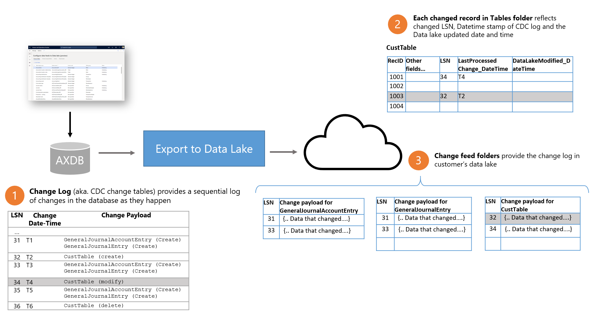
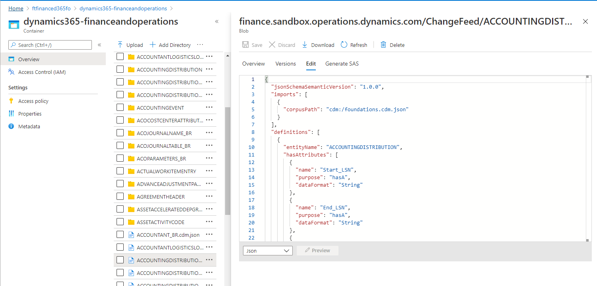
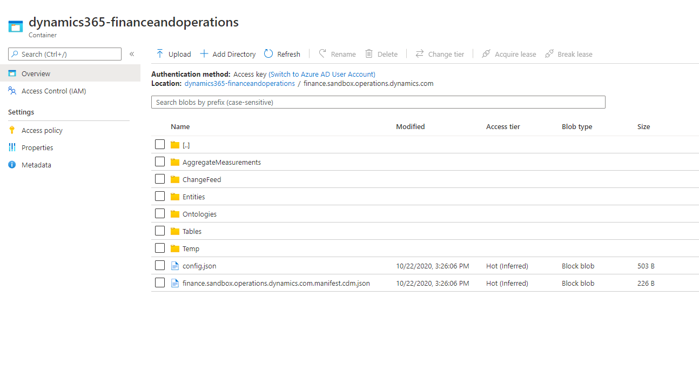
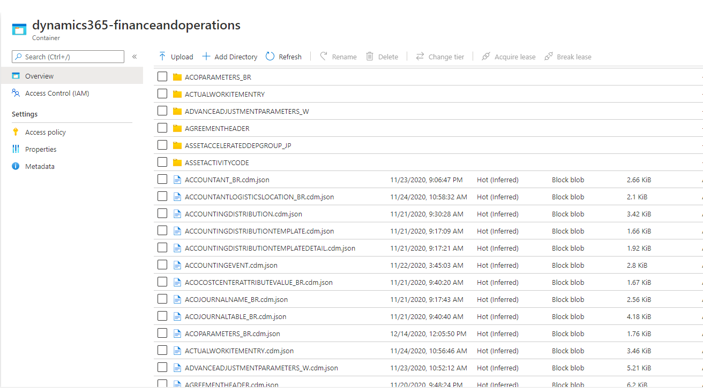
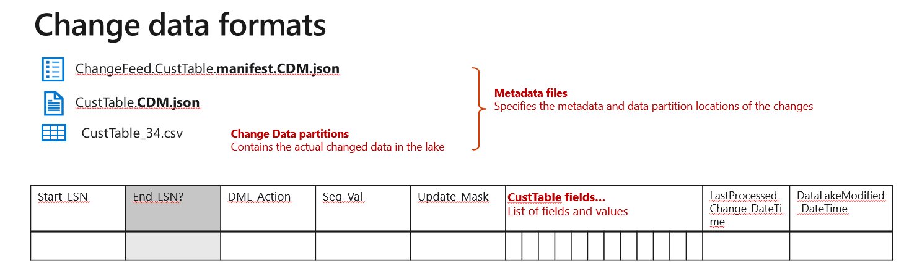

---
# required metadata

title: Changed data in Azure Data lake
description: This topic explains change data in the lake and what you can do with it.
author: MilindaV2
ms.date: 06/10/2021
ms.topic: article
audience: Developer, IT Pro
ms.reviewer: sericks
ms.search.region: Global
ms.author: milindav
ms.search.validFrom: 2021-06-10

---

# Change data in Azure Data Lake

[!include [banner](../includes/banner.md)]

> [!NOTE]
> The **Export to Data Lake** feature is in public preview in the United States, Canada, United Kingdom, Europe, South East Asia, East Asia, Australia, and Japan regions. If your Finance and Operations environment is in any of those regions, you can enable this feature in your environment by using Microsoft Dynamics Lifecycle Services (LCS). Before you can use this feature, see [Configure export to Azure Data Lake](configure-export-data-lake.md).

Change data in the data lake enables you to trigger downstream data pipelines for data changes in Finance and Operations apps. The **Change feed** folder in the lake contains each of the data changes in Finance and Operations apps. The **Change feed** folder is automatically created by the **Export to Data Lake** feature.

## Why do you need change data in the lake?
Data in the lake is often used for reporting purposes. While you can create reports using the table data in the lake, you may create additional copies of the data to improve your reporting. For example, you may have a data mart designed to enable your power users where you may have simplified, often aggregated, fact tables and dimension tables.

As table data in the lake gets updated, you need to keep corresponding fact tables and dimension tables in the lake updated so that your reports will reflect latest data.

The simplest way to update fact tables and dimension tables would be to create a full copy, on a periodic basis using tables. However, that approach may be inefficient – ie. if your tables are large, say tens or even hundreds of millions of rows, refreshing a fact table by creating a full copy may take hours, and may consume a lot of compute resources. Your users may not get the reports they need in time (ie. have to wait for hours to see latest data in reports), and also, due to consuming compute resources to re-process data each time, you may get a larger bill from the services you have consumed.

Incrementally updating your fact and dimension tables, that is choosing only the changed records from source tables and updating them in corresponding fact and dimension tables provides the answer to both these problems. Incremental update is a standard capability in most ETL and data transformation tools. However, for incremental update feature to work, you do need to identify the records that changed in source tables.

The **Change feeds** folder provides a history of table data changes in the lake such that ETL processes can be designed for incremental update.

## Change feeds explained

The Change feed feature relies on SQL Server Change Data Capture (CDC) feature – which is the native approach for capturing change data within the database layer. The Change feed feature enables you to access the CDC change log in your data lake.

Following diagram explains how change feeds operate in Finance and Operations apps.

1. Whenever a data change happens in Finance and Operations apps, the underlying database (AXDB) gets updated. The update is reflected in the database using a native SQL server feature called Change Data Capture (CDC). The CDC feature captures the changes in a log, (**Change log**) along with a Logical Sequence Number (**LSN**), a Date-time stamp (**Change DateTime**), as well as the **Change Payload** which identifies the data that changed.

2. **Export to Data Lake** microservices capture the changes in the database and write the Change Log to customer’s data lake. **Change feed folders** in the lake contains the Change log organized into folders.

3. In addition to change feed folders, each of the rows in **Tables folder** (that changed) also contain several new fields. Each row contains the LSN number of the corresponding change record and the Change DateTime. While you can use the LSN, Change date time fields in the Tables folders to identify whether a row changed, they only contain the latest change. If the same row changed multiple times, only the latest change is shown in the tables folder.

A given change feed folder in the data lake, as well as the changed fields in respective tables folders are consistent. This means, both the change feed folder and the corresponding table are updated in the data lake at the exact same time by a single microservice.

## Exploring change feeds folder in your data lake

Change feeds are automatically enabled when you add tables to the data lake.

When you add a table to the lake (or activate a table that’s deactivated), the system makes an initial copy of the data into the lake. You can see the table status in the UI as **Initializing**. When the initial copy is complete, the system changes the status to Running. When the table is in Running status, changes in Finance and Operations database are reflected in the data lake. Change feeds are added when the table is in Running status.

No navigate to change folders, launch **Azure portal** and locate the storage account that is associated with your finance and Operations environment.

The **Change feed** folder is visible in the data lake folder structure as shown below.

Navigate into the Change feed folder. You will see folders corresponding to each of the tables you have added to the lake. You will also see CDM metadata files that describe the change folder data as shown below.

CDM metadata files describe the structure of change feed data contained in folders. You can use the CDM metadata file to read/consume change feed data using ETL tools without having to read raw CSV files. You can examine the metadata by choosing a metadata file and opening the file in a Text editor.

As you can notice from the metadata definitions, change feed folder contains the CDC change log details along with additional fields. The following diagram and the subsequent table provides details of the format of changes within Change folders.

| Field name                   | Contents                                                                                                                                                                                                                                                                                                     |
|------------------------------|--------------------------------------------------------------------------------------------------------------------------------------------------------------------------------------------------------------------------------------------------------------------------------------------------------------|
| Start_LSN                    | Identifies the Logical Sequence Number (LSN) of the transaction that changed source data in Finance and Operations database. Please note that Start_LSN value is NOT enclosed in double quotes in CSV files and is a hexadecimal value as represented in the SQL Server database. Ex. 0X00011E9F00000FB00001  |
| End_LSN                      | This field is not used.       |
| DML_Action                   | Identifies the change made to the record.  1: DELETE 2: INSERT 3: BEFORE_UPDATE 4: AFTER_UPDATE.  System does not add a BEFORE_UPDATE record to change feeds.                                                                                                                                         |
| Seq_Val                      | Identifies the sequence number within the LSN that changed data in the source. Since a transaction may update more than one table in Finance and Operations database, the Seq_Val indicates the sequence number assigned by CDC to the table.                                                                |
| Update_Mask                  | A bitmap that identifies the fields that changed similar to update mask in Change tracking. But observing the bitmap, you can identify the fields that changed.                                                                                                                                               |
| List of fields and values    | Remaining columns provide a list of fields as present in the table along with values. You should use the update mask to identify fields that changed as part of the transaction.                                                                                                                              |
| LastProcessedChange_DateTime | Provides the CDC Change Date time field from the Finance and Operations database. Date Time is expressed in UTC time as per ISO 8601 Sample value: "2020-08-24T05:26:03.8622647Z" (including enclosed double quotes, with the default 7 digits of precision following the second value and Z signifying UTC). |
| DataLakeModified_DateTime    | Provides Date and time of writing to data lake expressed in UTC time as per ISO 8601 Sample value: "2020-08-24T05:26:03.8622647Z" (including enclosed double quotes, with the default 7 digits of precision following the second value and Z signifying UTC).                                                |

## Best practices in using change feeds

Change feeds are a powerful feature enabled by the Export to Data lake feature in Finance and Operations apps.

### Updating near real-time data marts

If you have a requirement to update your data warehouse or data marts on near-real time basis, you should use change feeds. By near-real-time, we mean data marts or data warehouses that need to be updated within minutes of behind operations.

However, there are several important concepts that must be understood:

- Change feeds are constantly updated in the lake. Updates may happen in small batches that update the data every minute – or even sub-minute in case of tables that update frequently. You should not observe the change feed folder to trigger downstream jobs – instead, you should assume that change feeds do happen all the time.

- Your downstream jobs should be orchestrated on a periodic basis, and can be triggered as micro-batches.

- You should rely on the LSN number as a marker – as opposed to replying on Change Date time stamps. Replying on the LSN number will ensure that you consume the changes in the same sequence that was committed in Finance and Operations database.

See a [sample Synapse template](https://github.com/microsoft/Dynamics-365-FastTrack-Implementation-Assets/tree/master/Analytics/SynapseToSQL_ADF) that can be used to incrementally ingest data into a SQL based data warehouse.

### Simplify BYOD-based ETL pipelines 

If you are using the [Bring your own database (BYOD)](../analytics/export-entities-to-your-own-database.md) feature today, you may rely on exporting entities based on DMF system tables or Batch tables. You may be using export job execution data contained within DMF system tables to identify time periods of export jobs. Your downstream jobs may be triggered using job execution status and details that are obtained from DMF tables.

You can simplify the orchestration pipeline by consuming change feeds.

### Use time stamps in Tables folder if your data marts only need to be updated daily/intra-day

While change feeds are a powerful feature, constructing and maintaining a near real-time data mart refresh process is complex. While modern ETL tools such as Azure Data Factory simplify the process of building and maintaining them, you may still need to invest in building and running your pipeline.

If your users expect to see data marts updated daily or several times a day, triggering a full refresh may be an economical alternative. This may be the case especially if the volume of data is low or moderate.

### Using change feeds to perform table-level consistency checks 

You can use the change feeds folder and the change fields in respective tables folders to perform consistency checks. These consistency checks will enable you

### Change feeds to audit/verify master data updates

Change feed folder is an exact replica of the CDC change logs maintained by the Finance and Operations database. Changes made to master data in Finance and Operations apps are reflected in CDC, and by extension, within change feed folders in your data lake.

You can use reports built over change feed folder to audit and verify master data changes in the system.

### Purging Change feed folder periodically

The Change feed folder is not deleted by the Export to Data Lake process, unless you are re-initializing the data to recover from an error.

Since tables continue to add changes while they are in running mode, Change feed folders will continue to grow in size in the data lake. (It should be noted that the cost of retaining data in the lake is a fraction of the cost compared to that of a SQL database – so the cost of growing data may not be a major concern.)

If you do want to reduce the amount of data stored in the lake, you can delete change log from your data lake on a periodic basis, for example, on a monthly basis. You can run a job that deletes change log files that have not been modified for say, 90 or 180 days.

Periodically deleting change log has no impact on data in the tables folder. However, if you do run consistency checks (see above), you may want to keep the change log longer in order to facilitate consistency checks.
