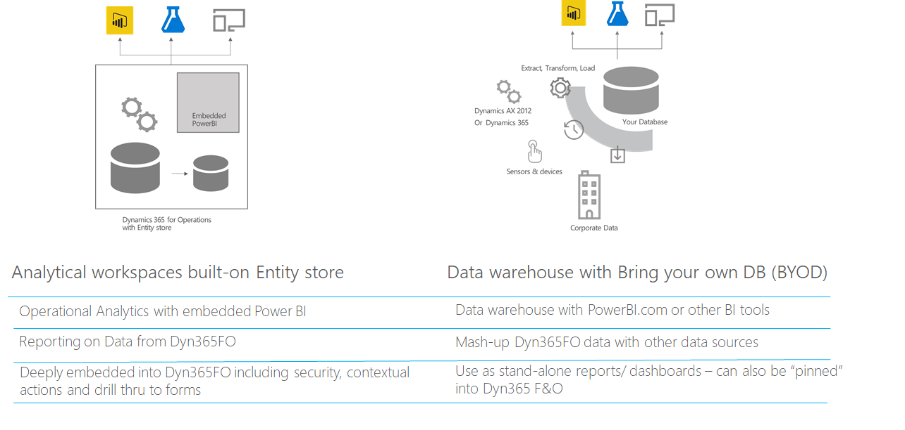

---
# required metadata

title: Azure Data Lake overveiw
description: This topic provides an overview of Azure Data Lake, which is a technology designed to enable big data analytics and AI in
the Azure cloud.
author: MilindaV2
manager: AnnBe
ms.date: 02/21/2020
ms.topic: article
ms.prod:
ms.service: dynamics-ax-applications
ms.technology: 

# optional metadata

# ms.search.form:
audience: Developer, IT Pro
# ms.devlang: 
ms.reviewer: kfend
ms.search.scope:
# ms.tgt_pltfrm: 
# ms.custom: NotInToc
ms.search.region: Global
# ms.search.industry:
ms.author: milindav
ms.search.validFrom: 2020-03-31
ms.dyn365.ops.version: Platform update 34
---

# Azure Data Lake overveiw

[!include [banner](../includes/banner.md)]

## What is Azure Data Lake?

Azure Data Lake is a technology designed to enable big data analytics and AI in the Azure cloud. When referring to Azure Data Lake, we specifically refer to Azure Data Lake Gen2 (ADLS) based storage technology.

Data lakes provide cheap cloud storage compared to a relational database. This enables storing large amounts of data in the cloud--both business data (traditionally stored in business systems and data warehouses) to device and sensor data, such as signals from devices. In addition to cheap storage, Azure Data Lake supports a range of tools and programming languages that enable reporting, querying, and transforming large amounts of data.

For an overview of Azure Data Lake Gen2, see [Introduction to Azure Data Lake storage Gen 2](https://docs.microsoft.com/azure/storage/blobs/data-lake-storage-introduction).

Dynamics 365 products, including Finance and Operations apps, leverage Azure Data Lake for AI and analytics scenarios, thereby enabling customers to leverage the strengths and cost advances offered by this technology. The following sections offer an overview of the scenarios.

## Analytical workspaces

Analytical workspaces provide contextual and actionable insights within Finance and Operations apps. Analytical workspaces provide a birds-eye view of a business processes, which enable your users to get relevant information immediately. They can also take action then and there.

Analytical workspaces leverage embedded Power BI technology to provide rich, interactive visuals over Finance and Operations data. Using analytical workspaces is fun and exciting--it invites your users to explore data.

Analytical workspaces can be leveraged for operational analytics scenarios in two ways:

- Use and extend the ready-made analytical workspaces without the need to build from scratch

- Built your own Power BI based analytical reports

For more information, see [Embedded Power BI in workspaces](https://docs.microsoft.com/dynamics365/fin-ops-core/dev-itpro/analytics/embed-power-bi-workspaces?toc=/dynamics365/finance/toc.json).

## BYOD

Bring your own database (BYOD) is a service that enables customers to extract data from Finance and Operations apps into their own data warehouses. BYOD is recommended when you need to combine data from Finance and Operations apps with other systems, as well as with reporting with legacy data.

For more information, see [Bring your own database (BYOD)](https://docs.microsoft.com/dynamics365/fin-ops-core/dev-itpro/analytics/export-entities-to-your-own-database).

## Azure Data Lake combines BYOD and Entity store

Customers use a combination of analytical workspaces (based on Entity store) and BYOD for different scenarios.

Azure Data Lake combines both these services into a single service that offers "best of both worlds" as follows:
 
- Customers can bring their own Azure Data Lake (ie. Azure Data Lake in their own subscription) and integrate with Finance and Operations apps. Finance and Operations apps will leverage your own data lake to store Entity store data and operate analytical workspaces. Analytical workspaces continue to work as before.
 
- Entity store (staged in your Azure Data Lake), provides a set of simplified (de-normalized) data structures for easier reporting. Now, your users can be given direct access to data best suited for creating their own reports with a tool of their choice.
 
- As opposed to exporting data (with BYOD), customers can choose the data they want to be staged in the Azure Data Lake. Data feed service (part of Finance and Operations services) keeps the data fresh in the data lake.
 
- Customers can bring their own data into the data lake to augment the data provided by Finance and Operations apps. This capability enables easy data mash-up scenarios in the data lake.
    - Using hundreds of ready-made connectors available in tools such as Power BI data flows and Azure Data factory, data from many external sources can be easily ingested into the data lake.
    - Historical and legacy data (often inherited as a part of transitioning to Finance and Operations apps) can be directly ingested into the data lake.
    - Data lakes provide options to ingest non-business data - for an example, device data can be easily ingested into the data lake.
 
- Cloud based services enable both power users as well as developers to consume this data.
 

  
## Common Data Model folders

Data is stored in Azure Data Lake to comply with Common Data Model (CDM) folder standard. This means:
- Data staged in Azure Data Lake by Finance and Operations apps is organized into a set of folders. 
- CDM folders contain metadata definitions in addition to data files - metadata definitions are kept in model files in accordance with the standard specified by CDM language.
- Presence of metadata (and complying with CDM folder standard) enables Azure and other services to read and transform this data.

CDM folder structure from Finance and Operations apps is shown below.

For more information on CDM in Azure Data lake see [Use the Common Data Model to optimize Azure Data Lake Storage Gen2](https://docs.microsoft.com/common-data-model/data-lake).
 
For an example:
- You can attach a CDM folder into Power BI dataflows as a reference Dataflow. You can work with Power BI data flows and further re-shape the data, or to create Power BI datasets and reports.
- You can use Azure Data Factory or other data transformation tools to further shape the data.
 
Similar to Finance and Operations apps, other services (including CDS), Azure IoT as well as a host of third-party tools and service can understand and work with data in CDM folders. The list of services is growing. Following are a few examples:

- Common Data Service enables exporting data to your own Azure Data Lake. For more information, see [Exporting CDS data to Azure Data Lake is Generally Available](https://powerapps.microsoft.com/en-us/blog/exporting-cds-data-to-azure-data-lake-preview/).

- Power users can transform data in Azure Data Lake using CDS Data Flows. For more information, see [Use the Common Data Model to optimize Azure Data Lake Storage Gen2](https://docs.microsoft.com/common-data-model/data-lake).

## If you are using BYOD, how you can use Azure Data Lake in the future

BYOD service is used by customers to extract data from Finance and Operations apps mostly for reporting or analytics. BYOD service requires the customer to provision and maintain a SQL Azure database for storing data that are exported from Finance and Operations apps.

Some customers use the exported data in the BYOD for reporting. They can simply point reporting tools to the SQL Azure database and create reports.

Some customers use BYOD as a staging area - where a "snapshot" of the Finance and Operations data is retained. They have an enterprise data warehouse – they use additional data pipelines that copy the data from the BYOD “staging area” to their data warehouse. They may also have further downstream processing and transformation pipelines.

If you using BYOD today for scenarios above, on-boarding to Azure Data Lake will yield several benefits.

## Data is already here, no need to export

Azure Data Lake integration enables the user to choose tables and entities (similar to the BYOD experience). Once chosen, the data is updated in Azure Data Lake by the system. The system also continuously exports data as they change within Finance and Operations apps. Updated Finance and Operations data is reflected in the Azure Data Lake within few minutes of a change.

> [!Note]
> Table data is refreshed within minutes of a change within Finance and Operations apps. Currently the services offers an SLA of data updates within 10 minutes.

With Azure Data Lake integration, customers do not need to monitor and manage complex data export and orchestration schedules. Data is updated in the Data lake without user intervention.

## Reduced cost of data storage

Data is stored in an Azure Data lake (Gen2), as opposed to an Azure SQL database as required by BYOD. Customer gets to use a storage medium much cheaper than Azure SQL database.

> [!Note]
> Since Azure Data Lake Gen2 is in customer's subscription, the customer must pay for data storage as well as I/O costs incurred when reading and writing data into the data lake. Customer may also incur IO costs due to the data being written/updated in the data lake by Finance and Operations apps. Finance and Operations apps requires the data lake be provisioned within the same Geo/region as the Finance and Opertations environment to reduce intra-region IO costs.

For an indicative cost, please see the [Azure Data Lake Storage Gen2 pricing](https://azure.microsoft.com/pricing/details/storage/data-lake/) page.

## Existing downstream/ consumption pipelines can be preserved

As we discussed earlier, BYOD is predominantly used in 2 scenarios

1.  Direct access to BYOD by Reporting and other tools.

2. Use BYOD as a temporary staging area to store data while being exported to other downstream systems such as data warehouses.

In case of scenario 1, you may point reporting tools to the Azure SQL database. Many reporting tools work with SQL databases since they can read data using T-SQL.

In case of scenario 2, if you may use data integration/transformation tools such as Azure data factory. Many data integration tools can consume data from the Azure Data Lake directly.

In case of scenario 1 and 2, if you are reading the database using T-SQL, you can create a SQL server end-point using Azure Synapse. Azure synapse SQL-on demand capability enables querying Azure Data Lake using T-SQL language. Downstream tools do not need to be modified since you can preserve the data shape similar to BYOD.

## Simplified data pipeline for near-real time reporting 

In a traditional data warehouse, data is stored in a staging area before it can be aggregated and simplified for reporting. You may also have a reporting tools that aggregate data for better user experiences. Having multiple data stops (for staging, de-normalization, and aggregation) increases data staleness – that is the time it takes from activity to the time it takes for the reports to reflect the results.

Traditional data warehouses built with multiple data stops are ideal for reporting on data that changes daily or several times a day. However, if you need to report on near-real time data, for an example, for reporting on retail sales data within minutes as they happen, you may need to design a data pipeline that has minimal data stops. This pattern is known as the hot-path, cold path reporting (also known as Lambda architecture). Having multiple data stops and multiple data pipelines adds to complexity and increased management efforts.

Data lake integration enables "warm-path" as the default reporting option. Since data is updated within minutes in an Azure Data Lake, this approach may be acceptable for most reporting scenarios including cases that involve near-real time reporting.

For near-real time reporting, you can minimize data staging and preparation steps by using on-demand query (ex. Azure Synapse) and Power BI direct query mode that queries semi-prepared data within the data lake. For analytical reporting, you can de-normalize and aggregate the data within the data lake.

## If you are using analytical workspaces, how you can use Azure Data Lake in the future

Analytical workspaces enable in-context, operational analytics within Finance and Operations apps. Analytical workspaces are built as an extension to Finance and Operations workspaces - a cockpit that provides a bird's eye view of business processes. There are over 25 ready-made analytical workspaces that provide interactive, near-real time data exploration. You can drive action by adding contextual gestures into analytical workspaces - users can act on the findings without leaving the report. There is an extensive programming model built into Finance and Operations apps that enable driving ERP action and business logic from within an analytical workspace.

You can use ready-made analytical workspaces from Microsoft (as well as partners and ISVs) as a starting point. Or if you have built your own Power BI based analytical reports (with BYOD or your own data warehouse), you can pin them into analytical workspaces. In both cases, you can enrich business processes with in-context reporting that drives action.

Ready-made analytical workspaces that are part of core Finance and Operations apps (or an ISV extension) include reports that are built using Entity store. Entity store contains aggregate measurements (ie. Simplified data structures such as fact tables and dimensions).

Aggregate measurements will be available in the Azure Data Lake as opposed to Entity store. If you are using ready-made analytical workspaces built over Entity store, they will be pointed to Azure Data Lake in a future monthly service update. Microsoft service team will notify you when your Entity store is ready to transition to Azure Data Lake. You will not need to modify the reports themselves - meaning no development work will be required.

If you have pinned your own Power BI reports to analytical workspaces, you can transition them to Azure Data Lake at your own schedule.

## How you can modernize your existing data warehouse with Azure Data Lake

While you can make use of Azure Data Lake integration as a way to transition out of BYOD and gain immediate benefits, there's a lot more you can do with the benefits offered by Azure Data Lake.

Azure Data Lake is designed to store large amounts of data into hundreds or terra bytes or more. Azure Data Lakes leverage inexpensive storage technology, ie. Blog storage, that is used by many underlying services of Azure.

Azure Data Lakes are designed for big data analytics. You can bring your legacy and historical data from your own systems into Azure Data Lake. Not only business data, you can bring scanned documents and apply machine learning models to make sense of the content and sentiments expressed by the authors. You can collect signals from devices and vehicles or machines on the shop floor and store the data in data lakes. You can apply machine learning models to detect anomalies and patterns in signals and join the results with business data to take proactive actions.

Azure Data Lake has many associated services that enables analytics, data transformation, as well as applying AI and machine learning. Azure services from Microsoft, partners, as well as open source tools can be used to reason over the data.

As opposed to downloading Finance and Operations data from an Azure Data Lake into your on-premises data warehouses, you can bring your on-premises data into an Azure Data Lake. We refer to this transformation as modernizing data warehouses.

## Planning the transition

You can plan your transition to Azure Data Lake in multiple stages as shown in the diagram below. Each stage yields business benefits that can be justified on their own. You can use the following phases as a planning guideline.

1.  You may be using BYOD as well as Entity store based analytical workspaces today.

2. **Easy access to data:** As you get access to tables, entities and aggregate measurements in Azure Data Lake, you will be able to retire BYOD and use the data readily available. This means a reduction in management effort and costs as we discussed above. You may keep the existing downstream data warehouses and pipelines intact to manage project scope and budget.

3. **Enabling power users:** Analytical workspaces will transition to Azure Data Lake as a service update. This means, ready-made analytical workspaces are based on the same data that's available in the Azure Data Lake. Analytical workspaces enable easy extensibility to power users. Along with this update, you can enable your power users to use full capabilities of PowerBI.com. Power users can easily combine data from online services as well as data is already available in the Azure Data Lake using capabilities such as Power BI dataflows. Same reports available in analytical workspaces can be consumed directly in PowerBI.com  

4. **Modernizing your (legacy) data warehouse** is likely an investment that will bring most benefits. You can move your existing data in your on-premise data warehouse to the cloud. You can rely on cloud based computing services and apply the same transformations on a pay-per use basis. You could also combine your business data with sensor and device data.

