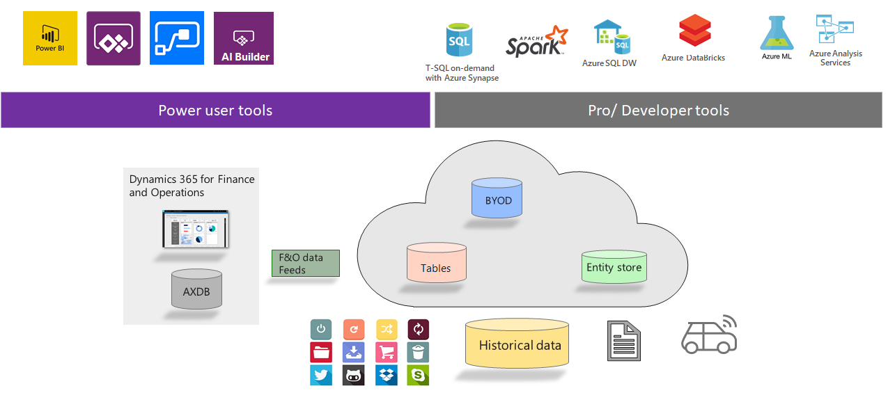
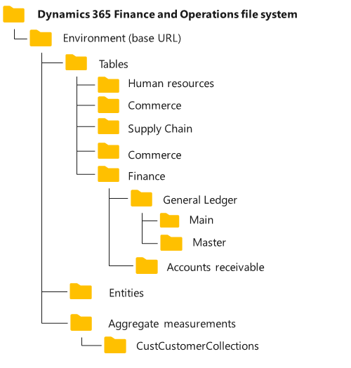
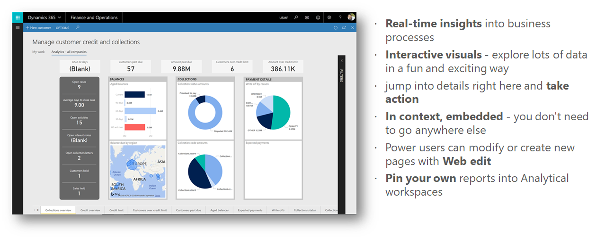
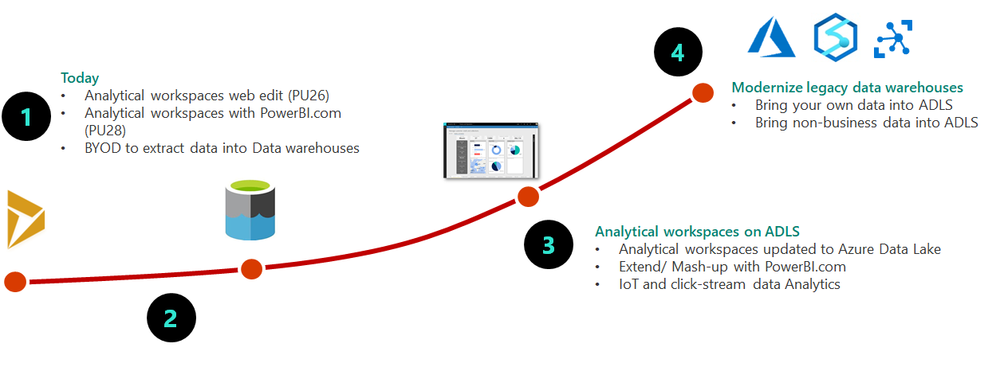

---
# required metadata

title: Azure Data Lake overview
description: This topic provides an overview of Microsoft Azure Data Lake. Data Lake is a technology that is designed to make big data analytics and artificial intelligence (AI) available in the Azure cloud.
author: MilindaV2
manager: AnnBe
ms.date: 04/01/2020
ms.topic: article
ms.prod:
ms.service: dynamics-ax-applications
ms.technology: 

# optional metadata

# ms.search.form:
audience: Developer, IT Pro
# ms.devlang: 
ms.reviewer: kfend
ms.search.scope:
# ms.tgt_pltfrm: 
# ms.custom: NotInToc
ms.search.region: Global
# ms.search.industry:
ms.author: milindav
ms.search.validFrom: 2020-03-31
ms.dyn365.ops.version: Platform update 34

---

# Azure Data Lake overview

[!include [banner](../includes/banner.md)]

## What is Azure Data Lake?

Microsoft Azure Data Lake is a technology in Azure cloud that enables big data analytics and artificial intelligence (AI). When this topic mentions "Data Lake," it's referring specifically to storage technology that is based on Azure Data Lake Storage Gen2.

Data lakes provide cloud storage that is less expensive than the cloud storage that relational databases provide. Therefore, large amounts of data can be stored in the cloud. This data includes both business data that is traditionally stored in business systems and data warehouses, device and sensor data, such as signals from devices. In addition, Data Lake supports a range of tools and programming languages that enable large amounts of data to be reported on, queried, and transformed.

For an overview of Data Lake Storage Gen2, see [Introduction to Azure Data Lake Storage Gen2](https://docs.microsoft.com/azure/storage/blobs/data-lake-storage-introduction).

Dynamics 365 products, such as Finance and Operations apps, use Data Lake for AI and analytics scenarios. Therefore, customers can take advantage of the strengths and cost advances that this technology offers. The following sections provide an overview of the scenarios.

## Analytical workspaces

Analytical workspaces provide contextual and actionable insights in Finance and Operations apps. They give users a bird's-eye view of a business process, so that they can immediately get relevant information and take appropriate action.

Analytical workspaces are based on Entity store and use embedded Power BI technology to provide rich, interactive visuals of data from Finance and Operations apps. Analytical workspaces are fun and exciting to use: they invite your users to explore data.

Analytical workspaces can be used for operational analytics scenarios in two ways:

- Use and extend the ready-made analytical workspaces, so that you don't have to build workspaces from scratch.
- Build your own Power BI–based analytical reports.

For more information, see [Embedded Power BI in workspaces](https://docs.microsoft.com/dynamics365/fin-ops-core/dev-itpro/analytics/embed-power-bi-workspaces?toc=/dynamics365/finance/toc.json).

## BYOD

Bring your own database (BYOD) is a service that lets customers extract data from Finance and Operations apps into their own data warehouses. We recommend that you use BYOD when you must combine data from Finance and Operations apps with other systems or with reporting that uses earlier data.

For more information, see [Bring your own database (BYOD)](https://docs.microsoft.com/dynamics365/fin-ops-core/dev-itpro/analytics/export-entities-to-your-own-database).

## Data Lake combines BYOD and Entity store

Customers use a combination of analytical workspaces (which are based on Entity store) and BYOD for different scenarios. Following table compares the scenarios and capabilities

| Analytical workspaces built-on Entity store                                                                                              | Data warehouse with Bring your own DB (BYOD)   |
|------------------------------------------------------------------------------------------------------------------------------------------|------------------------------------------------|
| Near real-time Operational Analytics (with embedded Power BI)                                                                            | Data warehouse with PowerBI.com or other tools |
| Reporting on data from F&O                                                                                                               | Mash-up F&O data with other data sources       |
| Ready-made reports shipped with F&O or ISV solution                                                                                      | Reports extended or authored by partner        |

Reports authored with both these sources can be pinned into Analytical workspaces in F&O with contextual security and drill thru actions
Data Lake combines both these services into a single service that offers the "best of both worlds":

- Because Data Lake is included in customer subscriptions, you can bring your own data lake and integrate it with Finance and Operations apps. Finance and Operations apps will use your data lake to store Entity store data and operate analytical workspaces. Analytical workspaces continue to work as they worked before.
- Entity store is staged in your data lake and provides a set of simplified (denormalized) data structures to make reporting easier. Your users can now be given direct access to the data that is most relevant to them, and they can create their own reports by using a tool of their choice.
- Instead of exporting data by using BYOD, customers can select the data that is staged in the data lake. Data feed service, which is part of Finance and Operations services, keeps the data in the data lake fresh.
- You can bring your own data into the data lake to supplement the data that Finance and Operations apps provide. This capability allows for easy data mash-up scenarios in the data lake.

    - Data from external sources can easily be ingested into the data lake via hundreds of ready-made connectors that are available in tools such as Power BI dataflows and Azure Data Factory.
    - Historical data and earlier data that is often inherited as a part of the transition to Finance and Operations apps can be ingested directly into the data lake.
    - Data lakes provide options for ingesting non-business data. For example, device data can easily be ingested into the data lake.

- Cloud-based services let both power users and developers consume this data.

    

## Common Data Model folders

Data is stored in Data Lake to comply with the Common Data Model folder standard. Here are some results:

- Data that Finance and Operations apps stage in Data Lake is organized into a set of folders.
- Common Data Model folders contain metadata definitions in addition to data files. Metadata definitions are kept in model files, according to the standard that is specified by the Common Data Model language.
- Because metadata is present and data storage complies with the Common Data Model folder standard, Azure and other services can read and transform the data.

The following illustration shows the Common Data Model folder structure from Finance and Operations apps.

For more information about Common Data Model in Data Lake, see [Use the Common Data Model to optimize Azure Data Lake Storage Gen2](https://docs.microsoft.com/common-data-model/data-lake).

Here is an example:

- You can attach a Common Data Model folder to Power BI dataflows as a reference dataflow. You can work with Power BI dataflows and further reshape the data, or you can create Power BI datasets and reports.
- You can use Data Factory or other data transformation tools to further shape the data.

Like Finance and Operations apps, other services (including Common Data Service), Azure IoT, and many third-party tools and service can understand and work with data in Common Data Model folders. The list of services is growing. Here are some examples:

- Common Data Service lets you export data to your own data lake. For more information, see [Exporting CDS data to Azure Data Lake is Generally Available](https://powerapps.microsoft.com/blog/exporting-cds-data-to-azure-data-lake-preview/).
- Power users can transform data in Data Lake by using Common Data Service dataflows. For more information, see [Use the Common Data Model to optimize Azure Data Lake Storage Gen2](https://docs.microsoft.com/common-data-model/data-lake).

## How you can use Data Lake later if you're currently using BYOD

In most cases, customers use BYOD to extract data from Finance and Operations apps so that they can use that data for reporting or analytics. BYOD requires that customers provision and maintain an Azure SQL database to store data that is exported from Finance and Operations apps.

Some customers use the exported data in BYOD for reporting. These customers can just point reporting tools to the SQL database and create reports.

Some customers use BYOD as a staging area, where a "snapshot" of the Finance and Operations data is retained. These customers have an enterprise data warehouse, and they use additional data pipelines that copy the data from the BYOD "staging area" to their data warehouse. They might also have other downstream processing and transformation pipelines.

If you're currently using BYOD for these scenarios, you will gain several benefits by onboarding to Data Lake.

## Because data is already present, export isn't required

Data Lake integration lets users select tables and entities, just as they can in the BYOD experience. After tables and entities are selected, the system updates the data in Data Lake. The system also continuously exports data as it changes in Finance and Operations apps. The data lake reflects the updated Finance and Operations data within a few minutes after the changes occur.

> [!NOTE]
> Table data is updated within minutes after a change occurs in Finance and Operations apps. According to the current service-level agreement (SLA) that the services offer, data is updated within **10 minutes**.

Because of Data Lake integration, customers don't have to monitor and manage complex data export and orchestration schedules. No user intervention is required to update data in the data lake.

## Reduced cost of data storage

Data is stored in a data lake (Gen2) instead of the SQL database that BYOD requires. Therefore, customer can use a storage medium that is much less expensive than Azure SQL Database.

> [!NOTE]
> Because Data Lake Storage Gen2 is included in a customer's subscription, the customer must pay for data storage and input/output (I/O) costs that are incurred when data is read and written to the data lake. The customer might also incur I/O costs because Finance and Operations apps write data to the data lake or update the data in it. To help reduce intra-region I/O costs, Finance and Operations apps require that data lakes be provisioned in the same country or region as the Finance and Operations environment.

For more information about cost, see the [Azure Data Lake Storage Gen2 pricing](https://azure.microsoft.com/pricing/details/storage/data-lake/) page.

## Existing downstream/consumption pipelines can be preserved

As was discussed earlier, BYOD is mostly used in two scenarios:

- Reporting tools and other tools access BYOD directly.
- BYOD is used as a temporary staging area to store data while it's being exported to other downstream systems, such as data warehouses.

For the first scenario, you can point reporting tools to the SQL database. Many reporting tools work with SQL databases, because they can use Transact-SQL (T-SQL) to read data.

For the second scenario, you can use data integration/transformation tools such as Data Factory. Many data integration tools can consume data directly from the data lake.

For both scenarios, if you're using T-SQL to read the database, you can create a SQL Server endpoint by using Azure Synapse Analytics. Azure Synapse include SQL-on-demand capability that enables Data Lake to be queried by using the T-SQL language. Downstream tools don't have to be modified, because you can preserve the data shape, as you can when you use BYOD.

## Simplified data pipeline for near-real-time reporting

In a traditional data warehouse, data is stored in a staging area before it can be aggregated and simplified for reporting. You might also have reporting tools that aggregate data for better user experiences. If you have multiple data stops (for staging, denormalization, and aggregation), data staleness increases (that is, after activity occurs, more time passes before reports reflect the results).

Traditional data warehouses that have multiple data stops are ideal for reporting on data that changes every day or even several times a day. However, if you must report on near-real-time data (for example, if you must report on retail sales data within minutes after the sales occur), you might have to design a data pipeline that has minimal data stops. This pattern is known as *hot-path, cold-path reporting* (or *lambda architecture*). Multiple data stops and multiple data pipelines increase complexity and management efforts.

Data Lake integration makes *warm-path reporting* available as the default reporting option. Because data in a data lake is updated within minutes, this approach might be acceptable for most reporting scenarios, even scenarios that involve near-real-time reporting.

For near-real time reporting, you can minimize the data staging and preparation steps by using on-demand query (for example, Azure Synapse) and Power BI direct query mode, which queries semi-prepared data in the data lake. For analytical reporting, you can denormalize and aggregate the data in the data lake.

## How you can use Data Lake later if you're currently using analytical workspaces

Analytical workspaces make in-context operational analytics available in Finance and Operations apps. Analytical workspaces are built as an extension to Finance and Operations workspaces. They are a type of a "cockpit" that provides a bird's-eye view of business processes. There are more than 25 ready-made analytical workspaces that provide interactive, near-real-time data exploration.

You can drive action by adding contextual gestures to analytical workspaces. Therefore, users can act on results without having to leave the report that they are viewing. An extensive programming model that is built into Finance and Operations apps enables enterprise resource planning (ERP) actions and business logic to be driven from analytical workspaces.

You can use the ready-made analytical workspaces from Microsoft, partners, and independent software vendors (ISVs) as starting points. Alternatively, if you've built your own Power BI–based analytical reports by using BYOD or your own data warehouse, you can pin them to analytical workspaces. In both cases, you can enrich business processes through in-context reporting that drives action.

The ready-made analytical workspaces that are part of core Finance and Operations apps (or part of ISV extensions) include reports that are built by using Entity store. Entity store contains *aggregate measurements* (that is, simplified data structures, such as fact tables and dimensions).

Aggregate measurements will be available in the data lake instead of Entity store. If you're using ready-made analytical workspaces that were built by using Entity store, they will be pointed to Data Lake in an upcoming monthly service update. The Microsoft service team will notify you when your Entity store is ready for the transition to Data Lake. You won't have to modify the reports themselves. Therefore, no development work will be required.

If you've pinned your own Power BI reports to analytical workspaces, you can transition them to Data Lake on your own schedule.

## How you can modernize your existing data warehouse by using Data Lake

Although you can use Data Lake integration to transition from BYOD and gain immediate benefits, Data Lake also lets you do much more.

Data Lake is designed to store large amounts of data: hundreds of terabytes (TB) or more. It takes advantage of Azure Blob storage, which is inexpensive storage technology that many underlying services of Azure use.

Data lakes are designed for big data analytics. You can bring your historical data and earlier data from your own systems into Data Lake. This data can consist of scanned documents in addition to business data. You can then apply machine learning models to the documents to make sense of the content and the opinions that the document authors expressed. You can also collect signals from devices and vehicles or machines on the shop floor, and store the data in data lakes. You can then apply machine learning models to detect anomalies and patterns in the signals, and you can join the results with business data to take proactive action.

Data Lake has many associated services that enable analytics, data transformation, and the application of AI and machine learning. Azure services from Microsoft, partners, and open-source tools can be used to reason over the data.

Instead of downloading Finance and Operations data from a data lake into your on-premises data warehouses, you can bring your on-premises data into a data lake. Microsoft refers to this transformation as *modernization of data warehouses*.

## Planning the transition

You can plan your transition to Data Lake in multiple stages, as shown in the following illustration. Each stage offers business benefits that can be justified on their own. You can use the stages that are shown here as a planning guideline.

1. **Your current situation:** You might already be using BYOD and analytical workspaces that are based on Entity store.
2. **Getting easy access to data:** As you gain access to tables, entities, and aggregate measurements in Data Lake, you will be able to retire BYOD and use the data that is readily available. Therefore, management effort and costs can be reduced, as was discussed earlier. You can keep your existing downstream data warehouses and pipelines to manage project scope and budget.
3. **Empowering power users:** Analytical workspaces will be transitioned to Data Lake as a service update. Therefore, ready-made analytical workspaces are based on the same data that is available in the data lake. Power users can easily extend analytical workspaces. When the service update occurs, you will be able to make the full capabilities of PowerBI.com available to your power users. By using capabilities such as Power BI dataflows, power users can easily combine data from online services and data is already available in the data lake. The same reports that are available in analytical workspaces can be consumed directly on PowerBI.com.  
4. **Modernizing your previous data warehouse:** Modernization will probably be the investment that brings the most benefits. You can move data that currently exists in your on-premises data warehouse to the cloud. You can rely on cloud-based computing services and apply the same transformations on a pay-per-use basis. You can also combine your business data with sensor and device data.
