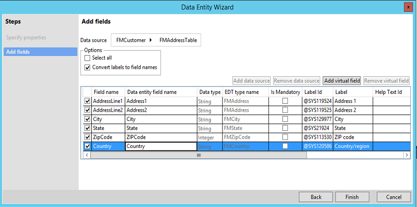
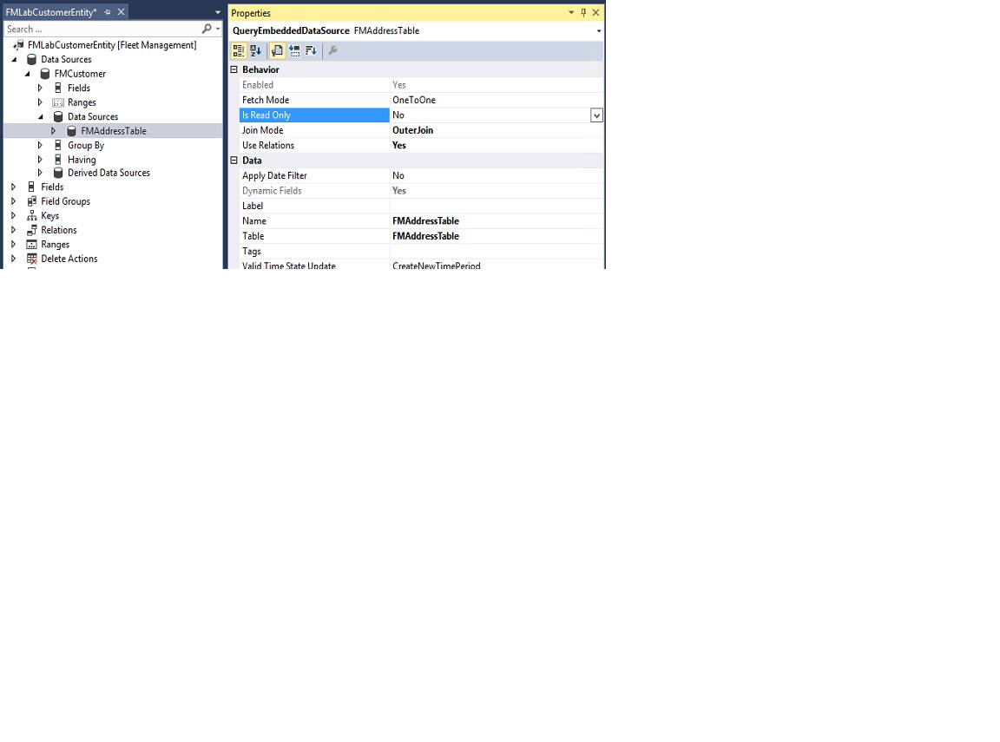
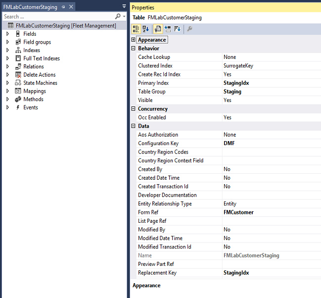
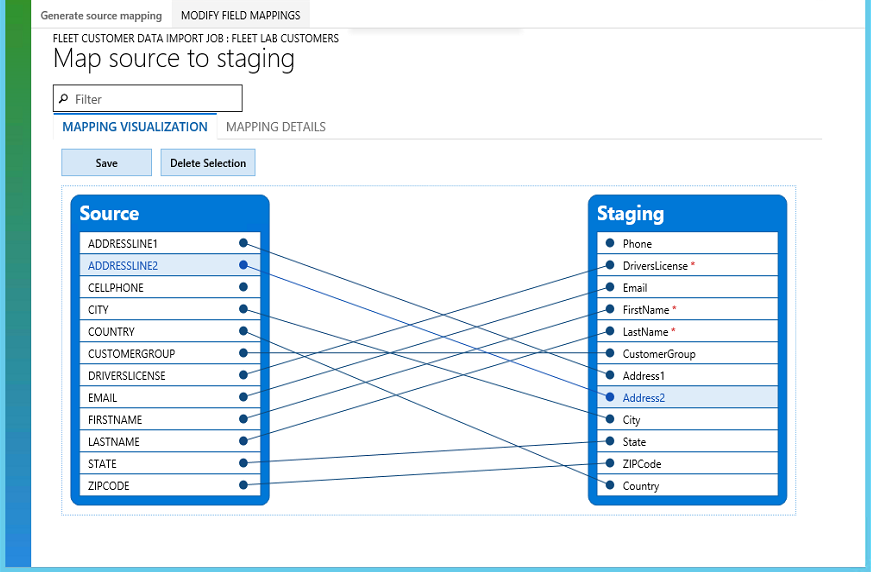
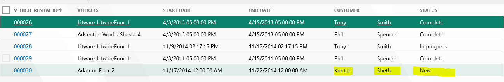

---
# required metadata

title: Build and consume data entities
description: This tutorial shows how to build an entity and how to consume some out-of-band (OOB) entities in an integration scenario.
author: peakerbl
ms.date: 03/01/2022
ms.topic: article
ms.prod: 
ms.technology: 

# optional metadata

# ms.search.form: 
# ROBOTS: 
audience: Developer
# ms.devlang: 
ms.reviewer: sericks
# ms.tgt_pltfrm: 
ms.assetid: 1de997fb-d5c4-4668-9759-0758d141a3eb
ms.search.region: Global
# ms.search.industry: 
ms.author: peakerbl
ms.search.validFrom: 2016-02-28
ms.dyn365.ops.version: AX 7.0.0

---

# Build and consume data entities

[!include [banner](../includes/banner.md)]


[!INCLUDE [PEAP](../../../includes/peap-3.md)]

This tutorial shows how to build an entity and how to consume some out-of-band (OOB) entities in an integration scenario. You will also preview how these data entities will be consumed in various integrations scenarios, such as data import and export, integration, and OData services.

When you are ready to build your first entity for production, you will need to:
- Create your own package and model. For more information, see [Models and packages](../dev-tools/models.md).
- Create a new project and set the model property to the one that you just created.

## Prerequisites
This tutorial requires that you access an environment by using Remote Desktop, and that you are provisioned as an administrator on the instance.

Throughout this tutorial, baseUrl refers to the base URL of the instance.

- In the cloud environment, the base URL is obtained from Microsoft Dynamics Lifecycle Services (LCS).
- On a [local virtual machine (VM)](../dev-tools/access-instances.md#vm-that-is-running-locally), the base URL is `https://usnconeboxax1aos.cloud.onebox.dynamics.com`.
- Download FMLab sample code to C:. For details, see [FMLab sample code](https://github.com/Microsoft/FMLab).

## Key concepts
- Developing a data entity in Microsoft Visual Studio
- Enabling a data entity for data management and OData services
- Consuming a data entity in integration scenarios

## Business problem
Fleet Management stores customer data in the FMCustomer table and address data in the FMAddressTable table. To access or update customer information, users must access multiple tables. Instead, you can create a business object that functionally represents customer information, and that you can use to build integration solutions.

## Building the FMLabCustomer entity
In this section, you must create a data entity for FMLabCustomer in the Fleet Management model. This entity will be used to manage master data through import/export and integration services. The primary data source is FMCustomer, and the secondary data source is FMAddressTable.

### Data entity

FMLabCustomerEntity

#### Data entity fields

| Name          | Mapping                     |
|---------------|-----------------------------|
| CellPhone     | FMCustomer.CellPhone        |
| DriversLicense | FMCustomer.DriversLicense    |
| Email         | FMCustomer.Email            |
| FirstName     | FMCustomer.FirstName        |
| LastName      | FMCustomer.LastName         |
| CustomerGroup | FMCustomer.CustGroup        |
| AddressLine1  | FMAddressTable.AddressLine1 |
| AddressLine2  | FMAddressTable.AddressLine2 |
| City          | FMAddressTable.City         |
| State         | FMAddressTable.State        |
| ZipCode       | FMAddressTable.ZipCode      |
| Country       | FMAddressTable.Country      |

#### Corresponding staging table

Staging tables are used in import/export scenarios to provide intermediary storage during file parsing and transformation. These tables are also used in connector integration scenarios. In many cases, staging tables are mapped 1:1 to an entity. The staging table that corresponds to the **FMLabCustomerEntity** entity is named FMLabCustomerStaging.

### Create a new project

1. In Visual Studio click **File** &gt; **New** &gt; **Project**, and then select **finance and operations Project**.
2. Right-click the project, click **Properties**, and verify that the project is in the Fleet Management model. If it isn't, set the **Model** property to **Fleet Management**.

### Add a new data entity to your project

1. Create a new entity that is named **FMLabCustomerEntity**. Right-click you project, and then click **Add** &gt; **New item**. The **Add New Item** dialog box opens.
2. Select **Data Entity**, and then set the **Name** property to **FMLabCustomerEntity**.
3. Click **Add**.
4. In the **Data entity** wizard, specify the properties for the data entity that you're creating. Use the values that are shown in the following image.

    > [!NOTE]
    > The name of an entity must not have '\_' or any numeric digits (0…9). Using these characters may result in mapping errors later.

    [](./media/data-entity-wizard.png)

5. Click **Next**. For more information about the function of each property, see "Categories of entities" and "Building an entity" in [Data entities overview](data-entities.md).
6. Add fields to the new entity from your data source, as shown in the following image. You can add fields from the primary data source, **FMCustomer**. For this entity, clear the check box for the **Image** and **LicenseImage** container types to simplify testing.
7. Rename the data entity fields to reflect public data contract standards, or click **Convert labels to field names** to generate names from the existing labels.
8. On the line for the **DriversLicense** field, select the **Is mandatory** check box. This field will be used as the natural key for the entity.

    [](./media/data-entity-wizard-2.png)

9. In the **Data source** field, select **PrimaryAddress**. Notice that the **PrimaryAddress** data source is automatically added because of automatic expansion or the surrogate foreign key replacement of **AddressID**.

    [](./media/steps-and-add-fields.png)

10. Select the fields from the **PrimaryAddress** data source that you want to be part of your entity. Additionally, rename the following fields to reflect proper public data contract naming:

    - PrimaryAddress \_AddressLine1 &gt; AddressLine1
    - PrimaryAddress \_AddressLine2 &gt; AddressLine2
    - PrimaryAddress \_City &gt; City
    - PrimaryAddress \_State &gt; State
    - PrimaryAddress \_ZipCode &gt; ZipCode
    - PrimaryAddress \_Country &gt; Country

    

11. Click **Finish**. A data entity item and staging table are added to the project.

    [](./media/solution-explorer.png)

### Build your project

1. In Solution Explorer, right-click your project, and then click **Properties**.
2. Change the value of the **Synchronize database on build** property to **True**, and then click **OK**. This property must be set only one time per project.

    > [!NOTE]
    > Entities are created as views in Microsoft SQL Server, and staging tables are also added. Therefore, you must sync a database when you build entities.

    

3. On the Visual Studio toolbar, click **Build** &gt; **Build Solution** to build the project.
4. Verify that the build doesn't contain any errors. At this point in the tutorial, warnings are allowed.

### Visually validate and customize an entity

1. In Solution Explorer, right-click the **FMLabCustomerEntity** node, and then click **Open**. The designer for the entity opens in the middle pane.
2. Validate the properties of the **FMLabCustomerEntity** entity. Select the entity in Solution Explorer, and compare the **Properties** pane values to the following image.
3. Set the **Label** property to **Fleet Lab Customers**.

    [](./media/fmlabcustomerentity-properties.png)

4. In the left pane, click **Data Sources** &gt; **FMCustomer** &gt; **Data Sources** &gt; **FMAddressTable**.
5. Change the **Is Read Only** property to **No**. This is a known issue. Eventually, the value will be set to **Yes** or **No** automatically, based on the type of join. The value should be **Yes** for composition scenarios, and **No** for associations (surrogate foreign key expansions). This property enables the data source to be read/write.

    [](./media/fmlabcustomerentity-properties2.png)

6. In the **FMLabCustomerEntity** designer, click **Keys** &gt; **EntityKey**, and then expand the **Fields** node. Verify that the list of fields matches the following image.

    [](./media/fmlabcustomerentity.png)

7. To visually validate the staging table that will be used for import/export, open the **FMLabCustomerStaging** table in the designer, and then select the **FMLabCustomerStaging** node.

    [](./media/fmlabcustomerstaging-properties.png)

8. Click **FMLabCustomerStaging** &gt; **Fields**. In the following image, the standard fields of the staging tables are selected. All entity staging tables have these standard fields. The image also shows the data fields that belong on this data entity.

    [](./media/fmlabcustomerstaging.png)

9. In Solution Explorer, right-click your project, and then select **Rebuild** to rebuild and synchronize the project.

## Testing data entities
Entities can be tested by using various methods in X++, through data import/export, or through integrations. In this section, we'll explore scenarios for validating entities.

### Test the entity by using X++ code

One of the most common ways of interacting with data entities is through X++, by using a unit test or a runnable job to validate that the entities have been built. In this example, we will use a runnable job.

1. In Solution Explorer, click **Add** &gt; **New item** &gt; **Runnable class** to add a runnable class to your project.
2. Copy and paste the following code into the class to test your data entity.

    ```xpp
    public static void main(Args _args)
    {
        FMLabCustomerEntity customer;
        str license = "License";
        Random r = new Random();
        int rand = r.nextInt();
        license = license + int2str(rand);

        //Create a new record in FM lab customer entity
        customer.clear();
        customer.FirstName = "Bob";
        customer.LastName = "Smith";
        customer.DriversLicense = license;
        customer.insert();

        info(strfmt("Tried to insert customer '%1 %2' with license %3", 
            customer.FirstName, customer.LastName, customer.DriversLicense));

        //Display newly created record
        select forupdate customer where customer.DriversLicense==license;
        info(strfmt("Found newly created customer '%1 %2' with license %3", 
            customer.FirstName, customer.LastName, customer.DriversLicense));

        //Now delete the record from the entity
        customer.delete();
        select customer where customer.DriversLicense==license ;
        info(strfmt("Deleted customer does not exist: license- %1", customer.DriversLicense));
    }
    ```

3. Run the code in debugger to set it as a startup object.
4. To validate the entity, view the Infolog in the debugger window or in notifications on the website. You will see that three successful messages are logged. You will also see the actions that were taken.

## Importing data by using entities
Data entities that have the **Data Management Enabled** property can be used to import and export data in various file formats. In this section, you will import data in a CSV file format for the **FMLabCustomer** entity.

### File import

After you create your data entity, you can validate import/export.

1. Create a sample CSV file that you can import. Copy the following text, and save it as **FM Lab Customer Import.csv**.

    ```Console
    CELLPHONE,DRIVERSLICENSE,EMAIL,FIRSTNAME,LASTNAME,CUSTOMERGROUP,ADDRESSLINE1,ADDRESSLINE2,CITY,STATE,ZIPCODE,COUNTRY(999) 555-0100,S615-3939-2349,chris.spencer@adatum.com,Chris,Spencer,adv\_mem\_1,444 Main Street,,Orlando,FL,77899,US(188) 555-0101,S615-3939-2350,Ichiro.lannin@blueyonderairlines.com,Ichiro,Lannin,non\_mem\_1,12 Long Street,,New York City,NY,99087,US(777) 555-0102,S615-3939-2351,josh.smith@fourthcoffee.com,Josh,Smith,adv\_mem\_1,9606 122th Avenue,,Sydney,TX,99874,US(456) 555-0103,S615-3939-2352,Vince@fabrikam.us,Vince,Ahmed,non\_mem\_1,123 Microsoft Way,Unit 87,Seattle,WA,90001,US(345) 555-0104,S615-3939-2353,tony.parker@lucernepublishing.com,Tony,Parker,non\_mem\_1,12012 11th PLNE,Apt 160,San Francisco,CA,75645,US(312) 555-0105,S615-3939-2354,Julia@fineartschool.net,Julia,Natarajan,exec\_mem\_1,449 Long Street,Apt 160,Bruxelles,ID,34213,US
    ```

2. Click **User Dashboard** &gt; **Data management**.
3. In the **Data Management** workspace, click the **Import** tile.
4. On the **Import** page, enter the import details, as shown in the following image.

    

5. Click the **Upload data** button next to the **Upload file for entity** field, and select the CSV file that you created.
6. After the file is uploaded, you will notice that the entity is added to the middle section. You will also receive an error that states that the mapping isn't valid. A few fields aren't mapped correctly between the source file and the target entity.
7. In the entities list, click **View map**.
8. **AddressLine1** and **AddressLine2** are two fields in the source that aren't mapped to target fields. In the visual mapper, or details view, map these fields as follows, and then click **Save**:

    - AddressLine1 – Address1
    - AddressLine2 – Address2

    [](./media/map-source-to-staging.png)

9. Click the **Back** button in your browser to go back to the **Import job** page. The check mark in the entities list indicates that the entity is now ready for import.

    [](./media/import-new-record-2.png)

10. Click **Import Now**. After the import is completed, the job status page opens.

## Consuming entities by using OData
In this section, you will learn how to expose and consume an entity for OData. Before you begin, verify that the Fleet demo data is loaded from the client: \[baseURL\]/?f=FMSetup

### Review the FleetRental entity and add a navigation property for OData

You will review the existing **FleetRental** entity and then create a relationship from one data entity to another. This relationship will be used as a navigation property for OData entities.

1. In Solution Explorer, verify that you're in the **FMEntityLab** project.
2. In Application Explorer, search for **FMRentalEntity**, right-click it, and then select **Add to Project**.
3. In Application Explorer, search for **FMCustomerEntity**, right-click it, and then select **Add to project**.
4. In Solution Explorer, right-click **FMRentalEntity**, and then select **Open**.
5. In the view designer, select the root node, **FMRentalEntity**, and review the following properties.

    | Property               | Value        | Description |
    |------------------------|--------------|-------------|
    | IsPublic               | Yes          | When this property is set to **Yes**, the entity is visible by using the OData application programming interface (API). |
    | Public Entity Name     | FleetRental  | The name that will be used in the OData APIs for **EntityType**. |
    | Public Collection Name | FleetRentals | The name that will be used for the OData collection entity. |

6. In the view designer, expand the **Relations** node.
7. Select **Customer Relation**, and then click **Delete**.
8. Right-click **Relations**, and then select **New** &gt; **Relation**.
9. Select **Relation1**, and set the following properties.

    | Property                        | Value            |
    |---------------------------------|------------------|
    | Cardinality                     | ZeroMore         |
    | Name                            | CustomerRelation |
    | Related Data Entity             | FMCustomerEntity |
    | Related Data Entity Cardinality | ExactlyOne       |
    | Related Data Entity Role        | CustomerRole     |
    | Relationship Type               | Association      |
    | Role                            | Rental           |

10. In the view designer, right-click the **CustomerRelation** node, and then select **New** &gt; **Normal**.
11. Right-click the new node under **CustomerRelation**, and then select **Properties**.
12. Set the following properties.

    | Property      | Value                                                                         |
    |---------------|-------------------------------------------------------------------------------|
    | Field         | **CustomerDriversLicense** - This is the foreign key field on **FMRentalEntity**. |
    | Related Field | **DriversLicense** - This is the unique key on **FMCustomerEntity**.              |

    The following image shows the relation in Visual Studio.

    [](./media/fmrentalentity-solution-explorer.png)

13. On the **BUILD** menu, click **Build Solution** to save your changes and build the project. You can view the build progress in the **Output** window.
14. To update the OData endpoint with the changes, you must run an **iisreset** command. Open a **Command Prompt** window as an administrator, and enter **iisreset**.

You've now created a navigation property between **FMRentalEntity** and **FMCustomerEntity**.

### Use standard OData syntax to retrieve data

In this section, you will use some of the standard OData syntax to navigate and query the OData entities that are exposed in the Fleet Management model. First, follow these steps to enable Internet Explorer to view JSON formatted data.

1. Close all Internet Explorer windows.
2. Go to C:\\FMLab, and select and double-click the json-ie.reg file.
3. In the **Registry Editor** dialog box, click **Yes**.
4. Click **OK**.

You can now use Internet Explorer to explore some OData URIs.

1. Start Internet Explorer, and enter the following URL in the address bar: \[baseURL\]/data/$metadata You will see all the metadata that is associated with OData entities.

    > [!NOTE]
    > The metadata might take a few minutes to appear the first time that you access it. In the XML, you can see all of the properties and navigation properties associated with the OData entities.

2. In the browser, find **FleetRental**. The following image shows the metadata of the **FleetRental** entity, together with the new relationship, **NavigationProperty**.

    [](./media/fleetrental-metadata.png)

3. To view all the customers in the Fleet Management application in JSON format, enter the following URL into the address bar of your browser: \[baseURL\]/data/FleetCustomer

    > [!NOTE]
    > Entity names are case-sensitive.

4. If you don't want to retrieve all properties for the customers, you can retrieve just selected properties. For example, to retrieve only **FirstName** and **LastName**, enter the following URL: \[baseURL\]/data/FleetCustomers?$filter=FirstName.LastName
5. You can also apply filters. For example, to filter on all customers where **FirstName**=**Phil**, enter the following URL: \[baseUrl\]/data/FleetCustomers?$filter=FirstName%20eq%20'Phil'

    > [!NOTE]
    > These URLs won't work if you copy and paste them. You must manually enter them in the address bar.

6. To retrieve all the **Rental** records, together with all details of the customers, enter the following URL: \[baseURL\]/data/FleetRentals?$expand=CustomerRole The following example shows a **Rental** record, together with details of the linked customer, in JSON format.

    ```Text
    "@odata.context":"https://testax32aos.cloud.test.dynamics.com/en/data/$metadata#FleetRentals","value":
    {  
        { 
            "@odata.etag":"W/"JzEsNTYzNzE0NDU3NjsxLDU2MzcxNDQ1NzY7MTc4NjA2OTg1Niw1NjM3MTQ0NjA1Jw=="",
            "Comments":"","StartMileage":0,"VehicleRatePerDay":40,"CustomerDriversLicense":
            "S468-3184-6541","VehicleRateTotal":280,"VehicleId":"Litware_LitwareFour_1",
            "RentalId":"000001",
            "StartFuelLevel":"Full","StartDate":"2010-04-09T00:00:00Z","CustomerLastName":"Spencer",
            "EndMileage":0,"VehicleVIN":"2J4FY19P0NJ710529",
            "RecId":5637144576,"EndDate":"2010-04-16T00:00:00Z",
            "VehicleRatePerWeek":270,"CustomerFirstName":"Phil","State":3,
            "EndFuelLevel":"","CustomerRole":

            {"@odata.etag":"W/"JzEsNTYzNzE0NDU3NjsxLDU2MzcxNDQ1NzYn"",
            "CellPhone":"(999) 555-0100",
            "DriversLicense":"S468-3184-6541","AddressLine2":"",
            "State":"FL","Country":"US","FirstName":"Phil",
            "Email":"phil.spencer@adatum.com","CustomerGroup":
            "adv_mem_1","AddressLine1":"167 BBN Way","City":"Orlando",
            "ZipCode":77899,"RecId":5637144576,"LastName":"Spencer"
        }  
    }
    ```

### Add an action to OData entity

Actions provide a way to inject behaviors into the data model. In Dynamics 'AX 7,' you add actions by adding a method to the data entity and then decorating the method with specific attributes. In this section, we'll walk through the steps for adding an action.

1. In Solution Explorer, right-click **FMRentalEntity**, and then select **View code**.
2. Copy the following code lines, and paste them into the **Code** window.

    ```xpp
    public class FMRentalEntity extends common
    {
        [SysODataActionAttribute("ReturnRental", true)]
        public str ReturnRental()
        {
            //do something
            return "Rental was successfully returned. Thanks for your business";
        }
    }
    ```

3. On the **BUILD** menu, click **Rebuild Solution** to save your changes and build the project. You can view the build progress in the **Output** window.
4. To update the OData endpoint with the changes, you must run an **iisreset** command. Open a **Command Prompt** window as an administrator, and enter **iisreset**.

    The action that you just added can be invoked through code, as you will see in the next section.

### Consume the OData API from an external console application

In this section, you will use a console application to consume the OData endpoints that are exposed in the Fleet Management application. The console application first creates a new customer and then creates a new reservation for that customer. This tutorial shows how easy it is to use OData together with standard .NET Windows Communication Foundation (WCF) data service libraries to integrate with Dynamics AX.

1. Start a new instance of Visual Studio.
2. On the **File** menu, click **Open** &gt; **Project/Solution**.
3. In the **Open Project** dialog box, browse to **C:\\FMLab\\Odata4ConsoleApplication**, and then select **Odata4ConsoleApplication.csproj**.
4. Click **Open**. The **Odata4ConsoleApplication** project appears in Solution Explorer.
5. In Solution Explorer, double-click **OdataProxyGenerator.tt**.
6. In the code editor, replace the following string with your organization's URL.

    ```xpp
    <baseURL> public const string MetadataDocumentUri = "<baseURL>/data/"
    ```

7. Save the OdataProxyGenerator.tt file.
8. In the **Save of Read-only file** dialog box, click **Overwrite**. The proxy class for the OData metadata endpoint is generated. This operation might take a few minutes.
9. In Solution Explorer, double-click **Program.cs**.
10. Replace the value of the **dynamicsBaseUri** variable with your organization's URL.
11. Verify that there is a final closing slash (/) in the URL, and then click **Save**.
12. In the **Save of Read-only file** dialog box, click **Overwrite**.
13. Press F5 to run the application, and then follow the instructions in the output console window. The application might prompt you for your Dynamics AX credentials. After the application has run, the new customer and the corresponding reservation are created.
14. Follow these steps to verify that the new reservation appears on the **Rental** page:

    1. Start Internet Explorer, and enter the following URL in the address bar: \[baseURL\]/?mi=FMRental The **FMRental** page shows the list of rentals.

        [](./media/rental-list.png)

    2. At the bottom of the list, click **Next** to view the next page. On this page, you can see that the reservation was created for the new customer that you added.

        [](./media/customer-reservation.png)

This completes the walkthrough, where you've seen an external client interacting with the Fleet Management model by using OData endpoint.

## Casing rules in data entities

### XML format
During an export, the entity name and the field names are exported in uppercase. If there is a need to apply a transformation, the transformation must use uppercase in all references.

During an import, data management accepts input file in any casing. However, care must be taken to have the same format for a given attribute/element in the file. When applying a transformation, ensure that the transformation is using the same casing rules in all references as in the incoming file.

### Excel format
During an export, column names will be exported in uppercase. Imports are not case sensitive.

### CSV format
During an export, column names will be exported in uppercase. Imports are not case sensitive.

## Tips and tricks

### Max join limits
During entity development, ensure that the overall structure of the entity does not exceed the max join limit of 26. This is the default limit. Increasing the join limit is not recommended because it can have unintended consequences. If this limit is exceeded, the entity will most likely fail to process records and will result in the following SQL error. We also recommend managing the total number of columns in the entity to avoid this error.

```Console
Cannot create a row of size xxx which is greater than the allowable maximum row size of 8060
```
### Exporting container fields
If an entity has container fields and these fields need to be exported, the entity must implement **getFieldsToBeConvertedToFile** to allow each container field to export its data value to a separate file. This allows for container fields to be exportable and at the same time, prevents making the entity export file (core entity data without the container fields) unreadable. If **getFieldsToBeConvertedToFile** is not implemented, then these fields will not be exported but the rest of the entity data will export as usual.

## Additional resources

[Develop entities for data migration](develop-entity-for-data-migration.md)


[!INCLUDE[footer-include](../../../includes/footer-banner.md)]

