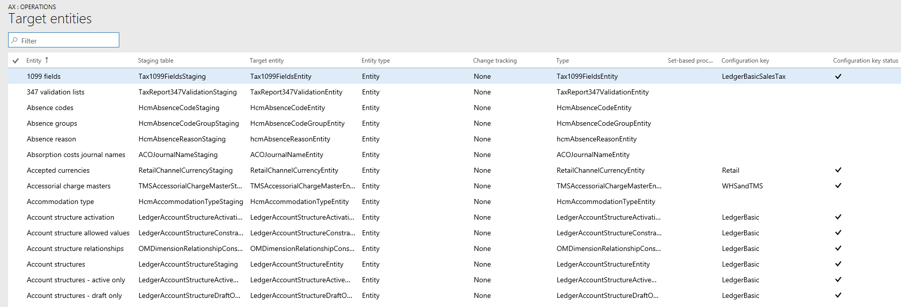

---
# required metadata

title: Configuration keys and data entities
description: This article describes the relationship between configuration keys and data entities.
author: peakerbl
ms.date: 05/10/2019
ms.topic: article
ms.prod: 
ms.technology: 

# optional metadata

# ms.search.form: 
# ROBOTS: 
audience: Application user
# ms.devlang: 
ms.reviewer: sericks
# ms.tgt_pltfrm: 
ms.assetid: 8e214c95-616b-4ee1-b5a4-fa5ce5147f2c
ms.search.region: Global
# ms.search.industry: 
ms.author: peakerbl
ms.search.validFrom: 2018-01-01
ms.dyn365.ops.version: Platform update 13

---

# Configuration keys and data entities

[!include [banner](../includes/banner.md)]

[!INCLUDE [PEAP](../../../includes/peap-3.md)]

Before you use data entities to import or export data, we recommended that you first determine the impact of configuration keys on the data entities that you are planning to use.

To learn more about configuration keys, see the [License codes and configuration keys report](../sysadmin/license-codes-configuration-keys-report.md).

### Configuration key assignments
Configuration keys can be assigned to one or all of the following artifacts.

- Data entities
- Tables used as data sources
- Table fields
- Data entity fields

The following table summarizes how configuration key values on the different artifacts that underlie an object change the expected behavior of the object.

| Configuration key setting on data entity | Configuration key setting on table | Configuration key setting on table field | Configuration key on data entity field | Expected behavior |
|-----------------------------------------|------------------------------------|------------------------------------------|----------------------------------------|------------------|
| Disabled                                | Not evaluated                      | Not evaluated                            | Not evaluated                          | If the configuration key for the data entity is disabled, the data entity will not be functional. It does not matter whether the configuration keys in the underlying tables and fields are enabled or disabled. |
| Enabled                                 | Disabled                           | Not evaluated                            | Not evaluated                          | If the configuration key for a data entity is enabled, the data management framework checks the configuration key on each of the underlying tables. If the configuration key for a table is disabled, that table will not be available in the data entity for functional use. If a table's configuration key is disabled, the table and data entity configuration key settings are not evaluated. If the primary table in the entity has its configuration key disabled, then the system will act as though the entity's configuration key were disabled. |
| Enabled                                 | Enabled                            | Disabled                                 | Not evaluated                          | If the configuration key for a data entity is enabled, and the underlying tables configuration keys are enabled, the data management framework will check the configuration key on of the fields in the tables. If the configuration key for a field is disabled, that field will not be available in the data entity for functional use even if the corresponding data entity field has the configuration key enabled. |
| Enabled                                 | Enabled                            | Enabled                                  | Disabled                               | If the configuration key is enabled at all other levels, but the entity field configuration key is not enabled, then the field will not be available for use in the data entity. |

> [!NOTE]
> If an entity has another entity as a data source then, the above semantics are applied in a recursive manner.

### Entity list refresh
When the entity list is refreshed, the data management framework builds the configuration key metadata for runtime use. This metadata is built using the logic described above. We strongly recommend that you wait for the entity list refresh to complete before using jobs and entities in the data management framework. If you don't wait, the configuration key metadata may not be up to date and could result in unexpected outcomes. When the entity list is being refreshed, the following message is shown in the entity list page.

### Data entity list page
The data entity list page in the Data management workspace shows the configuration key settings for the entities. Start from this page to understand the impact from configuration keys on the data entity.

This information is shown using the metadata that is built during entity refresh. The configuration key column shows the name of the configuration key that is associated with the data entity. If this column is blank it means that there is no configuration key associated with the data entity. The configuration key status column shows the state of the configuration key. If it has a checkmark, it means the key is enabled. If it is blank, it means either the key is disabled or there is no key associated.

### Target fields
The next step is to drill into the data entity to view the impact of configuration keys on tables and fields. The target fields form for a data entity shows configuration key and the key status information for the related tables and fields in the data entity. If the data entity itself has its configuration key disabled, a warning message is shown informing that the tables and fields in the target fields form for this entity will not be available at all regardless of their configuration key status.

### Child entities 
Certain entities have other entities as data sources, or are composite data entities: configuration key information for these entities is shown in the Child entities form. Use this form in the similar way to the entities list page described above. The target fields form for the child entity also behaves like what is described above.

### Using data entities
After understanding the full impact, if any, of configuration keys on the data entities that you would like to use, you can now proceed to using the data entities by adding them to data projects. 

### Run time validations for configuration keys
Using the configuration key metadata built during entity refresh list, run time validations are performed in the following use cases.

- When a data entity is added to a job
- When user clicks 'validate' on the entity list
- When the user loads a data package into a data project
- When the user loads a template into a data project
- When an existing data project is loaded
- When a template is loaded into a data project
- Before the export/import job is executed (batch, non-batch, recurring, OData)
- When the user generates mapping
- When the user maps fields in the mapping UI
- When the user adds only 'importable fields'

### Managing configuration key changes
Anytime that you update configuration keys at the entity, table or field level, the entity list in the data management framework must be refreshed. This process ensures that the framework picks up the latest configuration key settings. Until the entity list is refreshed, the following warning will be shown in the entity list page. The updated configuration key changes will take effect immediately after the entity list is refreshed. We recommend that you validate existing data projects and jobs to make sure that they function as expected after the configuration keys changes are put in effect.

[!INCLUDE[footer-include](../../../includes/footer-banner.md)]
