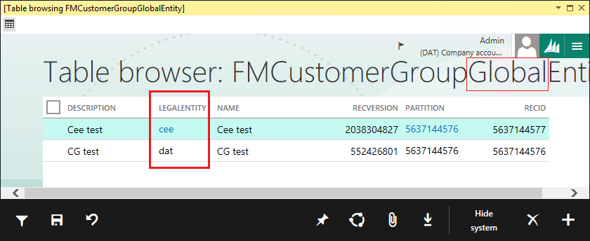

---
# required metadata

title: Cross-company behavior of data entities
description: This article provides information about how data entities interact with the cross-company concept.
author: peakerbl
ms.date: 06/20/2017
ms.topic: article
ms.prod: 
ms.technology: 

# optional metadata

# ms.search.form: 
# ROBOTS: 
audience: Developer
# ms.devlang: 
ms.reviewer: sericks
# ms.tgt_pltfrm: 
ms.assetid: f293d97a-9f70-4c45-91d4-574731892353
ms.search.region: Global
# ms.search.industry: 
ms.author: peakerbl
ms.search.validFrom: 2016-02-28
ms.dyn365.ops.version: AX 7.0.0

---

# Cross-company behavior of data entities

[!include [banner](../includes/banner.md)]


[!INCLUDE [PEAP](../../../includes/peap-1.md)]

This article provides information about how data entities interact with the cross-company concept. To understand this aspect of data entities, you must understand how tables and views apply the cross-company concept. Therefore, this article begins with a brief review of tables and views, and then explains how data entities are related.

## Review of tables and views for cross-company

Each table has a **SaveDataPerCompany** property, and each view has a **AllowCrossCompany** property. The following table describes these two properties.

|      &nbsp;            | Table | View |
|------------------------|-------|------|
| Property name          | SaveDataPerCompany | AllowCrossCompany |
| Relevant CRUD mode     | CUD | R |
| Timing of effect       | Run time, Design time | Run time, mostly. At design time, this setting causes the view to have **dataAreaId** in its list of selected fields. However, the filter for a specific **dataAreaId** value is added later, at run time. |
| Meaning of value = Yes | At design time, the system automatically *adds* a **dataAreaId** field to the table, even though the field isn't displayed in the Application Object Tree (AOT). Every record in the table is tagged with the company (or legal entity) that it belongs to. The system automatically *adds* a filter to the SQL **Where** clause to limit the returned set of rows to one **dataAreaId** value. | At run time, the system does *not* automatically add a filter for **dataAreaId** on the **Where** clause of the SQL **Select** statement that it sends to the underlying Microsoft SQL Server system. Therefore, SQL **Select** statements from the view can return a set of records that contains records for *multiple* companies. |
| Meaning of value = No  | The system does *not* add a **dataAreaId** field to the table. The table is said to be a shared table, because none of its records contain any formal company-specific data. | The system automatically *adds* a filter to the SQL **Where** clause to limit the returned set of rows to one **dataAreaId** value. However, the **AllowCrossCompany** property is ignored if the *root* data source of the view is a shared table. |

## Comparisons within AllowCrossCompany = No
In the following screenshot, the **CustomerList** view has two data sources:

- **Root** – CustTable, which has its **SaveDataPerCompany** property set to **Yes**.
- **Non-root** – DirPartyTable, which has its **SaveDataPerCompany** property set to **No**.

[](./media/root.png)

The **CustomerList** view has its **AllowCrossCompany** property set to **No**, as shown in the following screenshot.

[](./media/crosscomp.png)

Given the preceding information about the **CustomerList** view, the system creates the view in the underlying SQL Server system by generating and then running the following SQL **Create View** statement.

```sql
CREATE VIEW [dbo].[CUSTOMERLIST] 
AS 
       SELECT T1.accountnum AS ACCOUNTNUM, 
              T1.dataareaid AS DATAAREAID,  -- AllowCrossCompany =No caused this line.
              T1.partition  AS PARTITION, 
              T1.recid      AS RECID, 
              T2.partition  AS PARTITION#2, 
              T2.name       AS NAME 
       FROM   custtable T1 
              CROSS JOIN dirpartytable T2 
       WHERE ( T1.party = T2.recid 
              AND ( T1.partition = T2.partition ) ) 
```

### Making DirPartyTable the root data source

[](./media/dirpar.png)

By swapping the positions of the two data source tables in the **CustomerList** view, you make the DirPartyTable table the root data source.

```sql
CREATE VIEW [dbo].[CUSTOMERLISTPARTY] 
AS 
       SELECT T1.name       AS NAME, 
              T1.partition  AS PARTITION, 
              T1.recid      AS RECID, 
              T2.partition  AS PARTITION#2, 
              T2.accountnum AS ACCOUNTNUM 
       FROM   dirpartytable T1 
              CROSS JOIN custtable T2 
       WHERE  ( T2.party = T1.recid 
              AND ( T2.partition = T1.partition ) ) 
go 
```

In this case, the SQL **Create View** statement is the same, except for the following two differences:

- The **FROM** clause mentions DirPartyTable first and CustTable second.
- The **SELECT** column list does *not* include the line for **dataAreaId** (because DirPartyTable has its **SaveDataPerCompany** property set to **No**.)

## Limitations of tables and views
In some cases, the cross-company control features of tables and views aren't as granular control as you might require. Here are the limitations:

- Company or legal entity fields other than the system **dataAreaId** field can’t be recognized or treated automatically in the that way **dataAreaId** can.
- The cross-company behavior for views is too restricted to the properties of the root data source, even when non-root data sources have a **dataAreaId** field.

For example, this might happen if the legal entity information is in **LegalEntityRecId**, or if shared tables don't have a **dataAreaId** column.

## Design time: Setting the PrimaryCompanyContext property
Data entities help you overcome the limitations of tables and view where cross-company functionality is concerned. Data entities have a **PrimaryCompanyContext** property, where you can specify the entity field to use for company identification. This property provides flexibility and granular control in the following ways:

- The field can be from any data source of the entity and isn't limited to fields of the root data source.
- The field can be any field that is extended from the **DataAreaId** extended data type (EDT), and isn't limited to an underlying system **dataAreaId** field.
- You can use the **PrimaryCompanyContext** property even when the entity has only shared tables as its data sources, if this makes sense for your specific situation.

The following screenshot shows the value set for the **PrimaryCompanyContext** property on the **FMCustGroupEntity** entity.

[](./media/prim1.png)

When the **PrimaryCompanyContext** value is set to a non-empty value, the entity can't behave as a shared entity. The **dataAreaId** field is added to the SQL **Create View** statement.

```sql
CREATE VIEW [dbo].[FMCUSTGROUPENTITY] 
AS 
       SELECT T1.custgroup   AS GROUPNAME, 
              T1.description AS DESCRIPTION, 
              T1.dataareaid  AS DATAAREAID,   -- dataAreaId is added. 
              T1.recversion  AS RECVERSION, 
              T1.partition   AS PARTITION, 
              T1.recid       AS RECID 
       FROM   fmcustgroup T1 
```

## Run time: The behavior of data entities for cross company
In the context of X++ code, the cross-company behavior of data entities resembles the behavior of tables. If the **PrimaryCompanyContext** property for an entity has no value and is empty, the entity behaves like a shared table.

### X++ when PrimaryCompanyContext is set

The following table describes the behavior of a data entity under CRUD access when the **PrimaryCompanyContext** property is set to a field value. Both X++ and OData accesses are described.

|  &nbsp;       | X++ | OData |
|-------------|-----|-------|
| Read (R)    | By default, results are *always* filtered by **dataAreaId** = current company, and cross-company data can be fetched by using the **cross company** option. | Results are *not* filtered by **dataAreaId**. The consumer must filter explicitly. |
| Write (CUD) | CUD access to the data entity always occurs in the context of the current company. If cross-company CUD access to the entity is required, use the **changeCompany** keyword. | CUD access to the entity can be accomplished by the consumer for any company by setting the value of the **PrimaryCompanyContext(myDataAreaId)** field. The framework handles the necessary **ChangeCompany** action. |

The following X++ code example accesses **FMCustGroupEntity**, which has its **PrimaryCompanyContext** property set to **dataAreaId**.

[](./media/fmcust.png)

[](./media/snip.png)

### X++ when PrimaryCompanyContext is empty

When the **PrimaryCompanyContext** property is set on the data entity, a **dataAreaId** field is created in the view schema and mapped to the **PrimaryCompanyContext** field. The following table describes the behavior of a data entity under CRUD access when the **PrimaryCompanyContext** property is empty. Both X++ and OData accesses are described.

|     &nbsp;   | X++                                                                                                                              | OData |
|-------------|----------------------------------------------------------------------------------------------------------------------------------|-------|
| Read (R)    | Results aren't filtered, because no system **dataAreaId** field is created on the view schema.                                   | (The same as for R with X++) |
| Write (CUD) | There is no primary company context to set. Therefore, CUD access to the entity is always in the context of the current company. | (The same as for CUD with X++) |

In the current example, the **FMCustomerGroupGlobalEntity** entity has no value assigned to its **PrimaryCompanyContext** property.

[](./media/ent1.png)

However, a **dataAreaId** field from the FMCustGroup table is mapped to the **FMCustomerGroupGlobalEntity** entity as a regular field that is named **LegalEntity**. In this example, the FMCustGroup table is the root data source for **FMCustomerGroupGlobalEntity**. However, we are using this **dataAreaId** field in an informal way that bypasses the automatic mechanisms of the system. All these details are shown in the following screenshot of the **LegalEntity** field.

[](./media/ent2.png)

> [!NOTE]
> Although the terms *legal entity* and *data entity* both use the word *entity*, don't confuse them. Legal entities and data entities are two entirely different concepts. When the **PrimaryCompanyContext** property is empty, the SQL **Create View** statement usually contains no mention of a system **dataAreaId** column. However, in the current example, **dataAreaId** is "half-mentioned" because of the **LegalEntity** regular field on the data entity. This field is shown in the following SQL statement.

```sql
CREATE VIEW [dbo].[FMCUSTOMERGROUPGLOBALENTITY] 
AS 
       SELECT T1.custgroup   AS NAME, 
              T1.description AS DESCRIPTION, 
              T1.dataareaid  AS LEGALENTITY,   -- dataAreadId is named LegalEntity. 
              T1.recversion  AS RECVERSION, 
              T1.partition   AS PARTITION, 
              T1.recid       AS RECID 
       FROM   fmcustgroup T1 
```

### Purpose of this example

This example has two purposes:

- Show shared data by default, even though the backing table might be company-specific.
- Enable the consumer of the data entity to filter on or apply **dataAreaId** if this is required, by using the regular field that is named **LegalEntity**.

### Test data

The following screenshot of the **Table browser** page shows the test data that is in the **FMCustomerGroupGlobalEntity** entity before the X++ test code is run.

[](./media/ent3.png)

### X++ code

Here's how the X++ test code works with the shared entity:

- It accesses the data entity in shared mode for reads.
- It accesses the data entity with one specific company when a new record is created.

[](./media/snip2.png)


[!INCLUDE[footer-include](../../../includes/footer-banner.md)]
