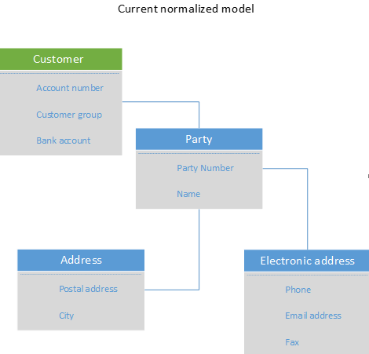
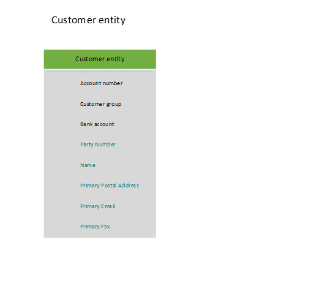
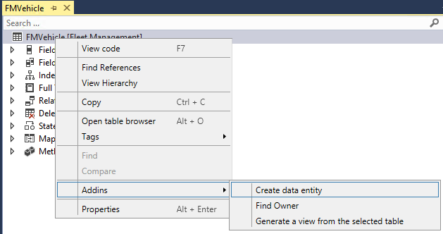

---
# required metadata

title: Data entities overview
description: This article describes data entities, the scenarios that they support, the categories that are used for them, and the methods for creating them.
author: peakerbl
ms.date: 04/28/2023
ms.topic: overview
ms.prod: 
ms.technology: 

# optional metadata

# ms.search.form: 
# ROBOTS: 
audience: Developer
# ms.devlang: 
ms.reviewer: twheeloc
# ms.tgt_pltfrm: 
ms.collection: get-started
ms.assetid: 89ee656f-3a91-42cd-a189-11744cd2415b
ms.search.region: Global
# ms.search.industry: 
ms.author: peakerbl
ms.search.validFrom: 2016-02-28
ms.dyn365.ops.version: AX 7.0.0

---

# Data entities overview

[!include [banner](../includes/banner.md)]

[!INCLUDE [PEAP](../../../includes/peap-3.md)]

This article defines and provides an overview of data entities. It includes information about the capabilities of data entities, the scenarios that they support, the categories that are used for them, and the methods for creating them.

## Overview

A *data entity* is an abstraction from the physical implementation of database tables. For example, in normalized tables, a lot of the data for each customer might be stored in a customer table, and then the rest might be spread across a small set of related tables. In this case, the data entity for the customer concept appears as one de-normalized view, in which each row contains all the data from the customer table and its related tables. A data entity encapsulates a business concept into a format that makes development and integration easier. The abstracted nature of a data entity can simplify application development and customization. Later, the abstraction also insulates application code from the inevitable churn of the physical tables between versions. **To summarize:** Data entity provides conceptual **abstraction** and **encapsulation** (de-normalized view) of underlying table schemas to represent key data concepts and functionalities.

### Capabilities

A data entity has the following capabilities:

- It replaces diverging and fragmented concepts of AXD, Data Import/Export Framework (DIXF) entities, and aggregate queries with single concept.
- It provides a single stack to capture business logic, and to enable scenarios such as import/export, integration, and programmability.
- It becomes the primary mechanism for exporting and importing data packages for Application Lifecycle Management (ALM) and demo data scenarios.
- It can be exposed as OData services, and then used in tabular-style synchronous integration scenarios and Microsoft Office integrations.

### Entity example

A consumer wants to access data that is related to a customer object, but this data is currently scattered across multiple normalized tables, such as DirParty, CustTable, LogisticPostalAddress, and LogisticElectronicAddress. Therefore, the process of reading and writing customer data is very tedious. Instead, the following customer entity can be designed to encapsulate the entire underlying physical schema into a single de-normalized view. This enables simpler read/write operations and also enables abstraction of any internal interaction between the tables.

### Supported scenarios

Data entities support all the following scenarios. Learn more at [Configuration data and data migration in Dynamics 365 implementation projects](/dynamics365/guidance/implementation-guide/data-management-configuration-data-migration).

#### Integration scenarios

##### Synchronous service (OData)

Data entities enable public application programming interfaces (APIs) on entities to be exposed, which enables synchronous services. Synchronous services are used for the following purposes:

- Office integration
- Third-party mobile apps

##### Asynchronous integration

Data entities also support asynchronous integration through a data management pipeline. This enables asynchronous and high-performing data insertion and extraction scenarios. Here are some examples:

- Interactive file-based import/export
- Recurring integrations (file, queue, and so on)

#### Business intelligence

- Aggregate data
- Standardized key performance indicators (KPIs)

#### Application Lifecycle Management

Besides integration and business intelligence (BI) scenarios, data entities also initially support two critical ALM scenarios. The following two progressive levels of an ALM scenario show the scope of coverage by data entities.

##### Configuration data provisioning

A system implementer will use both a guided data collection wizard and bulk data input mechanisms to **bootstrap the initial deployment** (or module) with configuration data through Microsoft Dynamics Lifecycle Services (LCS). Configuration primarily targets to cover the following entity categories:

- All of Parameter
- Reference
- System parameter
- Number sequence
- Currency

##### Data migration from legacy or external systems

After the initial deployment is up and running, the system implementer will **migrate existing data assets of the customer** into the application, especially the following assets:

- Master data (for example, customers and vendors)
- Subsets of documents (for example, sales orders)

## Built-in entities

You can use data entities to import data in Dynamics 365 projects, such as for data migration or integration scenarios. The following list shows some of the entities that are most often used in Dynamics 365 solutions.  

- Accounts receivable  

  - [Customer definitions entity](entity-customer-definitions-customerbase.md)  
  - [Customer details V2 entity](entity-customer-details-v2-na.md)  
  - [Customers V3 entity](entity-customers-v3-customerv3.md)  
  - [Sales order headers V2](entity-sales-order-headers-v2-salesorderheaderv2.md)  
  - [Sales order lines V2](entity-sales-order-lines-v2-salesorderline.md)  
- Accounts payable  

  - [Vendor invoice header entity](entity-vendor-invoice-header-vendorinvoiceheader.md)  
  - [Vendor invoice line entity](entity-vendor-invoice-line-vendorinvoiceline.md)  
  - [Vendor invoice charges entity](entity-vendor-invoice-charges-vendorinvoiceheadercharge.md)  
  - [Vendor invoice line charges entity](entity-vendor-invoice-line-charges-vendorinvoicelinecharge.md)  
  - [Vendor invoice document attachment V2 entity](entity-vendor-invoice-document-attachment-v2-vendorinvoicedocumentattachment.md)  
- Product information management  

  - [Products V2 entity](entity-products-v2-productsv2.md)  
  - [Released products V2 entity](entity-released-products-v2-releasedproductv2.md)  

## Categories of entities

Entities are categorized based on their functions and the type of data that they serve. The following are five categories for data entities.

### Parameter

- Functional or behavioral parameters.
- Required to set up a deployment or a module for a specific build or customer.
- Can include data that is specific to an industry or business. The data can also apply to a broader set of customers.
- Tables that contain only one record, where the columns are values for settings. Examples of such tables exist for Account payable (AP), General ledger (GL), client performance options, workflows, and so on.

### Reference

- Simple reference data, of small quantity, which is required to operate a business process.
- Data that is specific to an industry or a business process.
- Examples include units, dimensions, and tax codes.

### Master

- Data assets of the business. Generally, these are the "nouns" of the business, which typically fall into categories such as people, places, and concepts.
- Complex reference data, of large quantity. Examples include customers, vendors, and projects.

### Document

- Worksheet data that is converted into transactions later.
- Documents that have complex structures, such a several line items for each header record. Examples include sales orders, purchase orders, open balances, and journals.
- The operational data of the business.

### Transaction

- The operational transaction data of the business.
- Posted transactions. These are non idempotent items such as posted invoices and balances. Typically, these items are excluded during a full dataset copy to reduce the volume of data that is copied/migrated. Migrating completed transactions can also lead to further complexity in trying to preserve the referential integrity of related data in the new system. In general, transactions from a completed business process are not migrated in detail but in summary.
- Examples include pending invoices.

## Building an entity
There are multiple ways to create an entity. For example, you can use a wizard, or you can build an entity from a table.

#### Building an entity by using a wizard

The simplest way to build an entity is to use a wizard. This wizard lets you select a root data source and expand to other related data sources, and then select fields for the entity. To start the wizard, add a new item of type **Data entity** to your project. For step-by-step instructions for using the wizard to build an entity, see [Build and consume data entities](build-consuming-data-entities.md). The following table provides information about the properties that you set for an entity in the wizard.

| Property                            | Description |
|-------------------------------------|-------------|
| Primary data source                 | The root data source (table or view) that is used to construct the entity. You can add more related data sources, based on this root data source. |
| Data entity name                    | The name of the entity. |
| Entity category                     | The type of entity. Entity categories are similar to table groups for tables. The available categories include **Parameter**, **Reference**, **Master**, **Document**, and **Transaction**. |
| Public entity name                  | The public resource name for the entity. |
| Public collection name              | The public resource set name. |
| Enable public API                   | Select this option to enable the entity for OData services. |
| Enable data management capabilities | Select this option to enable the entity for asynchronous integrations such as data import/export and connector integration. |
| Staging table                       | The name of the staging table that will be generated for the entity. The staging table is used in asynchronous integrations and high-volume scenarios. |

##### Adding data sources

When you build an entity, you start with a root data source. However, you can add additional data sources. You can either manually add new data sources, or select a surrogate foreign key field in the root data source to automatically expand the required data sources.

##### Output

When you complete the wizard, it produces the following items:

- Data entity
- Staging table (optional, if data management was enabled)

#### Building an entity from a table

You can quickly create an entity from a table, and then customize the properties, data sources, and fields later. Right-click the table, and then select **Addins** &gt; **Create data entity**.

## Entity list refresh
Entities in an environment must be refreshed using the following guidelines.

-   When a new environment is deployed and the user navigates to the data management workspace, entity list refresh starts automatically.
-   When code packages are deployed to an environment where data management has already been used, entity list refresh must be manually started from **Data management > Framework parameters > Entity settings > Refresh entity list**.
-   When configuration keys are modified, entity list must be refreshed manually from **Data management > Framework parameters > Entity settings > Refresh entity list**.

Refreshing the entity list ensures all entities are available in the environment and that the entities have the latest metadata.

## Configuration keys and data entities
Before you use data entities to import or export data, we recommended that you first determine the impact of configuration keys on the data entities that you are planning to use.

To learn more about configuration keys, see the [License codes and configuration keys report](../sysadmin/license-codes-configuration-keys-report.md).

### Configuration key assignments
Configuration keys can be assigned to one or all of the following artifacts.

- Data entities
- Tables used as data sources
- Table fields
- Data entity fields

The following table summarizes how configuration key values, on the different artifacts that underlie an object, change the expected behavior of the object.

| Configuration key setting on data entity | Configuration key setting on table | Configuration key setting on table field | Configuration key on data entity field | Expected behavior |
|------------------------------------------|------------------------------------|------------------------------------------|----------------------------------------|------------------|
| Disabled                                 | Not evaluated                      | Not evaluated                            | Not evaluated                          | If the configuration key for the data entity is disabled, the data entity will not be functional. It does not matter whether the configuration keys in the underlying tables and fields are enabled or disabled. |
| Enabled                                  | Disabled                           | Not evaluated                            | Not evaluated                          | If the configuration key for a data entity is enabled, the data management framework checks the configuration key on each of the underlying tables. If the configuration key for a table is disabled, that table will not be available in the data entity for functional use. If a table's configuration key is disabled, the table and data entity configuration key settings are not evaluated. If the primary table in the entity has its configuration key disabled, then the system will act as though the entity’s configuration key were disabled. |
| Enabled                                  | Enabled                            | Disabled                                 | Not evaluated                          | If the configuration key for a data entity is enabled, and the underlying tables configuration keys are enabled, the data management framework will check the configuration key on the fields in the tables. If the configuration key for a field is disabled, that field will not be available in the data entity for functional use even if the corresponding data entity field has the configuration key enabled. |
| Enabled                                  | Enabled                            | Enabled                                  | Disabled                               | If the configuration key is enabled at all other levels, but the entity field configuration key is not enabled, then the field will not be available for use in the data entity. |

> [!NOTE]
> If an entity has another entity as a data source, then the above semantics are applied in a recursive manner.

### Entity list refresh
When the entity list is refreshed, the data management framework builds the configuration key metadata for runtime use. This metadata is built using the logic described above. We strongly recommend that you wait for the entity list refresh to complete before using jobs and entities in the data management framework. If you don't wait, the configuration key metadata may not be up to date and could result in unexpected outcomes. When the entity list is being refreshed, the following message is shown in the entity list page.

### Data entity list page
The data entity list page in the **Data management** workspace shows the configuration key settings for the entities. Start from this page to understand the impact of configuration keys on the data entity.

This information is shown using the metadata that is built during entity refresh. The configuration key column shows the name of the configuration key that is associated with the data entity. If this column is blank it means that there is no configuration key associated with the data entity. The configuration key status column shows the state of the configuration key. If it has a checkmark, it means the key is enabled. If it is blank, it means either the key is disabled or there is no key associated.

### Target fields
The next step is to drill into the data entity to view the impact of configuration keys on tables and fields. The target fields form for a data entity shows the configuration key and the key status information for the related tables and fields in the data entity. If the data entity itself has its configuration key disabled, a warning message is shown informing that the tables and fields in the target fields form for this entity will not be available, regardless of their configuration key status.

### Child entities 
Certain entities have other entities as data sources, or are composite data entities: configuration key information for these entities is shown in the **Child entities** form. Use this form in the similar way to the entities list page described above. The target fields form for the child entity also behaves like what is described above.

### Run time validations for configuration keys
Using the configuration key metadata built during entity refresh list, run time validations are performed in the following use cases.

- When a data entity is added to a job.
- When user clicks **Validate** on the entity list.
- When the user loads a data package into a data project.
- When the user loads a template into a data project.
- When an existing data project is loaded.
- When a template is loaded into a data project.
- Before the export/import job is executed (batch, non-batch, recurring, OData).
- When the user generates mapping.
- When the user maps fields in the mapping UI.
- When the user adds only 'importable fields'.

### Managing configuration key changes
Anytime that you update configuration keys at the entity, table, or field level, the entity list in the data management framework must be refreshed. This process ensures that the framework picks up the latest configuration key settings. Until the entity list is refreshed, the following warning will be shown in the entity list page. The updated configuration key changes will take effect immediately after the entity list is refreshed. We recommend that you validate existing data projects and jobs to make sure that they function as expected after the configuration keys changes are put in effect.

[!INCLUDE[footer-include](../../../includes/footer-banner.md)]
