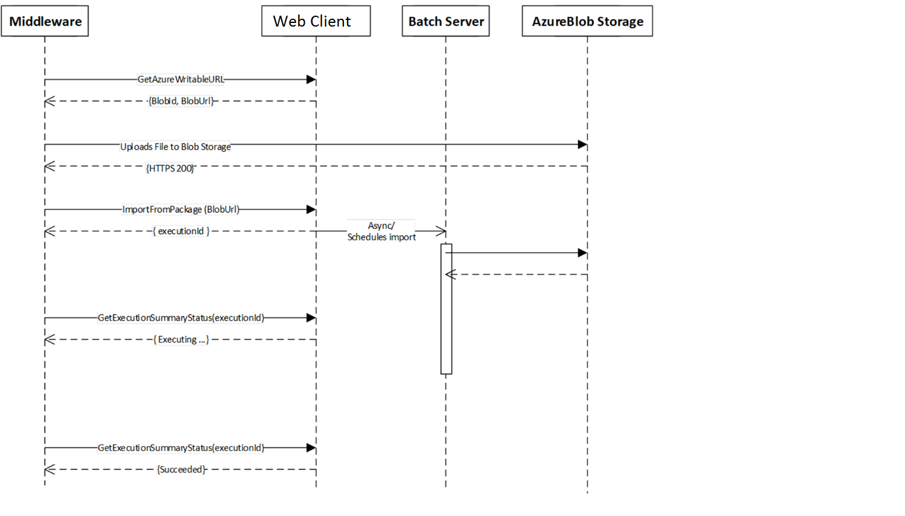

---
# required metadata

title: Data management package REST API
description: This article describes the Data management framework's package REST API.
author: peakerbl
ms.date: 11/04/2022
ms.topic: article
ms.prod: 
ms.technology: 

# optional metadata

# ms.search.form: 
# ROBOTS: 
audience: Developer
# ms.devlang: 
ms.reviewer: sericks
# ms.tgt_pltfrm: 
ms.search.region: Global
# ms.search.industry: 
ms.author: peakerbl
ms.search.validFrom: 2017-03-31
ms.dyn365.ops.version: Platform update 5

---

# Data management package REST API

[!include [banner](../includes/banner.md)]

This article describes the Data management framework's package representational state transfer (REST) application programming interface (API). The package API lets you integrate by using data packages. The REST API can be used with both cloud deployments and on-premises deployments. 

Although on-premises support has been added, API names haven't been changed. Therefore, Microsoft can keep a single API set for both cloud deployments and on-premises deployments.

## Choosing an integration API

Two APIs support file-based integration scenarios: the Data management framework's package API and the recurring integrations API. Both APIs support both data import scenarios and data export scenarios. The following table describes the main decision points that you should consider when you're trying to decide which API to use.

| Decision point      | Recurring integrations API | Data management framework's package API |
|---------------------|--------------------------------------|-----------------------------|
| Scheduling          | Scheduling in finance and operations apps | Scheduling outside finance and operations apps |
| Format              | Files and data packages | Only data packages |
| Transformation      | Support for Extensible Stylesheet Language Transformations (XSLT) if the data file is in XML format | Transformations that are external to the system |
| Supported protocols | SOAP and REST | REST |
| Service type        | Custom service | Open Data Protocol (OData) action |

If you decide that the recurring integrations API meets your requirement better than the Data management framework's package API, see [Recurring integrations](recurring-integrations.md). The rest of this article discusses the Data management framework's package API.

## Authorization

The Data management framework's package API uses OAuth 2.0 to authorize access. The API must be called by using a valid OAuth access token. For more information about OAuth 2.0 and Microsoft Azure Active Directory (Azure AD), see [Authorize access to web applications using OAuth 2.0 and Azure Active Directory](/azure/active-directory/develop/active-directory-protocols-oauth-code). For on-premises deployments, Active Directory Federation Services (AD FS) is used for authorization.

> [!NOTE]
> When you use the Client Credentials Grant flow, the application maintains an access control list. You can find the access control list at **System administration** \> **Setup** \> **Azure Active Directory applications**. The **Azure Active Directory applications** page shows the approved client IDs and the user security mapping that should be enforced when the API is called by using the Client Credentials Grant flow.
>
> For on-premises deployments, this list must have a valid client ID from AD FS. Additionally, for on-premises use, **\<baseurl\>** in the following examples must append **/namespaces/AXSF** when a connection is made.

## Import APIs

The following APIs are used to import files (data packages).

### GetImportStagingErrorFileUrl

The GetImportStagingErrorFileUrl API is used to get the URL of the error file containing the input records that failed at the source to the staging step of import for a single entity. An empty string is returned if no error file is generated.

POST /data/DataManagementDefinitionGroups/Microsoft.Dynamics.DataEntities.GetImportStagingErrorFileUrl

```json
Body
{
	"executionId":"<string>",
	"entityName":"<string>"
}

Successful Response:

HTTP/1.1 200 OK
{
	"@odata.context":"https://<baseurl>/data/$metadata#Edm.String",
	"value":"<errorfileurl>"
}
```

**Input parameters**

| Parameter     | Description |
|---------------------|--------------------------------------|
| string executionId          | Execution ID of import. This is called as Job ID in the UI. |
| string entityName        | Name of the entity for which to get the error file. |


**Output parameters**

| Parameter         | Description |
|-------------------|-------------|
| string errorkeysfileurl | The URL of the error file. The return value is empty if an error file was not generated. |


### GenerateImportTargetErrorKeysFile

The GenerateImportTargetErrorKeysFile API is used to generate an error file containing the keys of the import records that failed at the staging to target step of import for a single entity.  

If this API returns true, then use the GetImportTargetErrorKeysFileUrl API to get the URL of the generated error keys file.


POST /data/DataManagementDefinitionGroups/Microsoft.Dynamics.DataEntities.GenerateImportTargetErrorKeysFile

```json
Body

{
	"executionId":"<string>",
	"entityName":"<string>"
}

Successful Response:

HTTP/1.1 200 OK
{
	"@odata.context":"https://<baseurl>/data/$metadata#Edm.Boolean",
	"value": <errorsExist>
}
```

**Input parameters**

| Parameter     | Description |
|---------------------|--------------------------------------|
| string executionId          | Execution ID of import |
| string entityName        | Name of the entity for which to get the error file |

**Output parameters**

| Parameter     | Description |
|---------------------|--------------------------------------|
| Boolean errorsExist     | true if there are import errors; false if there are no errors |

### GetImportTargetErrorKeysFileUrl

The **GetImportTargetErrorKeysFileUrl** API is used to get the URL of the error file that contains the keys of the import records that failed at the staging-to-target step of import for a single entity.

If the error file is available, this API returns the URL. If the error file is still being generated, or if there is no error file, the API returns an empty string.

> [!IMPORTANT] 
> Before you call this API, call the **GenerateImportTargetErrorKeysFile** API to generate the error file. If the **GenerateImportTargetErrorKeysFile** API returns **true**, call this API in a loop until it returns a non-empty string. If the **GenerateImportTargetErrorKeysFile** API returns **false**, this API will always return an empty string, because there are no errors.

**Pseudocode example**

```csharp
errorsExist = GenerateImportTargetErrorKeysFile(executionId, entityName)

if (errorsExist)
{
    errorFileUrl = null

    while (errorFileUrl is not a non-empty string)
    {
        errorFileUrl = GetImportTargetErrorKeysFileUrl(executionId, entityName)
        if (errorFileUrl is not a non-empty string)
        {
            wait for some time before retrying
        }
    }
}
```

```csharp
POST
/data/DataManagementDefinitionGroups/Microsoft.Dynamics.DataEntities.GetImportTargetErrorKeysFileUrl

Body
{
    "executionId":"<string>",
    "entityName":"<string>"
}
```

Here is an example of a successful response.

```json
HTTP/1.1 200 OK
{
    "@odata.context":"https://<baseurl>/data/$metadata#Edm.String",
    "value":"<errorkeysfileurl>"
}
```

**Input parameters**

| Parameter         | Description |
|-------------------|-------------|
| string executionId | The execution ID of the import. This is called as Job ID in the UI.|
| string entityName | The name of the entity to get the error file for. |

**Output parameters**

| Parameter         | Description |
|-------------------|-------------|
| string errorkeysfileurl | The URL of the error keys file, if the file is available. If the error file is still being generated, or if no errors exist, the method returns an empty string. |


### GetAzureWriteUrl

The **GetAzureWriteUrl** API is used to get a writable blob URL. The method includes a shared access signature (SAS) token that is embedded in the URL. You can use this method to upload a data package to the Azure Blob storage container. For on-premises deployments, this API will still return the URL that has been abstracted to local storage.

> [!NOTE]
> An SAS is valid only during an expiry time window. Any request that is issued after the window has passed returns an error. For more information, see [Using shared access signatures (SAS)](/azure/storage/common/storage-dotnet-shared-access-signature-part-1).

```csharp
POST /data/DataManagementDefinitionGroups/Microsoft.Dynamics.DataEntities.GetAzureWriteUrl
BODY
{
    "uniqueFileName":"<string>"
}
```

Here is an example of a successful response.

```json
HTTP/1.1 200 OK
{
    "@odata.context":"https://<baseurl>/data/$metadata#Edm.String",
    "value": "{\"BlobId\":\"{<GUID>}\",\"BlobUrl\":\"https://<baseurl_id>.blob.core.windows.net/dmf/<uniqueFileName>?<SAS Token>\"}"
    }
}
```

**Input parameters**

| Parameter         | Description |
|-------------------|-------------|
| string uniqueFileName | A unique file name that is used to track blob IDs. You can include a globally unique identifier (GUID) to help guarantee a unique file name. |

**Output parameters**

| Parameter      | Description |
|----------------|-------------|
| string BlobId  | The blob ID of the allocated blob container. |
| string BlobUrl | A URL that has an embedded SAS token. The URL can be used to write to Blob storage. |

### ImportFromPackage

The **ImportFromPackage** API is used to initiate an import from the data package that is uploaded to the Blob storage that is associated with your implementation. For on-premises deployments, the import will be initiated from the local storage that the file was uploaded previously to.

There is an async version of this API **ImportFromPackageAsync**. The specifications are the same. It will be required to capture the execution id returned and the later call the **GetExecutionSummaryStatus** API to determine when the execution has completed.   

> [!NOTE]
> The **ImportFromPackage** API supports composite entities. However, the limitation is that there can be only one composite entity in a package.

```csharp
POST /data/DataManagementDefinitionGroups/Microsoft.Dynamics.DataEntities.ImportFromPackage
BODY
{
    "packageUrl":"<string>",
    "definitionGroupId":"<string>",
    "executionId":"<string>",
    "execute":<bool>,
    "overwrite":<bool>,
    "legalEntityId":"<string>"
}
```

Here is an example of a successful response.

```json
HTTP/1.1 200 OK
{
    "@odata.context":"https://<baseurl>/data/$metadata#Edm.String",
    "value":"<executionId>"
}
```

**Input parameters**

| Parameter                | Description |
|--------------------------|-------------|
| string packageUrl        | The URL of the data package in the Blob storage that is associated with a finance and operations app. |
| string definitionGroupId | The name of the data project for import. |
| string executionId       | The ID to use for the job. This is called as Job ID in the UI. If an empty ID is assigned, a new execution ID will be created. |
| bool execute             | Set this parameter to **True** to run the target step. Otherwise, set it to **False**. |
| bool overwrite           | This parameter must always be set to **False** when a composite entity is used in a package. Otherwise, set it to **True**. |
| string legalEntityId     | The legal entity for the data import. |

**Output parameters**

| Parameter          | Description |
|--------------------|-------------|
| string executionId | The execution ID of the data import. This is called as Job ID in the UI. |

> [!NOTE]
> **ImportFromPackage()** uses a batch to perform the import. Therefore, parallel processing rules must be used in Data management to perform parallel imports. **ImportFromPackage()** must not be called in parallel threads. Otherwise, it will fail.

## Export APIs

The following APIs are used to export files (data packages).

### ExportToPackagePreview 

The **ExportToPackagePreview** API is used to preview an export of a data package with a large number of records. This API is applicable to both cloud deployments and on-premises deployments.

There is an async version of this API **ImportFromPackagePreviewAsync**. The specifications are the same. It will be required to capture the execution id returned and the later call the **GetExecutionSummaryStatus** API to determine when the execution has completed.  

- The export data project must be created before you call this API. If the project doesn't exist, a call to the API returns an error.
- If change tracking has been turned on, only records that have been created or updated since the last run are exported. (In other words, only the delta is returned.)
- The number of records returned can limited using the **count** parameter.

```csharp
POST /data/DataManagementDefinitionGroups/Microsoft.Dynamics.DataEntities.ExportToPackagePreview
BODY
{
    "definitionGroupId":"<Data project name>",
    "packageName":"<Name to use for downloaded file.>",
    "executionId":"<Execution Id if it is a rerun>",
    "reExecute":<bool>,
    "legalEntityId":"<Legal entity Id>",
    "count":"<Legal entity Id>"
}
```

Here is an example of a successful response.

```json
HTTP/1.1 200 OK
{
    "@odata.context":"https://<baseurl>/data/$metadata#Edm.String",
    "value":{
        "value":"<executionId>"
    }
}
```

**Input parameters**

| Parameter                | Description |
|--------------------------|-------------|
| string definitionGroupId | The name of the data project for export. |
| string packageName       | The name of the exported data package. |
| string executionId       | The ID to use for the job. This is called as Job ID in the UI. If an empty ID is assigned, a new execution ID will be created. |
| bool reExecute           | Set this parameter to **True** to run the target step. Otherwise, set it to **False**. |
| string legalEntityId     | The legal entity for the data import. |
| count                    | The number of records to return. No top count condition will be applied if set to zero. |
	
**Output parameters**

| Parameter          | Description |
|--------------------|-------------|
| string executionId | The execution ID of the data export. This is called as Job ID in the UI. |

### ExportToPackage

The **ExportToPackage** API is used to initiate an export of a data package. This API is applicable to both cloud deployments and on-premises deployments.

There is an async version of this API **ExportToPackageAsync**. The specifications are the same. It will be required to capture the execution id returned and the later call the **GetExecutionSummaryStatus** API to determine when the execution has completed. 

- The export data project must be created before you call this API. If the project doesn't exist, a call to the API returns an error.
- If change tracking has been turned on, only records that have been created or updated since the last run are exported. (In other words, only the delta is returned.)

```csharp
POST /data/DataManagementDefinitionGroups/Microsoft.Dynamics.DataEntities.ExportToPackage
BODY
{
    "definitionGroupId":"<Data project name>",
    "packageName":"<Name to use for downloaded file.>",
    "executionId":"<Execution Id if it is a rerun>",
    "reExecute":<bool>,
    "legalEntityId":"<Legal entity Id>"
}
```

Here is an example of a successful response.

```json
HTTP/1.1 200 OK
{
    "@odata.context":"https://<baseurl>/data/$metadata#Edm.String",
    "value":{
        "value":"<executionId>"
    }
}
```

**Input parameters**

| Parameter                | Description |
|--------------------------|-------------|
| string definitionGroupId | The name of the data project for export. |
| string packageName       | The name of the exported data package. |
| string executionId       | The ID to use for the job. This is called as Job ID in the UI. If an empty ID is assigned, a new execution ID will be created. |
| bool reExecute           | Set this parameter to **True** to run the target step. Otherwise, set it to **False**. |
| string legalEntityId     | The legal entity for the data import. |
	
**Output parameters**

| Parameter          | Description |
|--------------------|-------------|
| string executionId | The execution ID of the data export. This is called as Job ID in the UI. |


### GetExportedPackageUrl

The **GetExportedPackageUrl** API is used to get the URL of the data package that was exported by a call to **ExportToPackage**. This API is applicable to both cloud deployments and on-premises deployments.

```csharp
POST /data/DataManagementDefinitionGroups/Microsoft.Dynamics.DataEntities.GetExportedPackageUrl
BODY
{"executionId":"<Execution Id>"}
```

Here is an example of a successful response.

```json
HTTP/1.1 200 OK
{
    "@odata.context":"https://<baseurl>/data/$metadata#Edm.String",
    "value":{
        "value":"https://<baseurl_id>.blob.core.windows.net/dmf/<uniqueFileName>?<SAS Token>"
    }
}
```

**Input parameters**

| Parameter          | Description |
|--------------------|-------------|
| string executionId | The execution ID of the data project run. This is called as Job ID in the UI. |

**Output parameters**

| Parameter      | Description |
|----------------|-------------|
| string BlobUrl | A blob URL that has an embedded SAS token. The URL can be used to download the exported data package. |

## Status check API	

The following APIs are used to check status. They are used during both import flows and export flows.

### GetExecutionSummaryStatus

The **GetExecutionSummaryStatus** API is used for both import jobs and export jobs. It's used to check the status of a data project execution job. This API is applicable to both cloud deployments and on-premises deployments. 

> [!NOTE]
> The package needs to be created for the API to return the final execution status, such as *Succeeded*.

```csharp
POST /data/DataManagementDefinitionGroups/Microsoft.Dynamics.DataEntities.GetExecutionSummaryStatus
BODY
{"executionId":"<executionId>"}
```

Here is an example of a successful response.

```json
HTTP/1.1 200 OK
{
    "@odata.context":"https://<baseurl>/data/$metadata#Edm.String",
    "value":"<executionStatus>"
}
```

**Input parameters**

| Parameter          | Description |
|--------------------|-------------|
| string executionId | The execution ID of the data project run. This is called as Job ID in the UI. |

**Output parameters**

<table>
<thead>
<tr>
<th>Parameter</th>
<th>Description</th>
</tr>
</thead>
<tbody>
<tr>
<td>DMFExecutionSummaryStatus executionStatus</td>
<td>The execution status. Here are the possible values:
<ul>
<li>Unknown</li>
<li>NotRun</li>
<li>Executing</li>
<li>Succeeded</li>
<li>PartiallySucceeded</li>
<li>Failed</li>
<li>Canceled</li>
</ul>
</td>
</tr>
</tbody>
</table>

> [!NOTE]
> The file in Blob storage will remain there for seven days. It will then be automatically deleted.

## Getting the list of errors
GetExecutionErrors can be used to get the list of errors in a job execution. The API takes the Execution ID as the parameter, and returns a set of error messages in a JSON list.

```json
POST /data/DataManagementDefinitionGroups/Microsoft.Dynamics.DataEntities.GetExecutionErrors
BODY
{"executionId":"<executionId>"}
```

## Import and export processes

The following illustration shows how the Data management package methods can be used to import data packages.



The following illustration shows how the Data management package methods can be used to export data packages.


A sample console application that showcases the data import and data export methods is available on GitHub. For more information, go to <https://github.com/Microsoft/Dynamics-AX-Integration/tree/master/FileBasedIntegrationSamples/ConsoleAppSamples>.


[!INCLUDE[footer-include](../../../includes/footer-banner.md)]

