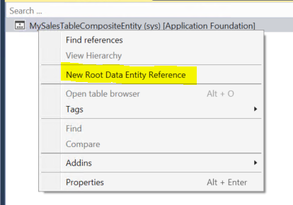
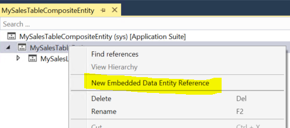
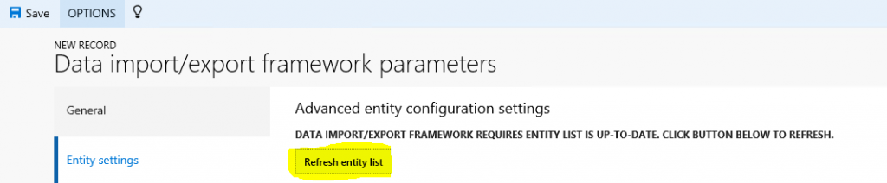

---
# required metadata

title: Develop composite data entities
description: A composite entity is a concept that allows you to build a single entity by leveraging multiple entities that are related to each other. 
author: peakerbl
ms.date: 03/27/2020
ms.topic: article
ms.prod: 
ms.technology: 

# optional metadata

# ms.search.form: 
# ROBOTS: 
audience: Developer
# ms.devlang: 
ms.reviewer: sericks
# ms.tgt_pltfrm: 
ms.assetid: 1cb19868-cbfd-4f45-bc47-39b9f303583d
ms.search.region: Global
# ms.search.industry: 
ms.author: peakerbl
ms.search.validFrom: 2016-02-28
ms.dyn365.ops.version: AX 7.0.0

---

# Develop composite data entities

[!include [banner](../includes/banner.md)]

A composite entity is a concept that allows you to build a single entity by leveraging multiple entities that are related to each other.

## What is a composite entity?

Composite entity is concept that allows you to build a single entity by leveraging multiple entities that are related to each other. The concept is heavily used in scenarios where an entity can be represented as a single document, like Sales header/line, Invoice header/line and Vendor Catalog. This concept is applicable in asynchronous integration scenarios rather than synchronous OData scenarios, and it will only be supported from a data management platform. There is no programmatic interface for composite entities in X++. It is only supported for a data management platform that is part of XML file-based imports/exports.

## Example
Sales Header and Sales Line are two different entities in the system. In case the customer requirement suggests that header and lines are part of a single document, then these two entities can be merged as a composite entity. Sample sales order entity: The composite entity (MySalesTableCompositeEntity) represents a sales orders document which is comprised of Sales Order header entity (MySalesTableEntity) and Sales Order Line entity (MySalesTableLineEntity).

[](./media/developingcompositeentities-17.png)

Based on the linked entities, these entities can be exposed as an XML document with embedded element tags for entities. XML is the only way to expose a composite entity in data management.

```xml
<?xml version="1.0" encoding="utf-8"?>
<Document>

<MySalesTableEntity SalesID="SO1" CurrencyCode="USD" CustAccount="Acc001">
<MySalesLineEntity SalesPrice="2.00" QtyOrdered="10.00" LineAmount="20.00" ItemId="1000" LineNum="1.00" SalesID="SO1"/>
<MySalesLineEntity SalesPrice="2.00" QtyOrdered="10.00" LineAmount="20.00" ItemId="4401" LineNum="2.00" SalesID="SO1"/>
</MySalesTableEntity>

<MySalesTableEntity SalesID="SO2" CurrencyCode="USD" CustAccount="Acc002">
<MySalesLineEntity SalesPrice="2.00" QtyOrdered="10.00" LineAmount="20.00" ItemId="4402" LineNum="1.00" SalesID="SO2"/>
</MySalesTableEntity>

</Document>
```

Each node in the XML represents attributes from an individual entity. For example - &lt;MySalesTableEntity SalesID="SO1" CurrencyCode="USD" CustAccount="Acc001"&gt; SalesId, CurrencyCode and CustAccount are attributes from MySalesTableEntity.

## Building the composite entity
There is a node for composite data entities under Data model. Let's take the example of MySalesTableEntity.

### Step 1: Identify and create the individual entities for the composite entity

Make sure that the entities are related to each other. In this example the individual entities are MySalesTableEntity and MySalesLineEntity.

### Step 2: Add relations between individual entities

Add a relation to parent entity in the relations node. Example – MySalesLineEntity has relationship to MySalesTableEntity.

[](./media/developingcompositeentities-18.png)

### Step 3: Create a new composite entity

1. Add a new **Dynamics 365** artifact item of type **Composite entity** to the project.
2. In designer mode, right-click the entity and select **New Root Data Entity Reference**.

    [](./media/developingcompositeentities-2.png)

3. Set the data entity to parent data entity. In this case its MySalesTableEntity.
4. Right-click the parent entity node and select **New Embedded Data Entity Reference**.

    [](./media/developingcompositeentities-3.png)

5. Set the embedded data entity as the child entity. In this case it is MySalesLineEntity.
6. Set the **Relation** property from the drop-down list on the embedded data entity properties.

    [](./media/developingcompositeentities-4.png)

7. Composite entity supports multi-level child entities.

### Step 4: Create relationships between staging tables

You need to create relationships between the parent and child entity staging tables based on the natural keys. For example, staging tables for MySalesTable and MySalesLine are linked by SalesID, DefinitionGroup, and ExecutionId.

1. Add a foreign key relation on MySalesLineStaging table.

    [](./media/developingcompositeentities-5.png)

2. Add two columns, RowId and ParentRowId (type int), on all the staging tables associated with the composite data entity. Refer to SysCompositeHeaderStaging table for the columns properties.

    [](./media/developingcompositeentities-7.png)

These columns are used to define runtime relationships during the target data movement.

- Create a cluster index on the staging tables which includes RowId, ParentRowid,DefinitionGroup, and ExecutionId. This is for performance reasons.
- Compile and synchronize the artifacts.

### Step 5: Set up the metadata for DMFEntity

For local testing the composite entity metadata needs to be refreshed.

1. Go to **DIXF Parameters &gt; Entity settings**. Click **Refresh entity list**.

    [](./media/developingcompositeentities-8.png)

2. Alternately, you can write the following job to refresh the composite entity list metadata.

    ```xpp
    DMFDataPopulation::refreshCompositeEntityList();
    ```

3. Execute the job. This refreshes the metadata required for the entity lookup.

> [!NOTE]
> Currently this is a workaround. In the future a feature will be enabled to refresh the list at compile/sync time.

### Step 6: Test the entity locally

We recommend that you import and export the data as a normal entity from DIXF standard process. Refer to the following the steps for importing and exporting entity.

> [!NOTE]
> The source types of XML-Attribute or XML-Element are supported for composite entity. In entity execution parameters, composite entities cannot be imported in parallel using the parallel processing settings.

## Import a composite entity
1. Click **Import**.
2. Enter **Name**, **Source data format**, and **Entity name**.
3. The **Source data format** is either xml-attribute or xml-element.
4. Click **Import now**.
5. The number of records created/updated/pending are shown.

## Export a composite entity
1. Click **Export**.
2. Enter **Name**, **Source data format**, **and Entity name**.
3. Click **Add entity** and **Export now**.
4. Click **Download package**.

## General troubleshooting guidelines
- Issue: The exported composite XML file is not imported. The scenario that produces this is:

    - Export a file for composite entity.
    - Import the same file.
    - Mapping fails and the file is not imported.

- Root cause:

    - Check if the exported file has lines or related child entity information.
    - If there no lines or related child entity information, then the lines will not be mapped during import.

- Resolution:

    - Create a sample file with all of the child entities.
    - Use this file for initial mapping only.
    - When the mapping is successful, import the actual file which does not have the line data into the entity. Use reimport or upload a new file.
    - This should import files with partial data (blank child records), depending on the validity of the records.


[!INCLUDE[footer-include](../../../includes/footer-banner.md)]
