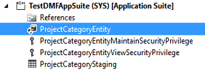
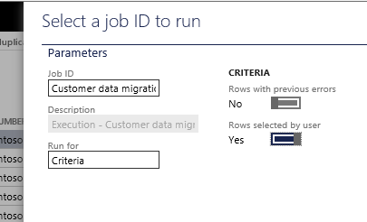

---
# required metadata

title: Develop entities for data migration
description: This tutorial shows how to develop data entities in Microsoft Visual Studio and then use them for data migration.
author: peakerbl
ms.date: 10/14/2019
ms.topic: article
ms.prod: 
ms.technology: 

# optional metadata

# ms.search.form: 
# ROBOTS: 
audience: Developer
# ms.devlang: 
ms.reviewer: sericks
# ms.tgt_pltfrm: 
ms.assetid: ebe9c79a-029d-4f03-9bd8-d17e805baa89
ms.search.region: Global
# ms.search.industry: 
ms.author: peakerbl
ms.search.validFrom: 2016-02-28
ms.dyn365.ops.version: AX 7.0.0

---

# Develop entities for data migration

[!include [banner](../includes/banner.md)]

This tutorial shows how to develop data entities in Microsoft Visual Studio and then use them for data migration.

This tutorial is broken out into two sections and four exercises. In the first section, you will build a **Project Category** entity in Visual Studio. You will then use this entity to export data. In the second section, you will use **Customer Groups** and **Customers** entities to import multiple sets of files by using the new Data Import/Export Framework.

> [!NOTE]
> This tutorial is designed to be slightly more challenging than [Build and consume data entities](build-consuming-data-entities.md). Instead of providing a step-by-step guide, it has scenario exercises and describes the expected outcomes. The assumption is that you've already familiarized yourself with entities.

## Prerequisites
This tutorial requires that you access the environment by using Remote Desktop. You must be provisioned as an administrator on the instance.

## Base URL
Throughout this tutorial, "base URL" refers to the base URL of the instance.

- In the cloud environment, you obtain the base URL from Microsoft Dynamics Lifecycle Services (LCS).
- On a local virtual machine (VM), the base URL is `https://usnconeboxax1aos.cloud.onebox.dynamics.com`.

## Developing an entity in Visual Studio and enabling it for data export
### Business problem

You're developing a new solution for a Project module. As part of your implementation, you must represent the data from project categories, so that this data can be imported into the system or exported from it. To accomplish this goal, you will first build an entity for the project category and then use the export functionality to test data extraction.

### Exercise 1: Build a Project Category entity

In this exercise, you will build an entity, **Project Category**, that uses the ProjCategory table as its primary data source. This entity has the following properties.

| Property               | Value                 |
|------------------------|-----------------------|
| Entity AOT name        | ProjectCategoryEntity |
| Label                  | Project Categories    |
| Entity category        | Reference             |
| Public name            | ProjectCategory       |
| Collection name        | ProjectCategories     |
| Enable public API      | Yes                   |
| Enable data management | Yes                   |

The entity also has the following fields:

- ActiveInJournals
- CategoryGroup
- Category
- TransactionType
- CategoryName
- Worker
- CustomerPaymentRetention
- IndirectCostComponent
- ItemSalesTaxGroup
- ServiceCode
- Absence

#### Steps

1. In Visual Studio, create a new application project.
2. In Solution Explorer, select the project, and then right-click **Properties**.
3. Specify the following project properties, and then click **OK**.

    | Property                      | Value             |
    |-------------------------------|-------------------|
    | Model                         | Application Suite |
    | Company                       | USSI              |
    | Synchronize Database on build | True              |

4. From the project, right-click **Add** &gt; **New item**.
5. Select **Data Model** &gt; **Data Entity** as your new item.
6. Enter a name, and then click **Add** to start the **Data** **Entity** wizard.
7. On the first page of the wizard, specify the set of properties for the entity by using the table earlier in this exercise. Then click **Next**.

    

8. On the next page, add fields from the primary data source. Make sure that each field name reflects the public contract (see the table earlier in this exercise). To use the field's label as the field name, select the **Convert label to field names** option. Clear the option for any fields that are not required for the entity.
9. Click **Finish** to complete the wizard, and to add the entity and its artifacts to the project.
10. Build your project, so that you can start to use the entity.

#### Expected outcome

- In Visual Studio, the following artifacts will appear in the project after you've completed the **Data Entity** wizard.

    

- Right-click the data entity, and then select **Open table browser**.

    > [!NOTE]
    > Make sure that your company is set to **USSI**.

### Exercise 2: Export a limited set of data by using a sample file mapping and filters

In this exercise, you will use the **Project Category** entity that you just built to export data. To export only a subset of the data, you will use a sample file mapping and filters. The exported data will be in XML format.

#### Steps

1. After you've finished building the **Project Category** entity, start the client.
2. Change the company to **USSI**.
3. In the **Data management** workspace, click **Export** to begin data extraction.
4. Enter the export details, such as entity name and target data format.

    

    Use the following file as the sample file format for XML: [ProjectCategoryExport\_Sample](https://go.microsoft.com/fwlink/?linkid=845209).

    Open this file in a text editor, and save it as an XML file. If the sample file mapping isn't valid, there is an incorrect field name in the entity. Fix either the entity or the sample file to continue.

5. Click **Filter**, and then specify **Project** as the filter criterion, so that only limited data is exported.

    

6. In the **Export** dialog box, click **OK**.

#### Expected outcome

- Fifteen records are successfully exported.
- The output is similar to the following file: [ProjectCategoryExport\_Output](https://go.microsoft.com/fwlink/?linkid=845210). (Open the file in a text editor to verify this outcome.)

## Migrating data in multiple files by using the Data Import/Export Framework
### Business problem

You're implementing a new environment. As part of this implementation, you want to migrate some legacy customer data. The data is contained in two sets of files, each of which has data for the **Customers** and **Customer Groups** entities. This migration is slightly complex, because some columns in the data files don't map directly to the entities. Additionally, the files have validation errors that must be corrected during the import process.

### Exercise 3: Create a data project and import multiple files

In this exercise, you will import two files into the **USRT** company by using the new Data Import/Export Framework. These files need to be imported in sequence by using a single data project. The **Customers** entity has a reference to the **Customer Groups** entity. Because the Customers1 file doesn't map correctly to the **Customers** entity, you will receive an error when you upload the file. Therefore, to complete the import process, you will have to provide the correct column mappings for the **Customers** entity.

#### Steps

1. Open the following files in Microsoft Excel, and save them as CSV files in your local directory:

    - [Customers1](https://go.microsoft.com/fwlink/?linkid=845211)
    - [CustomerGroups1](https://go.microsoft.com/fwlink/?linkid=845212)

2. In the client, change the company to **USRT**.
3. From the **User** dashboard, open the **Data Management** workspace.
4. Click **Import** to configure a new data project.
5. Enter the project details, such as the name and file format.
6. For each file, select an entity, and then upload the data file.
7. Because the Customer1.csv file doesn't map correctly to the **Customers** entity, you will receive an error when you upload the file. After the file is uploaded, click **View mappings** to fix the column mappings for the **Customers** entity.

    > [!TIP]
    > **CustomerAccount** is required in the entity during import. It is mapped from **AccountNum** in the source file. Address fields are optional for the import.

8. When you've finished, click the **Back** button in your browser to return to the data project.
9. On the **Data Project** page, click **Import now**.

#### Expected outcome

Four updates and 23 inserts are successfully imported and the **Execution summary** page shows the results.

### Exercise 4: Re-import by using an existing data project and manage data in staging

In this exercise, you will use a new set of files to import data through the existing data project. Customers2 contains new and updated data for the **Customers** entity. CustomerGroups2 contains updated data for the **Customer Groups** entity. Customers2 contains some error records. You will fix these errors in staging, validate the data, and then push it to the target to complete the import.

#### Steps

1. In the **Data management** workspace, select the existing data project, and the click **Re-import**. By using the re-import functionality, you can preserve your previous settings for the data project and use new files for the import. However, if you click **Reload data project** and upload new files instead, the previous mappings will be overridden.
2. Open the following files in Excel, and save them as CSV files in your local directory:

    - [Customers2](https://go.microsoft.com/fwlink/?linkid=845213)
    - [CustomerGroups2](https://go.microsoft.com/fwlink/?linkid=845214)

3. Upload the new files for each entity, and then click **Import now**.
4. On the **Status** page, click **View execution log** to investigate the errors.
5. On the **Status** page, click **View staging** to view the data in a staging table. This view will also show records that have errors.
6. Click **Edit** to fix records that have errors. (The **Customer Group** value for records DM10221 and DM1022 isn't valid.)
7. Select the records that you fixed, and then click **Validate**. Refresh the page to verify that the status of the records is **Validated**.
8. Click **Copy data to target**.
9. In the **Select a job ID to run** dialog box, in the **Run for** field, select **Criteria**, and set **Row selected by user** to **Yes**. Then click **OK**.

    

10. On the **Target data execution** page, click **Run**.
11. When the run is completed, refresh the page to see the latest staging status.

#### Expected outcome

- On the first try, the import succeeds for the **Customer Groups** entity and partially succeeds for the **Customers** entity.
- The **Execution summary** page shows that five records were created, three records were updated, and two records have errors.
- In the staging view, two records have errors.
- After you fix the records and run the import again, the staging view shows that all records are completed.

[!INCLUDE[footer-include](../../../includes/footer-banner.md)]
