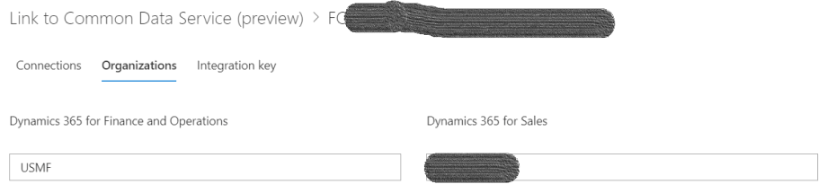

---
# required metadata

title: Bootstrap with company data FAQ
description: 
author: RamaKrishnamoorthy 
manager: AnnBe
ms.date: 09/20/2019
ms.topic: article
ms.prod: 
ms.service: dynamics-ax-applications
ms.technology: 

# optional metadata

ms.search.form: 
# ROBOTS: 
audience: Application User, IT Pro
# ms.devlang: 
ms.reviewer: rhaertle
ms.search.scope: Core, Operations
# ms.tgt_pltfrm: 
ms.custom: 
ms.assetid: 
ms.search.region: global
ms.search.industry: 
ms.author: ramasri
ms.dyn365.ops.version: 
ms.search.validFrom: 2019-09-20

---

# Bootstrap with company data FAQ
 
[!include [banner](../includes/banner.md)]

[!include [preview](../includes/preview-banner.md)]

## Why do I need bootstrapping? 
You many have an existing Common Data Service or Customer Engagement instance with business data, and you may wish to enable dual-write connection against it. In such case, you need to bootstrap the Common Data Service or Customer Engagement data with company information before enabling dual-write connection.  
 
## When should I use bootstrapping? 
You should use it before enabling dual-write entity maps (during step #5).  
1. To setup the dual-write connection between your Finance and Operations instance and the Common Data Service or Customer Engagement instance that has business data, log in to Finance and Operations as an administrator. 
2. Go to the **Data Management** module can click on the **Dual-Write** button. This will launch the **Data Integrator**. 
3. Create the dual-write connection for one or more companies.  
    
4. Enable the **Cdm_companies** entity map. This synchronizes companies from Finance and Operations to Common Data Service.  
    
5. Run the sample bootstrapping code on Common Data Service or Customer Engagement instance to bootstrap company data.  
6. When the bootstrapping is done and the system is ready for live sync, enable the entity maps.  
7. Enabling the entity maps triggers the initial data sync for the enabled entity maps. The data corresponding to the companies chosen on dual-write connection is synchronized between Finance and Operations and Common Data Service. 
 
## How to I use the code sample?
The code is provided as a sample C# application that you can load in Visual Studio. It takes NuGet package dependencies on the Common Data Service SDK, that you can refresh through standard Visual Studio tooling. 

After unzipping and opening the solution in Visual Studio and restoring the NuGet packages, search for **TODO** in the code. Each of the decisions you can make about how you want to bootstrap company information are noted by a **TODO**, with sample code for a canonical implementation. 

The sample code shows only one of many ways you might categorize entity records by company. By changing the logic in the **TODO** sections, you can use an alternate categorization technique. 
 
## What should I expect?
By default the sample application lets you provide a dictionary of business unit-to-company code mappings. Any entity you bootstrap with an OwningBusinessUnit field will be automatically set to use the specified company. Any entity without an OwningBusinessUnit field, such as product, will set the company based on the mapping with an empty business unit value.

The console application expects one parameter, either **–simulate** or **–apply**. If you use the **–simulate** command line parameter, then no data is updated. Only **simulation_<entityname>.csv** files are generated in the same directory as the tool, one for each entity that would have been updated. You can iteratively review these files while working to ensure the code updates company values as expected. 

When you finish with the simulated updates, then use the **–apply** parameter. This updates all records that currently have an incorrect company value, in batches of 1000 records at a time (by default). The code is idempotent as provided, meaning it can be re-run and it will only update the incorrectly assigned companies each time it runs. When running with **–apply**, it outputs CSV files of the changes made, but these are named **applied_<entityname>.csv**. 

This sample code is provided AS IS with no warranties or guarantees and confers no rights. 
 
 
