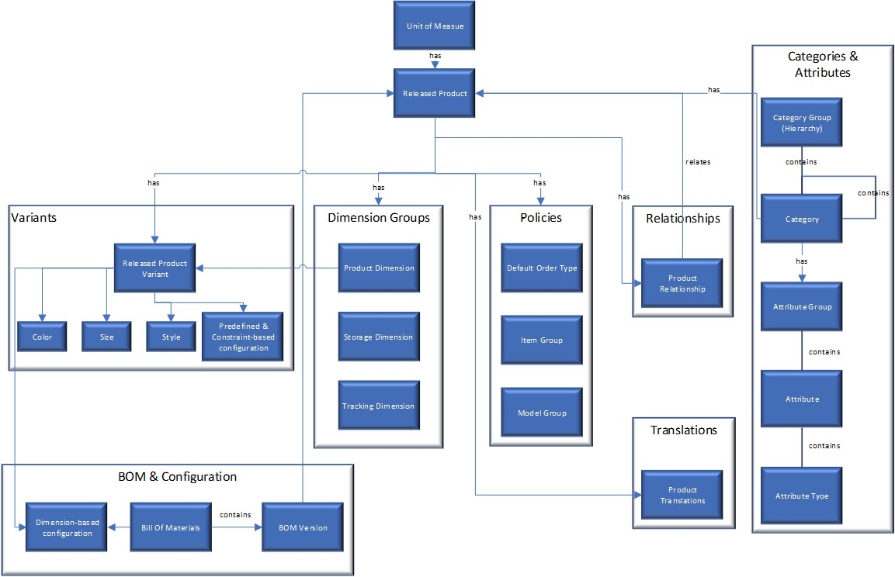
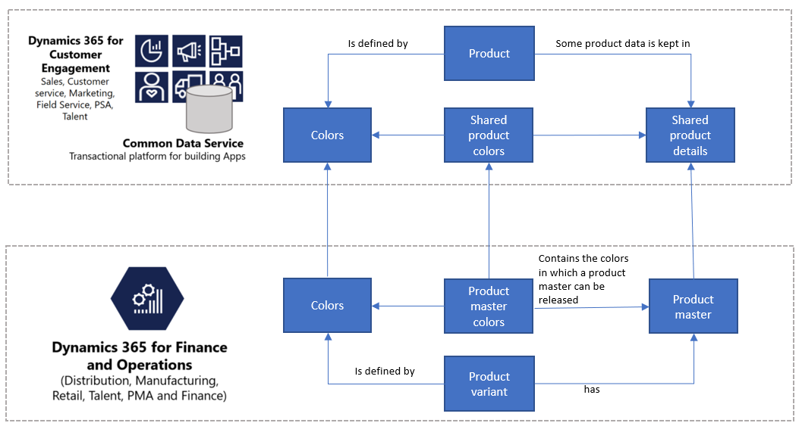

---
# required metadata

title: Unified product experience
description: This topic describes the integration of product data between Finance and Operations apps and Common Data Service.
author: t-benebo 
manager: AnnBe
ms.date: 09/3/2019
ms.topic: article
ms.prod: 
ms.service: dynamics-ax-applications
ms.technology: 

# optional metadata

ms.search.form: 
# ROBOTS: 
audience: Application User, IT Pro
# ms.devlang: 
ms.reviewer: rhaertle
ms.search.scope: Core, Operations
# ms.tgt_pltfrm: 
ms.custom: 
ms.assetid: 
ms.search.region: global
ms.search.industry: 
ms.author: ramasri
ms.dyn365.ops.version: 
ms.search.validFrom: 2019-07-15

---

# Unified product experience

[!include [banner](../includes/banner.md)]

[!include [preview](../includes/preview-banner.md)]

When a business ecosystem is made up of Dynamics 365 applications, such as Finance, Supply Chain Management, and Sales, it’s natural for customers to use these applications to source product data. This is because these apps provides a robust product infrastructure complemented with sophisticated pricing concepts and accurate on-hand inventory data. Customers who use an external Product Lifecycle Management (PLM) system for sourcing the product data can channelize products from Finance and Operations apps to other Dynamics 365 apps. The unified product experience brings in the integrated product data model to Common Data Service, so that all application users including Power Platform users can take advantage of the rich product data coming from Finance and Operations apps.

Here is the product data model from Sales.

Here is the product data model from Finance and Operations apps.

These two product data models have been integrated in Common Data Service as shown below.

The dual-write entity maps for products have been designed to flow data one-way only and it’s a near-real time experience from Finance and Operations apps to Common Data Service. However, the product infrastructure has been made open to make it bi-directional if required. Customers can customize it, at their own risk, as Microsoft does not recommend this approach.

## Templates

Product information contains all the information that is related to the product and its definition, such as the product dimensions or the tracking and storage dimensions. As the following table shows, a collection of entity maps is created to sync products and related information.

Finance and Operations | Other Dynamics 365 apps
-----------------------|--------------------------------
Released products V2 | msdyn\_sharedproductdetails
CDS released distinct products | Product
Product number identified barcode | msdyn\_productbarcodes
Default order settings | msdyn\_productdefaultordersettings
Product specific default order settings | msdyn_productdefaultordersettings
Product dimension groups | msdyn\_productdimensiongroups
Storage dimension groups | msdyn\_productstoragedimensiongroups
Tracking dimension groups | msdyn\_producttrackingdimensiongroups
Colors | msdyn\_productcolors
Sizes | msdyn\_productsizes
Styles | msdyn\_productsytles
Configurations | msdyn\_productconfigurations
Product master colors | msdyn_sharedproductcolors
Product master sizes | msdyn_sharedproductsizes
Product master styles | msdyn_sharedproductstyles
Product master configurations | msdyn_sharedproductconfigurations
All products | msdyn_globalproducts
Unit | uoms
Unit conversions | msdyn_ unitofmeasureconversions
Product specific unit of measure conversion | msdyn_productspecificunitofmeasureconversion
Sites | msdyn\_operationalsites
Warehouses | msdyn\_inventwarehouses
Product categories | msdyn_productcategories
Product category hierachies | msdyn_productcategoryhierarhies
Product category hierarchy roles | msdyn_productcategoryhierarchies
Product category assignments | msdyn_productcategoryassignments

[!include [symbols](../includes/dual-write-symbols.md)]

## Integration of products

In this model, the product is represented by the combination of two entities in Common Data Service: **Product** and **msdyn\_sharedproductdetails**. Whereas the first entity contains the definition of a product (the unique identifier for the product, the product name, and the description), the second entity contains the fields that are stored at the product level. The combination of these two entities is used to define the product according to the concept of the stock keeping unit (SKU). Each released product will have its information in the mentioned entities (Product and Shared Product Details). To keep track of all products (released and not released) the **Global products** entity is used. 

Because the product is represented as a SKU, the concepts of distinct products, product masters, and product variants can be captured in Common Data Service in the following way:

- **Products with subtype product** are products that are defined by themselves. No dimensions have to be defined for them. An example is a specific book. For these products, one record is created in the **Product** entity, and one record is created in the **msdyn\_sharedproductdetails** entity. No product family record is created.
- **Product masters** are used as generic products that hold the definition and rules that determine the behavior in business processes. Based on these definitions, distinct products that are known as product variants can be generated. For example, T-shirt is the product master, and it can have Color and Size as dimensions. Variants can be released that have different combinations of these dimensions, such a small blue T-shirt or a medium green T-shirt. In the integration, one record per variant is created in the product table. This record contains the variant-specific information, such as the different dimensions. The generic information for the product is stored in the **msdyn\_sharedproductdetails** entity. (This generic information is held in the product master.) Additionally, one product family record is created per product master. The product master information is synced to Common Data Service as soon as the released product master is created (but before variants are released).
- **Distinct products** refer to all the products subtype product and all the product variants. 

With the dual-write functionality enabled, the apps from Finance and Operations will be syncronized in other Dynamics 365 apps in **Draft** state. They are added to the first pricelist with the same currency. In other words, they are added to the first pricelist in a Dynamics 365 app that matches the currency of your legal entity where the product is released in a Finance and Operations app. 

By default products from Finance and Operations apps are synchronized to Customer Engagement in **Draft** state. To synchronize the product with **Active** state, so that you can directly use it in sales order quotations, for example, the following setting needs to be chosen: under **System> Adminstration > System administration > System settings > Sales** tab and select **Create products in active state = yes**. 

Note that the synchronization of products happens from Finance and Operations apps to CDS. This means that the values of the product entity fields can be changed in Common Data Service, but when the synchronization is triggered (when a product field is modified in a Finance and Operations app), this will overwrite the values in Common Data Service. 

### CDS released distinct products to Product

The **Product** entity contains the fields that define the product. It includes individual products (products with subtype product) and the product variants. The following table shows the mappings.

[!include [products](dual-write/EcoResReleasedDistinctProductCDSEntity-products.md)]

### Released products V2 to msdyn\_sharedproductdetails

The **msdyn\_sharedproductdetails** entity contains the fields from Finance and Operations apps that define the product, and that contain the product's financial and management information. The following table shows the mappings.

[!include [products](dual-write/EcoResReleasedProductV2-msdyn-sharedproductdetails.md)]

## All product to msdyn_global products

The all products entity contains all the products available in Finance and Operations apps, both the released products and the non-released products. These products are available in the Common Data Service using the following mappings:

[!include [global products](dual-write/EcoResEveryProductEntity-msdyn-globalproducts.md)]

## Product dimensions 

Product dimensions are characteristics that identify a product variant. The four product dimensions (Color, Size, Style, and Configuration) are also mapped to Common Data Service to define the product variants. The following illustration shows the data model for the product dimension Color. The same model is applied to Sizes, Styles and Configurations. 

### Colors

The possible colors in Finance and Operations apps are available in Common Data Service through the following mappings.

[!include [product colors](dual-write/EcoResProductColorEntity-msdyn-productcolor.md)]

### Sizes

The possible sizes in Finance and Operations apps are available in Common Data Service through the following mappings.

[!include [product sizes](dual-write/EcoResProductSizeEntity-msdyn-productsizes.md)]

### Styles

The possible styles in Finance and Operations apps are available in Common Data Service through the following mappings.

[!include [product sizes](dual-write/EcoResProductStyleEntity-msdyn-productstyles.md)]

### Configurations

The possible configurations in Finance and Operations apps are available in Common Data Service through the following mappings.

[!include [product sizes](dual-write/EcoResProductConfigurationsEntity-msdyn-productconfigurations.md)]

When a product has different product dimensions (for example, a product master has Size and Color as product dimensions), each distinct product (that is, each product variant) is defined as a combination of those product dimensions. For example, product number B0001 is an extra-small black T-shirt, and product number B0002 is a small black T-shirt. In this case, the existing combinations of product dimensions are defined. For example, the T-shirt from the preceding example can be extra-small and black, small and black, medium and black, or large and black, but it can't be extra-large and black. In other words, the product dimensions that a product master can take are specified, and variants can be released based on these values.

To keep track of the product dimensions that a product master can take, the following entities are created and mapped in Common Data Service for each product dimension. For more information, see [Product information overview](https://docs.microsoft.com/dynamics365/unified-operations/supply-chain/pim/product-information).

### Shared product color

The **Shared product color** entity indicates the colors that a specific product master can have. This concept is migrated to Common Data Service to keep data consistent. The following table shows the mappings.

[!include [product sizes](dual-write/EcoResProductMasterColorEntity-msdyn-sharedproductcolors.md)]

### Shared product size

The **Shared product size** entity indicates the sizes that a specific product master can have. This concept is migrated to Common Data Service to keep data consistent. The following table shows the mappings.

[!include [product sizes](dual-write/EcoResProductMasterSize-msdyn-sharedproductsizes.md)]

### Shared product style

The **Shared product style** entity indicates the styles that a specific product master can have. This concept is migrated to Common Data Service to keep data consistent. The following table shows the mappings.

[!include [product sizes](dual-write/EcoResProductMasterConfigurationEntity-msdyn-sharedproductconfigurations.md)]

### Shared product configuration

The **Shared product configuration** entity indicates the configurations that a specific product master can have. This concept is migrated to Common Data Service to keep data consistent. The following table shows the mappings.

[!include [product sizes](dual-write/EcoResProductMasterConfigurationEntity-msdyn-sharedproductconfigurations.md)]

## Product number identifier bar codes

Product bar codes are used to uniquely identify products. The following mappings are used to make these product bar codes available in Common Data Service.

[!include [product sizes](dual-write/EcoResProductNumberIdentifiedBarcode-msdyn-productbarcodes.md)]

## Default order settings and product specific default order settings

Default order settings define the site and warehouse where items will be sourced from or stored, the minimum, maximum, multiple and standard quantities that will be used for trading or inventory management, the lead times, the stop flag, and the order promising method. These information will be available in CDS using the default order settings and product specific default order settings entity. You can read more information about the functionality on [Default order settings page](https://docs.microsoft.com/en-us/dynamics365/unified-operations/supply-chain/production-control/default-order-settings).

### Default order settings

The following mappings are used to make the default order settings available in Common Data Service.

[!include [product sizes](dual-write/InventProductDefaultOrderSettingsEntity-msdyn-productdefaultordersetting.md)]

### Product specific default order settings

The following mappings are used to make the product specific default order settings available in Common Data Service.

[!include [product sizes](dual-write/InventProductSpecificOrderSettingsV2Entity-msdyn-productspecificdefaultordersetting.md)]

## Unit of measure and unit of measure conversions

The units of measure and its respective conversions will be available in the Common Data Service following the data model shown in the diagram.

The unit of measure concept is integrated between Finance and Operations apps and other Dynamics 365 apps. For each unit class in a Finance and Operations app a unit group is created in a Dynamics 365 app, which contains the untis belonging to the unit class. A default base unit is also created for every unit group. 

### Unit of measure

The following mappings are used to make the units of measure in Finance and Operations apps available in Common Data Service.

[!include [product sizes](dual-write/UnitOfMeasureEntity-uom.md)]

### Unit of measure conversions

The following mappings are used to make the units of measure conversions in Finance and Operations apps available in Common Data Service.

[!include [product sizes](dual-write/UnitOfMeasureConversionEntity-msdyn-unitofmeasureconversions.md)]

### Product specific unit of measure conversions

The following mappings are used to make the product specific unit of measure conversions in Finance and Operations apps available in Common Data Service.

[!include [product sizes](dual-write/EcoResProductSpecificUnitConversionEntity-msdyn-productspecificunitofmeasureconversions.md)]

### Initial synchronization of units data matching between Finance and Operations
and CDS**

#### Initial synchronization of units

When dual write is enabled, units from Dynamics 365 Finance and Operations are synchronized to CDS/Customer Engagement. The unit groups synchronized from Finance and Operations in CDS have a flag set that indicates they are “Externally maintained”.

#### Matching units and unit classes/groups data from Finance and Operations and Customer Engagement

First, it is important to note that the integration key for unit is
msdyn_symbol. Therefore, this value must be unique in CDS/Customer Engagement.
Due to the fact that in CE it is the pair “Unit group ID” and “Name” are what
define the uniqueness of a unit, different scenarios need to be considered for
matching unit data between Finance and Operations and CDS.

*For units matching/overlapping in Finance and Operations and Customer
Engagement*:

1.  **The unit belongs to a unit group in CE that corresponds to the associated unit class in Finance and Operations**: then, the field msdyn_symbol in CE must be filled in with the unit symbol from Finance and Operations. Therefore, when the data will be matched, and the unit group will be set as “Externally maintained” in CE.

2.  **The unit belongs to a unit group in CE that does not correspond to the associated unit class in Finance and Operations (no existing unit class in Finance and Operations for the unit class in CE**): the msdyn_symbol must be filled in with a random string. Note that this value must be unique in CE.

*For units and unit classes in Finance and Operations not existing in CE:*

As part of dual-write the unit groups from Finance and Operations and its corresponding units are created and synchronized in Customer Engagement/CDS and the unit group will be set as “Externally maintained”. No extra bootstrapping effort is required.

*For units in CE not existing in Finance and Operations:*

The field msdyn_symbol must be filled in for all units. The units can always be created in Finance and Operations in the corresponding unit class (if it exists). If the unit class does not exist, firstly the unit class must be created (note that you cannot create a unit class in F&O except through extension if you are extending the enum) matching the CE unit group and secondly the unit can be created. Note that the unit symbol in Finance and Operations must be the msdyn_symbol previously specified in CE for the unit.

## Product policies: dimension, tracking and storage groups

The product policies are sets of policies used for defining products and its characteristics in inventory. The product dimension group, product tracking dimension group and storage dimension group can be found as product policies. 

### Product dimension group

The product dimension group defined which product dimensions define the product. The four possible product dimension groups are: size, color, style and configuration. The product dimension groups are available in the Common Data Service using the following mappings. 

[!include [product dimension group](dual-write/EcoResProductDimensionGroup-msdyn-productdimensiongroups.md)]

### Product tracking dimension group

The product tracking dimension group represents the method used to track the product in inventory. These are available in the Common Data Service using the following mappings. 

[!include [product tracking dimension group](dual-write/EcoResTrackingDimensionGroup-msdyn-producttrackingdimensiongroups.md)]

### Product storage dimension group

The product storage dimension group represents the method used to define the placement the product in the warehouse. These are available in the Common Data Service using the following mappings. 

[!include [product storage dimension group](dual-write/EcoResStorageDimensionGroup-msdyn-productstoragedimensiongroups.md)]

## Product hierarchies

You use product hierarchies to categorize or group products. The product categories, category hierachies and the category roles from Dynamics 365 Finance and Operations are available in CDS using the following entities.

### Product category hierarchy

The category hierarchies are available in CDS using the Prodcut category hierarchy entity. This entity lists all the hierarchies and their descriptions. It has the following mappings. 

[!include [product category hierarchy](dual-write/EcoResProductCategoryHierarchyEntity-msdyn-productcategoryhierarchy.md)]

### Product category

Each of the product categories and information about its structure and characteristics are contained in the product category entity. The mappings are shown in the table below. 

[!include [product category](dual-write/EcoResProductCategoryEntity-msdyn-productcategory.md)]

### Product category assignments

To assign a product to a category the product category assignments entity can be used. It relates the product and the category using the following mappings. 

[!include [product category assignments](dual-write/EcoResProductCategoryAssignmentEntity-msdyn-productcategoryassignment.md)]

### Product category role

Product hierarchies can be used for different roles in D365 Finance and Operations. The specify which category is used in each role the product category role entity is used with the following mappings. 

[!include [product category role](dual-write/EcoResProductCategoryHierarchyRoleEntity-msdyn-productcategoryhierarchyrole.md)]

## Integration key for products 

To uniquely identify products between Dynamics 365 for Finance and Operations and products in CDS the integration keys are used. 
For products the **(productnumber)** is the unique key that identifies a product in CDS. It is composed by the concatenation of: **(company, msdyn_productnumber)**. The **company** indicates the legal entity in Finance and Operations and **msdyn_productnumber** indicates the product number for the specific product in Finance and Operations. 

For a Customer Engagement user, the product is identified in the UI with the **msdyn_productnumber** (note that the label of the field is **Product number**). In the product form both the company and the msydn_productnumber are shown. However, the (productnumber) field, the unique key for a product, is not shown. 

Note that if apps are built on top of CDS, especial attention should be paid to using the (productnumber), that is the unique product ID, as the integration key, and not the msdyn_productnumber, due to the fact that the last is not unique. 

## Initial synchronization of products and migration of data from CDS to Finance and Operations

### Initial synchronization of products 

When dual write is enabled, products from Dynamics 365 Finance and Operations are synchronized to CDS/Customer Engagement. Note that products created in CDS/Customer Engagement prior to dual write, will not be updated or matched with product data from Finance and Operations.

### Matching product data from Finance and Operations and Customer Engagement

If the same products are kept (overlapping/matching) in Finance and Operations and in CDS/Customer Engagement, when enabling dual-write the synchronization of products from Finance and Operations will take place, and duplicate records will appear in CDS for the same product.
To avoid the previous situation, if Customer Engagement has products that are overlapping/matching with Finance and Operations, then the administrator enabling dual write must bootstrap the fields **Company** (example: "USMF") and **msdyn_productnumber** (example: "1234:Black:S") before the synchronization of products takes place. In other words, these two fields in the product in CDS must be filled in with the respective company in Finance and Operations to which the product needs to be matched with and with its product number. 

Then, when the synchronization is enabled and takes place, the products from Finance and Operations will be synchronized with the matched products in Customer Engagement/CDS. This is applicable for both distinct products and product variants. 

### Migration of product data from Customer Engagement to Finance and Operations

If Customer Engagement has products that are not present in Finance and Operations, the administrator can first use the **EcoResReleasedProductCreationV2Entity** for importing those products in Finance and Operations. And secondly, match the product data from Finance and Operations and Customer Engagement as described above. 
