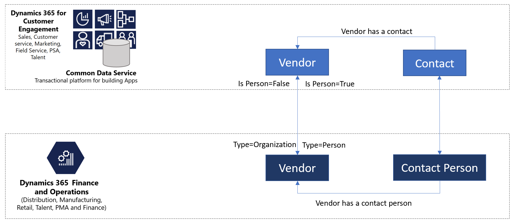
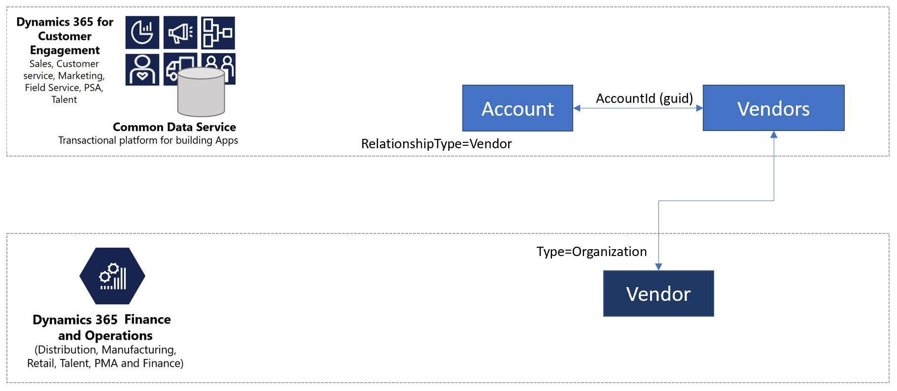
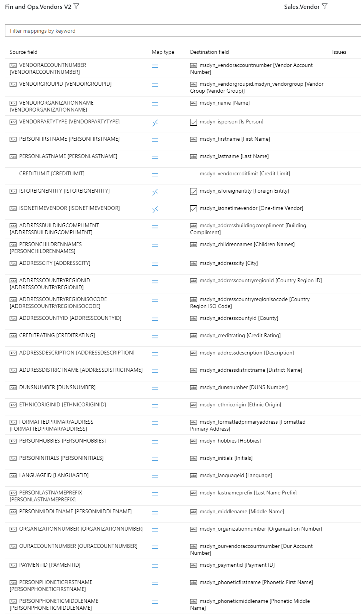
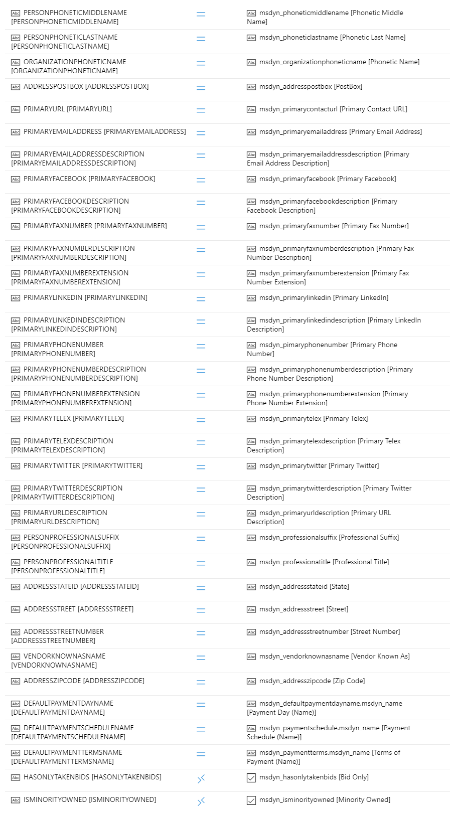
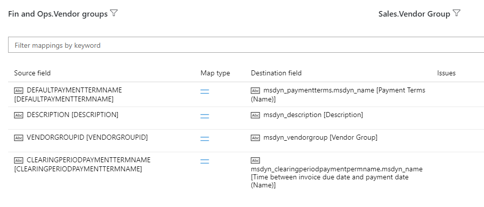
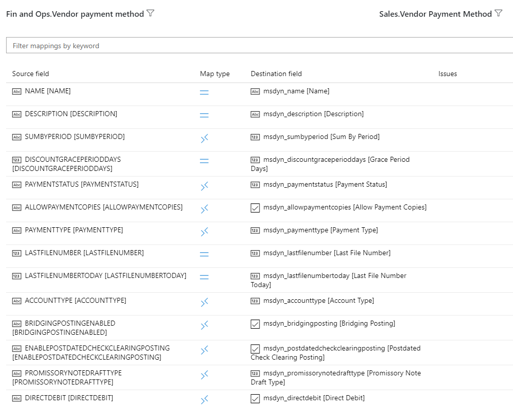

---
# required metadata

title: Integrated vendor master
description: This topic describes vendor data integration between Finance and Operations apps and Common Data Service.
author: RamaKrishnamoorthy 
manager: AnnBe
ms.date: 07/15/2019
ms.topic: article
ms.prod: 
ms.service: dynamics-ax-applications
ms.technology: 

# optional metadata

ms.search.form: 
# ROBOTS: 
audience: Application User, IT Pro
# ms.devlang: 
ms.reviewer: rhaertle
ms.search.scope: Core, Operations
# ms.tgt_pltfrm: 
ms.custom: 
ms.assetid: 
ms.search.region: global
ms.search.industry: 
ms.author: ramasri
ms.dyn365.ops.version: 
ms.search.validFrom: 2019-07-15

---

## Integrated vendor master

[!include [banner](../includes/banner.md)]

[!include [preview](../includes/preview-banner.md)]

The term *vendor* refers to a supplier organization or a sole proprietor that is part of the supply chain process, and that supplies goods for the business. Although *vendor* is an established concept in Finance and Operations apps, a vendor concept doesn't exist in other Dynamics 365 apps. Instead, some businesses overload the Account entity to store both customer information and vendor information. Other businesses use a custom vendor concept. Common Data Service integration supports both these designs. Therefore, you can enable either of the designs, depending on your business scenario.

Integration of vendor data between Finance and Operations apps and other Dynamics 365 applications lets you multi-master the data. Regardless of where the vendor data originates, it's integrated behind the scenes across application boundaries and infrastructure differences. 

### Vendor data flow

If you want to use other Dynamics 365 apps for vendor mastering, and you want to isolate vendor information from customer information, you can use the new vendor design.

If you want to use other Dynamics 365 apps for vendor mastering, and you want to continue to use the Account entity to store vendor information, you can use the new extended vendor design. In this design, extended vendor information, such as the vendor group and vendor posting profile, are stored in the vendor detail.

Vendor contact information resembles customer contact information. Behind the scenes, the contact person's information is stored and retrieved from same entities.

## Templates

Vendor data includes all information about the vendor, such as the vendor group, addresses, contact information, payment profile, and invoice profile. A collection of entity maps works together during vendor data interaction, as shown in the following table.

Finance and Operations apps  | Other Dynamics 365 apps
------------------------|---------------------------------
Vendor V2               | Account
Vendor V2               | Msdyn\_vendors
CDS Contacts V2         | Contact
Vendor groups           | Msdyn\_vendorgroups
Vendor Payment Method   | Msdyn\_vendorpaymentmethods
Payment Schedule        | Msdyn\_paymentschedules
Payment Schedule        | Msdyn\_paymentschedulelines
Payment day CDS         | Msdyn\_paymentdays
Payment day lines CDS   | Msdyn\_paymentdaylines
Terms of Payment        | Msdyn\_paymentterms
Name Affixes            | Msdyn\_nameaffixes

[!include [banner](../includes/dual-write-symbols.md)]

## Vendor V2 and Account 

Businesses that use the Account entity to store vendor information can continue to use it in the same way. They can also take advantage of the explicit vendor functionality that is coming because of Finance and Operations apps integration.

## Vendor V2 and Msdyn\_vendors

Businesses that use a custom solution for vendors can take advantage of the out-of-box vendor concept that is being introduced in Common Data Service because of Finance and Operations apps integration. 

<!--  -->

<!--  -->

<!--  -->

Source field | Map type | Destination field
---|---|---
VENDORACCOUNTNUMBER | = | msdyn\_vendoraccountnumber
VENDORGROUPID | = | msdyn\_vendorgroupid.msdyn\_vendorgroup
VENDORORGANIZATIONNAME | = | msdyn\_name
VENDORPARTYTYPE | \>\< | msdyn\_isperson
PERSONFIRSTNAME | = | msdyn\_firstname
PERSONLASTNAME | = | msdyn\_lastname
CREDITLIMIT | = | msdyn\_vendorcreditlimit
ISFOREIGNENTITY | \>\< | msdyn\_isforeignentity
ISONETIMEVENDOR | \>\< | msdyn\_isonetimevendor
ADDRESSBUILDINGCOMPLIMENT | = | msdyn\_addressbuildingcompliment
PERSONCHILDRENNAMES | = | msdyn\_childrennames
ADDRESSCITY | = | msdyn\_addresscity
ADDRESSCOUNTRYREGIONID | = | msdyn\_addresscountryregionid
ADDRESSCOUNTRYREGIONISOCODE | = | msdyn\_addresscountryregionisocode
ADDRESSCOUNTYID | = | msdyn\_addresscountyid
CREDITRATING | = | msdyn\_creditrating
ADDRESSDESCRIPTION | = | msdyn\_addressdescription
ADDRESSDISTRICTNAME | = | msdyn\_addressdistrictname
DUNSNUMBER | = | msdyn\_dunsnumber
ETHNICORIGINID | = | msdyn\_ethnicorigin
FORMATTEDPRIMARYADDRESS | = | msdyn\_formattedprimaryaddress
PERSONHOBBIES | = | msdyn\_hobbies
PERSONINITIALS | = | msdyn\_initials
LANGUAGEID | = | msdyn\_languageid
PERSONLASTNAMEPREFIX | = | msdyn\_lastnameprefix
PERSONMIDDLENAME | = | msdyn\_middlename
ORGANIZATIONNUMBER | = | msdyn\_organizationnumber
OURACCOUNTNUMBER | = | msdyn\_ourvendoraccountnumber
PAYMENTID | = | msdyn\_paymentid
PERSONPHONETICFIRSTNAME | = | msdyn\_phoneticfirstname
PERSONPHONETICMIDDLENAME | = | msdyn\_phoneticmiddlename
PERSONPHONETICLASTNAME | = | msdyn\_phoneticlastname
ORGANIZATIONPHONETICNAME | = | msdyn\_organizationphoneticname
ADDRESSPOSTBOX | = | msdyn\_addresspostbox
PRIMARYURL | = | msdyn\_primarycontacturl
PRIMARYEMAILADDRESS | = | msdyn\_primaryemailaddress
PRIMARYEMAILADDRESSDESCRIPTION | = | msdyn\_primaryemailaddressdescription
PRIMARYFACEBOOK | = | msdyn\_primaryfacebook
PRIMARYFACEBOOKDESCRIPTION | = | msdyn\_primaryfacebookdescription
PRIMARYFAXNUMBER | = | msdyn\_primaryfaxnumber
PRIMARYFAXNUMBERDESCRIPTION | = | msdyn\_primaryfaxnumberdescription
PRIMARYFAXNUMBEREXTENSION | = | msdyn\_primaryfaxnumberextension
PRIMARYLINKEDIN | = | msdyn\_primarylinkedin
PRIMARYLINKEDINDESCRIPTION | = | msdyn\_primarylinkedindescription
PRIMARYPHONENUMBER | = | msdyn\_pimaryphonenumber
PRIMARYPHONENUMBERDESCRIPTION | = | msdyn\_primaryphonenumberdescription
PRIMARYPHONENUMBEREXTENSION | = | msdyn\_primaryphonenumberextension
PRIMARYTELEX | = | msdyn\_primarytelex
PRIMARYTELEXDESCRIPTION | = | msdyn\_primarytelexdescription
PRIMARYTWITTER | = | msdyn\_primarytwitter
PRIMARYTWITTERDESCRIPTION | = | msdyn\_primarytwitterdescription
PRIMARYURLDESCRIPTION | = | msdyn\_primaryurldescription
PERSONPROFESSIONALSUFFIX | = | msdyn\_professionalsuffix
PERSONPROFESSIONALTITLE | = | msdyn\_professionatitle
ADDRESSSTATEID | = | msdyn\_addressstateid
ADDRESSSTREET | = | msdyn\_addressstreet
ADDRESSSTREETNUMBER | = | msdyn\_addressstreetnumber
VENDORKNOWNASNAME | = | msdyn\_vendorknownasname
ADDRESSZIPCODE | = | msdyn\_addresszipcode
DEFAULTPAYMENTDAYNAME | = | msdyn\_defaultpaymentdayname.msdyn\_name
DEFAULTPAYMENTSCHEDULENAME | = | msdyn\_paymentschedule.msdyn\_name
DEFAULTPAYMENTTERMSNAME | = | msdyn\_paymentterms.msdyn\_name
HASONLYTAKENBIDS | \>\< | msdyn\_hasonlytakenbids
ISMINORITYOWNED | \>\< | msdyn\_isminorityowned
ISVENDORLOCALLYOWNED | \>\< | msdyn\_isvendorlocallyowned
ISSERVICEVETERANOWNED | \>\< | msdyn\_isserviceveteranowned
ISOWNERDISABLED | \>\< | msdyn\_ownerisdisabled
ISWOMANOWNER | \>\< | msdyn\_womanowner
PERSONANNIVERSARYDAY | = | msdyn\_personanniversaryday
PERSONANNIVERSARYYEAR | = | msdyn\_anniversaryyear
PERSONBIRTHDAY | = | msdyn\_birthday
PERSONBIRTHYEAR | = | msdyn\_birthyear
ORGANIZATIONEMPLOYEEAMOUNT | = | msdyn\_numberofemployees
VENDORHOLDRELEASEDATE | = | msdyn\_vendoronholdreleasedate
VENDORPARTYNUMBER | = | msdyn\_vendorpartynumber
ADDRESSLOCATIONID | = | msdyn\_addresslocationid
PERSONANNIVERSARYMONTH | = | msdyn\_vendorpersonanniversarymonth
PERSONBIRTHMONTH | = | msdyn\_vendorpersonbirthmonth
PERSONMARITALSTATUS | \>\< | msdyn\_maritalstatus
ADDRESSLATITUDE | \>\> | msdyn\_addresslatitude
ADDRESSLONGITUDE | \>\> | msdyn\_addresslongitude
ONHOLDSTATUS | \>\< | msdyn\_onholdstatus
CURRENCYCODE | = | msdyn\_currencycode.isocurrencycode
ISVENDORLOCATEDINHUBZONE | \>\< | msdyn\_isvendorlocatedinhubzone
DEFAULTVENDORPAYMENTMETHODNAME | = | msdyn\_vendorpaymentmethod.msdyn\_name
INVOICEVENDORACCOUNTNUMBER | = | msdyn\_invoicevendoraccountnumber.msdyn\_vendoraccountnumber
PERSONGENDER | \>\< | msdyn\_gender
AREPRICESINCLUDINGSALESTAX | \>\< | msdyn\_priceincludessalestax
SALESTAXGROUPCODE | = | msdyn\_taxgroup.msdyn\_name
VENDORPRICETOLERANCEGROUPID | = | msdyn\_pricetolerancegroup.msdyn\_groupid

## Contacts

This template synchronizes all primary, secondary, and tertiary contact information, for both customers and vendors, between Finance and Operations apps and other Dynamics 365 apps. For the details of the entity map, see [Integrated customer master](dual-write-customer.md#contacts).

## Vendor Groups

This template synchronizes vendor group information between Finance and Operations apps and other Dynamics 365 apps.

<!--  -->

Source field | Map type | Destination field
---|---|---
DEFAULTPAYMENTTERMNAME | = | msdyn\_paymentterms.msdyn\_name
DESCRIPTION | = | msdyn\_description
VENDORGROUPID | = | msdyn\_vendorgroup
CLEARINGPERIODPAYMENTTERMNAME | = | msdyn\_clearingperiodpaymentpermname.msdyn\_name

### Vendor Payment Method

This template synchronizes vendor payment method information between Finance and Operations and other Dynamics 365 apps.

<!--  -->

Source field | Map type | Destination field
---|---|---
NAME | = | msdyn\_name
DESCRIPTION | = | msdyn\_description
SUMBYPERIOD | \>\< | msdyn\_sumbyperiod
DISCOUNTGRACEPERIODDAYS | = | msdyn\_discountgraceperioddays
PAYMENTSTATUS | \>\< | msdyn\_paymentstatus
ALLOWPAYMENTCOPIES | \>\< | msdyn\_allowpaymentcopies
PAYMENTTYPE | \>\< | msdyn\_paymenttype
LASTFILENUMBER | = | msdyn\_lastfilenumber
LASTFILENUMBERTODAY | = | msdyn\_lastfilenumbertoday
ACCOUNTTYPE | \>\< | msdyn\_accounttype
BRIDGINGPOSTINGENABLED | \>\< | msdyn\_bridgingposting
ENABLEPOSTDATEDCHECKCLEARINGPOSTING | \>\< | msdyn\_postdatedcheckclearingposting
PROMISSORYNOTEDRAFTTYPE | \>\< | msdyn\_promissorynotedrafttype
DIRECTDEBIT | \>\< | msdyn\_directdebit

