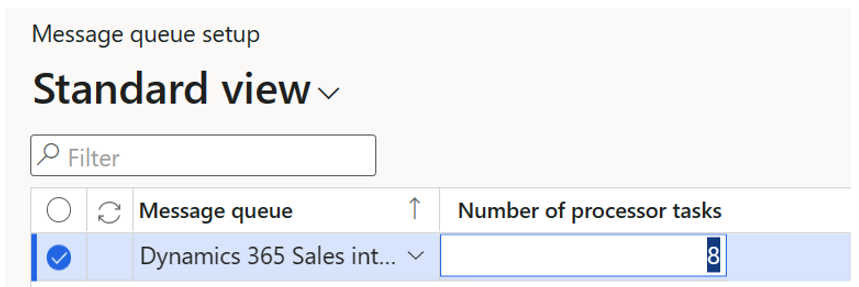
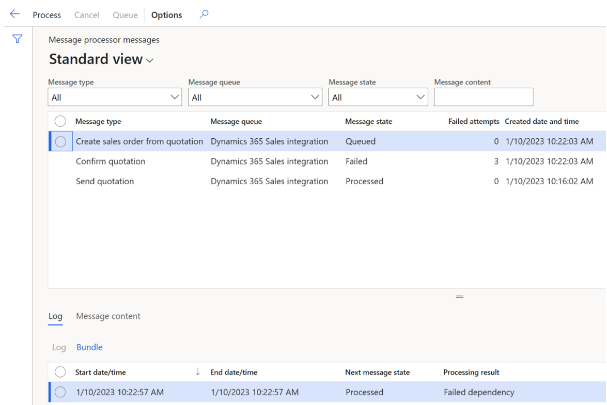

# Work with added efficiency in quote-to-cash with Dynamics 365 Sales

[!include [banner](../../includes/banner.md)]
[!INCLUDE [preview-banner](../../includes/preview-banner.md)]

<!-- KFM: Preview until 10.0.34 GA -->

This article describes how to work with the improved quote-to-cash features when integrating with Dynamics 365 Sales. It provides information about how the integrated system will behave based on which enhanced features you choose to enable. For details about how to enable these improvements for your system, see [Enable extra efficiency in quote-to-cash with Dynamics 365 Sales](add-efficiency-in-quote-to-cash-enable.md).

## Set the default ownership for all sales quotations

When the *Integrate Sales Quotation lifecycle with Dynamics 365 Sales* feature is enabled, you can set the default ownership of for all new sales quotations (regardless of which system they are created in) in Supply Chain Management. Follow these steps:

1. Go to **Accounts receivable \> Setup \> Accounts receivable parameters**.
1. Open the **Dynamics 365 Sales integration** tab.
1. Expand the **Sales quotation** FastTab.
1. Set **Default ownership** to one of the following values:
    - *Based on origin* – The ownership of all new sales quotations will be set to match the system they were created in.
    - *Supply Chain Management* – The ownership of all new sales quotations will be set to Supply Chain Management, regardless of which system they are created in.
    - *Dynamics 365 Sales* – The ownership of all new sales quotations will be set to Dynamics 365 Sales, regardless of which system they are created in.

## Change ownership for a sales quotation

You can change the ownership of a sales quotation by opening it in Supply Chain management. You can't do so from Sales.

> [!NOTE]
> To change ownership of a sales quotation, the following conditions must be met:
>
> - Your user account must have the *Change defaulted sales quotation ownership* privilege and *Maintain sales quotation ownership* duty. By default, the required privilege and duty are assigned to the *Sales manager* role, but not to the *Sales clerk* role.
> - The sales quotation must be in status *Created* or *Send* in Supply Chain Management.
> - The sales quotation must be in status *Draft* or *Active* in Sales.

Follow these steps:

1. Find and select the quotation you want to work with, for example by going to **Sales and marketing \> Sales quotations \> All quotations**. You can't change ownership for multiple sales quotations at a time, so select only one quotation.
1. On the Action Pane, open the **Follow up** tab and select **Change ownership** to open a drop-down dialog box. Then set **Ownership** to one of the following values:
    - *Based on origin* – The ownership will be inherited from the **Origin** value.
    - *Supply Chain Management* – The ownership will be assigned to Supply Chain Management.
    - *Dynamics 365 Sales* – The ownership will be assigned to Dynamics 365 Sales.
1. Select **OK** to apply the change.

Ownership change events are logged in a table in Supply Chain Management that isn't available from the user interface. To see it, enter the following URL in your browser: `https://<DomainName>/?cmp=<CompanyName>&mi=SysTableBrowser&TableName=SalesQuotationOwnershipChangeLog`, where `<DomainName>` is the domain name of your environment and `<CompanyName>` is the name of your legal entity.

## Make Supply Chain Management price master

When the feature *Make Supply Chain Management price master when integrated with Dynamics 365 Sales* is enabled, Supply Chain Management becomes the price master for making calculations for sales quotations and sales orders. Therefore, the following conditions apply when this feature is enabled:

- When a quotation or sales order is created in Sales, and a price list exists in Sales, then that price will be used.
- Sales behaves as though its **Use system price calculation** setting is set to *No*.
- The following changes are made in the Sales user interface for sales quotation and sales order lines:
    - The **Volume discount** field is hidden.
    - The **Line discount amount** field replaces the **Manual discount** field and is expressed as per-unit discount amount.
    - The **Manual discount** field is made read-only and relabeled to **Discount** which represents total discount amount which is calculated from Supply Chain Management.
- In Sales, manual discounts can be entered for quotation and sales order lines in the **Line discount amount** field.
- The following fields in Sales are no longer calculated based on Sales logic but instead rely upon values that are calculated and synchronized from Supply Chain Management. When a quote and sales order line is created in Sales, these fields won't have values until they are synchronized from Supply Chain Management.
    - For sales quotations and sales order lines: **Discount** and **Extended amount**.
    - For sales quotations and sales order summaries: **Detail amount**, **(-) Discount**, **Pre-freight amount**, **(+) Freight amount**, **(+) Total tax**, and **Total amount**.
- For sales orders in Sales, the **Recalculate** option will have no effect.

> [!NOTE]
> When you create or update a sales quotation or sales order Dynamics 365 Sales, select **Price quote** (for quotes) or **Price order** (for orders) to make sure all of the relevant calculations are done in Supply Chain Management and synced back to Sales. This isn't necessary for quotes and sales orders created in Supply Chain Management provided the *Calculate sales totals* batch job is set to run on a regular schedule.

## Calculate and push prices, discounts, and totals from Supply Chain Management to Sales

After updating a sales quotation or sales order in Supply Chain Management, it can sometimes be important to push the updated prices, discounts, and totals to Sales right away. To enable this ability, the *Calculate and push prices, discounts and totals for selective sales orders and sales quotations when integrated to Dynamics 365 Sales* must be enabled in Supply Chain Management.

Do the following steps to work with this feature:

1. Select the sales quotation or sales order you want to work with. If you are working in a list view, you can select more than one quotation or order.
1. On the Action Pane, open the **Quotation** tab (for quotations) or the **Sell** tab (for orders) and select **Push price and totals**.

When the feature is enabled additionally two new menu items <!-- KFM: Where, in the Action Pane?--> are added to **Sales and Marketing \> Periodic tasks**: **Calculate sales order totals for Sales** and **Calculate sales quotation totals for Sales**. These two menu actions allow for use cases complementary and not replacing existing **Calculate sales totals** <!-- KFM: What is this?-->. **Calculate sales totals** supports the use case of calculating both sales order and sales quotation subtotals and totals and synchronizing these to Sales with a fixed recurrence. **Calculate sales order totals for Sales** and **Calculate sales quotation totals for Sales** support the use case of needing to perform a calculation of sales quotation or sales order totals for a range of source documents immediately in a non-recurring scenario. The range can be based <!-- KFM: How do we choose this?--> on sales quotation and order numbers, customer account, and invoice account, while still considering the setting to ignore documents updated before (days)<!-- KFM: Where is this setting? What is it called? -->. The two settings work in combination<!-- KFM: Which two settings? -->. Setting up a recurring batch job is not supported. Use these capabilities when you need to apply a specific range of quotations and orders for which a total calculation should be performed as a one-off.

When the feature *Process sales quotation related events* is enabled together with *Calculate and push prices* <!-- KFM: Are these both in FM?--> , discounts and totals for selective sales orders and sales quotations when integrated to Dynamics 365 Sales, a setting is added to the **Dynamics 365 Sales integration** tab of the **Accounts receivable parameters** page: **Calculate and push prices and totals in batch**. This setting lets administrators choose whether to Calculate and push prices and totals in batch synchronously or asynchronously through the message processor. When using the message processor <!-- KFM: Clarify what this is and give a link. -->, four messages appear. Two for sales order: *Calculate and push prices and totals for sales order* and *Calculate and push totals for sales order*. Two for sales quotation: *Calculate and push prices and totals for sales quotation* and *Calculate and push totals for sales quotation*.

When the common use case is to select more sales orders and sales quotation for which to do the **Push price and totals** or **Calculate sales order/quotation totals for Sales**, then set **Calculate and push prices and totals in batch** to *Yes*. This setting will provide the better user experience when working in the Supply Chain Management.

## Copy Supply Chain Management sales quotation data to sales orders synced from Dynamics 365 Sales

Sales orders created from the sales quotation process in Dynamics 365 Sales are not created with the same data as sales orders created from the sales quotation process in Supply Chain Management. This is due to differences in data models between Dynamics 365 Sales and Supply Chain Management. Sales orders created from the sales quotation process in Dynamics 365 Sales have a small set of data (payload) carried forward to the sales order from the sales quotation. When the sales order is synchronized from Dynamics 365 Sales to Supply Chain Management, Supply Chain Management initializes values fields without values using standard Supply Chain Management logic. While this may be appropriate in some scenarios, in other scenarios it is not. In a scenario where Supply Chain Management only fields such as financial dimensions are manually updated on a sales quotation in Supply Chain Management where ownership is with Dynamics 365 Sales, these manually updated financial dimension values are not carried forward to the resulting sales order in Supply Chain Management.

With the feature *Copy Supply Chain Management sales quotation data to sales orders synced from Dynamics 365 Sales* you now have an option:<!-- KFM: How do set this option? Only in FM? -->

- Use the data from sales order created from the sales quotation in the Dynamics 365 Sales when the sales order is synched to and created in Supply Chain Management regardless of the data on the sales quotation in Supply Chain Management.
- When the feature is enabled, have the sales order synched to and created in Supply Chain Management have the same field values carried over from the sales quotation in Supply Chain Management regardless of ownership with Dynamics 365 Sales or Supply Chain Management.

*Copy Supply Chain Management sales quotation data to sales orders synced from Dynamics 365 Sales* is applicable only when the *Integrate sales quotation lifecycle with Dynamics 365 Sales* feature is enabled.

When the feature *Process sales quotation related events* is enabled together with *Copy Supply Chain Management sales quotation data to sales orders synced from Dynamics 365 Sales*, a setting is added to the Dynamics 365 Sales integration tab of the **Accounts receivable parameters** page. This setting lets administrators choose whether to copy quotation information on order creation in real time or through the message processor.

There are pros and cons to copying quotation information on order creation through the message processor.<!-- KFM: What are they? Next paragraph? -->

When copy quotation information on order creation is using the message processor, then the Create Order action will complete be faster compared to not using the message processor. This gives a better user experience in the in the Dynamics 365 Sales user interface when clicking Create Order from a sales quotation. The sales order synched from Dynamics 365 Sales and created in Supply Chain Management will have the data from the sales quotation in Supply Chain Management copied, once the copy quotation information on order creation is processed. Depending on the job execution recurrence setup in the message processor, this can happen with a delay. If this delay is unacceptable, then copy quotation information on order creation can happen immediately upon sales order synched from Dynamics 365 Sales and created in Supply Chain Management. Please note, when copy quotation information on order creation is not using the message processor, the wait time added to the user experience in Dynamics 365 Sales upon Create Order depends on the number of lines on the sales quotation. Fewer lines, less wait time.

## Process Dynamics 365 Sales integration related events

The *Process Dynamics 365 Sales integration related events* feature enables sales quotation events to be processed asynchronously using the message processor framework. The feature is applicable only when *Integrate Sales Quotation lifecycle with Dynamics 365 Sales* feature is enabled.

When the feature Process sales quotation related events <!-- KFM: Do you mean *Process Dynamics 365 Sales integration related events*? --> is enabled, two settings are added to the **Dynamics 365 Sales integration** tab of the **Accounts receivable parameters** page: **Create quotation journal in batch** and **Create quotation confirmation journal** in batch. These settings let administrators choose whether to create the quotation journal or the quotation confirmation journal in real time upon the send and confirm events synchronously or through the message processor when sales quotation ownership is indirectly or directly with Dynamics 365 Sales.

The feature provides new messages for the message processor:

- *Create sales quotation journal* – Creates the sales quotation journal.
- *Create sales quotation confirmation journal* – Creates the sales quotation confirmation journal.
- *Link sales order and sales quotation* – Results from the confirmation event and updates the sales quotation/sales order relationship. <!-- KFM: What do we mean by "results from"? -->

*Create quotation confirmation journal* and *Link sales order from quotation* are interrelated in that *Link sales order from quotation* is dependent on *Create quotation confirmation journal* being successfully processed. The two messages serve the same use case as the **Confirm** action in the user interface (**Sales and marketing \> Sales quotations \> All quotations**, header ribbon Follow up; group Generate, Confirm action).

When feature *Copy Supply Chain Management sales quotation data to sales orders synced from Dynamics 365* is enabled, the *Copy sales quotation data to sales order* message becomes available. <!-- KFM: What is this message? Available where, to whom, for what purpose? -->

When feature *Calculate and push prices, discounts and totals for selective sales orders and sales quotations when integrated to Dynamics 365 Sales* is enabled, additionally 4 messages are introduced. Two for sales order: *Calculate and push prices and totals for sales order* and *Calculate and push totals for sales order*. Two for sales quotation: *Calculate and push prices and totals for sales quotation* and *Calculate and push totals for sales quotation*. <!-- KFM: We should describe the purpose of each of these messages. -->

When feature Process *Dynamics 365 Sales integration related events* is enabled, one new message queue is available from the message processor user interface:

- *Dynamics 365 Sales Integration* – <!-- KFM: Description needed -->

### Set up Process Dynamics 365 Sales integration related events

When *Process Dynamics 365 Sales integration related events* has been enabled, then navigate to **Sales and Marketing \> Periodic tasks \> Dynamics 365 Sales Integration message processor** form to set up the required batch job. Setup the batch job to run with required recurrence. The batch job can also be set up from the **System administration > Message processor > Message processor** form. <!-- Give a procedure and describe all settings. -->

When the feature is enabled <!-- KFM: Which feature? -->, then the Send quotation and Confirm events are processed asynchronously <!-- KFM: Use proper names for each event. -->. A single batch job must be set up and be running for the messages from the message queue to be processed automatically. <!-- KFM: Describe how. -->

The messages can be processed using multithreading by defining the number of messages in a task and by defining the number of processor tasks.

When the feature <!-- KFM: Which feature? --> is enabled, a new tab **Dynamics 365 Sales integration** is available from **Accounts receivables \> Setup \> Accounts receivables parameters** page.

On the **Dynamics 365 Sales integration** tab, you set up the number of messages per task. <!-- Give a procedure and describe all settings. --> Messages per task represent the maximum number of messages to be processed in a single task <!-- Is this a setting? What is the label? --> . A task is similar to a bundle. The messages per tasks is defaulted to *0* (zero) in the user interface. Number of tasks *0* is interpreted as not being set, and a number of *30* is used implicitly as maximum. Any number higher than *0* (zero) is considered.

It is recommended not to set the (maximum) <!-- KFM: Why the parenthesis here? What is the actual label? --> number of messages too low, such as to the value *1*. It is recommended to set the maximum number of messages in a task to a value which results in a 1-2 minute execution time. <!-- KFM: OK, so 2 is good? How do I know what value is right? -->

Setting the number of messages per task goes hand-in-hand with setting the number of processor tasks.<!-- KFM: How so? How do we do this? -->

Go to **System administration \> Message processor \> Message queue setup**.

In this form you can specify a number of processor tasks for a specific queue, such as the queue Dynamics 365 Sales integration <!-- KFM: Describe how, use field labels. -->. If there is no record for the message queue, then the number *5* is used as maximum. Number of processor tasks value represents the maximum number of processor tasks for the specific queue.

If set <!-- KFM: If what is set? -->, the recommendation is to set the value higher than *1*, while not exceeding the number of maximum batch threads <!-- KFM: Where do I find this? -->. The value must be considered as a balancing act between expected peak volume and with other workloads running on the same batch servers.

### Monitoring Process Dynamics 365 Sales integration related events

When events are processed leveraging the message queue framework, it is possible to monitor the process from the **System Administration \> Message Queue \> Message process messages** page. This page provides insight into queued, failed, and processed messages. The page supports error handling, manual processing, cancelling , and re-queuing of messages.

For more information on the Message processor, see [Create and process custom message queues and message types](../../../../supply-chain/supply-chain-dev/message-processor.md).
