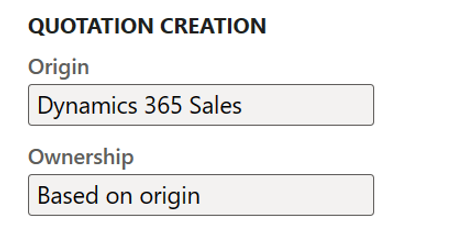

# Add efficiency in quote-to-cash with Dynamics 365 Sales

[!include [banner](../../includes/banner.md)]

In Dynamics Supply Chain Management, several enhancements are available from version 10.0.34 in quote to cash integration in dual write between Dynamics 365 Sales and Dynamics 365 Supply Chain Management. The changes are introduced to allow companies to have a seamless quotation process flow across Sales and Supply Chain Management allowing for fewer touch points and higher efficiency and transparency. The changes are enabled in a combination of more features in feature management in Supply Chain Management and an updated dual write supply chain solution to support the integration with Sales. These changes are developed for and to be used within the context of quote to cash integration in dual write between Dynamics 365 Sales and Dynamics 365 Supply Chain Management only.

## Integrate Sales Quotation lifecycle with Dynamics 365 Sales

A concept of quotation creation origin and ownership is added to the sales quotation in Dynamics 365 Supply Chain Management. This concept is agnostic to any feature enablement and is visible from the user interface of the sales quotation details page header section from version 10.0.32.

A new group, Quotation Creation, is added to the Sales quotation header fast tab in the Sales quotation details page in Dynamics 365 SCM. The Quotation Creation group contains two field: Origin and Ownership.

When the feature Integrate Sales Quotation lifecycle with Dynamics 365 Sales feature is disabled, all sales quotations have Supply Chain Management as Origin and Based on origin as Ownership.

Once the Integrate Sales Quotation lifecycle with Dynamics 365 Sales feature is enabled, the updated Dual-Write supply chain solution applied, and new table maps for entities Dynamics 365 Sales feature management states, Dynamics 365 Sales quotation header, Dynamics 365 Sales quotation lines are running, then origin becomes contextual: When the  quotation is created in Supply Chain Management, then Origin will be Supply Chain Management, while Origin will be set to Dynamics 365 Sales, when the quotation is created in Dynamics 365 Sales.

In Dynamics 365 Sales the two new fields are added to the Integration section in the Quote page.

To make ownership explicit to a user working with quotations in Dynamics 365 Sales, the following info message is added to the message area in the Quote page when ownership is not Dynamics 365 Sales:

> This quote is not owned by Dynamics 365 Sales

When this message is not provided, then ownership is with Dynamics 365 Sales.

This message will inform the user, that there are limits as to what actions in Dynamics 365 Sales are available for the specific sales quotation.

When the quotation is active and ownership is with Supply Chain Management, the combined messages for the quotation will appear like the below:

> Read-only This record's status: Active This quote is not owned by Dynamics 365 Sales

The following presents two use cases illustrating the differences in the sales quotation process flow resulting from ownership.

### Use case: Sales Quotation is created from Dynamics 365 Sales and activated

A sales quotation header is created in Dynamics 365 Sales. Origin is Dynamics 365 Sales, ownership based on origin. Sales Quotation header is synched through dual write using the Dynamics 365 Sales quotation header (quotes) entity. When inserted into Supply chain management from the Dynamics 365 Sales quotation header (quotes) entity, origin is set to Dynamics 365 Sales. The value is not synched from Dataverse but directly set based on the entity used. This is by intent as this Dynamics 365 Sales quotation header entity is only to be applied within a Dynamics 365 Sales integration context; any inserts from this entity should only originate from Dynamics 365 Sales. The sales quotation status in Dynamics 365 SCM is created.

When the sales quotation state and status in Dynamics 365 Sales and SCM respectively is Draft and Created, lines can be added, deleted, and modified from both systems. However as ownership is with Dynamics 365 Sales, the quotation cannot be deleted nor can it be processed through its lifecycle from Dynamics 365 SCM.

In Dynamics 365 Sales, products are added to the quotation and quotation lines are synchronized to Dynamics 365 SCM. Then the sales quotation is activated from Dynamics 365. This triggers a quotation send event in Dynamics 365 SCM. When feature Process Dynamics 365 Sales integration related events is not enabled, then the send event is processed immediately and in full in Supply Chain Management. First, the quotation journal is created and the status of the sales quotation is updated to Sent. Updating the sales quotation in Dynamics 365 Sales to state Active happens upon successfully updating the sales quotation in Dynamics 365 SCM to Sent.

When feature Process Dynamics 365 Sales integration related events is enabled and running, then part of the send event to update the status can processed immediately while the creation of the quotation journal is processed in batch. First, the quotation status is updated to Sent. Then the sales quotation in Dynamics 365 Sales is updated to state Active and a request to create the quotation journal is sent to a message queue in Dynamics 365 SCM. When the request is picked up by the message queue processor, the sales quotation journal is created. This is further explained in the section on Process Dynamics 365 Sales integration related events.

When the sales quotation in Dynamics 365 SCM is in status Sent and ownership is with Dynamics 365 Sales, sales quotation data becomes read only in Dynamics 365 SCM. Activating a sales quotation  through Dynamics 365 Sales automatically  makes the quotation in Dynamics 365 Sales read only. As ownership is with Dynamics 365 Sales, this is respected in Dynamics 365 SCM. Quotation data becomes read only from the Dynamics 365 SCM user interface.

Further processing of the sales quotation through its lifecycle is mastered through Dynamics 365 Sales with relevant events triggering appropriate updates to the linked Dynamics 365 SCM quotation.

### Use case: Sales Quotation is created from Dynamics 365 SCM and send

A sales quotation header is created in Dynamics 365 SCM. Origin is Supply chain management, ownership based on origin. Sales quotation header is synched through dual write using the Dynamics 365 Sales quotation header (quotes) entity. When inserted into Dataverse from the Dynamics 365 Sales quotation header (quotes) entity, the origin is synched and therefore set to Supply Chain Management. The synchronization of the Origin value is one directional: From Dynamics 365 SCM to Dataverse only. Once in Dataverse, the sales quotation can be accessed in Dynamics 365 Sales with the status In progress and state Draft.

When the sales quotation state and status in Dynamics 365 Sales and SCM respectively is Draft and Created, lines can be added, deleted, and modified from both apps. However, as ownership is with Supply chain management, the quotation cannot be deleted nor can it be processed through its lifecycle from Dynamics 365 Sales. When opening the sales quotation in the Dynamics 365 Sales Quote page, the following information is visible:

> This quote is not owned by Dynamics 365 Sales

In Dynamics 365 SCM, products can be added to the quotation and quotation lines are synchronized to Dynamics 365 Sales. Then the sales quotation is send from Dynamics 365 SCM using the generate send quotation functionality. When the status is updated to Sent, this status change is synched to Dynamics 365 Sales and triggers an update of the quotation to Active.

When the sales quotation in Dynamics 365 Sales is in state Active, default Dynamics 365 Sales logic ensures that the quotation data becomes read only in the Dynamics 365 Sales user interface. When origin is Supply Chain Management and ownership is Based on origin, the lifecycle actions available from Dynamics 365 Sales are hidden. It is not possible to Create order, Close, Revise, or Delete such a sales quotation from Dynamics 365 Sales.

When opening the sales quotation in the Dynamics 365 Sales Quote page, the following information is provided:

> Read-only This record's status: Active This quote is not owned by Dynamics 365 Sales

Further processing of the sales quotation through its lifecycle is mastered through Dynamics 365 SCM with relevant events triggering appropriate updates to the linked Dynamics 365 Sales quotation.

The following presents additional use cases illustrating the sales quotation lifecycle when ownership is with Dynamics 365 Sales.

### Additional use cases - ownership is with Dynamics 365 Sales

This section provides additional use cases when Integrate Sales Quotation lifecycle with Dynamics 365 Sales feature is enabled below are additional and ownership is with Dynamics 365 Sales.

**Ownership Dynamics 365 Sales scenarios**

Below is explained the impact and flow when the Sales Quotation is created in Dynamics 365 Sales, origin is Dynamics 365 Sales. As ownership is based on origin, ownership is with Dynamics 365 Sales.

**Step 1 - Creation** - The Sales quotation is created in Dynamics 365 Sales. The status is In progress and the state Draft. In Dynamics 365 Sales there are no changes compared to what the user can do with the sales quotation compared to when Integrate Sales Quotation lifecycle with Dynamics 365 Sales feature is disabled.

The quotation is synchronized to Supply chain management. The status is Created. As ownership is with Dynamics 365 Sales, the quotation cannot be send, lost, cancelled, confirmed, or deleted from Supply chain management. Data on the sales quotation can be edited in Supply chain management.

| Create Quotation | Sales (ownership) | Supply Chain Management |
|---|---|---|
| **Status** | *Draft* | *Created* |
| **Status reason** | *In Progress* | *N/A* |
| **Lifecycle restrictions** | *Similar to Integrate Sales Quotation lifecycle with Dynamics 365 Sales feature disabled* | Cannot Generate Send, Lost, Cancel, Confirm, Delete |
| **Data restrictions** | *Similar to Integrate Sales Quotation lifecycle with Dynamics 365 Sales feature disabled* | *Similar to Integrate Sales Quotation lifecycle with Dynamics 365 Sales feature disabled* |

**Dynamics 365 Sales Quotation: Create quotation**

| Result | Status | Status reason | Lifecycle restrictions | Data restrictions |
|---|---|---|---|---|
| Quotation created | Draft | In Progress | *Similar to Integrate Sales Quotation lifecycle with Dynamics 365 Sales feature disabled* | *Similar to Integrate Sales Quotation lifecycle with Dynamics 365 Sales feature disabled* |

**Supply Chain Management Sales Quotation: Quotation synchronization**

| Result | Status | Lifecycle restrictions | Data restrictions |
|---|---|---|---|
| Quotation created | Created | Cannot Generate Send, Lost, Cancel, Confirm, Delete | *Similar to Integrate Sales Quotation lifecycle with Dynamics 365 Sales feature disabled* |

**Step 2 - Activation** - The Sales quotation is activated in Dynamics 365 Sales. The status is In progress and the state Active. There are no changes compared to what the user can do with the sales quotation compared to a non-integrated scenario. 
The quotation update is synchronized to Supply chain management. The status is Sent. As ownership is with Dynamics 365 Sales, the quotation cannot be send, lost, cancelled, confirmed, or deleted from Supply chain management. Data on the sales quotation is read only in Supply chain management.

Note that activating a quotation in Dynamics 365 Sales makes it read only in the user interface.

| Activate Quotation | Sales (ownership) | SCM |
|---|---|---|
| **Status** | *Active* | *Sent* |
| **Status reason** | *In Progress* | *N/A* |
| **Lifecycle restrictions** | *Similar to Integrate Sales Quotation lifecycle with Dynamics 365 Sales feature disabled* | Cannot Generate Send, Lost, Cancel, Confirm, Delete |
| **Data restrictions** | *Similar to Integrate Sales Quotation lifecycle with Dynamics 365 Sales feature disabled* | Read only |

**Dynamics 365 Sales Quotation: Activate**

| Result | Status | Status reason | Lifecycle restrictions | Data restrictions |
|---|---|---|---|---|
| Quotation activated | Active | In Progress | *Similar to Integrate Sales Quotation lifecycle with Dynamics 365 Sales feature disabled* |

**Supply Chain Management Sales Quotation: Quotation synchronization**

| Result | Status | Lifecycle restrictions | Data restrictions |
|---|---|---|---|
| Quotation journal created | Sent | Cannot Generate Send, Lost, Cancel, Confirm, Delete | Read Only |

**Step 3 - Revision** - The Sales quotation is revised in Dynamics 365 Sales. The status is Closed and the state Revised.

The quotation update is synchronized to Supply chain management. The status is Revised. As ownership is with Dynamics 65 Sales, the quotation cannot be sent, lost, cancelled, confirmed, or deleted from Supply chain management. Data on the sales quotation is read only in Supply chain management.

A new sales quotation is automatically created in Dynamics 365 Sales. The status is In progress and the state Draft.

The quotation is synchronized to Supply chain management. The status is Created. As ownership is with Dynamics 365 Sales, the quotation cannot be sent, lost, cancelled, confirmed, or deleted from Supply chain management. Data on the sales quotation can be edited in Supply chain management.

**Dynamics 365 Sales Quotation: Revise**

| Result | Status | Status reason | Lifecycle restrictions | Data restrictions |
|---|---|---|---|---|
| Quotation Revised | Closed | Revised | *Similar to Integrate Sales Quotation lifecycle with Dynamics 365 Sales feature disabled* | *Similar to Integrate Sales Quotation lifecycle with Dynamics 365 Sales feature disabled* |
| Quotation Created | Draft | In Progress | *Similar to Integrate Sales Quotation lifecycle with Dynamics 365 Sales feature disabled* | *Similar to Integrate Sales Quotation lifecycle with Dynamics 365 Sales feature disabled* |

**Supply Chain Management Sales Quotation: Quotation synchronization**

| Result | Status | Lifecycle restrictions | Data restrictions |
|---|---|---|---|
| Quotation Revised | Revised | Cannot Generate Send, Lost, Cancel, Confirm, Delete | Read Only |
| Quotation Created | Created | Cannot Generate Send, Lost, Cancel, Confirm, Delete | No |

**Step 4 - Closing**

When closing an activated  sales quotation in Dynamics 365 Sales, different can be applied. Below is a variation for each of the standard reasons.

1st variation: The Sales quotation is Closed in Dynamics 365 Sales. Reason is revised. The status is Closed and the state Revised. The quotation update is synchronized to Supply chain management. The status is Revised. As ownership is with Dynamics 365 Sales, the quotation cannot be sent, lost, cancelled, confirmed, or deleted from Supply chain management. Data on the sales quotation is read only in Supply chain management.

2nd variation: The Sales quotation is Closed in Dynamics 65 Sales. Reason is Lost. The status is Closed and the state Lost. The quotation update is synchronized to Supply chain management. The status is Lost. As ownership is with Dynamics 65 Sales, the quotation cannot be sent, lost, cancelled, confirmed, or deleted from Supply chain management. Data on the sales quotation is read only in Supply chain management.

3rd variation: The Sales quotation is Closed in Dynamics 65 Sales. Reason is Cancelled. The status is Closed and the state Cancelled. The quotation update is synchronized to Supply chain management. The status is Cancelled. As ownership is with Dynamics 65 Sales, the quotation cannot be sent, lost, cancelled, confirmed, or deleted from Supply chain management. Data on the sales quotation is read only in Supply chain management.

Note that no reason code is synchronized through integration for the Lost and Cancel events in Supply chain management.

**Dynamics 365 Sales Quotation: Close**

| Result | Status | Status reason | Lifecycle restrictions | Data restrictions |
|---|---|---|---|---|
| Quotation Closed | Closed | Revised | *Similar to Integrate Sales Quotation lifecycle with Dynamics 365 Sales feature disabled* | *Similar to Integrate Sales Quotation lifecycle with Dynamics 365 Sales feature disabled* |
| Quotation Closed | Closed | Lost | *Similar to Integrate Sales Quotation lifecycle with Dynamics 365 Sales feature disabled* | *Similar to Integrate Sales Quotation lifecycle with Dynamics 365 Sales feature disabled* |
| Quotation Closed | Closed | Cancelled | *Similar to Integrate Sales Quotation lifecycle with Dynamics 365 Sales feature disabled* | *Similar to Integrate Sales Quotation lifecycle with Dynamics 365 Sales feature disabled* |

**Supply Chain Management Sales Quotation: Quotation synchronization**

| Result | Status | Lifecycle restrictions | Data restrictions |
|---|---|---|---|
| Quotation Revised | Revised | Cannot Generate Send, Lost, Cancel, Confirm, Delete | *Similar to Integrate Sales Quotation lifecycle with Dynamics 365 Sales feature disabled* |
| Quotation Lost | Lost | Cannot Generate Send, Lost, Cancel, Confirm, Delete | *Similar to Integrate Sales Quotation lifecycle with Dynamics 365 Sales feature disabled* |
| Quotation Cancelled | Canceled | Cannot Generate Send, Lost, Cancel, Confirm, Delete | *Similar to Integrate Sales Quotation lifecycle with Dynamics 365 Sales feature disabled* |

**Step 4 variation – Create order**
When create order action is performed for an activated sales quotation in Dynamics 365 Sales, the following events are triggered in Supply chain management: Update the sales quotation status to confirmed and generate quotation confirmation journal. The sales order created in Dynamics 365 Sales is synchronized and available in Dynamics 365 SCM, related to the sales quotation, enabling navigation from Dynamics 365 SCM quotation to the Dynamics 365 SCM Sales order.

**Dynamics 365 Sales Quotation: Create order**

| Result | Status | Status reason | Lifecycle restrictions | Data restrictions |
|---|---|---|---|---|
| Quotation Won | Won | Won | *Similar to not integrated* | *Similar to not integrated* |
| Sales order created | Active | New | *Similar to not integrated* | *Similar to not integrated* |

**Supply Chain Management Sales Quotation: Quotation synchronization**

| Result | Status | Lifecycle restrictions | Data restrictions |
|---|---|---|---|
| Quotation confirmation journal created | Won | Cannot Generate Send, Lost, Cancel, Confirm, Delete | Read Only |
| Sales order Created | Open | | |

## Change ownership for a sales quotation

It is possible to change the defaulted ownership value on the sales quotation from the Dynamics Supply Chain management sales quotation user interface. This capability is not available from Dynamics 365 Sales quotation. A separate security construct of privilege and duty is assigned to the sales manager role allowing the sales manager to on a single sales quotation in Dynamics Supply Chain management change the ownership. It is not possible to change ownership for multiple sales quotations at a time. It is possible to change the ownership on a sales quotation in any from/to direction when the sales quotation status in Supply Chain management is created and active in Dynamics 365 Sales. When the sales quotation status in Supply Chain Management is sent then it is possible to change the ownership to Supply Chain Management. It is possible to change ownership to based on origin, when origin is Supply Chain Management. When the sales quotation is in status sent in Supply Chain Management, it is not possible directly nor indirectly to change ownership to Dynamics 365 Sales. Beyond the status sent in Supply Chain Management, it is not possible to change ownership for a sales quotation.

The ownership change event is captured in a separate table log in Supply Chain Management not accessible from the user interface.

## Set default ownership for sales quotations when integrated with Dynamics 365 Sales

By default, the ownership value assigned to a sales quotation when created is Based on origin. With feature Set default ownership for sales quotations when integrated with Dynamics 365 Sales a setting is added to the “Accounts receivables parameters” page, where the default ownership can be set different from Based on ownership. Default ownership can be set to “Based on origin”, “Dynamics 365 Sales”, or “Supply Chain Management”. When this feature is disabled, ownership is always based on origin.
This setting is per company and allows an organization to, regardless of sales quotation creation happing from Dynamics 365 Sales or Supply Chain Management, always have a constant default ownership.

## Make Supply Chain Management price master when integrated with Dynamics 365 Sales

With the feature Make Supply Chain Management price master when integrated with Dynamics 365 Sales you now have an option to disable Dynamics 365 Sales logic when doing calculations for sales quotations and sales orders.

When enabled, calculations for extended amounts, summary amounts, subtotals, and totals for sales quotations and sales orders will not be performed in Dynamics 365 Sales. When quotations or sales orders are created in Sales, and a price list exists in Sales, then that price will be used, but no other calculations will be made automatically in Sales. All calculated monetary fields are calculated in and synchronized from Supply Chain Management to Sales. When enabled, this feature behaves as if the Sales settings “Use system price calculation” is set to “No” and “Discount calculation method” is set to “Per unit” in Sales regardless of how the settings are in Dynamics 365 Sales. When enabled, the following changes are made in the Sales user interface for sales quotation and sales order lines: The “Volume discount” field is hidden, the "Line discount amount” field is now replacing "Manual discount" field and is expressed as per-unit discount amount, and the “Manual discount” field is made read-only and relabeled to "Discount" which represents total discount amount which is calculated from Supply Chain Management. Manual discounts can henceforth be entered for a quotation and sales order line in Sales in the “Line discount amount” field.

When enabled, the following fields in Sales are no longer automatically calculated based on Sales logic but rely upon values being synchronized from Supply Chain Management. When a quote and sales order line is created the following fields in Sales will not have values until synchronized from SCM:

- Quotation and Sales order line line discount and extended amount.
- Quotation and Sales order Detail Amount, (-) Discount, Pre-Freight Amount, Freight Amount, Total Tax, Total Amount.
- For the Sales Order, the Recalculate option will not perform any recalculation in Sales.

> [!NOTE]
> The following fields in Sales are not mapped 1:1 to fields in the sales order and sales quotation in SCM, and require that a Calculate Sales Totals is run to aggregate the data to be synchronized to Sales: Line Discount, (-) Discount, (+) Freight Amount, (+) Total Tax Total Amount. It requires a Totals calculation to be done in SCM management before the result is synchronized to Sales, and the amounts on a quotation and sales order in Sales are correctly updated.

## Calculate and push prices, discounts and totals for selective sales orders and sales quotations when integrated to Dynamics 365 Sales

In some scenarios it is required for a user to on demand recalculate and push prices and totals for one or more sales quotations or sales orders from SCM to Sales. This is possible when feature Calculate and push prices, discounts and totals for selective sales orders and sales quotations when integrated to Dynamics 365 Sales is enabled.

When the feature is enabled a new menu item is added to the sales quotation and sales order list and details pages Push price and totals. When clicking Push price and totals the same update is performed as if a user in Sales clicked Price Quote or Price Order. When Price Quote or Price Order is a request for SCM to price the sales order or sales quotation and then synchronize the changes back to Sales, Push price and totals will support scenarios where a user in SCM needs to price the sales order or sales quotation and then push the changes to Sales. Same logic, but a push instead of a pull.

When the feature is enabled additionally two new menu items are added to Sales and Marketing>Periodic tasks: Calculate sales order totals for Sales and Calculate sales quotation totals for Sales. These two menu actions allow for use cases complementary and not replacing existing Calculate sales totals. Calculate sales totals supports the use case of calculating both sales order and sales quotation subtotals and totals and synchronizing these to Sales with a fixed recurrence. Calculate sales order totals for Sales and Calculate sales quotation totals for Sales support the use case of needing to perform a calculation of sales quotation or sales order totals for a range of source documents immediately in a non-recurring scenario. The range can be based on sales quotation and order numbers, customer account, and invoice account, while still considering the setting to ignore documents updated before (days). The two settings work in combination. Setting up a recurring batch job is not supported. Use these capabilities when you need to apply a specific range of quotations and orders for which a total calculation should be performed as a one off.

When the feature Process sales quotation related events is enabled together with Calculate and push prices, discounts and totals for selective sales orders and sales quotations when integrated to Dynamics 365 Sales a setting is added to the Dynamics 365 Sales integration tab of the Accounts receivable parameters page: Calculate and push prices and totals in batch. This setting lets administrators choose whether to Calculate and push prices and totals in batch synchronously or asynchronously through the message processor. When using the message processor, four messages appear. Two for sales order: Calculate and push prices and totals for sales order and Calculate and push totals for sales order. Two for sales quotation: Calculate and push prices and totals for sales quotation and Calculate and push totals for sales quotation.

When the common use case is to select more sales orders and sales quotation for which to do the Push price and totals or Calculate sales order/quotation totals for Sales, then set Calculate and push prices and totals in batch to Yes. This setting will provide the better user experience when working in the Supply Chain Management.

## Copy Supply Chain Management sales quotation data to sales orders synced from Dynamics 365 Sales

Sales orders created from the sales quotation process in Dynamics 365 Sales are not created with the same data as sales orders created from the sales quotation process in Supply Chain Management. This is due to differences in data models between Dynamics 365 Sales and Supply Chain Management. Sales orders created from the sales quotation process in Dynamics 365 Sales have a small set of data (payload) carried forward to the sales order from the sales quotation. When the sales order is synchronized from Dynamics 365 Sales to Supply Chain Management, Supply Chain Management initializes values fields without values using standard Supply Chain Management logic. While this may be appropriate in some scenarios, in other scenarios it is not. In a scenario where Supply Chain Management only fields such as financial dimensions are manually updated on a sales quotation in Supply Chain Management where ownership is with Dynamics 365 Sales, these manually updated financial dimension values are not carried forward to the resulting sales order in Supply Chain Management.

With the feature Copy Supply Chain Management sales quotation data to sales orders synced from Dynamics 365 Sales you now have an option: Use the data from sales order created from the sales quotation in the Dynamics 365 Sales when the sales order is synched to and created in Supply Chain Management regardless of the data on the sales quotation in Supply Chain Management. Or, when the feature is enabled, have the sales order synched to and created in Supply Chain Management have the same field values carried over from the sales quotation in Supply Chain Management regardless of ownership with Dynamics 365 Sales or Supply Chain Management.

Copy Supply Chain Management sales quotation data to sales orders synced from Dynamics 365 Sales is applicable only when the Integrate sales quotation lifecycle with Dynamics 365 Sales feature is enabled.

When the feature Process sales quotation related events is enabled together with Copy Supply Chain Management sales quotation data to sales orders synced from Dynamics 365 Sales a setting is added to the Dynamics 365 Sales integration tab of the Accounts receivable parameters page. This setting lets administrators choose whether to copy quotation information on order creation in real time or through the message processor.

There are pros and cons to copy quotation information on order creation through the message processor.

When copy quotation information on order creation is using the message processor, then the Create Order action will complete be faster compared to not using the message processor. This gives a better user experience in the in the Dynamics 365 Sales user interface when clicking Create Order from a sales quotation. The sales order synched from Dynamics 365 Sales and created in Supply Chain Management will have the data from the sales quotation in Supply Chain Management copied, once the copy quotation information on order creation is processed. Depending on the job execution recurrence setup in the message processor, this can happen with a delay. If this delay is unacceptable, then copy quotation information on order creation can happen immediately upon sales order synched from Dynamics 365 Sales and created in Supply Chain Management. Please note, when copy quotation information on order creation is not using the message processor, the wait time added to the user experience in Dynamics 365 Sales upon Create Order depends on the number of lines on the sales quotation. Fewer lines, less wait time.

## Process Dynamics 365 Sales integration related events

The Process Dynamics 365 Sales integration related events feature enables sales quotation events to be processed asynchronously using the message processor framework. The feature is applicable only when Integrate Sales Quotation lifecycle with Dynamics 365 Sales feature is enabled.

When the feature Process sales quotation related events is enabled, two settings are added to the Dynamics 365 Sales integration tab of the Accounts receivable parameters page: Create quotation journal in batch and Create quotation confirmation journal in batch. These settings let administrators choose whether to create the quotation journal or the quotation confirmation journal in real time upon the send and confirm events synchronously or through the message processor when sales quotation ownership is indirectly or directly with Dynamics 365 Sales.

The feature provides new messages for the message processor:

- Create sales quotation journal
- Create sales quotation confirmation journal
- Link sales order and sales quotation

Create quotation journal creates the sales quotation journal. Create quotation confirmation journal and Link sales order from quotation are interrelated in that Link sales order from quotation is dependent on Create quotation confirmation journal being successfully processed; Create quotation confirmation journal creates the sales quotation confirmation journal, Link sales order from quotation results from the confirmation event and updates the sales quotation/sales order relationship. The two messages serve the same use case as the Confirm action in the user interface (Sales and marketing>Sales quotations>All quotations, header ribbon Follow up; group Generate, Confirm action).

When feature Copy Supply Chain Management sales quotation data to sales orders synced from Dynamics 365 is enabled, the Copy sales quotation data to sales order message becomes available.

When feature Calculate and push prices, discounts and totals for selective sales orders and sales quotations when integrated to Dynamics 365 Sales is enabled, additionally 4 messages are introduced. Two for sales order: Calculate and push prices and totals for sales order and Calculate and push totals for sales order. Two for sales quotation: Calculate and push prices and totals for sales quotation and Calculate and push totals for sales quotation.

When feature Process Dynamics 365 Sales integration related events is enabled, one new message queue is available from the message processor user interface:

- Dynamics 365 Sales Integration

### Setup Process Dynamics 365 Sales integration related events

When Process Dynamics 365 Sales integration related events has been enabled, then navigate to Sales and Marketing>Periodic tasks>Dynamics 365 Sales Integration message processor form to setup the required batch job. Setup the batch job to run with required recurrence. The batch job can also be setup from the System administration>Message processor>Message processor form.

When the feature is enabled, then the Send quotation and Confirm events are processed asynchronously. A single batch job must be setup and be running for the messages from the message queue to be processed automatically.

The messages can be processed using multithreading by defining the number of messages in a task and by defining the number of processor tasks.

When the feature is enabled, a new tab page Dynamics 365 Sales integration is available from Accounts receivables>Setup> Accounts receivables parameters form.

In tab page Dynamics 365 Sales integration, you setup the number of messages per task. Messages per task represent the maximum number of messages to be processed in a single task. A task is similar to a bundle. The messages per tasks is defaulted to “0” (zero) in the user interface. Number of tasks “0” is interpreted as not being set, and a number of “30” is used implicitly as maximum. Any number higher than “0” (zero) is considered.

It is recommended not to set the (maximum) number of messages too low, such as to the value “1”. It is recommended to set the maximum number of messages in a task to a value which results in a 1-2 minute execution time.
Setting the number of messages per task goes hand in hand with setting the number of processor tasks.

Navigate to System administration>Message processor>Message queue setup form.

In this form you can specify a number of processor tasks for a specific queue, such as the queue Dynamics 365 Sales integration. If there is no record for the message queue, then the number “5” is used as maximum.
Number of processor tasks value represents the maximum number of processor tasks for the specific queue.

If set, the recommendation is to set the value higher than “1”, while not exceeding the number of maximum batch threads. The value must be considered as a balancing act between expected peak volume and with other workloads running on the same batch servers.

### Monitoring Process Dynamics 365 Sales integration related events

When events are processed leveraging the message queue framework, it is possible to monitor the process from the System Administration>Message Queue>Message process messages form. This form provides insight into queued, failed, and processed messages. The form supports error handling, manual processing, cancelling , and re-queuing of messages.

For more information on the Message processor, see [Create and process custom message queues and message types](../../../../supply-chain/supply-chain-dev/message-processor.md).
