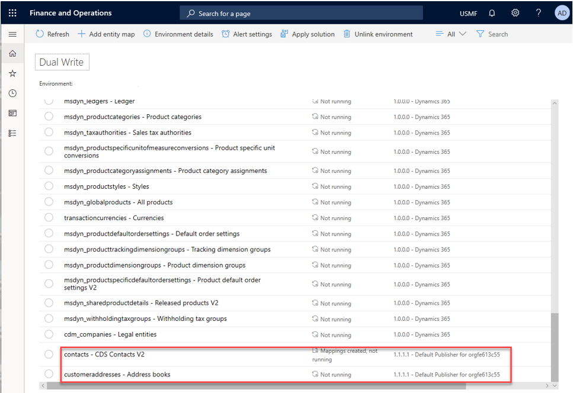
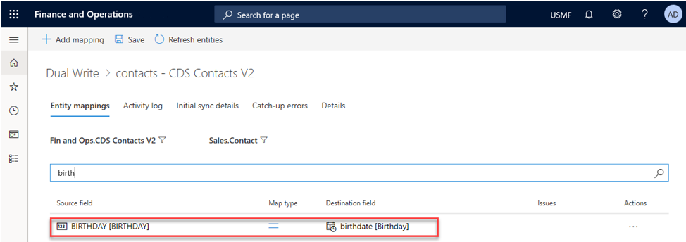

---

title: Application lifecycle management
description: This topic describes the benefits of making dual-write solution-aware.
author: sabinn-msft
manager: AnnBe
ms.date: 03/20/2020
ms.topic: article
ms.prod: 
ms.service: dynamics-ax-applications
ms.technology: 

# optional metadata

ms.search.form: 
# ROBOTS: 
audience: Developer
# ms.devlang: 
ms.reviewer: v-douklo
ms.search.scope: Operations
# ms.tgt_pltfrm: 
ms.custom:
ms.assetid: 
ms.search.region: Global
# ms.search.industry: 
ms.author: sabinn
ms.search.validFrom: 2020-03-20
ms.dyn365.ops.version: AX 7.0.0
---

# Application lifecycle management

[!include [banner](../../includes/banner.md)]

By making dual-write solution-aware, you enable basic application lifecycle management (ALM) capabilities, such as transportation and backup/restore of dual-write entity maps across environments. You also enable scenarios where you can get solutions that are published by Microsoft or an independent software vendor (ISV) from AppSource.

## What is a dual-write solution?

A dual-write solution can contain one or more dual-write entity maps. These maps can be imported into your environment (by selecting **Solutions** in Microsoft Power Apps). They can also be exported to other environments as a package. You can import Microsoft-published or ISV-published entity maps from AppSource, modify them in your test environment, test them, and then, when they are ready, export them to your production environment. Additionally, you can publish your solution through AppSource, so that other people can use it.

There two types of solutions: managed and unmanaged.

A managed solution can't be modified, and it can be uninstalled after it's imported. When you import an unmanaged solution, you add all the components of that solution into your environment. When you import an unmanaged solution that contains components that you've already customized, your customizations are overwritten by the customizations in the imported unmanaged solution.

For more information about solutions, see the [solutions overview](https://docs.microsoft.com/powerapps/maker/common-data-service/solutions-overview).

## Install the dual-write core solution

The dual-write core solution contains metadata for your entity maps and must be installed in your environments.

1. In Power Apps, in the left pane, select **Solutions**.
2. Select **Open AppSource**, and search for the solution that is named **Dual Write Core**.
3. Follow the prompts to import the solution.

    

## Install the dual-write entity maps solution

1. In Power Apps, in the left pane, select **Solutions**.
2. Select **Open AppSource**, and search for the solution that is named **Common Data Service Add-in for Finance and Operations package**.
3. Follow the prompts to import the solution.
4. In the Finance and Operations app, on the **Dual-write** page, select **Apply Solution** to apply the entity maps that you downloaded and installed. After you apply the solution, you will see that the default entity maps are published.

    

You've now successfully imported and applied a Microsoft-published dual-write entity maps solution to your environment.

## Import entity maps through a dual-write solution and apply them to your environment (New environments)

This section explains how to import entity maps from AppSource and apply them to your environment.

    
1. Import the dual-write core solution.

    1. Create a new dual-write environment (a Finance and Operations app environment and a Common Data Service environment).
    2. Follow the instructions in the [Install the dual-write core solution](#install-the-dual-write-core-solution) section earlier in this topic to install the dual-write core solution from AppSource in Power Apps.
    3. Verify that the dual-write core solution is listed under **Solutions** in Power Apps.

2. Import the Microsoft-published or ISV-published entity maps solution.

    1. Follow the instructions in the [Install the dual-write entity maps solution](#install-the-dual-write-entity-maps-solution) section to download and install the Microsoft-published or ISV-published entity maps from AppSource in Power Apps.
    2. Verify that the entity maps solution is listed under **Solutions** in Power Apps.

3. Apply the dual-write entity maps solution to your Finance and Operations app environment.

    Apply the solution that you downloaded by selecting **Apply Solutions** on the **Dual-write** page in the Finance and Operations app, as described in the [Install the dual-write entity maps solution](#install-the-dual-write-entity-maps-solution) section.

## Update entity maps and export them to other environments as a solution

This section explains how to export your customized entity maps as a solution, use it as a backup, and move the artifacts across environments and/or publish them to AppSource.

### Customize your entity maps

The first step is to customize your entity maps by modifying existing entity maps and adding a new entity map.

1. In the Finance and Operations app, on the **Entity mappings** tab, customize the mappings for the default entity map that you just installed by using a solution. To add a new entity map, select **Add Entity**. In both cases, when you save the entity map, you're prompted to specify the publisher and the version number.

    The following figure shows how to add a new field that is named **birthday** to the contacts - CDS Contacts V2 entity map and select the default publisher.

    

    > [!NOTE]
    > When you [create a new solution](#create-a-new-dual-write-solution-and-add-your-components-customized-entity-maps) by using these modified entity maps, you must specify the same publisher.

    The following figure shows how to add a new entity map that is named **Address books**.

    

2. Confirm the entity maps that you just modified and added. Be sure to enable and test them, to ensure that they work as you expect.

    

### Create a new dual-write solution and add your components (Customized entity maps)

Now that you've customized your mappings and added new mappings, the next step is to create a new dual-write solution and add the entity maps to it.

1. In Power Apps, in the left pane, select **Solutions**, and then select **New solution** to create a solution. For this example, the solution is named **MyCustomEntityMaps**. Be sure to select the same publisher that you selected in previous steps.

    

2. Select **Create**. The new solution appears on the **Solutions** list page.

    

3. Now that you've created your dual-write solution, you can add the customized entity maps that you created in previous steps. Select the **MyCustomEntityMaps** solution that you just created, select **Add existing**, point to **Other**, and then select **Dual Write entity map**.

    

4. In the list, select the customized entity maps, and add them to the solution. The solution should now contain your customized entities.

    

You've now customized your entities and put them into a solution.

### Export and publish your solution

After you run the solution checker and make sure that there are no issues, you export the solution that you created and publish the changes.

1. In the list of solutions, select your solution, and then select **Export**.
2. Update the version number, and select whether you want to export the solution as a managed or unmanaged solution. (We recommend that you export it as a managed solution.) Then select **Export**.

    

3. Before you export, select **Publish all changes**, and then select **Check for issues**. When you've finished, select **Next** to publish all your changes.

    

    The solution, together with all its components, is exported to a zip file.

    
    
You've now customized your entities, added them to a new solution, and created a solution file that can be imported and applied to other environments. (This capability can be useful if you want to move entity maps between test and production environments.) In a similar way, you can create a backup of all your entity maps by adding them to a solution and exporting the solution as a package. That package can then be imported into to any environment to restore the entity maps.

For information about how to publish the package to AppSource, see [Publish your app on AppSource](https://docs.microsoft.com/powerapps/developer/common-data-service/publish-app-appsource).

### Test your exported solution package

You can test your exported solution package by importing and applying it to another environment.

1. In Power Apps, select **Import** to import the package into a new environment.

    

2. Apply the solution that you just imported to the environment.

    

3. Verify that the two customized entity maps appear on the dual-write entity maps list page.

    

4. Make sure that the customizations from previous steps are preserved.

    

### Use the entity map version

Sometimes, a solution might contain different implementations of an entity map. For example, the version of the contacts - CDS Contacts V2 entity map might have a different publisher or a newer version number. In these cases, you can use the **Entity Map version** button to select which entity map you want to use in your environment.

## Upgrade existing dual-write environments for solution awareness (Existing environments)

1. Import the dual-write core solution.

    1. Follow the instructions in the [Install the dual-write core solution](#install-the-dual-write-core-solution) section earlier in this topic to import the dual-write core solution from AppSource into Power Apps.
    2. Verify that the dual-write core solution is listed under **Solutions** in PowerApps.

2. Upgrade the entity maps.

    You'll see a notification prompting you to upgrade.

    

    Select **Upgrade entity maps** at the top of the page.

    

The upgrade takes a few minutes. When it's completed, you receive a notification.
