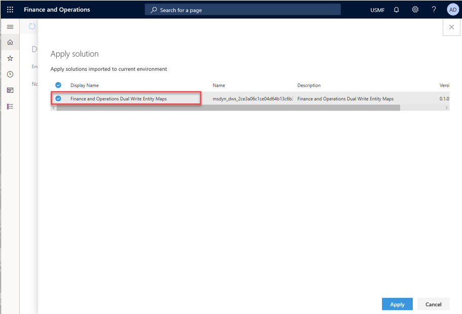
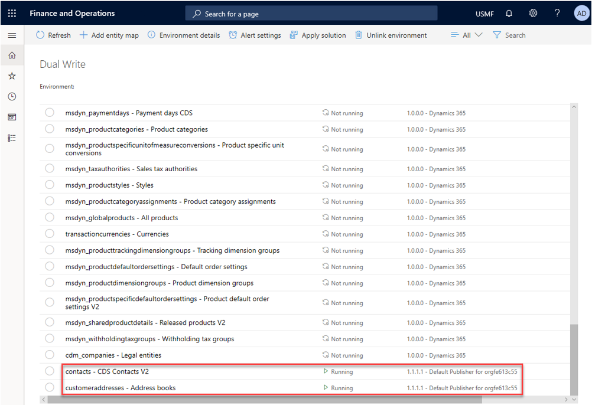
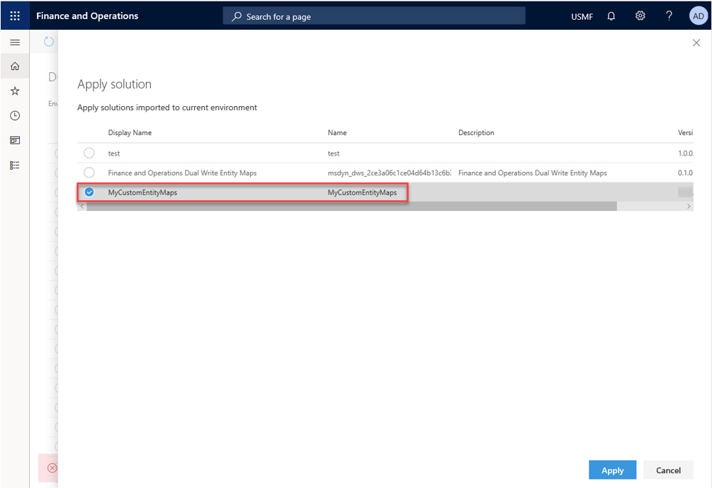
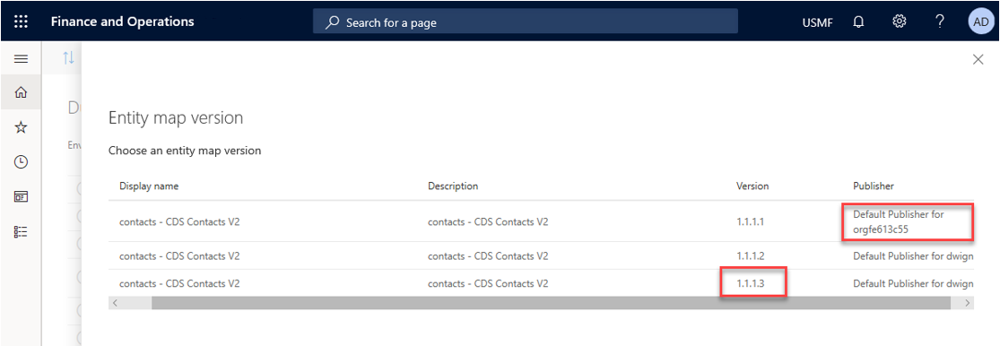
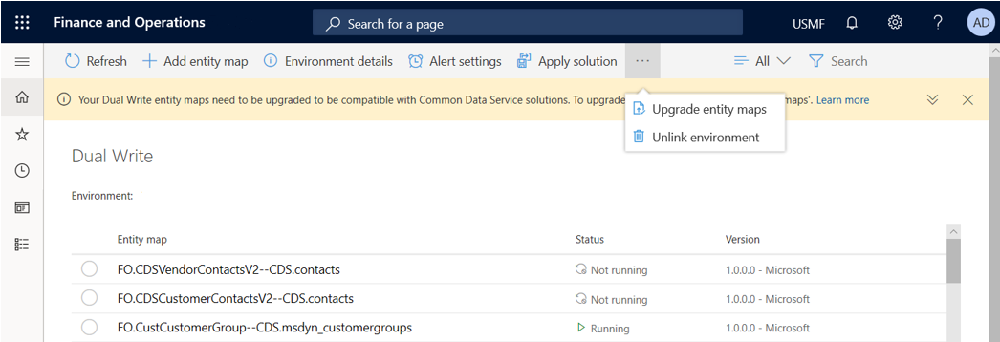

---

title: "Application lifecycle management"
description: Describes the benefits of making dual-write solution aware.
author: sabinn-msft

ms.technology: 
ms.topic: conceptual
ms.date: 03/13/2020
ms.author: v-douklo

LocalizationGroup: 
---

# Application lifecycle management

[!include [banner](../../includes/banner.md)]

[!include [banner](../../includes/preview-banner.md)]

Making dual-write solution aware enables basic application lifecycle management (ALM) abilities. These abilities include transportation and backup/restore of dual-write entity maps across environments. This also enables scenarios wherein you can get a solution from AppSource published by Microsoft or from an independent software vendor (ISV).

## What is a dual-write solution?

A dual-write solution can contain one or more dual-write entity maps. These maps can be imported into your environment (using Solutions in the Power Apps maker portal). Also, they can be exported as a package to other environments. You can import entity maps published by Microsoft or ISV from AppSource, modify these entity maps in your test environment, test it, and when ready, export it to your production environment. Additionally, you can also publish your solution to others through AppSource.

>[!Note]
>There two types of solutions: managed and unmanaged solutions. 

A managed solution can't be modified and can be uninstalled after it's imported. When you import an unmanaged solution, you add all the components of that solution into your environment. When you import an unmanaged solution that contains components you've already customized, your customizations are overwritten by the customizations in the imported unmanaged solution. 

For more information on solutions, see the [solutions overview](https://docs.microsoft.com/powerapps/maker/common-data-service/solutions-overview).

## How to install the dual-write core solution

The dual-write core solution contains metadata for your entity maps and must be installed in your environments.

The following steps describe how to install the dual-write core solution.

1. In the Power Apps maker portal, select **Solutions** in the left-hand pane.

2. Select **Open AppSource** and search for the solution named dual-write core.

3. Follow the prompts to import the solution. 

    <kbd>

## How to install the dual-write entity maps solution

The following steps describe how to install the dual-write entity maps solution.

1. In the Power Apps maker portal, select **Solutions** in the left-hand pane.

2. Select **Open AppSource** and search for the solution named Common Data Service Add-in for Finance and Operations package.

3. Follow the prompts to import the solution.

4. In the dual-write UI in the Finance and Operations app, select **Apply Solution** in the top menu of the dual-write page. This selection applies the entity maps that you downloaded and installed. Once you apply the solution, you'll see the default entity maps published.

    <kbd>

That's it&mdash;you've successfully imported and applied a Microsoft published dual-write entity map solution to your environment.

## Importing entity maps through a dual-write solution and applying to your environment (new environments)

In this section, you'll learn how to import entity maps from AppSource and apply them to your environment.

<kbd>
	
1. Import the dual-write core solution

    1. Start with a new dual-write environment (a Finance and Operations app and Common Data Service environment).

    1. Follow the instructions in [How-to install the dual-write core solution](#how-to-install-the-dual-write-core-solution) to import the dual-write core solution from AppSource to the Power Apps maker portal.

    1. Once imported, verify that you can see the dual-write core solution listed under **Solutions**.

2. Import the ISV or Microsoft published entity map solution.

    1. Follow the instructions in [How to install the dual-write entity maps solution](#how-to-install-the-dual-write-entity-maps-solution) to download and install the entity maps from ISV or Microsoft using AppSource to the Power Apps maker portal.

    1. Once imported, verify that you see the entity map solution listed under **Solutions**.

3. Apply the dual-write entity map solution in your Finance and Operations app environment.

    Follow the instructions in [How to install the dual-write entity maps solution](#how-to-install-the-dual-write-entity-maps-solution) to apply the solution you downloaded from the dual-write page by selecting **Apply Solutions**.

## Updating entity maps and exporting them as a solution to other environments

In this section, you'll learn how to export your customized entity maps as a solution, use it as a backup and move these artifacts across environments and/or publish to AppSource.

<kbd>

### Customize your entity maps

The following steps describe how to customize your entity maps by modifying existing entity maps and adding new an entity map.

1. In the Finance and Operations app, select the **Entity mappings** tab to   customize the mappings for the default entity map (that you just installed using a solution).
  
   Also, you can add a new entity map by selecting the **Add Entity** button. In both cases, when you save the entity map, you'll be prompted to specify the publisher and the version number.

   The following figure shows how to add a new "birthday" field to the contacts-CDS Contacts V2 entity map and choose the default publisher.

   <kbd>

   >[!Note]
   >When you [create a new solution](#create-a-new-dual-write-solution-and-add-your-components-(customized-entity-maps)) with these modified entity maps, you'll need to specify the same publisher.

   The following figure shows how to add a new entity map called **Address books**.

   <kbd>

2. Confirm the entity maps you just modified and added. Make sure to enable and test them to ensure they are working as expected.

   <kbd>

### Create a new dual-write solution and add your components (customized entity maps)

Now that you've customized your mappings and added new mappings, the next step is to create a new dual-write solution and add these entity maps to the solution.

   1. Go to the Power Apps maker portal and create a New solution under **Solutions**. Make sure to choose the same publisher as in prior steps.

       <kbd>

   2. Select **Create**, and the new solution will show up in the Solutions list page.

       <kbd>

   3. Now that you've created your Dual Write solution, you want to add the customized entity maps that created in prior steps. To the maps, select the solution you just created, select **Add existing**, and then select **Dual Write entity map**.

      <kbd>

   4. From the list, select the customized entity maps and add it to the solution. The new solution you created (MyCustomeEntityMaps) should now contain your customized entities.

      <kbd>

      With this step, you've customized your entities and put them into a solution.

### Exporting and publishing your solution

Once you run the Solution checker and make sure there are no issues, you can export the solution you created and publish the changes.

1. In the list of solutions, select your solution, and then select **Export**.

2. Update the version number and choose to export as a managed (recommended) or unmanaged solution. Select **Export** to export your solution.

   <kbd>

3. Before you export, choose **Publish all changes** and **Check for issues**. Select **Next** to publish all your changes.

   <kbd>

    After you select **Next**, the solution, with all its components, is exported to a .zip file 

   <kbd>
	
That's it&mdash;you've customized your entities, added them to a new solution, and created a solution file that can now be imported and applied to other environments (useful to move entity maps between test and production environments). Similarly, you could create a backup of all your entity maps by adding them to a solution and exporting the solution as a package, which can then be imported to restore the entity maps into to any environment.

Follow the steps in [Publish your app on AppSource](https://docs.microsoft.com/powerapps/developer/common-data-service/publish-app-appsource) to publish this package to AppSource.

### Test your exported solution package

You can test your exported solution package by importing and applying it in another environment.

1. First import the package to a new environment.

   <kbd>

2. Apply the solution you just imported on your environment.

    <kbd>

3. Check to see whether the two customized entity maps are listed on the dual-write entity maps list page. 

      <kbd>

4. Check to make sure the customizations from prior steps are preserved. 

      <kbd>

### How to use the Entity map version

There could be situations where a solution might contain different implementations of an entity map. For example, the contacts&mdash;CDS Contacts -V2 entity map version might have a different publisher or a newer version. Using the **Entity Map version** button, you could select which entity map to use for your environment.

<kbd>
 
## How to upgrade existing dual-write environments for solution awareness (existing environments)

1. Import the dual-write core solution.

    Follow the instructions in [How to install the dual-write core solution](#how-to-install-the-dual-write-core-solution) to import the dual-write core solution from AppSource to the Power Apps maker portal. 

    Once imported, verify that you see the dual-write core solution listed under Solutions.

2. Upgrade entity maps.

    Once you allow list your tenant, you'll see a notification prompting you to upgrade.

      <kbd>

    Select **Upgrade entity maps** from top menu.

      <kbd>

    You'll receive a notification once the upgrade completes (which takes a few minutes).

