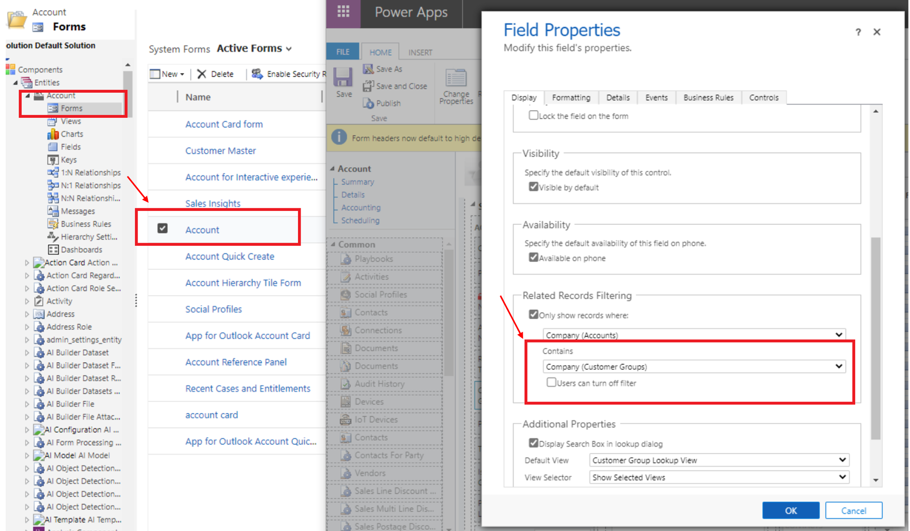

---
# required metadata

title: Apply company context based filtering on lookup fields
description: This topic describes the ways to apply the company context based filtering on lookup fields.
author: RamaKrishnamoorthy 
manager: AnnBe
ms.date: 07/27/2020
ms.topic: article
ms.prod: 
ms.service: dynamics-ax-applications
ms.technology: 

# optional metadata

ms.search.form: 
# ROBOTS: 
audience: Application User, IT Pro
# ms.devlang: 
ms.reviewer: rhaertle
ms.search.scope: Core, Operations
# ms.tgt_pltfrm: 
ms.custom: 
ms.assetid: 
ms.search.region: global
ms.search.industry: 
ms.author: ramasri
ms.dyn365.ops.version: 
ms.search.validFrom: 2020-07-27

---

# Apply company context based filtering on lookup fields

In order to achieve the company context based filtering on your custom forms or custom lookup fields added to the standard forms, please open the form and use "Related Records Filtering" section to apply the company filter. You can find the setting on each entity's form as shown below. You need to do this setting for each lookup field that requires filtering based on the underlying company on a given record.

