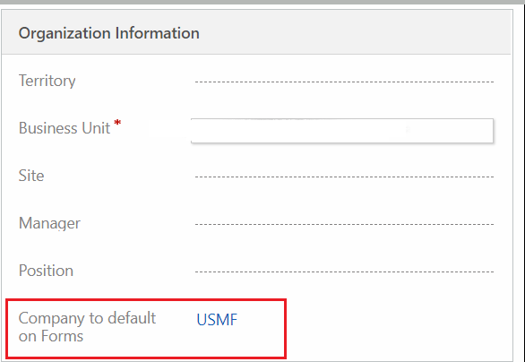
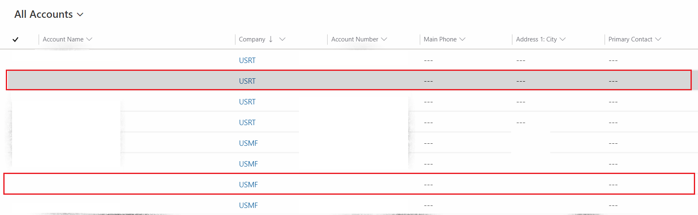

---
# required metadata

title: Autopopulate company name in customer engagement apps
description: This topic describes the ways to autopopulate company name in Customer Engagement Apps user interface.
author: RamaKrishnamoorthy 
manager: AnnBe
ms.date: 07/27/2020
ms.topic: article
ms.prod: 
ms.service: dynamics-ax-applications
ms.technology: 

# optional metadata

ms.search.form: 
# ROBOTS: 
audience: Application User, IT Pro
# ms.devlang: 
ms.reviewer: rhaertle
ms.search.scope: Core, Operations
# ms.tgt_pltfrm: 
ms.custom: 
ms.assetid: 
ms.search.region: global
ms.search.industry: 
ms.author: ramasri
ms.dyn365.ops.version: 
ms.search.validFrom: 2020-07-27

---

# Autopopulate company name in customer engagement apps

[!include [banner](../../includes/banner.md)]

In Customer Engagement app user interface, there are 3 ways to auto-populate the company name.
+ As a system administrator, you can set the default company for a user from  Advanced Settings > System > Security > Users. Open the User form, under "Organization Information" section, set "Company to default on Form" to required company.

+ In case the user has "Write" permission on "SystemUser" entity minimum at "Business Unit" level, then he can change the default company on any form by selecting a company from the Company lookup drop down.

+ In case the user has write access to more than one company data, then by choosing a record that belongs to different company changes his default company to the chosen one.

As a system configurator or administrator, if you want to autopopulate company data on a custom form, then you can achieve it using [Events in forms](https://docs.microsoft.com/en-us/powerapps/developer/model-driven-apps/clientapi/events-forms-grids) and taking a reference of "msdyn_/DefaultCompany.js" javascript for setting the following events. You can use any out of the box form as an example like "Account" form .

+ OnLoad : defaultCompany
+ OnChange of Company field : updateDefaultCompany

