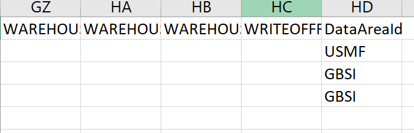

---
# required metadata

title: Why do I need bootstrapping?
description: 
author: 
manager: tfehr
ms.date: 12/01/2020
ms.topic: article
ms.prod: 
ms.service: dynamics-ax-platform
ms.technology: 

# optional metadata

# ms.search.form: 
# ROBOTS: 
audience: Developer
# ms.devlang: 
ms.reviewer: rhaertle
# ms.tgt_pltfrm: 
ms.custom: 31301
ms.search.region: Global
# ms.search.industry: 
ms.author: rhaertle
ms.search.validFrom: 2020-12-01
ms.dyn365.ops.version: AX 7.0.0

---

# Why do I need bootstrapping?

[!include [banner](../includes/banner.md)]

[!include [preview-banner](../includes/preview-banner.md)]

You might have an existing Dataverse or Finance and Operations app instance with business data, and you want to enable dual-write connection against it. In this case, you need to bootstrap Dataverse or Finance and Operations app data with company information before enabling dual-write connection.

This document describes sample scenarios explaining how to use Azure Data Factory (ADF) to bootstrap data into Dataverse tables for dual-write. It doesn't cover all tables, error handling scenarios, or lookups. Use this document and template as a reference to setup your own ADF pipeline to import/update data into Dataverse.

## High-level scenario

- Consider the **Customers** table in a Finance and Operations app and the **Account** table in Dataverse, for example.
- Use initial write to copy reference and dependent tables, for example, **Company**, **Customer groups**, and **Terms of payment**. Copy from the Finance and Operations app to Dataverse.
- Use the data management framework to export data from Finance and Operations in csv format. For example, setup an export project in data management to export customers from each company, using the **DataAreaId** field, the in Finance and Operations app. It's one-time manual process.
- Use Azure Blob Storage to store the csv files for lookup and transformation. Upload your Finance and Operations customers csv file in Azure Blob Storage.
- Use Azure Data Factory ([ADF](https://docs.microsoft.com/azure/data-factory/introduction)) to bootstrap data into Dataverse.

## High-level flow

:::image type="content" source="media/boot-process-flow.png" alt-text="High-level flow":::

## Assumptions

- Source data is the Finance and Operations app.
- If an account exists in Dataverse and it doesn't exist in the Finance and Operations app, that account will not be bootstrapped as part of this flow.
- All account records in the customer engagements have a natural key (account number) that matches Finance and Operations natural key (CustomerAccount).
- Records have 1-1 mapping across the apps.

## Prerequisites

- Azure subscription: You must have **contributor access** to an existing Azure subscription. If you don\'t have an Azure subscription, create a [free Azure account](https://azure.microsoft.com/en-us/free/) before you begin.
- Azure storage account: If you don\'t have a storage account, see [Create an Azure storage account](https://docs.microsoft.com/azure/storage/common/storage-account-create?tabs=azure-portal#create-a-storage-account) for steps to create one.
- Azure data factory: - Create an Azure Data Factory resource follow the steps to [create a Data factory](https://docs.microsoft.com/en-us/azure/data-factory/tutorial-copy-data-portal#create-a-data-factory).
- Finance and Operations app: Use the data management framework to export the data in csv format. For more information, see [Data management overview](../data-entities-data-packages.md)). In this template, example is used for exporting customers using **CustCustomerV3Entity**.
- Dynamics 365 Dataverse: Dataverse administrator user credentials to bootstrap the data.
- Dual-Write: Dual-write solutions installed, and reference data is copied using the initial write.

## Deployment steps

### Setup Azure Storage account

If you don\'t have a storage account, see [Create an Azure storage account](https://docs.microsoft.com/azure/storage/common/storage-account-create?tabs=azure-portal#create-a-storage-account) for steps to create one. Create one container named `ce-data` in your storage account. This container will be used to store all data files. You can change it if needed in your datasets and pipe-lines. Navigate to **Access keys** and copy **Connection string** as shown in the screenshot. This value is required when you import the Azure Data Factory template:

:::image type="content" source="media/boot-storage-account.png" alt-text="Set up access keys":::

### Deploy Azure Data Factory Template

1. Note the Azure data factory name that you created.
2. Note the Azure Storage account connection string.
3. Note Dataverse instance service URI and Admin user name and password.
    Here are parameters you need:

    | Parameter name | Description | Example |
    |---|---|---|
    |Factory name | Name of your data factory   |BootstrapDataverseDataADF |
    |Bootstrap blob storage account Linked Service_connection String | Connection string of blob storage |As copied at the time of creating storage account |
    |Bootstrap Dynamics 365 Linked Service_service Uri | URI of the Dataverse instance |`https://contosod365.crm4.dynamics.com` |
    |Bootstrap Dynamics 365 Linked Service_properties_type Properties_username | Dynamics 365 Admin user id    | `<adminservice@contoso.onmicrosot.com>` |  
    |Bootstrap Dynamics 365 Linked Service_password | Dynamics 365 Admin user's password | \*\*\*\*\*\*\*\* | 

4. Download the [ARM template file](https://github.com/microsoft/Dynamics-365-FastTrack-Implementation-Assets/blob/master/Dual-write/Bootstrapping/arm_template.json) to your local directory.
5. Navigate to [Custom deployment](https://ms.portal.azure.com/#create/Microsoft.Template).
6. Select **Build your own template in the editor**.
7. Select **Load file** and locate the ARM template file you downloaded earlier. Select **Save**.
8. Provide the required parameters, then select **Review** and **Create**.

    :::image type="content" source="media/boot-custom-deployment.png" alt-text="Customize a template":::

9. After deployment, you will find below **Pipelines**, **Datasets** and **Data flows**.

    :::image type="content" source="media/boot-pipeline.png" alt-text="Pipelines, Datasets and Data flows":::

## Run the process

- In the Finance and Operations app, use the data management framework to export data in csv format. For more information, see [Data management overview](../data-entities-data-packages.md). In this template, the example used exports customer records using the **CustCustomerV3Entity** table. Set up the **CustCustomerV3Entity** and remove the **FullPrimaryAddress** field map from the mapping. Add the **DataAreaId** field in the csv field. Rename the exported file to **01-CustomersV3Export-Customers V3.csv** and upload to the Azure Storage account that you named **ce-data**.

    

- Download the [Sample customer file](https://github.com/microsoft/Dynamics-365-FastTrack-Implementation-Assets/blob/master/Dual-write/Bootstrapping/01-CustomersV3Export-Customers%20V3.csv).
- Run **BootstrapAccountsPipeline** from Azure Data Factory.
