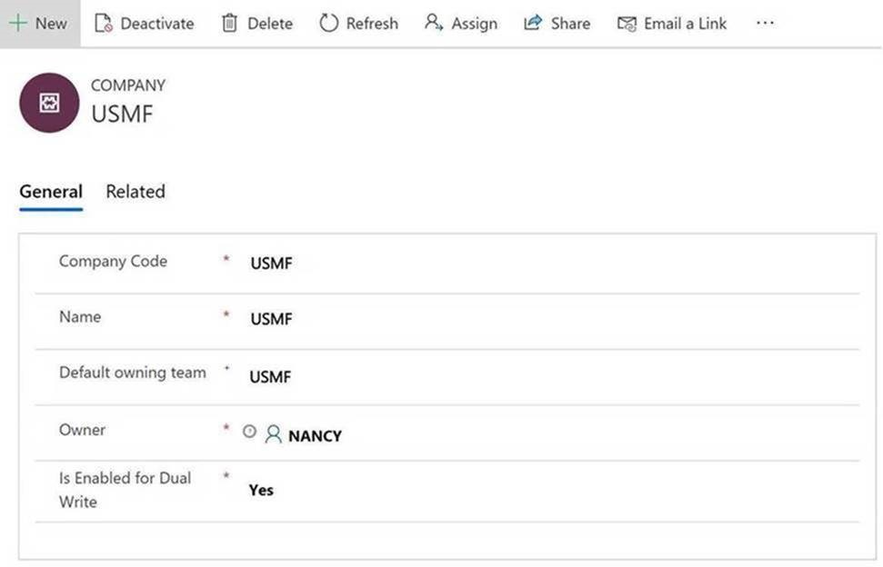

---
# required metadata

title: Company concept in Common Data Service
description: This topic describes the integration of company data between Finance and Operations and Common Data Service.
author: RamaKrishnamoorthy 
manager: AnnBe
ms.date: 07/15/2019
ms.topic: article
ms.prod: 
ms.service: dynamics-ax-applications
ms.technology: 

# optional metadata

ms.search.form: 
# ROBOTS: 
audience: Application User, IT Pro
# ms.devlang: 
ms.reviewer: rhaertle
ms.search.scope: Core, Operations
# ms.tgt_pltfrm: 
ms.custom: 
ms.assetid: 
ms.search.region: global
ms.search.industry: 
ms.author: ramasri
ms.dyn365.ops.version: 
ms.search.validFrom: 2019-07-15

---

# Company concept in Common Data Service

[!include [banner](../../includes/banner.md)]

[!include [preview-banner](../../includes/preview-banner.md)]

In Finance and Operations, the concept of a *company* is both a legal construct and a business construct. It's also a security and visibility boundary for data. Users always work in the context of a single company, and most of the data is striped by company.

Common Data Service doesn't have an equivalent concept. The closest concept is *business unit*, which is primarily a security and visibility boundary for user data. This concept doesn't have the same legal or business implications as the company concept.

Because business unit and company aren't equivalent concepts, it isn't possible to force a one-to-one (1:1) mapping between them for the purpose of Common Data Service integration. However, because users must, by default, be able to see the same records in the application and Common Data Service, Microsoft has introduced a new entity in Common Data Service that is named cdm\_Company. This entity is equivalent to the Company entity in the application. To help guarantee that visibility of records is equivalent between the application and Common Data Service out of the box, we recommend the following setup for data in Common Data Service:

+ For each Finance and Operations Company record that is enabled for dual-write, an associated cdm\_Company record is created.
+ When a cdm\_Company record is created and enabled for dual-write, a default business unit is created that has the same name. Although a default team is automatically created for that business unit, the business unit isn't used.
+ A separate owner team is created that has the same name. It's also associated with the business unit.
+ By default, the owner of any record that is created and dual-written to Common Data Service is set to the "DW Owner" team that is linked to the associated business unit.

The following illustration shows an example of this data setup in Common Data Service.

Because of this configuration, any record that is related to the USMF company will be owned by a team that is linked to the USMF business unit in Common Data Service. Therefore, any user who has access to that business unit through a security role that is set to business unit–level visibility can now see those records. The following example shows how teams can be used to provide the correct access to those records.

+ The "Sales Manager" role is assigned to members of the "USMF Sales" team.
+ Users who have the "Sales Manager" role can access any account records that are members of the same business unit that they are members of.
+ The "USMF Sales" team is linked to the USMF business unit that was mentioned earlier.
+ Therefore, members of the "USMF Sales" team can see any account that is owned by the "USMF DW" user, which would have come from the USMF Company entity in Finance and Operations.

As the preceding illustration shows, this 1:1 mapping between business unit, company, and team is just a starting point. In this example, a new "Europe" business unit is manually created in Common Data Service as the parent for both DEMF and ESMF. This new root business unit is unrelated to dual-write. However, it can be used to give members of the "EUR Sales" team access to account data in both DEMF and ESMF by setting the data visibility to **Parent/Child BU** in the associated security role.

A final topic to discuss is how dual-write determines which owner team it should assign records to. This behavior is controlled by the **Default owning team** field on the cdm\_Company record. When a cdm\_Company record is enabled for dual-write, a plug-in automatically creates the associated business unit and owner team (if it doesn't already exist), and sets the **Default owning team** field. The admin can change this field to a different value. However, the admin can't clear the field as long as the entity is enabled for dual-write.

> [!div class="mx-imgBorder"]

## Company striping and bootstrapping

Common Data Service integration brings company parity by using a company identifier to stripe data. As the following illustration shows, all company-specific entities are extended so that they have a many-to-one (N:1) relationship with the cdm\_Company entity.

> [!div class="mx-imgBorder"]

+ For records, after a company is added and saved, the value becomes read-only. Therefore, users should make sure that they select the correct company.
+ Only records that have company data are eligible for dual-write between the application and Common Data Service.
+ For existing Common Data Service data, an admin-led bootstrapping experience will soon be available.
