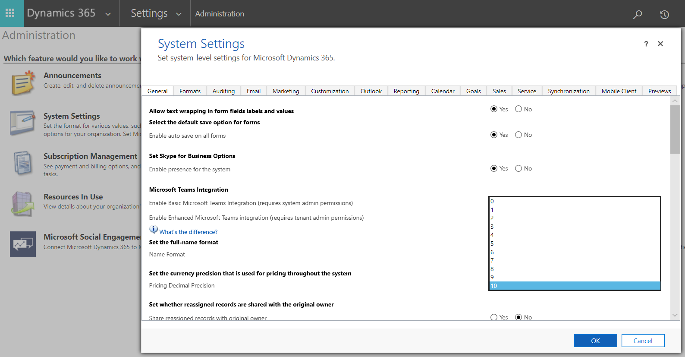
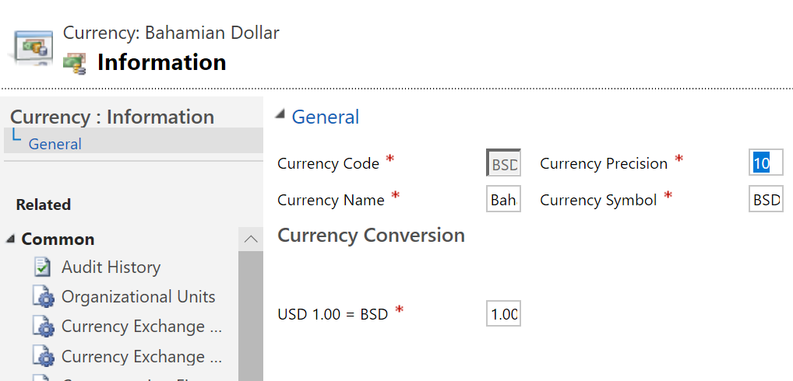

# Currency data-type migration for dual-write

[!include [banner](../../includes/banner.md)]

You can increase the number of decimal places that are supported for currency values to a maximum of 10. The default limit is four decimal places. By increasing the number of decimal places, you help prevent data loss when you use dual-write to sync data. The increase in the number of decimal places is an opt-in change. To implement it, you must request assistance from Microsoft.

The process of changing the number of decimal places has two steps:

1. Request migration from Microsoft.
2. Change the number of decimal places in Dataverse.

The Finance and Operations app and Dataverse must support the same number of decimal places in currency values. Otherwise, data loss can occur when this information is synced between apps. The migration process reconfigures the way that currency and exchange rate values are stored, but it doesn't change any data. After the migration is completed, the number of decimal places for currency codes and pricing can be increased, and the data that users enter and view can have more decimal precision.

Migration is optional. If you might benefit from support for more decimal places, we recommend that you consider migration. Organizations that don't require values that have more than four decimal places don't have to migrate.

## Requesting migration from Microsoft

Storage for existing currency columns in Dataverse can't support more than four decimal places. Therefore, during the migration process, currency values are copied to new internal columns in the database. This process occurs continuously until all data has been migrated. Internally, at the end of migration, the new storage types replace the old storage types, but the data values are unchanged. The currency columns can then support up to 10 decimal places. During the migration process, Dataverse can continue to be used without interruption.

At the same time, exchange rates are modified so that they support up to 12 decimal places instead of the current limit of 10. This change is required so that the number of decimal places is the same in both the Finance and Operations app and Dataverse.

Migration doesn't change any data. After the currency and exchange rate columns are converted, admins can configure the system to use up to 10 decimal places for currency columns by specifying the number of decimal places for each transaction currency and for pricing.

### Request a migration

To make this feature available, email **CDSExpandDecimal@microsoft.com**, and include the following information:

+ **Subject:** Request to enable expanded decimal support for \<organizationID\>
+ **Body:** I would like to enable expanded decimal support for my org \<organizationID\>.

A Microsoft representative will contact you within two to three business days for the next steps.

When you request a migration, you should be aware of the following details and plan for them accordingly:

+ The time that is required to migrate the data depends the amount of data in the system. Migration of large databases can take several days.
+ The size of the database temporarily increases while the migration is running, because additional space is needed for indexes. Most of the additional space is freed when the migration is completed.
+ During the migration process, if errors occur that prevent the migration from being completed, the system raise alerts to Microsoft Support, so that Support staff can intervene. However, even if errors occur during the migration, Dataverse remains fully available for regular use.
+ The migration process isn't reversible.

## Changing the number of decimal places

After the migration is completed, Dataverse can store numbers that have more decimal places. Admins can choose how many decimal places are used for specific currency codes and for pricing. Users of Microsoft Power Apps, Power BI, and Power Automate can then view and use numbers that have more decimal places.

To make this change, you must update the following settings in Power Apps:

+ **System Settings: Currency precision for pricing** – The **Set the currency precision that is used for pricing throughout the system** column defines how the currency will behave for the organization when **Pricing Precision** is selected.
+ **Business Management: Currencies** – The **Currency Precision** column lets you specify a custom number of decimal places for a specific currency. There is a fallback to the organization-wide setting.

There are some limitations:

+ You can't configure the currency column on a table.
+ You can specify more than four decimal places only at the **Pricing** and **Transaction Currency** levels.

### System Settings: Currency precision for pricing

After migration is completed, admins can set the currency precision. Go to **Settings \> Administration**, and select **System Settings**. Then, on the **General** tab, change the value of the **Set the currency precision that is used for pricing throughout the system** column, as shown in the following illustration.

### Business Management: Currencies

If you require that the currency precision for a specific currency differ from the currency precision that is used for pricing, you can change it. Go to **Settings \> Business Management**, select **Currencies**, and select the currency to change. Then set the **Currency Precision** column to the number of decimal places that you want, as shown in the following illustration.

### Tables: Currency column

The number of decimal places that can be configured for specific currency columns is limited to four.

### Default currency decimal precision
For the expected behavior for the default currency decimal precision under migration and non-migration scenarios, refer to the following table. 

| Created date  | Currency decimal field    | Existing org (Currency field not migrated) | Existing org (Currency field migrated) | New org created post build 9.2.21062.00134 |
|---------------------------------------------------------|-------------------------------------------------------------------|-----------------------------------------------------------------------------------------------------------------------------------------------------------------------------|-------------------------------------------------|------------------------------------------------|
| Currency field created before build 9.2.21111.00146  |     |  |       |
|    | Max precision visible in UI   | 4 digits    | 10 digits    | N/A    |
| | Max precision visible in database and DB query results UI         | 4 digits   | 10 digits   | N/A    |
| Currency field created after build 9.2.21111.00146 |    |  |     |   |
|   | Max decimal precision visible in UI     | 4 digits   | 10 digits   | 10 digits     |
|          | Max decimal precision visible in database and DB query results UI | 10 digits. However, only 4 are significant with all zeros beyond the 4 decimal digits. This enables a simpler and faster migration of the org, if required. | 10 digits      | 10 digits     |

[!INCLUDE[footer-include](../../../../includes/footer-banner.md)]
