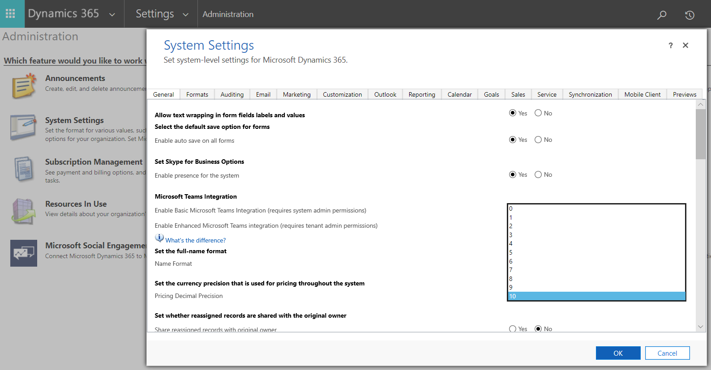
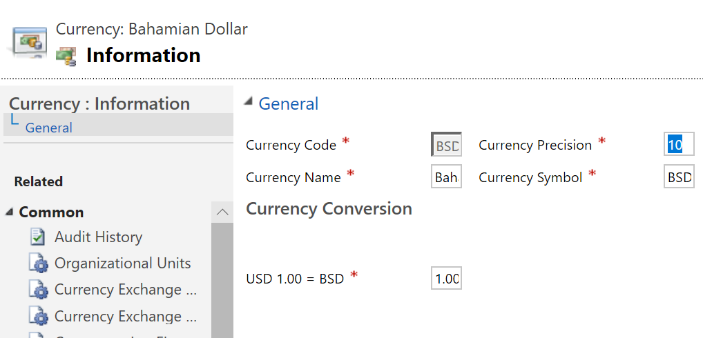

---
# required metadata

title: Currency data-type migration for dual-write
description: This topic describes how to change the number of decimal places for currency supported by dual-write.
author: RamaKrishnamoorthy 
manager: AnnBe
ms.date: 04/06/2020
ms.topic: article
ms.prod: 
ms.service: dynamics-ax-applications
ms.technology: 

# optional metadata

ms.search.form: 
# ROBOTS: 
audience: Application User, IT Pro
# ms.devlang: 
ms.reviewer: rhaertle
ms.search.scope: Core, Operations
# ms.tgt_pltfrm: 
ms.custom: 
ms.assetid: 
ms.search.region: global
ms.search.industry: 
ms.author: ramasri
ms.dyn365.ops.version: 
ms.search.validFrom: 2020-04-06
---

# Currency data-type migration for dual-write

[!include [banner](../../includes/banner.md)]

You can increase the number of decimal places supported for currency values, up to 10 places. The default limit is 4. Increasing the decimal places prevents data loss when you synchronize data using dual-write. Increasing the decimal places is an opt-in change, and you must request assistance from Microsoft to implement the change.

Changing the number of decimal places is a two-step process:

+ Request migration from Microsoft.
+ Change the number of decimal places in Common Data Service.

The Finance and Operations app and Common Data Service must support the same number of decimal positions on currency values to avoid data loss when this information is synchronized between apps. The migration process reconfigures the way currency and exchange rate values are stored, but it does not change any data. After the migration is complete, the number of decimal positions for currency codes and pricing can be increased, and users can enter and display data with greater decimal precision.

Migration is optional. We recommend that if you would benefit from increased decimal position support, then you should consider migration. Organizations that have no need for values with more than 4 decimal places do not need to migrate.

## Migration process

Storage for existing currency fields in Common Data Service cannot support more than 4 decimal positions. Therefore, during the migration process, currency values are copied to new internal fields in the database. This process occurs continuously until all data has been migrated. Internally, at the end of migration, the new storage types replace the old ones, but the data values are unchanged. The currency fields are then capable of supporting up to 10 decimal places. During the migration process, Common Data Service can continue to be used without interruption.

At the same time, exchange rates are also modified to support up to 12 decimal positions instead of the current limit of 10. This change is also necessary to match the number of decimal positions for currency exchange rate that the Finance and Operations app supports.

No data is changed during the migration process. After all currency and exchange rate fields have been converted, admins can configure the system for up to 10 decimal positions for currency fields by specifying the number of positions for each transaction currency and for pricing.

### How to request a migration

If you want to enable this feature, email \<\<distlist\>\> and include the following information:

+ **Subject**: Request to enable expanded decimal support for \<organizationID\>
+ **Body**: I would like to enable expanded decimal support for my org \<organizationID\>

A Microsoft representative will contact you within 2-3 business days for the next steps.

You should plan for the following when you request the migration:

+ The amount of time required to migrate existing data to prepare for expanded decimal positions varies according to the amount of data in the system. In large databases, it may run for several days.
+ The size of the database will be temporarily increased while the migration is running, including additional space for supporting indexes. At the conclusion of migration, most of this additional space will be freed up.
+ If there are errors during the migration process that prevent it from being completed, the system is designed to raise alerts internally for Microsoft support intervention. However, even if there are errors in the migration, Common Data Service remains fully available for normal use.
+ The migration process is not reversible.

## Changing the number of decimal places

After migration is complete, Common Data Service can store numbers with more decimal places. Admins can choose how many decimal places to use for specific currency codes and for pricing. Making these changes allows users of Power Apps, Power BI, and Power Automate to view and use numbers with more decimal places.

To enable this change, you must update these settings in Power Apps:

+ **System Settings: Precision for pricing**: The pricing precision sets how the currency will behave for the organization when **Pricing Precision** is selected.
+ **Business Management: Currencies**: The **Currency Precision** setting lets you use custom currency-specific decimal positions, with a fallback to the organization setting.

There are some limitations:

+ You cannot configure the currency field on an entity. 
+ Specifying more than four decimal positions can only be done at the **Pricing** and **Transaction Currency** levels.

### System Settings: Currency Precision for pricing

After migration is complete, admins can set the currency precision by accessing: **Settings \> Administration \> System Settings** and then changing the value for **Set the currency precision that is used for pricing throughout the system**. The setting is shown in the following image.

### Business Management: Currencies

If you need a specific currency to behave differently than the currency pricing precision, you can change the currency precision for the specific currency. To do this, go to **Settings \> Business Management \> Currencies** and select the currency you want to change. Set the **Currency Precision** setting to the number of decimal places you want. The setting is shown in the following image.

### Entities: Currency Field

The number of decimal positions that can be configured for specific currency fields is limited to 4.

