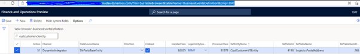
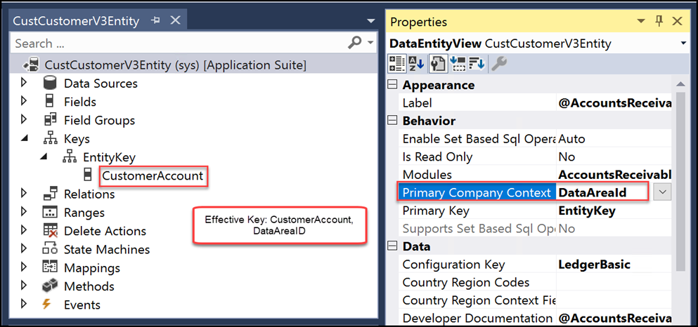
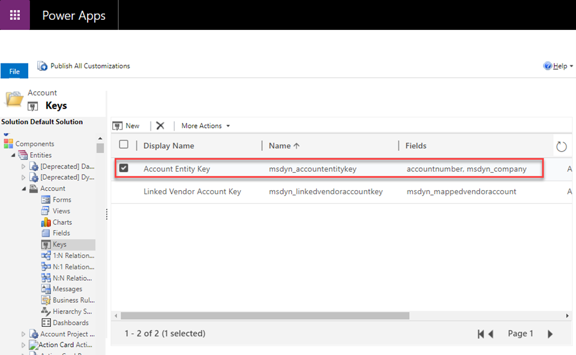
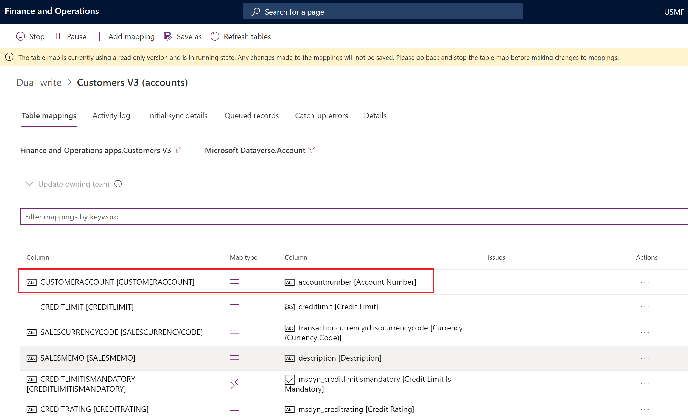
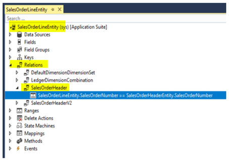
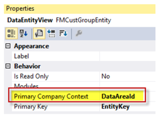

# Customization guidance for dual-write

[!include [banner](../../includes/banner.md)]


Dual-write provides out-of-box maps for some business processes. However, there might be scenarios where you need additional fields, maps, or transformations. The dual-write platform is extensible. You can create custom maps and extend existing maps with custom fields to sync data between Finance and Operations apps and Microsoft Dataverse. This topic provides guidance and best practices for these customizations.

Before you customize any maps, you should be familiar with the tasks in [Customize table and column mappings](customizing-mappings.md).

## Guidance when the entity is in both the Finance and Operations app and Dataverse

If the entity is in both environments, create a dual-write map.

+ Integration keys for the entity should match in both environments. If the entity key isn't available on either side, be sure to create entity keys. The integration key fields should be mapped to each other in the map.
+ The **company** field should not be present in the mapping if the entity is legal entity–specific, because the **company** field will already be part of the key. For an example, review the **Customer groups (msdyn\_customergroups)** entity mapping.
+ Add filters to either the Finance and Operations environment or the Dataverse environment to trigger the dual-write map only on specific criteria. The **Customers V3 - Accounts or CDS Contacts V2 (Contacts)** map has several filters that you can use as examples.

## Guidance when the entity is in the Finance and Operations app only

If the entity is in the Finance and Operations app only, create a new entity in Dataverse, and then add a map.

+ If the Finance and Operations entity contains data that is legal entity–specific, be sure to add a lookup field to **cdm\_companies** in the new Dataverse entity. If the Finance and Operations entity is global, a field for the company isn't required in the Dataverse entity.
+ Add keys to the Dataverse entity to mimic the Finance and Operations entity key. Dual-write requires the same entity keys in both the Finance and Operations environment and the Dataverse environment. The key fields on the Finance and Operations app and Dataverse should be mapped to each other. Don't add the **company** field in the mapping. For an example, review the **Vendors V2 - msdyn\_vendors mapping**.

## Guidance when the entity is in Dataverse only

If the entity is in Dataverse only, create a new entity in the Finance and Operations environment, and then add a map.

+ Create the new entity, and include all the required fields. Make sure that the entity is enabled for Data management and public, so that it can be consumed by OData (Open Data Protocol). For more information about how to create a new entity, see [Build and consume data entities](../build-consuming-data-entities.md).
+ If data in the Finance and Operations app should be legal entity–specific, be sure to add a lookup field to **cdm\_companies** in the Dataverse entity. If the Finance and Operations entity is global, a field for the company isn't required in the Dataverse entity.
+ Make sure that both entities have the entity key fields. Dual-write requires the same entity keys in both the Finance and Operations environment and the Dataverse environment. The key fields on the Finance and Operations app and Dataverse should be mapped to each other. Don't add the **company** field in the mapping. For an example, review the **Vendors V2 - msdyn\_vendors mapping**.

## Add attributes to a mapping

If the entities exist in both environments and are mapped, you can add attributes to the map. For more information, see [Customize table and column mappings](customizing-mappings.md).

## Create and update operations don't trigger the synchronization of attributes to Dataverse

In some situations, the entities exist in both environments, but create and update operations don't trigger the synchronization of attributes to Dataverse. Go to the **BusinessEventsDefinition** table either by using SQL on the Finance and Operations virtual machine (VM) or by using the table browser. Make sure that there is a record for the combination of the affected table that has an updated date (in the **RefTableName** field) and the entity name (in the **RefEntityName** field). An example is shown in the following image.



## Guidance when entities aren't available in either the Finance and Operations app or Dataverse

If the entities don't exist in either environment, you can create tables in both environments and then create the app by following these steps.

1. In Dataverse, create a new table that has all the required fields. Follow the steps in [Create a custom table](/powerapps/maker/data-platform/data-platform-create-entity). If the table should store legal entity–specific data, be sure to add a lookup field to **cdm\_companies** in the new Dataverse table. If the table stores global data, a field for the company isn't required in the Dataverse table.
2. In the Finance and Operations app, create a new entity that has all the required fields. Make sure that the entity is enabled for Data management and public, so that it can be consumed by OData. For more information about how to create a new entity, see [Build and consume data entities](../build-consuming-data-entities.md).
3. To enable table maps for dual-write, define an alternative key in the Dataverse table. The value of the alternative key in Dataverse must match the key that is defined in the Finance and Operations app. For example, in the Finance and Operations app, **CustomerAccount** is the key for the **Account** table, as shown in the following illustration.

    

    In Dataverse, **accountnumber** is defined as the key for the **Account** table, as shown in the following illustration.

    

    If you review the **Customers V3** table map, you can see that **accountnumber** is mapped to **CustomerAccount**.
    
    

## Best practices for dual-write

+ Changes must be in a transaction. It's important that you evaluate the number of records per transaction, based on your table design. It's also important that you evaluate how transaction blocks are structured as part of the process in X++. Two examples are shown here.

    ```xpp
    ttsbegin;
    // Transaction start
    table1record1.insert();
    table1record2.insert();
    table1record3.insert();
    table1recordN.insert();
    ttscommit;
    // Transaction end
    ```

    ```xpp
    ttsbegin;
    // Transaction start
    while (// loop conditions// )
    {
        table1recordN.insert();
    }
    ttscommit;
    // Transaction end
    ```

+ The following items aren't handled by business events. Therefore, they aren't handled by dual-write.

    + The **doUpdate** method
    + The **doInsert** method
    + Set-based operations (**insert** and **update**)
    + Records where **skipBusinessEvents(true)** is marked

+ Business events must be registered for the data source that is mapped. Data sources aren't tracked if they are outer-joined and marked as read-only in the Finance and Operations app.
+ Changes are triggered only if the modifications are on the mapped fields in the Finance and Operations app. In customer engagement apps, all field modifications trigger dual-write synchronization.
+ Every filter evaluation should provide a valid result.
+ Data sources aren't tracked if they don't have any fields that are mapped.
+ Entity relationships in the Finance and Operations app must indicate to dual-write that the two entities are linked, and that relationships exist between the two records in the same transaction. Dual-write batching depends on entity relationships that are explicitly defined and considered to sequence the record insertion if both the parent record and child record are part of the same transaction on related entities. If a business process in the Finance and Operations app involves several entities and must be enabled as batch mode in the customer engagement app, dual-write expects the relationships to be identified and defined on the entity. The following illustration shows the relationship between **Sales Order header V2** and **Sales Order Line V2**.

    

+ To help prevent performance issues, avoid using a large number of data sources in dual-write data tables that raise multiple events for a record change. Don't map unwanted fields in dual-write, and avoid excessive business logic on tables and entities.
+ If a custom entity in the Finance and Operations app is company-specific (that is, the primary company context property of the entity is set to **DataAreaId**, as shown in the following illustration), the related Dataverse table should have a company lookup as one of the key columns. Mapping between the shared entity and the company-specific entity isn't allowed. You can determine whether a Finance and Operations app entity is shared or company-specific by looking at the **entity** property in Visual Studio Application Explorer. For more information, see [Cross company behavior of Data entities](../cross-company-behavior.md).

    

## Filter guidance for maps

You can apply filters to both Finance and Operations entities and Dataverse tables. Filters should be applied only on fields that are present on the dual-write maps. Verify the filter results before you add them to dual-write maps.

For Finance and Operations entities, you can verify filter expressions by using the following code example in an X++ runnable class. Replace the expression and the entity name, and run the class.

```xpp
var entityName = "PROJECTENTITY";
var filterExpression = '(ParentProject == "")';
Query query = new Query();
query.literals(NoYes::Yes);
QueryBuildDataSource qbd =
query.addDataSource(tablename2id(entityName));
qbd.addRange(fieldname2id(qbd.table(),identifierStr(RecVersion))).
value(filterExpression);
qbd.addSelectionField(fieldname2id(qbd.table(),identifierStr(RecId)));
QueryRun qRun = new QueryRun(query);
// This provides the actual SQL statement to execute
var actualSqlStatement = query.getSQLStatement();
while(qRun.next())
{
    var rec = qRun.get(tableName2Id(entityName));
}
```

For Dataverse tables, you can verify filter expressions by adding the expression as a filter condition on the OData expression.

```powerappsfl
https://<Env URL>/api/data/v9.0/<TableName>?$filter=<fieldname> eq <value>
```

For more information about filters, and more examples, see [Examples and patterns for filtering](dual-write-faq.md#where-can-i-find-examples-and-patterns-for-filtering-dual-write-maps).

[!INCLUDE[footer-include](../../../../includes/footer-banner.md)]
