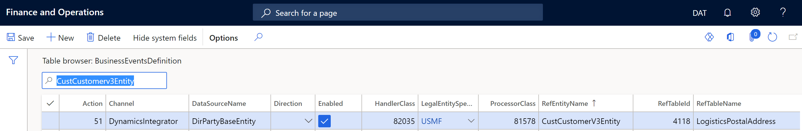

# Customization guidance for dual-write

[!include [banner](../../includes/banner.md)]

[!include [rename-banner](~/includes/cc-data-platform-banner.md)]

Dual-write provides out of box maps for certain business processes, but there may be scenarios where you need additional fields, maps, or transformations. The dual-write platform is extensible and lets you create custom maps and extend existing maps with custom fields to sync data between Finance and Operations apps and Dataverse. When you use these customizations, there are some considerations and best practices that you need to account for.

## The entity is in both the Finance and Operations app and Dataverse

You can create a dual-write map by following instructions in [Customize table and column mappings](customizing-mappings.md).

+ Integration keys for the entity on both Finops and Dataverse should match. If the entity key is not available on any side, make sure to create entity keys. These integration key fields should be mapped with each other in the map. + Company field should not be present in the mapping if the entity is legal entity specific since company field would already be part of the key. Refer Customer groups (msdyn\_customergroups) entity mapping for reference. + Add any filters to Finance and Operations or Dataverse side to trigger the dual write map only on certain criteria based on your requirements. [Customize table and column mappings](customizing-mappings.md) The **Customers V3 - Accounts or CDS Contacts V2 (Contacts)** map has several filters that you can use as examples. ## The entity is in only the Finance and Operations app
You can create a new entity in Dataverse by following instructions in [Create a custom table](/learn/modules/create-manage-entities/2-custom-entity).

+ If the Finance and Operations entity contains legal entity specific data, make sure to add a lookup field to cdm\_companies in the new Dataverse entity. If the Finance and Operations entity is global , then a field for company is not required in the Dataverse entity + Add keys to the Dataverse entity mimicking the Finance and Operations entity key as the requirement of dual write platform is to have same entity keys on both Finance and Operations and Dataverse. The key fields on both Finance and Operations and Dataverse should be mapped with each other, do not add the company field in the mapping. Refer to the Vendors V2 - msdyn\_vendors mapping as an example. For more information on creating new table maps refer to [Customize table and column mappings](customizing-mappings.md)   ## Scenario: Entity is only in Dataverse Create a new entity in Finance and Operations with all the required fields, make sure it is Data management enabled and public so that the entity can be consumed by Odata. For more information on creating a new entity refer to [Build and consume data entities](../data-entities/build-consuming-data-entities.md)

+ If data in Finance and Operations is supposed to be legal entity specific , make sure to add a lookup field to cdm\_companies in the Dataverse entity. If the Finance and Operations entity is global, then a field for company is not required in the Dataverse entity + Make sure to have the same fields in the entity keys as the requirement of dual write platform is to have same entity keys on both Finance and Operations and Dataverse. The key fields on both Finance and Operations and Dataverse should be mapped with each other, do not add the company field in the mapping. + For more information on creating new table maps refer to [Customize table and column mappings](customizing-mappings.md) ## How to add attributes to a mapping If the entities exist in both environments and are mapped, you can add attributes to the map. For more information, see [Customize table and column mappings](customizing-mappings.md). ## Create and update do not trigger the attributes to sync to Dataverse In some situations, the entities exist in both environments, but create and update do not trigger the attributes to sync to Dataverse. Navigate to the **BusinessEventsDefinition** table by using SQL in the Finance and Operations virtual machine or using table browser. Ensure that there is a record for the combination of the affected table which has updated date (in the **RefTableName** field) and entity name (in the **RefEntityName** field). An example is shown in the following image.



## Entities are not available in either the Finance and Operations app or Dataverse

You can create tables in both environments and then create the app by following these steps:

1. Create a new entity in Dataverse with all the required fields by following the steps in [Create a custom table](/modules/create-manage-entities/2-custom-entity).
    If the entity should store legal entity specific data make sure to add a lookup field to cdm\_companies in the new Dataverse entity. If the entity stores global data, then a field for company is not required in the Dataverse entity. 2. Create a new entity in Finance and Operations with all the required fields. Make sure it is Data management enabled and public so that the entity can be consumed by Odata. For more information on creating a new entity, see [Build and consume data entities](../data-entities/build-consuming-data-entities.md) 3. To enable table maps for dual-write, define an alternative key in Dataverse. The value of the alternative key in Dataverse must match the key that is defined in the Finance and Operations app. For example, in a Finance and Operations app, CustomerAccount is the key for the Account table, as shown in the following screenshot. 
    In Dataverse, accountnumber is defined as the key for the Account table.

    

    In the **Customers V3** table map, you can see that **accountnumber** is mapped to **CustomerAccount**. For more information on creating new table maps, see [Customize table and column mappings](customizing-mappings.md)

    

## Prerequisite and best practice considerations for dual-write

Other best practices are:

+ Changes must be in a transaction. It is Important to evaluate \# of records per transaction based on your entity design and evaluate how transaction blocks are structured as part of the process in X++

    ```xpp
    ttsbegin;
    // Transaction start
    table1record1.insert();
    table1record2.insert();
    table1record3.insert();
    table1recordN.insert();
    ttscommit;
    // Transaction end
    ```

    ```xpp
    ttsbegin;
    // Transaction start
    While (..) // loop
    {
    table1recordN.insert();
    }
    ttscommit;
    // Transaction end
    ```

+ The **doUpdate** method, the **doInsert** method, the set-based operations (insert and update), and records where **skipBusinessEvents(true)** is marked will not be handled by business events and subsequently not handled by dual-write.
+ Business events must be registered for the data source that is mapped. There can be data sources that are outer joined and marked as readonly in the Finance and Operations app. These data sources are not tracked.
+ Changes are triggered only if the modifications are on the mapped fields in the Finance and Operations app. In customer engagement apps, all field modifications trigger dual-write sync.
+ Every filter evaluation should provide a valid result.
+ Data sources which do not have any fields mapped are not tracked
+ Entity relationships within Finance and Operations app to indicate the dual-write platform that the two entities are linked and there are relationships that exist between the two records within the same transaction. Dual-write batching depends on entity relationships explicitly defined and considered to sequence the record insertion if both parent and child record are part of same transaction on related entities. If there is a business process in Finance and Operations apps that involves several entities and has to be enabled as batch mode for customer engagement, dual-write expects the relationships to be identified and defined on the entity. The following screenshot show the relationship between **Sales Order header V2** and **Sales Order Line V2**.  + To avoid any performance issues, avoid using large number of data sources in Dual write data entities resulting in raising multiple events for a record change. Do not map unwanted fields in Dual write entity map and avoid excessive business logic on data entities. + If a custom entity on Finance and operations is company specific i.e. Primary company context property of entity is set to DataAreaId , then related Dataverse table should have company lookup as one of the key columns. Also mapping between shared entity and company specific entity not allowed. You can identify if a Finance & Operations app entity is shared or company specific by looking the entity property from Visual studio application explorer. You can read more about the behaviour on [Cross company behaviour of Data entities](../data-entities/cross-company-behavior.md).

    

## Filter guidance for maps

Filters can be applied both on Finance and operations entities or Dataverse tables. Filters should only be applied on fields present on the dual write maps and you can follow below methodology to verify the filter results before putting them onto dual write maps.

Filter expressions on Finance and operation entities can be verified using the following code example in an X++ runnable class. Replace the expression and the entity name and run the class.

```xpp
var entityName = "PROJECTENTITY";
var filterExpression = '(ParentProject == "")';
Query query = new Query();
query.literals(NoYes::Yes);
QueryBuildDataSource qbd =
query.addDataSource(tablename2id(entityName));
qbd.addRange(fieldname2id(qbd.table(),identifierStr(RecVersion))).
value(filterExpression);
qbd.addSelectionField(fieldname2id(qbd.table(),identifierStr(RecId)));
QueryRun qRun = new QueryRun(query);
// This provides the actual sql statement to execute
var actualSqlStatement = query.getSQLStatement();
while(qRun.next())
{
var rec = qRun.get(tableName2Id(entityName));
}
```

Filter expressions on Dataverse tables can be verified by adding the expression as filter condition on the Odata expression.

```dos
https://<Env URL>/api/data/v9.0/<TableName>?$filter=<fieldname> eq <value>
```

For more information about filters, including more examples, see [Examples and patterns for filtering](dual-write-faq#where-can-i-find-examples-and-patterns-for-filtering-dual-write-maps).

[!INCLUDE[footer-include](../../../../includes/footer-banner.md)]
