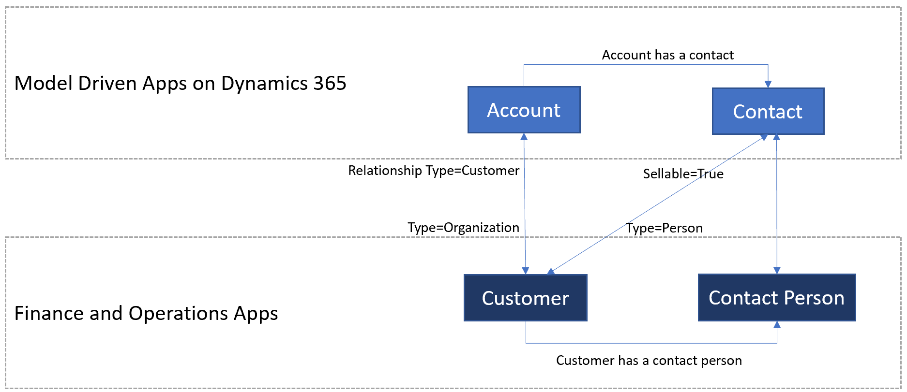

---
# required metadata

title: Integrated customer master
description: This topic describes the integration of customer data between Finance and Operations and Common Data Service.
author: RamaKrishnamoorthy 
manager: AnnBe
ms.date: 07/15/2019
ms.topic: article
ms.prod: 
ms.service: dynamics-ax-applications
ms.technology: 

# optional metadata

ms.search.form: 
# ROBOTS: 
audience: Application User, IT Pro
# ms.devlang: 
ms.reviewer: rhaertle
ms.search.scope: Core, Operations
# ms.tgt_pltfrm: 
ms.custom: 
ms.assetid: 
ms.search.region: global
ms.search.industry: 
ms.author: ramasri
ms.dyn365.ops.version: 
ms.search.validFrom: 2019-07-15

---

# Integrated customer master

[!include [banner](../../includes/banner.md)]

Customer data can be mastered in more than one Dynamics 365 application. For example, a customer record can originate though sales activity in Dynamics 365 Sales (a model-driven app in Dynamics 365), or a record can originate through retail activity in Dynamics 365 Commerce (a Finance and Operations app). No matter where where the customer data originates, it is integrated behind the scenes. Integrated customer master gives you the flexibility to master customer data in any Dynamics 365 application and provides a comprehensive view of the customer across the Dynamics 365 application suite.

## Customer data flow

*Customer* is a well-defined concept in applications. Therefore, the integration of customer data just involves harmonizing the customer concept between the two applications. The following illustration shows the customer data flow.

Customers can be broadly classified into two types: commercial/organizational customers and consumers/end users. These two types of customers are stored and handled differently in Finance and Operations and Common Data Service.

In Finance and Operations, both commercial/organizational customers and consumers/end users are mastered in a single table that is named **CustTable** (CustomerCustomerV3Entity), and they are classified based on the **Type** attribute. (If **Type** is set to **Organization**, the customer is a commercial/organizational customer, and if **Type** is set to **Person**, the customer is a consumer/end user.) The primary contact person information is handled through the SMMContactPersonEntity entity.

In Common Data Service, commercial/organizational customers are mastered in the Account entity and are identified as customers when the **RelationshipType** attribute is set to **Customer**. Both consumers/end users and the contact person are represented by the Contact entity. To provide a clear separation between a consumer/end user and a contact person, the **Contact** entity has a Boolean flag that is named **Sellable**. When **Sellable** is **True**, the contact is a consumer/end user, and quotations and orders can be created for that contact. When **Sellable** is **False**, the contact is just a primary contact person of a customer.

When a non-sellable contact participates in a quotation or order process, **Sellable** is set to **True** to flag the contact as a sellable contact. A contact that has become a sellable contact remains a sellable contact.

## Templates

Customer data includes all information about the customer, such as the customer group, addresses, contact information, payment profile, invoice profile, and loyalty status. A collection of entity maps works together during customer data interaction, as shown in the following table.

Finance and Operations apps | Other Dynamics 365 apps         | Description
----------------------------|---------------------------------|------------
CDS Contacts V2             | contacts                        | This template synchronizes all primary, secondary, and tertiary contact information, for both customers and vendors.
Customer groups             | msdyn_customergroups            | This template synchronizes customer group information.
Customer payment method     | msdyn_customerpaymentmethods    | This template synchronizes customer payment method information.
Customers V3                | accounts                        | This template synchronizes customer master information for commercial and organizational customers.
Customers V3                | contacts                        | This template synchronizes customer master data for consumers and end users.
Name affixes                | msdyn_nameaffixes               | This template synchronizes name affixes reference data, for both customers and vendors.
Payment day lines CDS V2    | msdyn_paymentdaylines           | This template synchronizes payment day lines reference data, for both customers and vendors.
Payment days CDS            | msdyn_paymentdays               | This template synchronizes payment days reference data, for both customers and vendors.
Payment schedule lines      | msdyn_paymentschedulelines      | Syncs payment schedule lines reference data, for both customers and vendors.
Payment schedule            | msdyn_paymentschedules          | This template synchronizes payment schedule reference data, for both customers and vendors.
Terms of payment            | msdyn_paymentterms              | This template synchronizes payment terms (terms of payment) reference data, for both customers and vendors.

[!include [banner](../../includes/dual-write-symbols.md)]

[!include [mapping contacts contacts](includes/CDSContactsV2-contacts.md)]

[!include [mapping customer group](includes/CustCustomerGroup-msdyn-customergroups.md)]

[!include [mapping customer payment method](includes/CustomerPaymentMethod-msdyn-customerpaymentmethods.md)]

[!include [mapping customer accounts](includes/CustomersV3-accounts.md)]

[!include [mapping customer contacts](includes/CustomersV3-contacts.md)]

[!include [mapping name affixes](includes/NameAffixes-msdyn-nameaffixes.md)]

[!include [mapping payment day lines](includes/PaymentDayLinesCdsV2-msdyn-paymentdaylines.md)]

[!include [mapping payment days](includes/PaymentDaysCds-msdyn-paymentdays.md)]

[!include [mapping payment schedule lines](includes/PaymentScheduleLines-msdyn-paymentschedulelines.md)]

[!include [mapping payment schedules](includes/PaymentSchedules-msdyn-paymentschedules.md)]

[!include [mapping terms of payment](includes/TermsofPayment-msdyn-paymentterms.md)]
