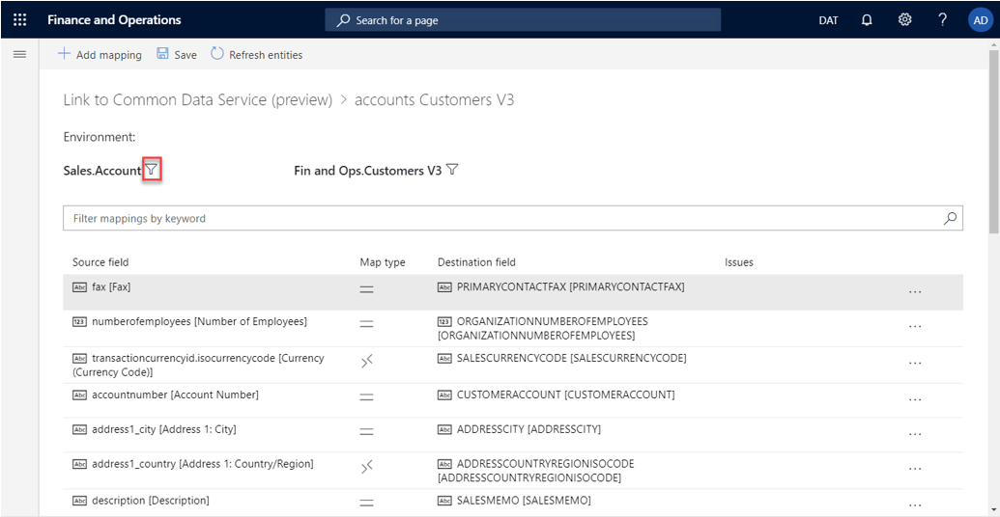

---

title: Customize entity and field mappings
description: This topic explains how to customize entity and field mappings.
author: sabinn-msft
manager: AnnBe
ms.date: 03/20/2020
ms.topic: article
ms.prod: 
ms.service: dynamics-ax-applications
ms.technology: 

# optional metadata

ms.search.form: 
# ROBOTS: 
audience: Developer
# ms.devlang: 
ms.reviewer: v-douklo
# ms.tgt_pltfrm: 
ms.custom:
ms.assetid: 
ms.search.region: Global
# ms.search.industry: 
ms.author: sabinn
ms.search.validFrom: 2020-03-20
ms.dyn365.ops.version: AX 7.0.0
---

# Customize entity and field mappings

[!include [banner](../../includes/banner.md)]

[!include [rename-banner](~/includes/cc-data-platform-banner.md)]

The out-of-box table maps have predefined entity and field mappings that enable the flow of data between two apps. In this way, they serve as "blueprints." However, because every business is different, the default table maps might sometimes not be enough. Therefore, dual-write fully supports customization by providing ways to change table maps and field mappings.

## Customize field mappings, add transforms, and enable filtering

1. In your Finance and Operations app, on the **Dual-write** page, on the **Table mappings** tab, select the table map to customize.

    > [!NOTE]
    > Before you change table mappings, they must be stopped (not running). Otherwise, your changes won't be saved.

2. On the **Table mappings** tab, you can customize a field by selecting a new or custom field from either the Finance and Operations app or Dataverse.

    

3. You can customize the synchronization direction (unidirectional or bidirectional) and add transforms by selecting the map type.

    

    The following table describes the available synchronization directions.

    | Symbol | Description |
    |---|---|
    |  | Bidirectional field assignment |
    |  | Bidirectional field assignment that uses transforms |
    |  | Unidirectional field assignment (left to right) |
    |  | Unidirectional field assignment (right to left) |
    |  | Unidirectional field assignment that uses transforms (left to right) |
    |  | Unidirectional field assignment that uses transforms (right to left) |

    The following table describes the available transform types.

    | Transform type | Description |
    |---|---|
    | Default | Default values are values that are applied to destination fields when no source field value is available. Use default values for fields that are required on the destination entity when you have no corresponding source field. |
    | Value map | Value maps define how values that are present in one entity should be mapped to values in the other entity. |

4. You can add a new field by selecting **Add mapping** and then selecting an existing or custom field in the list.

    The following illustration shows an example where a new **birthdate** field is being added.

    

5. When you've finished customizing the field mappings, select **Save**. Then follow the prompts to specify a publisher and a version number.

    

### Filter your data

Dual-write lets you filter data by using Open Data Protocol (OData) filter expressions for Dataverse. For the Finance and Operations app, filtering resembles range expressions that are used in the query range.

1. On the table mapping page, select the filter button (funnel symbol).

    

2. In the **Edit query** dialog box, specify your filters. In this example, the filter that is specified will return only accounts where the account type equals **3**.

    

    The following table shows some examples of filter expressions.

    | Dataverse | Finance and Operations apps |
    |---|---|
    | Accounttype eq '3' | (accounttype == '3') |
    | numberofemployees gt 1000 and numberofemployees le 2000 | ((numberofemployees > 1000) && (numberofemployees <= 2000)) |

    For more examples that show how to use expressions in query ranges, see [Using Expressions in Query Ranges](https://docs.microsoft.com/dynamicsax-2012/developer/using-expressions-in-query-ranges).
    
    Currently, we do not support nested lookups in dual-write source filter. Only standard filter operators directly against entity fields are supported. For more examples, see [Standard filter operators](https://docs.microsoft.com/powerapps/developer/common-data-service/webapi/query-data-web-api#standard-filter-operators).
    
## Add new table maps

Although Microsoft is continuing to add new tables, you can also add standard or custom table maps.

The following example shows how to add a new table map that is named **Address books**.

1. In the Finance and Operations app, on the **Dual-write** page, select **Add table map**.

    

    > [!NOTE]
    > When you [create a new solution](app-lifecycle-management.md#create-a-new-dual-write-solution-and-add-your-components-customized-entity-maps) that uses these modified table maps, you must specify the same publisher.

2. Confirm the table maps that you just modified and added. Be sure to enable and test them, to ensure that they work as you expect.

    

## Next steps

[Error management and alert notifications](errors-and-alerts.md)
