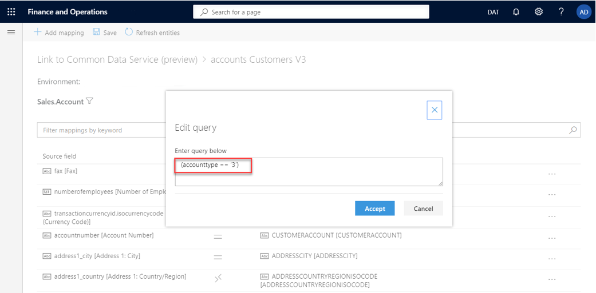
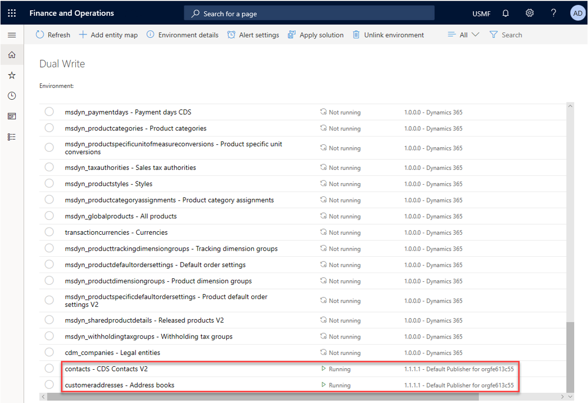

# Customize table and column mappings

[!include [banner](../../includes/banner.md)]

The out-of-box table maps have predefined table and column mappings that enable the flow of data between two apps. In this way, they serve as "blueprints." However, because every business is different, the default table maps might sometimes not be enough. Therefore, dual-write fully supports customization by providing ways to change table maps and column mappings.

>[!Note:]
>The Worker Personal details entity in Dataverse doesn't contain Professional Suffix. Professional suffix can be added using extensibility. You can't save new values to Professional Suffix and Personal Suffix of the Worker entity while mapping Worker Personal details from Dataverse to the Worker entity in finance and operations. The data source DirNameAffixPersonalSuffix, that contains these two fields, will not save values to fields that aren't available in finance and operations. 

## Customize column mappings, add transforms, and enable filtering

1. In your finance and operations app, on the **Dual-write** page, on the **Table mappings** tab, select the table map to customize.

    > [!NOTE]
    > Before you change table mappings, they must be stopped (not running). Otherwise, your changes won't be saved.

2. On the **Table mappings** tab, you can customize a column by selecting a new or custom column from either the finance and operations app or Dataverse.

    

3. You can customize the synchronization direction (unidirectional or bidirectional) and add transforms by selecting the map type.

    

    The following table describes the available synchronization directions.

    | Symbol | Description |
    |---|---|
    |  | Bidirectional column assignment |
    |  | Bidirectional column assignment that uses transforms |
    |  | Unidirectional column assignment (left to right) |
    |  | Unidirectional column assignment (right to left) |
    |  | Unidirectional column assignment that uses transforms (left to right) |
    |  | Unidirectional column assignment that uses transforms (right to left) |

    The following table describes the available transform types.

    | Transform type | Description |
    |---|---|
    | Default | Default values are values that are applied to destination columns when no source column value is available. Use default values for columns that are required on the destination table when you have no corresponding source column. |
    | Value map | Value maps define how values that are present in one table should be mapped to values in the other table. |

4. You can add a new column by selecting **Add mapping** and then selecting an existing or custom column in the list.

    The following illustration shows an example where a new **birthdate** column is being added.

    

5. When you've finished customizing the column mappings, select **Save**. Then follow the prompts to specify a publisher and a version number.

    

### Filter your data

Dual-write lets you filter data by using Open Data Protocol (OData) filter expressions for Dataverse. For the finance and operations app, filtering resembles range expressions that are used in the query range.

1. On the table mapping page, select the filter button (funnel symbol).

    

2. In the **Edit query** dialog box, specify your filters. In this example, the filter that is specified will return only accounts where the account type equals **3**.

    

    The following table shows some examples of filter expressions.

    | Filter | Dataverse | Finance and operations apps |
    |---|---|---|
    |String field like| startswith(name, 'A')|(name like "A*")|
    |String field not like|not contains(name, 'A')|(!(name like "*A*"))|
    |Enumeration fields| AccountType eq '3'| (AccountType == AccountType::Customer)|
    |Dates|TransactionDate le '2021-06-23'|(TransactionDate <= 23\06\2021)|
    |Multiple criteria combined| numberofemployees gt 1000 and numberofemployees le 2000 | ((numberofemployees > 1000) && (numberofemployees <= 2000)) |

    For more examples that show how to use expressions in query ranges, see [Using Expressions in Query Ranges](/dynamicsax-2012/developer/using-expressions-in-query-ranges).

    Currently, we do not support nested lookups in dual-write source filter. Only standard filter operators directly against table columns are supported. For more examples, see [Standard filter operators](/powerapps/developer/common-data-service/webapi/query-data-web-api#standard-filter-operators).

## Add new table maps

Although Microsoft is continuing to add new tables, you can also add standard or custom table maps.

The following example shows how to add a new table map that is named **Address books**.

1. In the finance and operations app, on the **Dual-write** page, select **Add table map**.

    

    > [!NOTE]
    > When you [create a new solution](app-lifecycle-management.md#create-new-solution) that uses these modified table maps, you must specify the same publisher.

2. Confirm the table maps that you just modified and added. Be sure to enable and test them, to ensure that they work as you expect.

    

## Next steps

[Error management and alert notifications](errors-and-alerts.md)

[!INCLUDE[footer-include](../../../../includes/footer-banner.md)]

