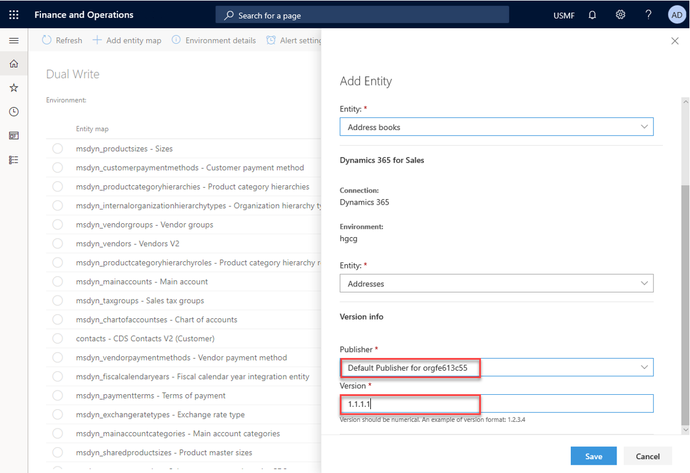

---

title: "Customizing entity and field mappings"
description: Describes the .
author: sabinn-msft

ms.technology: 
ms.topic: conceptual
ms.date: 03/13/2020
ms.author: v-douklo

LocalizationGroup: 
---

# Customizing entity and field mappings

The out of the box OOB entity maps serve as a blueprint with predefined entity and field mappings to enable flow of data between two apps. However, we understand that every business is different and sometimes the default entity maps may not be enough. To address these needs, we have made dual-write fully supportive of customizations by providing you ways to modify and customize entity maps and field mappings

## How-to customize field mappings, add transforms and enabling filtering

* Navigate to the Entity mappings tab by select the entity map that you want to customize. To be able to make changes to entity mappings, they need to be stopped (not running) else your changes won't be saved

* On Entity mappings tab, you can customize a field by picking a new or custom field from either Dynamics 365 Finance and Operations or Common Data Service

    

* You can also customize the Sync direction (unidirectional or bidirectional) and add Transforms by clicking the Map type

    

* Additionally, you can also add a new field by clicking on the Add mapping button and picking an existing or custom field from the list. 

    Here is an example of adding a new "Birthdate" field

      

* Once you complete customizing field mappings, click save and follow the prompts choose a publisher and version number

    

Description of available sync direction: 

|Symbol |Description |
| --- | --- |
| |Bi-directional field assignment |
| |Bi-directional field assignment with transforms |
| |Uni directional field assignment (left to right) |
| |Uni directional field assignment (right to left) |
| |Uni directional field assignment with transforms (left to right) |
| |Uni directional field assignment with transforms (right to left) |
| | |

Description of available transform types:

|Transform type |Description |
| --- | --- |
|Default |Default values are values that are applied to destination field when no source field value is available. Use default values for fields that are required on the destination entity when you have no corresponding source field. |
|Value map |Value maps define how values that are present in one entity should be mapped to values in the other entity. | 
| | |

### Filtering your data

With Dual Write, we are providing you the ability to filter data using OData filter expression for Common Data Service. For Dynamics 365 for Finance and Operations, filtering is like range expressions used in query range.

* Click the filter icon from the entity mapping screen

    

* Specify your filters in the Edit query box. In this example I specified a filter to return only accountype equal to '3'

    

Here are some more examples of filter expressions:

|Common Data Service |Dynamics 365 for Finance and Operations |
| --- | --- |
|Accounttype eq '3' |(accounttype == '3') |
|numberofemployees gt 1000 and  numberofemployees le 2000 |((numberofemployees > 1000) &&  (numberofemployees <= 2000)) |
| | |

Click [here](https://docs.microsoft.com/dynamicsax-2012/developer/using-expressions-in-query-ranges) for more examples on using expressions in query ranges

## How-to add new entity maps

While we continue to add new entities, we also provide you the ability to add standard or custom entity maps:

* Here is an example of adding a new entity map "Address books" by clicking the Add entity map button

    

    >[!Note]
    >When you create a new solution, later in the steps below, with these modified entity maps, you will need to specify the same publisher

* Confirm the entity maps you just modified and added. Make sure to enable and test them to ensure they are working as expected.

    

## Next steps

[Error management and alert notifications](errors-and-alerts.md)

