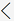

---

title: "Customizing entity and field mappings"
description: Describes how to customize entity and field mappings.
author: sabinn-msft

ms.technology: 
ms.topic: conceptual
ms.date: 03/20/2020
ms.author: v-douklo

LocalizationGroup: 
---

# Customizing entity and field mappings

[!include [banner](../../includes/banner.md)]

[!include [banner](../../includes/preview-banner.md)]

The out of the box (OOB) entity maps serve as a blueprint with predefined entity and field mappings to enable flow of data between two apps. However, every business is different and sometimes the default entity maps may not be enough. To address these needs, dual-write fully supports customizations by providing you with ways to modify and customize entity maps and field mappings.

## How-to customize field mappings, add transforms, and enable filtering

1. In your Finance and Operations app, select the **Entity mappings** tab, and then select the entity map that you want to customize. To make changes to entity mappings, they need to be stopped (not running) or else your changes won't be saved.

2. On the **Entity mappings** tab, you can customize a field by picking a new or custom field from either the Finance and Operations app or Common Data Service.

    <kbd>

3. In addition, you can customize the Sync direction (unidirectional or bidirectional) and add Transforms by selecting the Map type.

    <kbd>

4. You can also add a new field by selecting the **Add mapping** button and picking an existing or custom field from the list. 

    The following figure shows an example of adding a new "Birthdate" field.

    <kbd>  

5. Once you complete customizing the field mappings, select **Save** and follow the prompts to choose a publisher and version number.

    <kbd>

The following table provides a description of the available sync directions. 

|Symbol |Description |
| --- | --- |
| |Bidirectional field assignment |
| |Bidirectional field assignment with transforms |
| |Unidirectional field assignment (left to right) |
| |Unidirectional field assignment (right to left) |
| |Unidirectional field assignment with transforms (left to right) |
| |Unidirectional field assignment with transforms (right to left) |
| | |

The following table provides a description of the available transform types.

|Transform type |Description |
| --- | --- |
|Default |Default values are values that are applied to destination field when no source field value is available. Use default values for fields that are required on the destination entity when you have no corresponding source field. |
|Value map |Value maps define how values that are present in one entity should be mapped to values in the other entity. | 
| | |

### Filtering your data

With dual-write, you can filter data using OData filter expression for Common Data Service. For the Finance and Operations app, filtering is like range expressions used in the query range.

1. Select the filter icon from the entity mapping screen.

    <kbd>

2. Specify your filters in the **Edit query** dialog box. In this example, specify a filter to return only "accountype equal to 3".

    <kbd>

The following table contains some more examples of filter expressions.

|Common Data Service |Dynamics 365 for Finance and Operations |
| --- | --- |
|Accounttype eq '3' |(accounttype == '3') |
|numberofemployees gt 1000 and  numberofemployees le 2000 |((numberofemployees > 1000) &&  (numberofemployees <= 2000)) |
| | |

For more examples on using expressions in query ranges, see [Using Expressions in Query Ranges](https://docs.microsoft.com/dynamicsax-2012/developer/using-expressions-in-query-ranges).

## How-to add new entity maps

While Microsoft continues to add new entities, we also provide you the ability to add standard or custom entity maps.

Here is an example of how to add a new entity map called "Address books".

1. In the Finance and Operations app, select the **Add entity map** button.

    <kbd>

    >[!Note]
    >When you [create a new solution](app-lifecycle-management.md#create-a-new-dual-write-solution-and-add-your-components-customized-entity-maps) with these modified entity maps, you'll need to specify the same publisher.

2. Confirm the entity maps you just modified and added. Make sure to enable and test them to ensure they're working as expected.

    <kbd>

## Next steps

[Error management and alert notifications](errors-and-alerts.md)

